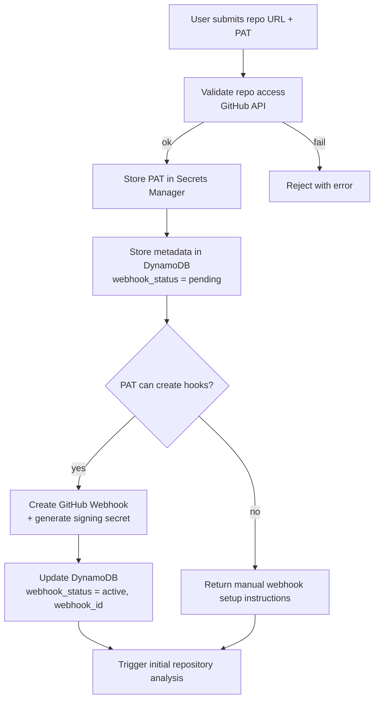
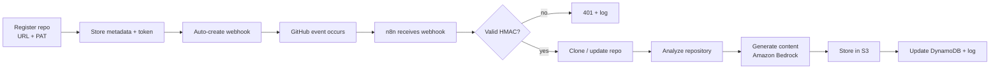
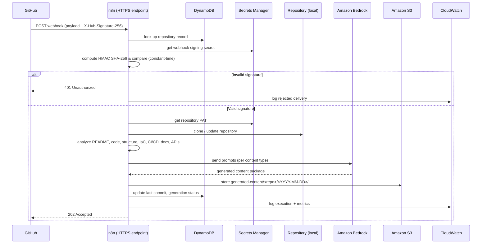
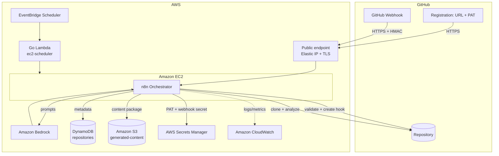
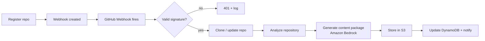
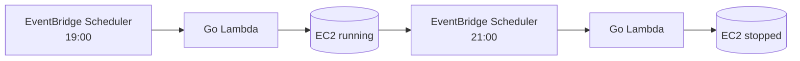

<div align="center">

# AI GitHub Repository Blog Generator

**An AI-powered Developer Content Engine. Register a GitHub repository once; every time it changes, a webhook triggers automatic analysis and a complete, publication-ready content package — powered by Amazon Bedrock.**

[](./LICENSE)
[](https://www.terraform.io/)
[](https://aws.amazon.com/)
[](https://aws.amazon.com/bedrock/)
[](https://n8n.io/)
[](https://go.dev/)
[](https://docs.github.com/webhooks)
[](./.github/workflows)
[](./docs/contributing.md)

</div>

---

## Overview

**AI GitHub Repository Blog Generator** is an AI-powered Developer Content Engine. You **register a GitHub repository** by providing its URL and a Personal Access Token (PAT). The platform validates access, securely stores the repository metadata (in DynamoDB) and the token (in AWS Secrets Manager), and — when permissions allow — **automatically configures a GitHub Webhook**. From then on, whenever a supported event occurs (push, release, pull request, …), the platform analyzes the repository and uses [Amazon Bedrock](https://aws.amazon.com/bedrock/) to generate a **complete, publication-ready content package**.

Instead of a single blog post, each run produces an entire bundle of platform-specific content: a technical blog article, Medium / Dev.to / Hashnode versions, a LinkedIn post, an X (Twitter) thread, a Reddit post, a newsletter, an FAQ, SEO metadata, cover-image prompts, and more.

Orchestration runs on [n8n](https://n8n.io/); infrastructure is provisioned entirely with [Terraform](https://www.terraform.io/) on AWS; and cost is kept low by starting and stopping the compute host on a daily schedule.

> This is an open-source **portfolio project** — architected for production practices today and a future **SaaS** evolution — demonstrating AI Engineering, Amazon Bedrock, AWS, Terraform, n8n, webhook automation, Infrastructure as Code, and operable, observable software engineering.

---

## Features

| Capability | Description |
| --- | --- |
| 📝 **Repository registration** | Register a repo with its URL + PAT; metadata is stored and a webhook is auto-created |
| 🔑 **Secure token handling** | PATs are stored in AWS Secrets Manager, never in DynamoDB or plaintext |
| 🪝 **Automatic webhook setup** | The platform creates the GitHub Webhook for you when the PAT permits |
| 🔐 **Webhook signature validation** | HMAC SHA-256 verification of every delivery before processing |
| 🔍 **Deep repository analysis** | README, source, structure, IaC, Docker/K8s, CI/CD, docs, API definitions, and more |
| 🧠 **Amazon Bedrock integration** | Generates content with configurable foundation models |
| ✍️ **Full content package** | Many platform-specific assets per run (see below) |
| 🔗 **n8n workflow orchestration** | Composable, observable pipeline with branching and retries |
| 🗄️ **DynamoDB metadata store** | Tracks registration, webhook status, and generation history |
| 🪣 **S3 content storage** | Versioned, dated storage for every generated package |
| 🪵 **CloudWatch logging** | Structured logs and metrics across every stage |
| 🛡️ **Error handling & retries** | Explicit failure handling with exponential backoff |
| 💰 **Scheduled cost control** | Daily EC2 start/stop keeps infrastructure cheap |

---

## Repository Registration

Registration is the onboarding entry point. You provide two things:

| Input | Purpose |
| --- | --- |
| **GitHub Repository URL** | The repository to analyze |
| **GitHub Personal Access Token (PAT)** | Authenticates GitHub API and clone access, and lets the platform create the webhook |

### What the platform does on registration



1. **User registers a repository** (URL + PAT).
2. The platform **validates repository access** via the GitHub API.
3. It **securely stores** the token in Secrets Manager and the metadata in DynamoDB.
4. It **creates a GitHub Webhook automatically** (if the PAT grants permission) with a generated HMAC signing secret; otherwise it returns manual setup instructions.
5. It **triggers an initial analysis** so you get content immediately.

> The PAT is used to: access private repositories, clone repositories, read repository contents, read releases, read pull requests, read branches, automatically create GitHub Webhooks (when permitted), and trigger the initial analysis.

### GitHub Personal Access Token setup

Create a token at **GitHub → Settings → Developer settings → Personal access tokens**. A **fine-grained token** scoped to the specific repository is recommended.

### Required GitHub token permissions

| Permission (fine-grained) | Access | Why |
| --- | --- | --- |
| **Contents** | Read | Clone the repo and read source, README, config |
| **Metadata** | Read | Repository metadata, branches |
| **Pull requests** | Read | Analyze pull request events |
| **Webhooks** | Read & write | Automatically create/manage the webhook |

> Classic-token equivalent: `repo` (private repo access) and `admin:repo_hook` (create webhooks). Prefer fine-grained, least-privilege tokens. If webhook permission is not granted, registration still succeeds and returns manual webhook instructions.

### Automatic webhook registration

When the token includes webhook write access, the platform calls the GitHub API to create a webhook pointing at the n8n HTTPS endpoint (`/webhook/github`), subscribed to the supported events, with a per-repository **HMAC SHA-256 signing secret** stored in Secrets Manager. The webhook's status and ID are tracked in DynamoDB.

---

## End-to-End Workflow



1. User **registers a repository**.
2. Application **validates repository access**.
3. Application **securely stores configuration** (metadata → DynamoDB, PAT → Secrets Manager).
4. Application **creates the GitHub Webhook automatically** (if permitted).
5. GitHub **sends webhook events**.
6. **n8n receives** the webhook.
7. The **webhook signature is validated** (HMAC SHA-256).
8. The repository is **cloned or updated**.
9. **Repository analysis** begins.
10. **Amazon Bedrock generates** the content package.
11. Generated content is **stored in Amazon S3**.
12. **Logs are written to CloudWatch** and metadata is updated in DynamoDB.
13. **Failures are retried** where appropriate.

---

## GitHub Webhook Processing



> **Operating window:** the webhook endpoint is available while the EC2 host is running (its daily window — see [Cost Optimization](#cost-optimization)). GitHub automatically **retries** failed deliveries, and the window is configurable. An always-on ingestion buffer for 24/7 capture is on the [roadmap](./docs/roadmap.md).

---

## Supported GitHub Events

### Primary (supported)

| Event | Fires when | Example generated content |
| --- | --- | --- |
| `push` | Commits are pushed | Updated technical article · updated documentation · LinkedIn update · X thread |
| `release` | A release is published | Release blog · newsletter · LinkedIn article · release summary |
| `pull_request` | A PR is opened/updated/merged | Feature article · architecture update · technical summary |
| `workflow_dispatch` | Manually triggered from GitHub Actions | On-demand full content package |
| `repository` | A repository is created | Initial project overview · technology stack article · repository introduction |

### Future (planned)

`issues` · `issue_comment` · `discussion` · `discussion_comment` · `deployment` · `deployment_status` · `package` · `registry_package` · `milestone` · `fork` · `watch` (star)

These are **future work** — see [Roadmap](./docs/roadmap.md) and [Future Enhancements](./docs/requirements.md#13-future-enhancements).

---

## Repository Analysis

Before generation, the platform builds a rich understanding of the repository by analyzing:

| Area | Includes |
| --- | --- |
| Documentation | README, docs, API definitions (OpenAPI/GraphQL) |
| Code | Source files, folder structure, project architecture |
| Dependencies | Package managers and manifests |
| Infrastructure as Code | Terraform, CloudFormation |
| Containers & orchestration | Dockerfiles, Kubernetes manifests |
| CI/CD | Pipelines, GitHub Actions workflows |
| Configuration | Config files across the repo |

This analysis is used to provide **context to Amazon Bedrock** for high-quality, accurate content generation.

---

## AI Generated Content

Each run produces an **entire content package**, not a single article.

### Long-form articles

| Asset | File | Optimized for |
| --- | --- | --- |
| Technical blog | `blog.md` | Personal & company engineering blogs, any Markdown platform |
| Medium article | `medium.md` | Medium |
| Dev.to article | `devto.md` | Dev.to |
| Hashnode article | `hashnode.md` | Hashnode |
| Newsletter | `newsletter.md` | Email newsletters |

### Social & community

| Asset | File | Platform |
| --- | --- | --- |
| LinkedIn post | `linkedin.md` | LinkedIn |
| X (Twitter) thread | `twitter-thread.md` | X / Twitter |
| Reddit post | `reddit.md` | Reddit |

### Supporting assets

| Asset | File | Purpose |
| --- | --- | --- |
| FAQ | `faq.md` | Anticipated reader questions |
| README improvement suggestions | `readme-suggestions.md` | Actionable README upgrades for the source repo |
| Cover image prompts | `image-prompts.md` | Prompts for AI image generation |
| SEO metadata | `seo.json` | SEO title, description, keywords |
| Package metadata | `metadata.json` | Tags, reading time, social captions, call-to-action suggestions |

`metadata.json` and `seo.json` additionally carry: SEO title, description, and keywords; platform-specific tags; estimated reading time; social media captions; and call-to-action suggestions.

### Publication-ready articles

Each long-form article is **platform-specific and publish-ready**, optimized for **Medium**, **Dev.to**, **Hashnode**, **personal blogs**, **company engineering blogs**, and **any Markdown-compatible publishing platform**. Every article aims to include:

- **Title** and **subtitle**
- **Introduction** · **table of contents** · structured **sections**
- **Code examples** · **architecture explanations**
- **Best practices** · **challenges** · **trade-offs**
- **Conclusion** · **call to action**
- **SEO metadata** · **platform tags** · **reading time**

---

## AWS Architecture

Infrastructure is provisioned **entirely with Terraform**. Each service has a clear purpose:

| Service | Purpose |
| --- | --- |
| **VPC** | Network isolation boundary for all resources |
| **Public subnets** | Host the internet-facing webhook/registration endpoint (Elastic IP + TLS) |
| **Private subnets** | Reserved for internal/optional components; defense in depth |
| **Internet Gateway** | Ingress/egress to the internet |
| **Route tables** | Direct traffic between subnets, IGW, and endpoints |
| **Security groups** | Restrict inbound 443 to GitHub webhook IP ranges; allow SSM |
| **IAM roles / policies** | Least-privilege identities and permissions for compute |
| **Amazon EC2** | Runs the n8n orchestrator (registration, webhook, analysis, generation) |
| **Amazon Bedrock** | Foundation model inference for content generation |
| **Amazon S3** | Stores generated content packages and Terraform state |
| **Amazon DynamoDB** | Stores repository metadata; provides Terraform state locking |
| **AWS Secrets Manager** | Stores per-repository PATs and webhook signing secrets |
| **Amazon CloudWatch** | Logs, metrics, dashboards, and alarms |
| **Amazon EventBridge** | Event bus and rules |
| **EventBridge Scheduler** | Fires the daily EC2 start/stop schedule |
| **AWS Lambda** | Go function that starts/stops the EC2 host on schedule |



Full detail: **[docs/architecture.md](./docs/architecture.md)** and **[docs/infrastructure.md](./docs/infrastructure.md)**.

### Repository metadata storage

**DynamoDB** stores per-repository metadata — but **never the PAT**:

| Attribute | Example |
| --- | --- |
| `repository_url` | `https://github.com/acme/widget` |
| `owner` | `acme` |
| `name` | `widget` |
| `default_branch` | `main` |
| `registered_at` | `2026-07-05T19:00:00Z` |
| `webhook_status` | `active` \| `pending` \| `manual` |
| `webhook_id` | `498……` |
| `last_processed_commit` | `a1b2c3d` |
| `last_successful_generation` | `2026-07-05T19:12:00Z` |
| `generation_status` | `success` \| `running` \| `failed` |

The PAT and webhook signing secret are stored **only in AWS Secrets Manager**; DynamoDB holds references (secret ARNs), not secret values.

---

## Terraform Deployment

```bash
# 1. Bootstrap remote state (once per account/region)
./scripts/bootstrap.sh --region us-east-1 --state-bucket <tfstate-bucket> --lock-table tf-locks

# 2. Configure variables
cp terraform/terraform.tfvars.example terraform/terraform.tfvars
#   edit: region, bedrock_model_id, ec2_instance_type,
#         ec2_start_cron, ec2_stop_cron, webhook_dns_name, ...

# 3. Provision
cd terraform
terraform init
terraform fmt -check && terraform validate
terraform plan -out tfplan
terraform apply tfplan
```

After apply, populate deployment secrets and import the n8n workflows. Full guide with rollback: **[docs/deployment.md](./docs/deployment.md)**.

---

## Local Development

```bash
git clone https://github.com/<your-org>/ai-github-repository-blog-generator.git
cd ai-github-repository-blog-generator/docker
cp .env.example .env          # AWS region, Bedrock model, n8n creds, table name
docker compose up -d          # n8n → http://localhost:5678
```

Import the workflows from `workflows/n8n/`, register a test repository, and send a **test webhook** (GitHub's *Recent Deliveries → Redeliver*). Full guide: **[docs/local-development.md](./docs/local-development.md)**.

---

## Amazon Bedrock Configuration

1. In the AWS Console, open **Bedrock → Model access** and request access to your chosen model in the deployment Region.
2. Set `bedrock_model_id`, `bedrock_max_tokens`, and `bedrock_temperature` in `terraform.tfvars`.
3. Verify:
   ```bash
   aws bedrock list-foundation-models --region us-east-1 \
     --query "modelSummaries[].modelId" --output table
   ```

## n8n Configuration

1. Reach the n8n editor via **SSM Session Manager** port-forwarding (the management UI is not publicly exposed).
2. **Import** each workflow JSON from `workflows/n8n/` (registration, webhook ingestion, analysis, generation, publishing, notifications).
3. Configure **credentials** (AWS, GitHub) — these reference Secrets Manager.
4. **Activate** the workflows and note the registration and webhook paths.

---

## Example Workflow



---

## Generated Content Examples

Each run writes a dated content package to S3 under `generated-content/`:

```text
generated-content/
└── repository-name/
    └── YYYY-MM-DD/
        ├── medium.md              # Medium article
        ├── devto.md               # Dev.to article
        ├── hashnode.md            # Hashnode article
        ├── blog.md                # Generic technical blog article
        ├── linkedin.md            # LinkedIn post
        ├── twitter-thread.md      # X (Twitter) thread
        ├── reddit.md              # Reddit post
        ├── newsletter.md          # Newsletter edition
        ├── faq.md                 # FAQ
        ├── seo.json               # SEO title, description, keywords
        ├── metadata.json          # Tags, reading time, captions, CTAs
        └── image-prompts.md       # Cover-image prompts for AI image generation
```

Example `metadata.json`:

```json
{
  "source_repository": "https://github.com/acme/widget",
  "trigger_event": "release",
  "generated_at": "2026-07-05T19:12:00Z",
  "model": "us.anthropic.claude-sonnet-4-...",
  "reading_time_minutes": 8,
  "tags": ["go", "aws", "terraform", "ai"],
  "platform_tags": {
    "devto": ["go", "aws", "tutorial", "devops"],
    "hashnode": ["golang", "cloud", "bedrock"]
  },
  "social_captions": {
    "linkedin": "How we built …",
    "twitter": "🧵 A deep dive into …"
  },
  "call_to_action": "Star the repo and try it on your own project."
}
```

---

## Cost Optimization

The compute host (EC2, which runs n8n) is the only always-on cost driver — so it **does not run continuously**. An **EventBridge Scheduler** rule invokes a small **Go AWS Lambda** to start and stop the instance on a fixed daily window:

| Action | Time (daily) | Mechanism |
| --- | --- | --- |
| **Start EC2** | **19:00** | EventBridge Scheduler → Go Lambda → `StartInstances` |
| **Stop EC2** | **21:00** | EventBridge Scheduler → Go Lambda → `StopInstances` |



This ensures the n8n EC2 instance only runs during the required processing window (~2h/day instead of 24/7), minimizing infrastructure cost. The schedule is configurable via Terraform variables. Estimates and levers: **[docs/cost-optimization.md](./docs/cost-optimization.md)**.

---

## Security

Security is built in by default (full detail in **[docs/security.md](./docs/security.md)**):

- **Least-privilege IAM** — every role is scoped to only the actions and resources it needs.
- **HTTPS only** — the registration and webhook endpoints accept TLS traffic only.
- **GitHub webhook signature verification** — every delivery is validated with **HMAC SHA-256**.
- **PATs in Secrets Manager** — Personal Access Tokens are stored only in AWS Secrets Manager, **never in DynamoDB or plaintext**.
- **Encryption at rest** — S3, EBS, DynamoDB, and Secrets Manager are encrypted.
- **Encryption in transit** — all traffic uses TLS.
- **No hardcoded credentials** — no secrets in source, images, or Terraform state.
- **IAM roles instead of static credentials** — compute uses instance/Lambda roles; CI uses OIDC.
- **CloudWatch audit logging** — auditable, structured logs with no secret material.
- **Secure Bedrock and S3 access** — scoped by IAM to specific model ARNs and buckets.

---

## Documentation

| Document | Description |
| --- | --- |
| [Requirements](./docs/requirements.md) | Functional, registration, GitHub API, webhook, AI, infra, security, workflow, storage, monitoring, cost, non-functional |
| [Architecture](./docs/architecture.md) | System, AWS, registration, webhook, and data-flow architecture |
| [Deployment](./docs/deployment.md) | AWS deployment with Terraform |
| [Local Development](./docs/local-development.md) | Running and developing locally |
| [Workflows](./docs/workflows.md) | Every n8n workflow, documented |
| [Infrastructure](./docs/infrastructure.md) | Every AWS service and Terraform module |
| [Security](./docs/security.md) | IAM, webhook & token security, encryption, auditing |
| [Monitoring](./docs/monitoring.md) | CloudWatch metrics, logs, and alerts |
| [Cost Optimization](./docs/cost-optimization.md) | Cost controls and estimates |
| [CI/CD](./docs/ci-cd.md) | GitHub Actions pipelines |
| [Roadmap](./docs/roadmap.md) | Planned features and releases |
| [Contributing](./docs/contributing.md) | How to contribute |

---

## Contributing

Contributions are welcome! Please read the **[Contributing Guide](./docs/contributing.md)** for the development workflow, branch naming, commit conventions, and the pull-request process.

---

## Roadmap

Current focus is a robust, webhook-driven, multi-repository content engine. Planned enhancements include **GitHub App authentication** and **OAuth login**, **automatic publishing** (Medium, Dev.to, Hashnode, WordPress, Ghost), multi-language generation, AI-generated diagrams and release notes, API documentation and video/short/podcast scripts, multi-model support, content quality scoring, duplicate-content detection, scheduled rescans, and **team workspaces / multi-user support**.

See the full **[Roadmap](./docs/roadmap.md)** and [Future Enhancements](./docs/requirements.md#13-future-enhancements).

---

## License

Released under the [MIT License](./LICENSE).
