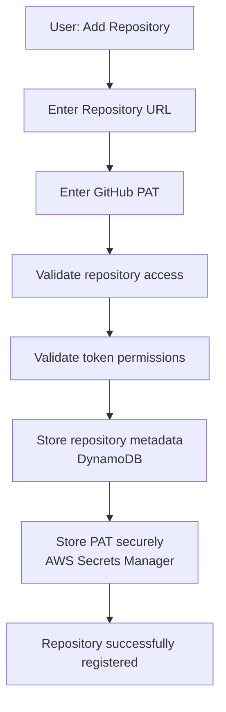
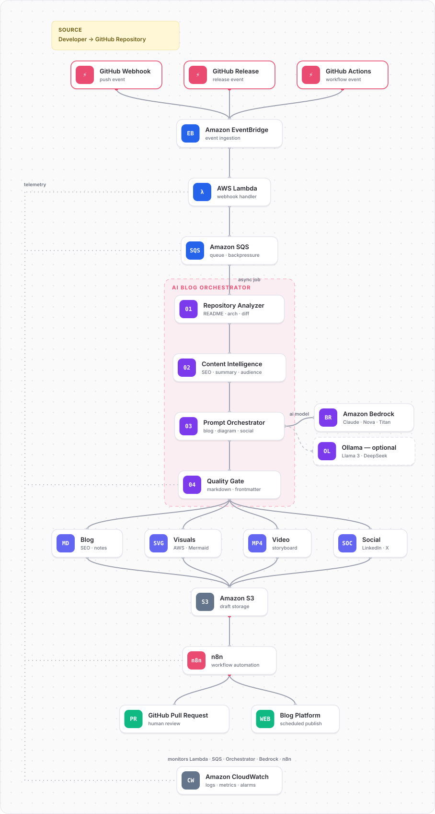
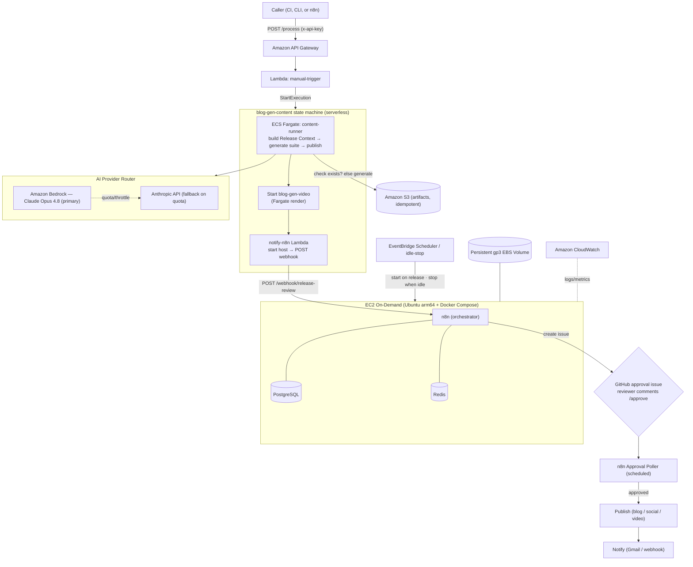
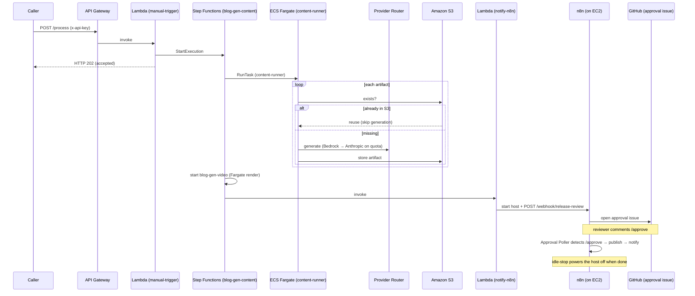
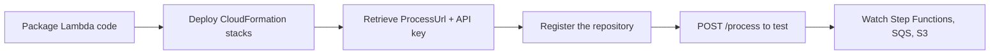
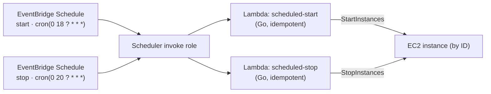

<div align="center">

<picture>
  <source media="(prefers-color-scheme: dark)" srcset="./docs/assets/brand/logo-horizontal-dark.svg">
  
</picture>


**On-demand, self-hosted AI platform that turns GitHub repositories into high-quality technical content. Triggered by an authenticated `POST /process`, orchestrated with AWS Step Functions, generated by Claude on Amazon Bedrock (with an Anthropic API fallback), published through n8n, and provisioned entirely with AWS CloudFormation.**

[](./LICENSE)
[](./docs/development-plan.md)
[](https://go.dev/)
[](https://aws.amazon.com/cloudformation/)
[](https://aws.amazon.com/ec2/)
[](https://aws.amazon.com/bedrock/)
[](https://www.anthropic.com/claude)
[](https://n8n.io/)
[](https://aws.amazon.com/step-functions/)
[](https://aws.amazon.com/sqs/)
[](https://aws.amazon.com/api-gateway/)
[](./docs/contributing.md)

</div>

---

## Table of Contents

- [Overview](#overview)
- [Status](#status)
- [Core Principle](#core-principle)
- [Why This Project](#why-this-project)
- [Features](#features)
- [Repository Registration](#repository-registration)
- [Publishing Trigger](#publishing-trigger)
- [Content Generation Workflow](#content-generation-workflow)
- [Architecture](#architecture)
- [AI Workflow](#ai-workflow)
- [Technology Stack](#technology-stack)
- [Cost Optimisation](#cost-optimisation)
- [Why On-Demand (Scheduled Runtime)](#why-on-demand-scheduled-runtime)
- [Optimizing Instance Startup](#optimizing-instance-startup)
- [Security](#security)
- [Prerequisites](#prerequisites)
- [Installation](#installation)
- [Configuration](#configuration)
- [Deployment](#deployment)
- [CloudFormation Deployment Guide](#cloudformation-deployment-guide)
- [Project Structure](#project-structure)
- [Roadmap](#roadmap)
- [Local Development Workflow](#local-development-workflow)
- [Contributing](#contributing)
- [Documentation](#documentation)
- [License](#license)

---

## Overview

**GitHub AI Blog Generator** is a fully self-hosted, event-driven AI platform that turns any GitHub repository into publication-ready technical content — **on demand, under your explicit control**.

You onboard a repository once (for the MVP, with its URL and a **GitHub Personal Access Token**); the platform validates access, stores metadata, and stores the token securely in **AWS Secrets Manager**. A run starts when you call the authenticated **`POST /process`** endpoint, naming the repository and release. That request starts an **AWS Step Functions** execution — the **`GenerateContent`** machine, which runs generation as a one-shot **ECS Fargate** task (`content-runner`) that builds the Release Context, generates the suite, and publishes it to **Amazon S3**, then best-effort triggers video rendering. There is no server to keep running: compute is on-demand and dies with the task. Nothing runs — and nothing is billed — until you ask. *(An earlier EC2-worker path — Step Functions → start host → SSM ready → SQS → worker — remains as the rollback until the [Phase B teardown](./docs/phase-b-teardown.md); see the [serverless migration](./docs/content-generation-serverless-migration.md).)*

When a run fires, the **`content-runner` Fargate task** generates each artifact through the **AI Provider Router**: **Claude on Amazon Bedrock (Opus 4.8)** first — IAM-authenticated, no API key — falling back to the **Anthropic API** on a quota/throttle error. Before generating an artifact it checks **Amazon S3**; if the Markdown already exists it is **reused, never regenerated**. The machine then starts the on-demand host and hands the release to **n8n** (with PostgreSQL + Redis on the box): n8n **opens a GitHub approval issue**, a scheduled **poller** acts on an authorized **`/approve`**, and n8n then **publishes and notifies**. See [Manual Trigger](./docs/manual-trigger.md) and [Content Pipeline Redesign](./docs/content-pipeline-redesign.md).

Supported outputs include technical blog posts, README improvements, documentation, architecture summaries, API documentation, project overviews, release notes, changelogs, and technical tutorials — all emitted as clean, portable Markdown.

> This project is architected for real-world production practices: **developer-controlled generation**, self-hosting, cost optimisation, managed Claude inference (Bedrock → Anthropic), AWS-native orchestration, and Infrastructure as Code with AWS CloudFormation.

---

## Status

**The MVP is implemented and unit-tested** (a single Go module + three request Lambdas + scheduler Lambdas + an instance worker, all backed by modular CloudFormation). It has **not yet been deployed** to a live AWS account — deployment needs your AWS credentials and Bedrock/Anthropic access. Milestone-by-milestone detail lives in the [Development Plan](./docs/development-plan.md).

**What works end to end today:**

register repo → **`POST /process`** → Step Functions **`GenerateContent`** → **ECS Fargate `content-runner`** (build Release Context → generate via Bedrock → Anthropic, skip artifacts already in S3) → quality review → publish to S3 → best-effort **video render** → notify. *(Legacy EC2 path, kept as rollback: Step Functions → start host → SSM ready → SQS → worker → n8n approval/publish → scheduled/idle stop.)*

The pipeline drives **two paths** through the same review/approval/publish stages, both reached via `POST /process`:

- **A published GitHub Release** (a `/process` call with a release tag) → SemVer gate → Release Context → the **complete content suite** (blog, storyboard, voice-over, YouTube, Shorts, TikTok, visual assets, SEO, architecture, LinkedIn, X thread). See [Full Content Suite](./docs/content-suite.md).
- **A repository run** (a `/process` call without a release tag) → clone repo (go-git) → read README/docs/commits → generate the written core (blog, README, docs, architecture summary, release notes, architecture diagram).

`cmd/generate-all` runs the *same* content-suite orchestrator manually (local/CI/one-off) — the manual door onto the pipeline the release path runs automatically.

| Area | Status |
| --- | --- |
| Repository registration (URL + PAT → Secrets Manager + DynamoDB) | ✅ Implemented |
| Trigger — authenticated `POST /process` → Step Functions execution | ✅ Implemented |
| Orchestration — Step Functions: run `content-runner` on Fargate → video render → notify n8n | ✅ Implemented |
| Approval — n8n opens a GitHub approval issue; scheduled poller acts on `/approve` → publish + notify | ✅ Implemented |
| Instance lifecycle — on-demand start on a release + scheduled/idle stop | ✅ Implemented |
| Release pipeline — release tag → SemVer gate → Release Context → **full content suite** (11 artifacts) → review, approval, publish | ✅ Implemented |
| Repository pipeline — repo run → clone, analyse, generate written core, review, approval, publish, memory, notify | ✅ Implemented |
| AI Provider Router — Bedrock (Claude Opus 4.8) → Anthropic API fallback | ✅ Implemented |
| S3 idempotency — existing artifacts reused, never regenerated | ✅ Implemented |
| Infrastructure — modular CloudFormation (`cfn-lint`-clean) | ✅ Implemented |
| CI/CD — Go tests, cfn-lint, security scanning, opt-in OIDC deploy | ✅ Implemented |
| Deploy to AWS + end-to-end validation | ⏳ Needs your AWS account + Bedrock/Anthropic access |
| Future roadmap — email notifications, extra trigger sources, GitHub Apps, a web approvals UI | ⏳ Planned |

> **Implementation note.** Generation runs serverlessly as the **`content-runner`** Go binary on **ECS Fargate** (chosen for testability and zero idle cost). **n8n** on the on-demand EC2 host owns the review/approval/publish/notify stages. *(A legacy EC2 Go worker that drained SQS remains as rollback until the [Phase B teardown](./docs/phase-b-teardown.md).)* See the [Development Plan](./docs/development-plan.md) for the runtime decision.

---

## Core Principle

> **AI-generated content is produced only on an explicit signal: an authenticated call to `POST /process` naming the repository (and optionally a release). Nothing runs automatically on repository changes.**

This keeps developers in complete control of when content is produced, prevents unwanted publishing, and eliminates the AI, compute, and storage cost of processing routine commits. A run is always a deliberate, authenticated API request — never an automatic reaction to every change.

---

## Why This Project

Most "AI content" projects assume two things this project rejects: that every repository change should be processed, and that you should keep paying to regenerate content you already have.

- **Opt-in, not automatic.** Content is generated **only** when you call `POST /process`. Normal development never produces content.
- **Never regenerate.** Artifacts already in S3 are reused, not rebuilt — you pay for tokens only on new content ([idempotency](#s3-idempotency--never-regenerate)).
- **Managed Claude, no GPU.** Inference runs on **Amazon Bedrock (Claude Opus 4.8)** with an **Anthropic API** fallback — a tiny t4g.small host makes API calls, so there is no GPU to run or keep warm.
- **On-demand, bounded compute.** The host runs only while a job needs it (started on `/process`, stopped by the schedule/idle-stop); otherwise the system costs only cents per month (EBS storage).
- **Reproducible infrastructure.** Everything is defined in modular AWS CloudFormation — no click-ops, no Terraform.

---

## Features

| Capability | Description |
| --- | --- |
| 🔌 **Repository registration** | Onboard a repo with its URL + a GitHub PAT; the platform validates access and stores metadata |
| 🔑 **Secure PAT storage** | The token is stored in AWS Secrets Manager; only a secret reference is kept in the metadata store |
| 🗄️ **Repository metadata store** | Per-repo metadata (owner, trigger pattern, secret reference, last commit) in DynamoDB |
| 🎛️ **`POST /process` trigger** | The single entry point: an authenticated (API key) request starts a Step Functions execution that runs the whole pipeline — **starts the On-Demand host on demand** if it is stopped ([docs](./docs/manual-trigger.md)) |
| 🧭 **Step Functions orchestration** | Resolves the host by tag, starts it, waits for it to report ready via SSM, then enqueues the job — the control plane for every run |
| 🧠 **Release Context Builder** | Authenticated `POST /release-context` analyzes a repo + release into a structured, AI-ready **Release Context** (JSON) — the canonical input for content generation ([docs](./docs/release-context.md)) |
| 🎬 **Storyboard Generator** | Turns a generated technical blog + Release Context into a scene-by-scene **video storyboard** (JSON + Markdown) — the Video Planning engine, grounded in real Mermaid diagrams ([docs](./docs/storyboard.md)) |
| 🎙️ **Voice-over Generator** | Enriches a storyboard into a synchronized **voice-over script** (JSON + Markdown) — the Narration engine: timestamps, pacing, pronunciation, emphasis, pauses, and sync cues, ready for any TTS provider or human narrator ([docs](./docs/voiceover.md)) |
| 📺 **YouTube Script Generator** | Combines the Release Context, blog, storyboard, and voice-over into a production-ready **long-form YouTube script** (JSON + Markdown) — the Long-form Video engine: hook, chapters, demos, callouts, CTAs, and SEO metadata ([docs](./docs/youtube.md)) |
| 📱 **YouTube Shorts Generator** | Mines the release package for the best moments and plans multiple standalone **30–60s Shorts** (JSON + Markdown) — the Short-form Video engine: hooks, scene breakdowns, timed captions, grounded visuals, CTAs, and hashtags ([docs](./docs/shorts.md)) |
| 🎵 **TikTok Generator** | Adapts the release package into multiple **20–60s TikTok videos** (JSON + Markdown) — the Social Video engine: native hooks, problem/solution scripts, engagement prompts, timed captions, grounded visuals, hashtags, and a retention score ([docs](./docs/tiktok.md)) |
| 🎨 **Visual Asset Generator** | Turns the release package into **provider-neutral AI image prompts** (JSON + Markdown) for thumbnails, social graphics, blog headers, banners, and technical illustrations — the Visual Design engine: grounded prompts, negative prompts, a shared brand identity, and text placeholders (no baked-in text) ([docs](./docs/visual-assets.md)) |
| 🔎 **SEO Metadata Generator** | Aggregates the whole pipeline into **canonical SEO metadata** (JSON + Markdown) for blog, YouTube, short-form, and social — the SEO engine: keyword taxonomy, slugs, excerpts, hashtags, Open Graph, JSON-LD/RSS/sitemap, platform limits, and a confidence score ([docs](./docs/seo.md)) |
| 📐 **Architecture Diagram Generator** | Renders grounded **AWS architecture diagrams** (Mermaid + Graphviz DOT + SVG + PNG metadata) from the Release Context — the Architecture Visualization engine: analysis → one shared graph → three synchronized renderings, with edges only when explicit ([docs](./docs/architecture-diagrams.md)) |
| 💼 **LinkedIn Content Generator** | Composes multiple professional **LinkedIn post variations** (JSON + Markdown) from the pipeline — the Professional Marketing engine: audience-targeted posts, grounded technical highlights, engagement prompts, CTAs, hashtags, and references to existing visuals ([docs](./docs/linkedin.md)) |
| 🧵 **X Thread Generator** | Composes technical **X (Twitter) threads** (JSON + Markdown) from the pipeline — the Social Marketing engine: configurable-length threads with 280-char-enforced posts, grounded code snippets, key takeaways, engagement prompts, CTAs, and hashtags ([docs](./docs/xthread.md)) |
| 🎛️ **Full Content Suite** | One command turns a single Release Context into **every artifact (Milestones 3–16)** — blog, storyboard, voice-over, YouTube script, Shorts, TikTok, visual assets, SEO, architecture, LinkedIn, X thread, the architecture-diagram spec + SVG, and the per-scene **`storyboard-scenes`** SDXL image specs — by orchestrating the dedicated generators in dependency order; fault-tolerant (a failed stage is recorded, not fatal) and correlated by a `manifest.json` (the `generate-all` CLI). The blog rotates through **narrative archetypes** (no fixed template), and `visual-assets` + `storyboard-scenes` are **SDXL-first** (shared style/negative anchors, per-category Replicate `stability-ai/sdxl` params, rotating compositions) ([docs](./docs/content-suite.md)) |
| 🎬 **Social Video Rendering** | Opt-in AWS Step Functions stage (`GenerateSocialVideos`) that renders the YouTube/Shorts/TikTok scripts into **MP4s** on **ECS Fargate** (FFmpeg + **Amazon Polly**), stores them in S3, and publishes a manifest — three formats in parallel, each fault-tolerant. Every scene gets a background: an **AI-generated scene image** (Replicate FLUX/SDXL, opt-in via `ENABLE_SCENE_IMAGES`, using the same prompt logic as `storyboard-scenes`), falling back to a **deep-slate title slide**. Renders are **idempotent** (an existing MP4 is skipped unless `FORCE_RENDER=true`) ([docs](./docs/social-video.md)) |
| 🚀 **Publishing Automation** | Distributes **approved** content to multiple platforms (Dev.to, Medium, Hashnode, YouTube, GitHub) — the Content Distribution engine: a common Publisher interface, scheduling, retries with backoff, per-platform metadata, publication tracking, and a full audit trail; **never publishes unapproved content** ([docs](./docs/publishing.md)) |
| 🛡️ **Review & Approval Workflow** | The governance layer every asset passes before publishing — deterministic validation, AI quality review grounded in the Release Context, 8-dimension scoring, a revision loop, human approval gates, publication-readiness checks, and a full audit trail; **never approves hallucinated content** ([docs](./docs/governance.md)) |
| 📊 **Social Media Intelligence** | Cross-platform performance tracking for YouTube, Instagram, X, and TikTok — the Analytics engine: immutable daily snapshots, growth trends, content effectiveness (virality/evergreen), subscriber conversion, cross-platform comparison, a daily morning briefing, and a Business Advisory Council package, with grounded AI insights that **never fabricate statistics** ([docs](./docs/social-intelligence.md)) |
| 📈 **Content Analytics & Performance** | Per-publication performance measurement across Dev.to, Medium, Hashnode, and YouTube — the Content Analytics engine: one normalized model, immutable daily/weekly/monthly snapshots, trend analysis (DoD/WoW/MoM, best/worst, top tags/keywords/times), structured reports, dashboard datasets, CloudWatch metrics, and a grounded OptimizationSignals bundle for AI optimization; **produces analytics only, never fabricated** ([docs](./docs/content-analytics.md)) |
| 🧠 **AI Content Optimization** | Continuous-improvement engine that consumes the analytics engine's output — winning/losing pattern recognition, grounded confidence-scored recommendations, multi-horizon trend detection, prompt-template versioning with human-approval and rollback, and Claude (Bedrock → Anthropic) reasoning with a deterministic fallback; **explainable, auditable, reproducible, and never auto-replaces a prompt** ([docs](./docs/content-optimization.md)) |
| 🧩 **Extensibility Platform** | Plugin-style provider abstraction layer for the whole system — a thread-safe registry with capability-based selection, priority, health checks, and fallback; interface + reference implementation for LLM, image, video, voice, translation, vector-DB, publishing, MCP, workflow, and content-format providers; a configuration framework and semver API-compatibility — **new providers are added by implementing an interface, never by editing existing code** ([docs](./docs/platform-extensibility.md)) |
| 🔌 **MCP Integration & Tool Ecosystem** | The standardized integration layer — one secure `Client` speaks the Model Context Protocol (`2025-06-18`) to nine self-registering server plug-ins (repository, filesystem, documentation, database, cloudformation, mermaid, aws, publishing, context) exposing tools **and** resources; every call runs discovery → deny-by-default authorization → credential resolution (env/Secrets Manager, never logged) → input validation → timeout → bounded retry → audit; least-privilege allow-lists and per-caller rate limiting throughout — **new integrations plug in via one interface, never by editing the client** (the `mcp` CLI) ([docs](./docs/mcp.md)) |
| 🧱 **Reusable CloudFormation Modules** | A platform-engineering module library — versioned, cfn-lint-clean CloudFormation for network, IAM, compute, storage, DynamoDB, monitoring, and messaging, composed by a nested root stack with centralized per-environment config; every resource is shared via predictable CloudFormation Exports + SSM Parameter Store contracts, so any AI project consumes shared infrastructure by import — **modular, secure-by-default, and never duplicated** ([docs](./docs/cfn-modules.md)) |
| 🧠 **AI Provider Router** | Every generation attempts **Amazon Bedrock (Claude Opus 4.8)** first and falls back to the **Anthropic API** on a quota/throttle error, with structured logging of provider, model, and fallback reason |
| 📥 **Durable buffering** | The state machine hands the job to Amazon SQS so nothing is lost while the instance boots |
| ⏰ **On-demand compute** | The t4g.small host starts on `/process` and is stopped by a fixed daily window + idle-stop |
| 🔍 **Deep repository analysis** | The worker clones the repo and inspects README, source, structure, IaC, Docker, CI/CD, and docs |
| 🗂️ **Repository Memory** | Persistent per-repo memory of prior analyses and published topics for continuity and de-duplication |
| ✅ **Quality review** | A review stage checks generated content before publishing |
| 🙋 **Optional human approval** | An optional gate lets a human approve content before it is published |
| 🔗 **n8n orchestration** | Composable, observable pipeline with branching, retries, and notifications |
| ✍️ **Multi-format output** | Blog posts, READMEs, docs, architecture summaries, changelogs, tutorials |
| 📝 **Markdown-native** | All content is emitted as clean, portable GitHub-flavoured Markdown |
| ♻️ **S3 idempotency** | The worker checks S3 before generating and reuses any artifact already present — existing content is never regenerated |
| 🔁 **Retry & error handling** | Failed stages retry with backoff; poison messages route to a dead-letter queue |
| 🪵 **Structured logging** | CloudWatch logs and metrics across every stage of the pipeline |
| 🔔 **Notifications** | Users are notified when content is published or a run fails |
| 💤 **Automatic shutdown** | An idle-timeout Lambda stops the instance so you pay only for active work |
| 💾 **Persistent storage** | A gp3 EBS volume keeps n8n + PostgreSQL state and Repository Memory across cycles |

---

## Repository Registration

For the **MVP**, you connect a repository by providing two things:

| Input | Purpose |
| --- | --- |
| **GitHub Repository URL** | The repository to monitor and analyse |
| **GitHub Personal Access Token (PAT)** | Access repository contents, read metadata, and open pull requests |

### How onboarding works



> **To register a repo**, POST the repository URL + PAT to the registration API
> Gateway endpoint. That route **requires an `x-api-key` header** (403 without it).
> Copy-paste commands, including how to fetch the API key: **[First Deploy → Register the repository](./docs/first-deploy.md#5-register-the-repository)**.

### Why a PAT for the MVP

A PAT keeps onboarding simple while providing a clear migration path to **GitHub Apps** in future releases (see [Roadmap](#roadmap)). The token is required to access repository contents, read repository metadata, and open pull requests.

### How credentials are stored

- The PAT is stored as a secret in **AWS Secrets Manager** — **never in plain text**, and never in source, config, environment variables, or the metadata database.
- The metadata store keeps only a **reference** to the secret (its ARN/name), plus non-sensitive metadata: repository ID, owner, name, URL, default branch, trigger pattern, enabled status, last processed commit SHA, and registration timestamp.
- The PAT is retrieved **only when required** (to clone the repository or open a pull request), under least-privilege IAM.

This keeps the platform **secure** (secrets isolated, least privilege, never logged), **simple** (two inputs to onboard), and **cost-effective** (repository and token validation happen up front, before any compute or AI runs). See [Security](./docs/security.md) and [Requirements → Repository Registration](./docs/requirements.md#12-repository-registration-requirements-mvp).

> **GitHub App authentication is a future enhancement, not part of the MVP.**

---

## Publishing Trigger

Content is generated **only** when you call the authenticated **`POST /process`** endpoint — a deliberate, explicit request, never an automatic reaction to a push.

### Request a run

```bash
curl -X POST "$PROCESS_URL" \
  -H "x-api-key: $API_KEY" -H "Content-Type: application/json" \
  -d '{"owner":"acme","repository":"widget","releaseTag":"v1.2.0"}'
```

- **With `releaseTag`** → the full content suite for that GitHub Release.
- **Without `releaseTag`** → a repository run over the default branch.

The call returns **HTTP 202** and starts a Step Functions execution that boots the host and enqueues the job. See [Manual Trigger](./docs/manual-trigger.md).

### Trigger pattern (metadata)

Each repository still carries an optional **Trigger Pattern** (`blog:` by default; `[blog]` or `regex:^(blog|post):` also accepted) in its metadata. It is retained for future push-based sources; the current MVP is driven exclusively by `POST /process`. Additional entry points (release webhooks, tags, PR labels, scheduled summaries) remain [planned](#roadmap).

---

## Content Generation Workflow

> **Conceptual reference** of the end-to-end AI content pipeline — a `POST /process` request flows through Step Functions, serverless **ECS Fargate** generation (Claude on Bedrock → Anthropic), and **n8n-orchestrated** human-reviewed publishing. This is a high-level overview; for the exact request lifecycle and the components actually deployed, see [Architecture](#architecture) below. An interactive, theme-aware version lives at [`docs/orchestration-diagram.html`](./docs/orchestration-diagram.html).

<div align="center">

<picture>
  <source media="(prefers-color-scheme: dark)" srcset="./docs/assets/orchestration-diagram-dark.svg">
  
</picture>

</div>

---

## Architecture

The platform is **on-demand and API-triggered**. `POST /process` starts an AWS Step Functions execution; **content generation runs serverlessly on ECS Fargate**, and **n8n on an on-demand EC2 host owns human approval, publishing, and notifications**. There is no local model inference and no GitHub webhook ingress.



### Request lifecycle

1. A caller (your CI, the CLI, or an n8n flow) sends **`POST /process`** with an `x-api-key`, naming the repository and release.
2. **API Gateway** invokes the **manual-trigger Lambda**, which validates the request and **starts the `blog-gen-content` Step Functions execution**, returning HTTP 202.
3. The state machine runs the **`content-runner` task on ECS Fargate** (serverless — no EC2 worker, no SQS): it builds the **Release Context**, generates each artifact through the **AI Provider Router** (**Amazon Bedrock / Claude Opus 4.8** first, falling back to the **Anthropic API** on a quota/throttle error), and publishes the Markdown to **Amazon S3**.
4. Before generating an artifact the runner **checks S3** — if the Markdown already exists it is **reused, never regenerated** (no wasted tokens).
5. The machine then **starts the `blog-gen-video` render** (Fargate) and invokes the **`notify-n8n` Lambda**, which **starts the on-demand EC2 host** and **POSTs the release to n8n's `/release-review` webhook**.
6. **n8n** (with PostgreSQL + Redis on the same box) is the orchestrator: its **review workflow opens a GitHub approval issue**, and a scheduled **Approval Poller** watches for an authorized **`/approve`** comment, then **publishes** (blog / social / video) and **notifies** (Gmail / webhook). `/reject` cancels.
7. The **scheduler stack** (daily window / idle-stop) powers the instance **off** when the work is done.

For a deeper treatment, see [`docs/architecture.md`](./docs/architecture.md).

---

## AI Workflow



The full node-by-node n8n pipeline is documented in [`docs/workflows.md`](./docs/workflows.md).

---

## Local Content Development & Prompt Testing

Generate and iterate on every content artifact **locally** — no GitHub Release,
GitHub Actions, EC2, EventBridge, SQS, or S3. The local tool (`cmd/content`)
reuses the exact production pipeline (`internal/contentsuite` + the same
generators), so what you iterate on locally is what production runs.

### Quick start

```bash
# Generate the blog from a fixture using your Claude Code subscription (no API key)
make blog-local
# …or any artifact/provider:
go run ./cmd/content --artifact architecture --provider anthropic --context fixtures/v0.3.0.json --output output/

# See the exact prompt that would be sent — without calling a provider or spending tokens
go run ./cmd/content --artifact blog --provider anthropic --context fixtures/v0.3.0.json --dry-run

# Interactive playground: pick provider, artifact, fixture
make prompt
```

Outputs are written to `output/releases/<version>/<kind>.md` (and `.svg` for the
diagram), where `<version>` is the release tag — each release version gets its
own folder.

### Providers

`--provider claude-code | anthropic | bedrock` (default `claude-code`). There is
**no local model** — local dev uses Claude, exactly like production. The provider
abstraction is unchanged from production; no provider-specific logic lives in the
generators.

| Provider | Setup | Cost |
| --- | --- | --- |
| `claude-code` (default) | Uses your Claude Code subscription via `claude -p` (no API key). Local dev only — the worker never uses it. | Subscription, **no Anthropic API credits** |
| `anthropic` | `export ANTHROPIC_API_KEY=sk-ant-…`. Honors `--model`, `--temperature`, `--max-tokens`, `--system`. Mirrors the router's fallback leg. | Anthropic API credits |
| `bedrock` | AWS credentials + `--model <bedrock-model-id>` (`--region`). Mirrors the router's primary leg (Claude Opus 4.8). | AWS/Bedrock |

To iterate on prompts without spending API credits, use `--provider claude-code`
(subscription) or `--dry-run` (no model call at all). Keep the cache on (omit
`--no-cache`) so repeated identical runs replay from `.cache/`.

### Hybrid routing (local AI Provider Router)

`--hybrid` (best with `--artifact all`) routes every artifact through the same
**AI Provider Router** the worker uses (`internal/airouter`), driven locally by
your Claude Code subscription. Every prompt stays in the Go generators, so local
hybrid output matches production routing with no drift.

```bash
go run ./cmd/content --artifact all --hybrid --no-history \
  --context fixtures/designing-v0.3.0.json
```

Each run prints the routing policy up front and logs progress per artifact (start
and finish with elapsed time + output size, plus a 15s heartbeat during long
generations); `--hybrid --dry-run` previews the policy without calling any
provider.

> **Cost & caching.** Local generation uses Claude — your **Claude Code
> subscription** (`--provider claude-code`, no API key) by default, or the
> **Anthropic API** / **Bedrock** with `--provider anthropic|bedrock`. A full
> `--artifact all` suite is many calls, so keep the cache on (omit `--no-cache`)
> to replay identical runs from `.cache/`, and use `--dry-run` to preview a prompt
> without any model call. The deployed worker runs the same generators through the
> Bedrock → Anthropic Provider Router.

### Reuse an existing blog (`--from-blog`)

`blog.md` is the foundation every other artifact derives from, and it's the most
expensive to generate. `--from-blog <path>` loads an existing `blog.md` and runs
the suite's **offline path** — it **skips blog regeneration** and derives the
downstream artifacts from the supplied blog. This gives a clean two-stage
workflow: build the blog once, then generate the rest against it.

**Stage 1 — build the foundation blog (once):**

```bash
CTX=fixtures/designing-v0.3.0.json
go run ./cmd/content --artifact blog --provider claude-code --no-history --context "$CTX"
BLOG=output/releases/v0.3.0/blog.md      # the file Stage 2 reads
```

**Stage 2 — derive the downstream artifacts from that blog.** All at once
(`--hybrid` auto-routes each kind to its provider):

```bash
go run ./cmd/content --artifact all --from-blog "$BLOG" --hybrid --no-history --no-cache --context "$CTX"
```

…or one artifact at a time, **in dependency order**. A single `--artifact <kind>`
runs only that stage plus its real dependencies (not the whole suite); every kind
is generated through the **AI Provider Router** (Claude Code locally).
`--from-blog` supplies the blog dependency for free. Run the commands
top-to-bottom so each builds on the ones above it:

| # | `--artifact`                | Depends on (also runs)                     |
| - | --------------------------- | ------------------------------------------ |
| 1 | `architecture`              | blog                                       |
| 1 | `architecture-diagram-spec` | blog                                       |
| 2 | `storyboard`                | blog                                       |
| 3 | `voiceover`                 | storyboard                                 |
| 4 | `youtube`                   | voiceover                                  |
| 5 | `youtube-shorts`            | youtube                                    |
| 6 | `tiktok`                    | youtube-shorts                             |
| 7 | `visual-assets`             | tiktok                                     |
| 8 | `seo-metadata`              | visual-assets (the whole chain above)      |
| 9 | `linkedin` / `x-thread`     | architecture + seo-metadata (most of all)  |

> [!NOTE]
> `architecture` reads only the storyboard's repo/release labels — which come from
> the release context, not from generated content — so it derives from the blog
> alone. `linkedin` and `x-thread`, however, genuinely consume the generated SEO
> keywords, hashtags, and visual-asset references, so they expand to most of the
> suite; for those, prefer `--artifact all` (one shared chain) over separate
> per-artifact runs.

```bash
# 1) blog-only — need nothing but the blog
go run ./cmd/content --artifact architecture              --from-blog "$BLOG" --hybrid --no-history --context "$CTX"   # ← blog
go run ./cmd/content --artifact architecture-diagram-spec --from-blog "$BLOG" --hybrid --no-history --context "$CTX"   # ← blog

# 2) the storyboard transform chain — each needs the one directly above
go run ./cmd/content --artifact storyboard     --from-blog "$BLOG" --hybrid --no-history --no-cache --context "$CTX"   # ← blog
go run ./cmd/content --artifact voiceover      --from-blog "$BLOG" --hybrid --no-history --no-cache --context "$CTX"   # ← storyboard
go run ./cmd/content --artifact youtube        --from-blog "$BLOG" --hybrid --no-history --no-cache --context "$CTX"   # ← voiceover
go run ./cmd/content --artifact youtube-shorts --from-blog "$BLOG" --hybrid --no-history --no-cache --context "$CTX"   # ← youtube
go run ./cmd/content --artifact tiktok         --from-blog "$BLOG" --hybrid --no-history --no-cache --context "$CTX"   # ← youtube-shorts
go run ./cmd/content --artifact visual-assets  --from-blog "$BLOG" --hybrid --no-history --no-cache --context "$CTX"   # ← tiktok
go run ./cmd/content --artifact seo-metadata   --from-blog "$BLOG" --hybrid --no-history --no-cache --context "$CTX"   # ← visual-assets

# 3) final synthesis — need architecture (1) + the whole chain above
go run ./cmd/content --artifact linkedin       --from-blog "$BLOG" --hybrid --no-history --context "$CTX"   # ← architecture + seo-metadata
go run ./cmd/content --artifact x-thread       --from-blog "$BLOG" --hybrid --no-history --context "$CTX"   # ← architecture + seo-metadata
```

…or loop the chain in the same dependency order:

```bash
# blog-only
for a in architecture architecture-diagram-spec; do
  go run ./cmd/content --artifact "$a" --from-blog "$BLOG" --hybrid --no-history --context "$CTX"
done
# the linear transform chain, in order
for a in storyboard voiceover youtube youtube-shorts tiktok visual-assets seo-metadata; do
  go run ./cmd/content --artifact "$a" --from-blog "$BLOG" --hybrid --no-history --no-cache --context "$CTX"
done
# final synthesis (Claude + the chain above)
for a in linkedin x-thread; do
  go run ./cmd/content --artifact "$a" --from-blog "$BLOG" --hybrid --no-history --context "$CTX"
done
```

…or run the whole two-stage workflow with the ready-made script (Stage 1 blog +
Stage 2 downstream; defaults to v0.14.0):

```bash
scripts/generate-content.sh                 # v0.14.0
RELEASE=v0.11.0 scripts/generate-content.sh # another release
FAST=1 scripts/generate-content.sh          # one `--artifact all` run (storyboard once)
FORCE_BLOG=1 scripts/generate-content.sh    # regenerate the blog too
```

**Notes.**

- `--from-blog` requires `--artifact` ≠ `blog` (there's nothing to derive).
- The suite is a dependency graph, not independent transforms. **Blog-only**
  artifacts (architecture, linkedin, x-thread, storyboard, seo-metadata) derive
  straight from `blog.md`. The **storyboard-derived** ones (voiceover, youtube,
  youtube-shorts, tiktok, visual-assets) internally regenerate storyboard first —
  so generating those one-by-one repeats the storyboard step each time. To avoid
  the repeat, generate them together (or `--artifact all`).
- Swap `--hybrid` for an explicit `--provider claude-code` (or `anthropic` /
  `bedrock`) to pin a single provider for a step.

### Flags

`--artifact` (blog, architecture, linkedin, x-thread, storyboard, voiceover,
youtube, youtube-shorts, tiktok, visual-assets, seo-metadata, or `all`),
`--provider`, `--hybrid`, `--from-blog`, `--context`, `--output`, `--model`,
`--temperature`, `--max-tokens`, `--system`, `--dry-run`, `--no-history`,
`--verbose`, `--no-cache`.

### Fixtures

`fixtures/*.json` are fully-built Release Contexts (the same structure production
consumes). They need no GitHub access and are deterministic regression inputs.
Add new ones by dropping a Release Context JSON into `fixtures/`.

### Versioned local output

Every release version gets its own folder. Each run writes the latest
`output/releases/<version>/<kind>.md` **and** archives the full run under
`output/releases/<version>/history/<timestamp>/` — so drafts for different
releases never mix and no iteration is lost (the local counterpart to S3 object
versioning in production). Diff any two generations:

```bash
diff output/releases/v0.3.0/history/20260127-193312-a4f1/blog.md \
     output/releases/v0.3.0/blog.md
```

Disable archiving with `--no-history` (recommended for fast iteration). `output/`
is git-ignored (a few sample `blog.md` deliverables are intentionally tracked).

### Response caching

Identical requests are cached under `.cache/` keyed by a hash of
`provider + model + system prompt + temperature + user prompt`, so re-runs are
free. Change any input → cache miss → regenerate. Bypass with `--no-cache`.

### Validation

Every generated artifact is validated and reported (required sections, ≤2
Mermaid diagrams, valid SVG, no placeholder/marketing/hallucination markers, SEO
lengths, LinkedIn limits, …). Validate already-generated files with:

```bash
make validate-content        # runs: go run ./cmd/content validate --output output/
```

### Snapshot regression tests

Deterministic snapshots (`testdata/expected/*`) are generated with a fixed model
over `fixtures/v0.3.0.json` and compared byte-for-byte (timestamps normalised):

```bash
make snapshot          # compare; fails on drift
make snapshot-update   # refresh intentionally (never automatic)
```

### Prompt versioning

Prompt revisions are tracked in `internal/promptversion` (`blog@13`,
`architecture@2`, …); bump a kind's version when its prompt changes materially.
The blog prompt is currently **`blog@13`** — a concise, 13-section publication
format (Why This Matters → Conclusion) grounded in the release's own
architecture graph, with terminology-consistency, readable-service-name, and
control-vs-data-plane clarity rules, plus a deterministic content gate and a
regeneration loop. `blog.go` is the single source of truth: encode blog format or
quality changes there (+ `internal/contentcheck` + a version bump), never as
hand-edits to output `.md` files, so both local and cloud generations inherit
them. Prompts remain assembled in their generator packages (built from the
Release Context, not static templates), so there is nothing to externalise.

---

## Technology Stack

| Layer | Technology | Purpose |
| --- | --- | --- |
| **Onboarding** | Registration API (API Gateway + Lambda) | Validate repo + PAT, store metadata/secret |
| **Credentials** | AWS Secrets Manager | Securely store GitHub PATs and the Anthropic API key |
| **Metadata** | Amazon DynamoDB | Per-repository metadata (secret reference, trigger pattern, …) |
| **Trigger** | `POST /process` (API Gateway, x-api-key) | Named, on-demand run request |
| **Ingress** | Amazon API Gateway | HTTPS endpoints for registration + `/process` |
| **Serverless** | AWS Lambda | Registration, manual-trigger, release-context, scheduled start/stop |
| **Orchestration (control)** | AWS Step Functions (`blog-gen-content`) | Run content-runner on Fargate → start video render → notify n8n |
| **Content generation** | Amazon ECS Fargate (`content-runner`, arm64) | Serverless generation of the full content suite — no EC2 worker, no SQS |
| **Video render** | Amazon ECS Fargate (`blog-gen-video`) | Serverless social-video rendering |
| **AI Provider Router** | Amazon Bedrock (Claude Opus 4.8) → Anthropic API | Primary on Bedrock; auto-fallback to Anthropic on quota |
| **Compute (orchestrator)** | EC2 On-Demand (Ubuntu arm64) | Runs **n8n**; started on a release, stopped when idle; no GPU, no local model |
| **Idempotent store** | Amazon S3 | Generated artifacts; existing Markdown is reused, never regenerated |
| **Storage** | gp3 EBS Volume | Persistent n8n + PostgreSQL state and Repository Memory |
| **Runtime** | Docker + Docker Compose | n8n + PostgreSQL + Redis on the instance |
| **Orchestration (workflow)** | n8n | Owns approval end-to-end: opens a GitHub approval issue, a scheduled poller acts on `/approve`, then publishes + notifies |
| **Memory** | Repository Memory | Per-repo continuity and topic de-duplication |
| **IaC** | AWS CloudFormation | Modular, reusable infrastructure templates |
| **Observability** | Amazon CloudWatch | Logs, metrics, and alarms |

> **All AI inference is Claude** — Amazon Bedrock (Claude Opus 4.8) first, the Anthropic API as the quota fallback. There is **no local model, no GPU, and no GitHub webhook ingress**.

---

## Cost Optimisation

This project is engineered to keep AWS costs as close to zero as possible when idle.

### S3 idempotency — never regenerate

Before generating any artifact the worker **checks S3** for an existing Markdown file, and reuses it if present. Re-running a release therefore **spends no model tokens** on artifacts that already exist — the single biggest lever on paid-inference cost, since generation is the only paid step.

### Other design principles

- **On-demand only.** Nothing runs until you call `POST /process`. The Step Functions machine starts the host, does the work, and the scheduler/idle-stop powers it off — no idle server, only cheap EBS storage while stopped.
- **No GPU.** The host is a **t4g.small** (arm64); it makes Bedrock/Anthropic **API calls**, so there is no GPU rate to pay and no large instance to keep warm.
- **Pay-per-use inference.** Claude runs on Bedrock (fallback Anthropic) only while generating **missing** artifacts — combined with S3 idempotency, you pay per token only for new content.
- **Bounded, predictable compute.** A fixed daily window (18:00–20:00) plus idle-stop caps instance hours; On-Demand (not Spot) guarantees the start succeeds. See [Why On-Demand](#why-on-demand-scheduled-runtime).
- **Persistent EBS, ephemeral compute.** n8n + PostgreSQL state and Repository Memory live on a persistent gp3 volume; only cheap storage cost persists while stopped.

### How SQS buffers the job

The Step Functions machine hands the release job to **Amazon SQS**, which durably retains it (up to 14 days) regardless of instance state. The worker **drains the queue** once the host is up; a **visibility timeout** and **dead-letter queue** handle retries and poison messages.

Full numbers and tuning guidance: [`docs/cost-optimization.md`](./docs/cost-optimization.md).

---

## Why On-Demand (Scheduled Runtime)

The compute host is an **On-Demand** EC2 instance. The Step Functions machine starts it on `POST /process`, and a fixed daily window (**18:00–20:00**) plus opt-in idle-stop powers it off.

**Why On-Demand, not Spot** — Spot is cheaper but **interruptible** and a start only succeeds if there is capacity at your max price in the AZ. Because the host is a tiny t4g.small that only runs n8n and API-calling code, the absolute cost is already low, so On-Demand's guaranteed start is worth more than Spot's marginal saving.

**Trade-off** — On-Demand's hourly rate is higher, but a t4g.small is inexpensive and the schedule + idle-stop bound total spend. Cost math: [`docs/cost-optimization.md`](./docs/cost-optimization.md).

**Availability model** — a `POST /process` call starts the host on demand; the job waits in SQS until it is ready. Scheduling and manual maintenance starts are covered in [`docs/scheduling.md`](./docs/scheduling.md).

---

## Instance Startup

The host boots the **stock Ubuntu 22.04 arm64** AMI. First boot installs Docker and brings up the **n8n + PostgreSQL + Redis** compose stack and the worker binary (fetched from S3); state lives on a `Retain` gp3 EBS volume that survives stop/start. There is **no pre-baked AMI, no GPU driver install, and no multi-GB model download** — the old custom-AMI/Ollama warm-up is gone because inference now happens on Bedrock/Anthropic, not on the box. The Step Functions machine waits for the instance to report ready via **SSM** before handing over the job.

---

## Security

Security is built in by default (full detail in [`docs/security.md`](./docs/security.md)):

- **Least-privilege IAM roles** — each Lambda, the state machine, and the EC2 instance profile is scoped to only what it needs (Bedrock `InvokeModel`, S3 R/W, SSM, SQS).
- **API-key auth** — `POST /process` (and registration) require an `x-api-key`; requests without it are rejected.
- **Security groups** — inbound tightly restricted; SSH limited to known IPs; the n8n port is never publicly exposed (SSH tunnel only).
- **HTTPS only** — the API Gateway endpoints accept TLS traffic only.
- **Secrets in Secrets Manager** — GitHub PATs and the Anthropic API key live in Secrets Manager; Bedrock uses IAM (no key). Nothing sensitive is committed.
- **SSH key authentication** — key-pair auth only; password login disabled.

---

## Prerequisites

- An **AWS account** with permissions to create VPC, EC2, Lambda, API Gateway, Step Functions, SQS, IAM, and CloudWatch resources.
- **Amazon Bedrock access** to a Claude model (`us.anthropic.claude-opus-4-8`) **and/or** an **Anthropic API key** for the Provider Router's fallback leg.
- The **AWS CLI v2** installed and configured (`aws configure`).
- A **key pair** for SSH access to the EC2 instance.
- A **GitHub account** with a PAT for the repositories you want to process (contents read + pull requests).
- **Docker** and **Docker Compose** knowledge for local development (optional).

---

## Installation

```bash
# 1. Clone the repository
git clone https://github.com/<your-org>/github-ai-blog-generator.git
cd github-ai-blog-generator

# 2. Review and copy the environment template
cp .env.example .env

# 3. Configure your AWS CLI (if not already done)
aws configure

# 4. Bootstrap the deploy pipeline (one-time, uses your admin credentials)
#    Creates the artifacts bucket + GitHub OIDC provider + deploy IAM role,
#    then prints the GitHub Actions secrets/variables to set.
scripts/bootstrap.sh --owner <your-org> --repo <your-repo>
```

### Bootstrapping the deploy pipeline

[`scripts/bootstrap.sh`](./scripts/bootstrap.sh) is a **one-time** step run with your **admin AWS credentials**. It deploys [`infrastructure/bootstrap.yaml`](./infrastructure/bootstrap.yaml) — the artifacts **S3 bucket**, the **GitHub OIDC identity provider**, and the least-privilege **deploy IAM role** — so GitHub Actions can deploy the app **without any long-lived AWS keys**. An account may have only one GitHub OIDC provider, so the script auto-detects and reuses an existing one.

| Flag | Default | Purpose |
| --- | --- | --- |
| `--region` | `us-east-1` | AWS region to bootstrap in |
| `--owner` | `teddynted` | GitHub org/user that owns the repo |
| `--repo` | `ai-github-repository-blog-generator` | Repository name (scopes the OIDC trust) |
| `--project` | `blog-gen` | Resource name prefix |
| `--no-oidc-provider` | — | Don't create an OIDC provider (reuse only) |
| `--existing-oidc-arn <arn>` | — | Reuse a specific OIDC provider ARN |

When it finishes, it prints the values to set on the repository under **Settings → Secrets and variables → Actions**:

- **Secret** `AWS_DEPLOY_ROLE_ARN` — the deploy role the workflow assumes via OIDC
- **Variables** `ARTIFACTS_BUCKET`, `AWS_REGION`, `KEY_PAIR_NAME`, `OPERATOR_CIDR` *(optional)*, and `DEPLOY_ENABLED=true` to arm the workflow

Then merge to `main` (or run the deploy workflow) to deploy the app stacks — see [Deployment](#deployment).

> **Recovery:** if a resource already exists outside the stack (e.g. an artifacts bucket retained from a previously deleted bootstrap stack), a plain run fails with `... already exists`. Re-run with `IMPORT_EXISTING=1 scripts/bootstrap.sh …` to adopt it instead of recreating it (requires **AWS CLI v2 ≥ 2.22**).

---

## Configuration

Configuration is provided through environment variables and CloudFormation parameters. Key values:

| Variable / Parameter | Description | Example |
| --- | --- | --- |
| `AWS_REGION` | Deployment region | `us-east-1` |
| `BEDROCK_MODEL_ID` | Provider Router primary — Bedrock Claude model id | `us.anthropic.claude-opus-4-8` |
| `ANTHROPIC_MODEL` | Provider Router fallback — Anthropic API model id | `claude-opus-4-8` |
| `PUBLISH_TRIGGER` | Trigger pattern stored in metadata (optional) | `blog:` |
| `INSTANCE_TYPE` | EC2 instance type (arm64/Graviton) | `t4g.small` |
| `StartExpression` | Scheduler cron for the daily START | `cron(0 18 ? * * *)` |
| `StopExpression` | Scheduler cron for the daily STOP | `cron(0 20 ? * * *)` |
| `ScheduleTimezone` | IANA timezone the crons evaluate in | `Etc/UTC` |
| `EBS_VOLUME_SIZE_GB` | Size of the persistent gp3 volume | `20` |
| `KeyPairName` | (optional) existing key pair; blank = stack-managed key | (managed) |
| `REQUIRE_HUMAN_APPROVAL` | Require manual approval before publishing | `false` |

The Anthropic API key lives in **Secrets Manager** (`blog-gen/anthropic/api-key`), never in a variable; Bedrock authenticates via IAM. See [`docs/security.md`](./docs/security.md).

---

## Deployment



1. Package the Lambda functions and upload them (or deploy inline).
2. Deploy the CloudFormation stacks (network → serverless → compute → scheduler → observability).
3. Copy the **`ProcessUrl`** and the API key from the stack outputs.
4. Register the repository (`POST /repositories` with `x-api-key`).
5. `POST /process` for that repo (optionally with a `releaseTag`) and watch the Step Functions execution start the host, enqueue the job, and the worker generate to S3.

Full instructions: [`docs/deployment.md`](./docs/deployment.md).

---

## CloudFormation Deployment Guide

All infrastructure is provisioned with **AWS CloudFormation** — no Terraform. Templates are **modular and reusable**.

Provisioned resources include: **VPC, Public Subnet, Internet Gateway, Route Tables, Security Groups, IAM Roles, On-Demand EC2 Instance (t4g.small), persistent gp3 EBS Volume, API Gateway, Lambda functions, AWS Step Functions, EventBridge Scheduler, Amazon SQS, and CloudWatch.**

| Stack | Template | Responsibility |
| --- | --- | --- |
| **Network** | `network.yaml` | VPC, public subnet, IGW, route tables, security groups |
| **Serverless** | `serverless.yaml` | API Gateway, Lambdas, Step Functions state machine, SQS + DLQ, IAM |
| **Compute** | `compute.yaml` | On-Demand t4g.small instance, gp3 EBS volume, instance IAM role, user data |
| **Scheduler** | `scheduler.yaml` | EventBridge Schedules + 2 Go Lambdas that start/stop the instance on the daily window (owns instance power) ([docs](./docs/scheduling.md)) |
| **Observability** | `observability.yaml` | CloudWatch log groups, metrics, alarms |

```bash
# 1. Network layer
aws cloudformation deploy \
  --template-file infrastructure/network.yaml \
  --stack-name blog-gen-network \
  --capabilities CAPABILITY_NAMED_IAM

# 2. Serverless layer (API Gateway, Lambdas, Step Functions, SQS)
aws cloudformation deploy \
  --template-file infrastructure/serverless.yaml \
  --stack-name blog-gen-serverless \
  --parameter-overrides ArtifactsBucket=$ARTIFACTS_BUCKET PublishTrigger=$PUBLISH_TRIGGER \
  --capabilities CAPABILITY_NAMED_IAM

# 3. Compute layer (On-Demand EC2 + persistent EBS)
aws cloudformation deploy \
  --template-file infrastructure/compute.yaml \
  --stack-name blog-gen-compute \
  --parameter-overrides \
      InstanceType=$INSTANCE_TYPE \
  --capabilities CAPABILITY_NAMED_IAM

# 4. Scheduler layer — start 18:00 / stop 20:00, daily (owns instance power)
INSTANCE_ID=$(aws cloudformation describe-stacks --stack-name blog-gen-compute \
  --query "Stacks[0].Outputs[?OutputKey=='InstanceId'].OutputValue" --output text)
aws cloudformation deploy \
  --template-file infrastructure/scheduler.yaml \
  --stack-name blog-gen-scheduler \
  --parameter-overrides \
      InstanceId=$INSTANCE_ID \
      ArtifactsBucket=$ARTIFACTS_BUCKET \
  --capabilities CAPABILITY_NAMED_IAM

# 5. Retrieve the /process endpoint URL
aws cloudformation describe-stacks \
  --stack-name blog-gen-serverless \
  --query "Stacks[0].Outputs[?OutputKey=='ProcessUrl'].OutputValue" \
  --output text
```

See [`docs/infrastructure.md`](./docs/infrastructure.md) for the full parameter reference and stack outputs.

---

## Scheduled Power Management

The `scheduler.yaml` stack **owns instance power** for the platform: it starts
the On-Demand host in the evening and stops it later the same night — keeping it
available during a fixed window (default **18:00 → 20:00, daily**) without
paying for compute the rest of the week. It targets an instance by ID (wired to
the compute stack's `InstanceId`) and its Lambdas are otherwise independent of
the application stacks, so the same stack can schedule any instance.



- **EventBridge Scheduler** (preferred over Rules) evaluates the cron in a
  configurable **IANA timezone** (`ScheduleTimezone`), handling DST — no
  hardcoded UTC.
- Two **Go Lambdas** (`provided.al2023`, arm64) read `INSTANCE_ID`, check current
  state, and start/stop **only when needed** (idempotent); actions are logged as
  structured JSON.
- **Least-privilege IAM**: `ec2:Start/StopInstances` scoped to the single target
  instance ARN.

```bash
# Build, package, and deploy in one step
INSTANCE_ID=i-0123456789abcdef0 TIMEZONE=Africa/Johannesburg \
  scripts/deploy-scheduler.sh
```

Running 2 h/day, 7 days a week (~56 h/month) instead of 24×7 cuts compute cost by
**~94%** (≈$7/mo vs ≈$121/mo for an On-Demand `t3.xlarge`). Full details —
parameters, timezone, cost math, manual/maintenance start-stop, and
troubleshooting — in [**`docs/scheduling.md`**](./docs/scheduling.md).

---

## Project Structure

Single Go module (monorepo): shared code in `internal/`, entry points under `lambdas/` and `cmd/`.

```text
ai-github-repository-blog-generator/
├── README.md · LICENSE · Makefile · go.mod · .env.example
├── .github/workflows/         # CI: go, cloudformation, security, deploy (OIDC, opt-in)
├── infrastructure/            # AWS CloudFormation (modular; cfn-lint clean)
│   ├── bootstrap.yaml         # artifacts bucket + OIDC provider + deploy role (once)
│   ├── network.yaml
│   ├── serverless.yaml        # API Gateway, Lambdas, Step Functions, SQS, Secrets Manager, DynamoDB
│   ├── compute.yaml           # On-Demand t4g.small EC2 + persistent gp3 EBS
│   ├── scheduler.yaml         # EventBridge Scheduler + start/stop Lambdas (daily window)
│   └── observability.yaml     # log groups, alarms, dashboard
├── lambdas/                   # Lambda entry points (Go)
│   ├── registration/          # validate repo + PAT → store metadata + secret
│   ├── manual-trigger/        # authenticated POST /process → start the Step Functions execution
│   ├── release-context/       # authenticated POST /release-context — builds the structured Release Context
│   ├── scheduled-start/       # start the On-Demand instance at 18:00 daily
│   └── scheduled-stop/        # stop the instance at 20:00 daily
├── cmd/
│   ├── worker/                # instance worker: drain SQS → run the content pipeline
│   └── release/               # semantic-versioning release CLI (tag, changelog, GitHub Release)
├── CHANGELOG.md · .release.json                    # release management (see docs/releases.md)
├── internal/                  # shared library code (Clean Architecture, ports + adapters)
│   ├── config · logging · apperror · app          # foundation
│   ├── semver · conventional · changelog · release  # release management
│   ├── github · repo · registration · secrets · metadata   # onboarding
│   ├── trigger · intake · eventbus                        # trigger + shared intake + Step Functions publish
│   ├── airouter · artifactstore                          # AI Provider Router + S3 idempotency
│   ├── awsec2 · awssqs · lifecycle · power                 # instance lifecycle + scheduled power
│   ├── reposource · processing                            # clone (go-git) + retrieval
│   └── generation · review · approval · memory · publish · notify · pipeline
├── instance/
│   └── docker-compose.yml     # n8n + PostgreSQL + Redis
├── scripts/
│   └── bootstrap.sh           # one-time deploy bootstrap
└── docs/                      # architecture, requirements, development-plan, deployment, …
```

---

## Roadmap

- [ ] **GitHub App authentication** (recommended long-term approach, replacing per-repo PATs) + OAuth login
- [ ] Push-based trigger sources (release/PR webhooks), fine-grained permissions, and secret rotation
- [ ] Multiple repositories per user, repository groups/organisations, multi-user workspaces
- [x] Approvals dashboard — CLI over the pending queue (`approve -all` auto-approves); web UI still planned
- [x] Configurable custom trigger patterns (`[blog]`, `regex:`, per-repo rules)
- [x] GitHub **Releases** as a trigger source (a published release always triggers); Git Tags / PR labels still planned
- [ ] Manual blog generation from the application, and scheduled repository summaries
- [x] On-Demand EC2 on a scheduled daily runtime (replaced per-event Spot start)
- [ ] Multi-model support and configurable per-repo schedules

The living roadmap is maintained in [`docs/roadmap.md`](./docs/roadmap.md).

---

## Local Development Workflow

This project ships versioned Git hooks and an [`act`](https://nektosact.com) integration that mirror GitHub Actions locally, so problems are caught **before** they reach CI. The hooks **complement** GitHub Actions — CI remains the source of truth — and are designed to keep commits fast.

### Install the hooks

```bash
make hooks          # or: ./scripts/install-hooks.sh
```

This sets `git config core.hooksPath .githooks` (no files are copied — the hooks are versioned and update with the repo). Uninstall with `git config --unset core.hooksPath`.

### What runs, and when

```
write code
   │
   ▼
git commit ──▶ pre-commit         (fast, no Docker)
   │            • gofmt  (auto-formats & re-stages your staged Go files)
   │            • go vet (static analysis; golangci-lint too, if installed)
   │            • go test ./...    (unit tests)
   │
   ▼         commit-msg
   │            • Conventional Commits validation
   ▼
git commit succeeds
   │
   ▼
git push ───▶ pre-push
   │            • act runs the primary CI workflow (.github/workflows/go.yml)
   ▼
GitHub Actions  ──▶  review  ──▶  merge
```

The `pre-commit` and CI both call the **same scripts** in [`scripts/hooks/`](./scripts/hooks) (`format.sh`, `lint.sh`, `tests.sh`), so local and CI checks never drift. Running them locally means fewer red builds on GitHub.

### The `act` pre-push mirror

[`act`](https://nektosact.com) runs your GitHub Actions workflows in Docker. The `pre-push` hook runs the primary `go` workflow before every push; if it fails, the push is aborted with the failing job shown.

**Requirements**

| Requirement | Install |
| --- | --- |
| Docker (running daemon) | [Docker Desktop](https://docs.docker.com/get-docker/) (macOS/Windows) or Docker Engine (Linux) |
| `act` | `brew install act` (macOS) · `curl -fsSL https://raw.githubusercontent.com/nektos/act/master/install.sh \| sudo bash` (Linux) |
| OS | Linux or macOS (on Windows use **WSL2**) |

The runner image is pinned in [`.actrc`](./.actrc) to `catthehacker/ubuntu:act-latest` (act's "medium" image — includes Go and git). Run it any time with `make act`.

**Graceful by design:** if Docker or `act` is missing, `pre-push` prints an actionable message and **allows the push** (it does not block contributors who haven't installed `act`). Set `PREPUSH_STRICT=1` to require it instead.

### Escape hatches

| Situation | Command |
| --- | --- |
| Skip all commit hooks (emergency) | `git commit --no-verify` |
| Skip the `act` mirror for one push | `SKIP_ACT=1 git push` |
| Bypass pre-push entirely | `git push --no-verify` |
| Run checks manually | `make check` (fmt-check · lint · test) |

### Troubleshooting

- **`gofmt not found` / `Go toolchain not found`** — install Go (<https://go.dev/dl/>); the hooks read the pinned version from `go.mod`.
- **`Docker ... daemon is not reachable`** — start Docker Desktop (macOS) or the Docker service (Linux), then retry.
- **`act` is slow on first run** — it pulls the runner image once (~ hundreds of MB); subsequent runs are cached.
- **Apple Silicon** — if a workflow needs amd64, add `--container-architecture linux/amd64` via `ACT_EXTRA_ARGS`.
- **"staged files need formatting but also have unstaged changes"** — stage or stash the unstaged edits first, so the hook never commits partial work on your behalf.

See [`docs/local-workflow.md`](./docs/local-workflow.md) for the full reference, and **Future enhancements** (commitizen, CHANGELOG automation, semantic-release, commit signing, secret/vulnerability scanning) documented there.

---

## Contributing

Contributions are welcome! Please read [`docs/contributing.md`](./docs/contributing.md) for the development workflow, coding standards, and pull-request process.

---

## Documentation

| Document | Description |
| --- | --- |
| [Development Plan](./docs/development-plan.md) | MVP milestones, implementation decisions, and current status |
| [Architecture](./docs/architecture.md) | Components, trigger path, data flow, and design decisions |
| [Requirements](./docs/requirements.md) | Functional, non-functional, infrastructure, and security requirements |
| [Infrastructure](./docs/infrastructure.md) | CloudFormation stacks, parameters, and outputs |
| [Scheduled Power Management](./docs/scheduling.md) | Daily start/stop of an EC2 instance via EventBridge Scheduler + Go Lambdas |
| [First Deploy](./docs/first-deploy.md) | One-page runbook: bootstrap → deploy → register → trigger → verify |
| [Deployment](./docs/deployment.md) | Step-by-step deployment guide |
| [Workflows](./docs/workflows.md) | The `/process` trigger and the n8n pipeline, node by node |
| [Cost Optimisation](./docs/cost-optimization.md) | S3 idempotency, on-demand runtime, On-Demand rationale, cost math |
| [Registration](./docs/registration.md) | `/repositories` API — shared-secret credential storage, register/update/delete, PAT scopes, responses, migration |
| [Manual Trigger](./docs/manual-trigger.md) | `POST /process` API — auth, payload, responses, errors, CloudFormation |
| [Release Context](./docs/release-context.md) | `POST /release-context` API + the Content Intelligence schema, analyzers, and design |
| [Blog Generation](./docs/blog-generation.md) | Long-form technical blog + social/SEO generation from a Release Context (the `blog` CLI) |
| [Storyboard Generation](./docs/storyboard.md) | Scene-by-scene video storyboard from a blog + Release Context — the Video Planning engine (the `storyboard` CLI) |
| [Voice-over Generation](./docs/voiceover.md) | Synchronized narration script from a storyboard — the Narration engine, TTS-agnostic (the `voiceover` CLI) |
| [YouTube Script Generation](./docs/youtube.md) | Long-form YouTube script from the release package (context + blog + storyboard + voice-over) — the Long-form Video engine (the `youtube` CLI) |
| [YouTube Shorts Generation](./docs/shorts.md) | Multiple standalone 30–60s Shorts mined from the release package — the Short-form Video engine (the `shorts` CLI) |
| [TikTok Generation](./docs/tiktok.md) | Multiple 20–60s TikTok videos adapted from the release package — the Social Video engine (the `tiktok` CLI) |
| [Visual Asset Generation](./docs/visual-assets.md) | Provider-neutral AI image prompts for thumbnails, social, blog headers, banners, and illustrations — the Visual Design engine (the `visualassets` CLI) |
| [SEO Metadata Generation](./docs/seo.md) | Canonical SEO metadata for every channel — keywords, slugs, hashtags, Open Graph, and structured data (the `seo` CLI) |
| [Architecture Diagram Generation](./docs/architecture-diagrams.md) | Grounded AWS architecture diagrams — Mermaid, Graphviz DOT, SVG, PNG metadata — the Architecture Visualization engine (the `architecture` CLI) |
| [LinkedIn Content Generation](./docs/linkedin.md) | Professional LinkedIn post variations from the pipeline — the Professional Marketing engine (the `linkedin` CLI) |
| [X Thread Generation](./docs/xthread.md) | Technical X (Twitter) threads from the pipeline — configurable length, 280-char posts, grounded code snippets (the `xthread` CLI) |
| [Full Content Suite](./docs/content-suite.md) | One command → every release artifact (M3–M13) via the `generate-all` orchestrator — dependency-ordered, fault-tolerant, manifest-correlated |
| [Social Video](./docs/social-video.md) | The `GenerateSocialVideos` state machine — renders YouTube/Shorts/TikTok scripts into MP4s on ECS Fargate (Polly + FFmpeg), stores them in S3, publishes a manifest (opt-in via `ENABLE_VIDEO`) |
| [Publishing Automation](./docs/publishing.md) | Distribute approved content to Dev.to, Medium, Hashnode, YouTube, and GitHub — scheduling, retries, tracking, and audit (the `distribute` CLI) |
| [Review & Approval Workflow](./docs/governance.md) | Content governance — validation, AI review, scoring, approval gates, readiness, and audit trail (the `govern` CLI) |
| [Social Media Intelligence](./docs/social-intelligence.md) | Cross-platform tracking (YouTube/Instagram/X/TikTok) — immutable snapshots, trends, effectiveness, subscriber conversion, morning briefing, and advisory package (the `socialintel` CLI) |
| [Content Analytics & Performance](./docs/content-analytics.md) | Per-publication analytics (Dev.to/Medium/Hashnode/YouTube) — normalized model, immutable daily/weekly/monthly snapshots, trends, reports, dashboards, CloudWatch, and M18 optimization signals (the `contentanalytics` CLI) |
| [AI Content Optimization](./docs/content-optimization.md) | Consumes analytics to detect winning/losing patterns, generate grounded recommendations, version prompt templates with human approval, and reason via Claude (Bedrock → Anthropic) — explainable and auditable (the `contentoptimizer` CLI) |
| [Platform Extensibility](./docs/platform-extensibility.md) | Plugin architecture — provider registry, capability selection, fallback, config framework, and interface + reference impl for LLM/image/video/voice/translation/vector/publishing/MCP/workflow/content (the `platform` CLI) |
| [MCP Integration & Tool Ecosystem](./docs/mcp.md) | The standardized MCP integration layer — a secure `Client` (discovery, deny-by-default authz, credential isolation, validation, timeout/retry, rate limiting, audit) over nine self-registering server plug-ins exposing tools + resources; extend by implementing one interface (the `mcp` CLI) |
| [Reusable CloudFormation Modules](./docs/cfn-modules.md) | Cross-stack platform library — network/IAM/compute/storage/database/monitoring/messaging modules, nested root stack, Exports + SSM contracts, naming standards, versioning, migration guide, and consumer example (with all dependency/flow diagrams) |
| [Runbook: Release → Content](./docs/runbook-release-to-content.md) | End-to-end live validation — publish a release, verify a blog post is generated and published |
| [Configuration Reference](./docs/configuration.md) | Every environment variable — purpose, required/optional, default, example, format, and validation |
| [Security](./docs/security.md) | IAM, signature validation, secrets, and SSH |
| [Monitoring](./docs/monitoring.md) | CloudWatch logs, metrics, and alarms |
| [Local Development](./docs/local-development.md) | Running the stack locally with Docker Compose |
| [Local Workflow](./docs/local-workflow.md) | Git hooks, Conventional Commits, and the `act` CI mirror |
| [CI/CD](./docs/ci-cd.md) | Continuous integration and delivery |
| [Releases](./docs/releases.md) | Semantic Versioning, Conventional Commits, tags, CHANGELOG, GitHub Releases, the `release` CLI |
| [Contributing](./docs/contributing.md) | How to contribute |
| [Roadmap](./docs/roadmap.md) | Planned features |

---

## License

This project is licensed under the terms of the [MIT License](./LICENSE).
