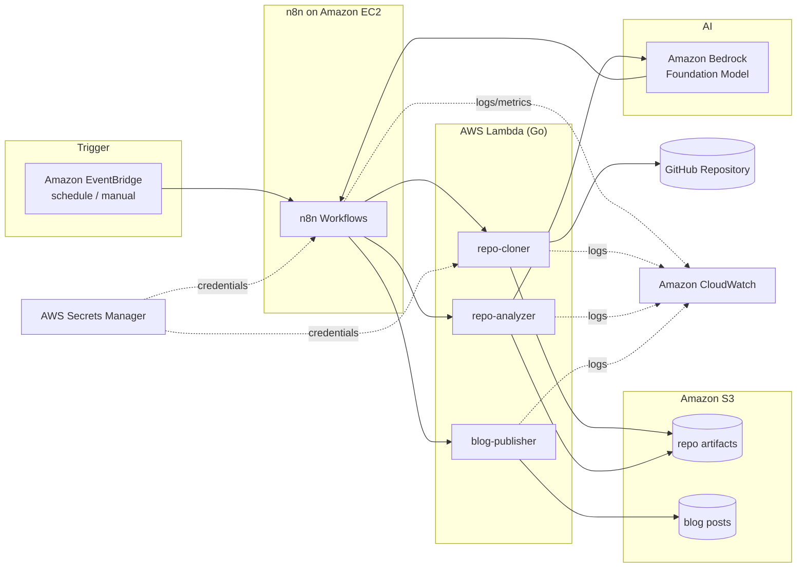

<div align="center">

# AI GitHub Repository Blog Generator

**Turn any GitHub repository into a professional, publication-ready technical blog post — automatically, using Amazon Bedrock.**

[](./LICENSE)
[](https://www.terraform.io/)
[](https://aws.amazon.com/)
[](https://aws.amazon.com/bedrock/)
[](https://n8n.io/)
[](https://go.dev/)
[](./.github/workflows)
[](./docs/contributing.md)

</div>

---

## Overview

**AI GitHub Repository Blog Generator** is a serverless, event-driven platform that analyzes a GitHub repository — its purpose, architecture, technologies, and implementation — and generates a high-quality technical blog post in Markdown using [Amazon Bedrock](https://aws.amazon.com/bedrock/).

Point it at a repository. The platform clones it, extracts metadata, discovers and reads the most relevant files, detects the technology stack, builds a structured prompt, invokes a foundation model on Amazon Bedrock, and writes a versioned Markdown blog post to Amazon S3 — end to end, with no manual intervention.

Orchestration is handled by [n8n](https://n8n.io/). Heavy lifting (cloning, analysis, publishing) runs in Go-based AWS Lambda functions. Everything is provisioned with [Terraform](https://www.terraform.io/) and runs on AWS.

> This is an open-source **portfolio project** that demonstrates production-grade AI Engineering, Amazon Bedrock, AWS, Terraform, n8n, workflow automation, Infrastructure as Code, and operable, observable software engineering.

---

## Features

- 🔍 **Automated repository analysis** — clones a repo, extracts metadata, discovers files, and reads READMEs and key source files.
- 🧠 **Technology detection** — infers languages, frameworks, build tools, and infrastructure from the file tree and manifests.
- ✍️ **AI blog generation** — builds a structured prompt and generates a professional technical article via Amazon Bedrock.
- 📝 **Clean Markdown output** — front matter, headings, code blocks, and diagrams, ready to publish.
- 🗂️ **Versioned storage** — every generated post is versioned and retained in Amazon S3.
- ⏰ **Scheduling** — generate on demand or on a schedule via Amazon EventBridge.
- 🔗 **Workflow orchestration** — composable n8n workflows connect each stage with retries and error handling.
- 🔔 **Notifications** — success/failure notifications on completion.
- 💰 **Cost-aware by design** — EC2 start/stop scheduling, S3 lifecycle policies, and short CloudWatch retention.
- 🔒 **Secure by default** — least-privilege IAM, Secrets Manager, encryption at rest and in transit.
- 🏗️ **100% Infrastructure as Code** — reproducible environments with Terraform and remote state.

---

## Architecture Overview



See **[docs/architecture.md](./docs/architecture.md)** for the full architecture, data flow, and storage design.

---

## AWS Services

| Service | Role in the platform |
| --- | --- |
| **Amazon Bedrock** | Foundation model inference for blog generation |
| **Amazon EC2** | Hosts the n8n orchestration engine (Docker Compose) |
| **AWS Lambda** | Go functions for cloning, analysis, and publishing |
| **Amazon S3** | Stores repository artifacts and versioned blog posts; remote Terraform state |
| **Amazon EventBridge** | Scheduled and event-driven triggers; EC2 start/stop scheduling |
| **Amazon CloudWatch** | Logs, metrics, dashboards, and alarms |
| **AWS Secrets Manager** | GitHub tokens, n8n credentials, API keys |
| **AWS IAM** | Least-privilege roles and policies |
| **Amazon VPC** | Network isolation, subnets, security groups |
| **Amazon DynamoDB** | Terraform state locking |

Full details in **[docs/infrastructure.md](./docs/infrastructure.md)**.

---

## Technology Stack

| Layer | Technology |
| --- | --- |
| AI / Inference | Amazon Bedrock (Anthropic Claude foundation models) |
| Orchestration | n8n |
| Application code | Go (AWS Lambda) |
| Infrastructure as Code | Terraform |
| Containers | Docker, Docker Compose |
| Cloud | AWS |
| CI/CD | GitHub Actions |
| State & artifacts | Amazon S3, Amazon DynamoDB |

---

## Screenshots

> _Screenshots are placeholders and will be added as the UI/workflow surfaces stabilize (**future work**)._

| View | Description |
| --- | --- |
| `docs/assets/n8n-workflow.png` | The AI blog generation workflow in the n8n editor |
| `docs/assets/generated-post.png` | A rendered generated Markdown blog post |
| `docs/assets/cloudwatch-dashboard.png` | Operational dashboard with run metrics |

---

## Demo

> _A hosted demo and walkthrough video are **future work** (see [Roadmap](./docs/roadmap.md))._

A typical run:

1. A schedule (or manual trigger) fires an EventBridge event.
2. n8n starts the **Repository Ingestion** workflow with a target repo URL.
3. The repo is cloned and analyzed; a prompt is assembled.
4. Amazon Bedrock generates the article.
5. A versioned Markdown post lands in S3, and a notification is sent.

---

## Quick Start

> Full instructions: **[docs/deployment.md](./docs/deployment.md)** (AWS) and **[docs/local-development.md](./docs/local-development.md)** (local).

**Prerequisites:** an AWS account with Amazon Bedrock model access, Terraform ≥ 1.6, AWS CLI v2, Docker, Go ≥ 1.22, and Git.

```bash
# 1. Clone
git clone https://github.com/<your-org>/ai-github-repository-blog-generator.git
cd ai-github-repository-blog-generator

# 2. Configure variables and secrets (see docs/deployment.md)
cp terraform/terraform.tfvars.example terraform/terraform.tfvars
# edit terraform/terraform.tfvars

# 3. Provision infrastructure
cd terraform
terraform init
terraform plan -out tfplan
terraform apply tfplan

# 4. Import the n8n workflows (see docs/workflows.md)
```

To run n8n locally instead:

```bash
cd docker
cp .env.example .env       # fill in values
docker compose up -d
# n8n available at http://localhost:5678
```

---

## Project Structure

```text
ai-github-repository-blog-generator/
├── README.md
├── LICENSE
├── .github/
│   └── workflows/              # GitHub Actions: terraform, go, lint, security
├── docs/                       # Project documentation (this directory)
├── terraform/
│   ├── main.tf
│   ├── variables.tf
│   ├── outputs.tf
│   ├── providers.tf
│   ├── backend.tf              # S3 + DynamoDB remote state
│   └── modules/
│       ├── networking/         # VPC, subnets, security groups
│       ├── ec2/                # n8n host
│       ├── lambda/             # Go Lambda functions
│       ├── s3/                 # artifact + post buckets, lifecycle
│       ├── eventbridge/        # schedules and rules
│       ├── secrets/            # Secrets Manager
│       ├── iam/                # roles and policies
│       └── monitoring/         # CloudWatch dashboards and alarms
├── lambdas/
│   ├── repo-cloner/            # Go: clone repo → S3
│   ├── repo-analyzer/          # Go: analyze repo, build prompt
│   └── blog-publisher/         # Go: write versioned Markdown → S3
├── workflows/
│   └── n8n/                    # Exported n8n workflow JSON
├── docker/
│   ├── docker-compose.yml      # local n8n stack
│   └── .env.example
└── scripts/
    ├── bootstrap.sh            # create remote-state backend
    └── deploy.sh               # convenience deploy wrapper
```

---

## Documentation

| Document | Description |
| --- | --- |
| [Requirements](./docs/requirements.md) | Functional and non-functional requirements |
| [Architecture](./docs/architecture.md) | System, AWS, and data-flow architecture |
| [Deployment](./docs/deployment.md) | AWS deployment with Terraform |
| [Local Development](./docs/local-development.md) | Running and developing locally |
| [Workflows](./docs/workflows.md) | Every n8n workflow, documented |
| [Infrastructure](./docs/infrastructure.md) | Every AWS service and Terraform module |
| [Security](./docs/security.md) | IAM, secrets, encryption, auditing |
| [Monitoring](./docs/monitoring.md) | CloudWatch metrics, logs, and alerts |
| [Cost Optimization](./docs/cost-optimization.md) | Cost controls and estimates |
| [CI/CD](./docs/ci-cd.md) | GitHub Actions pipelines |
| [Roadmap](./docs/roadmap.md) | Planned features and releases |
| [Contributing](./docs/contributing.md) | How to contribute |

---

## Roadmap Summary

- **v1.0** — Repository analysis, Amazon Bedrock integration, Markdown generation, Terraform deployment.
- **v1.1** — Improved prompts, better architecture diagrams, SEO optimization.
- **v2.0** — Multiple blog templates, multi-language support, automatic publishing.
- **v3.0** — Multi-repository support, AI content review, team collaboration.

Full detail: **[docs/roadmap.md](./docs/roadmap.md)**.

---

## Contributing

Contributions are welcome! Please read the **[Contributing Guide](./docs/contributing.md)** for the development workflow, branch naming, commit conventions, and the pull-request process.

---

## License

Released under the [MIT License](./LICENSE).
