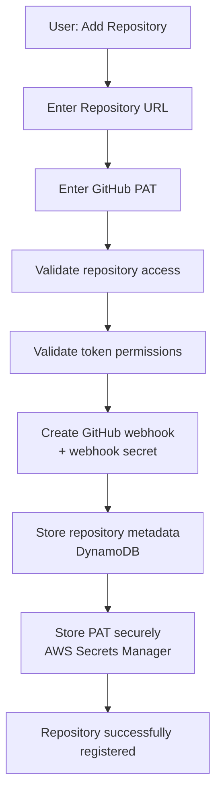
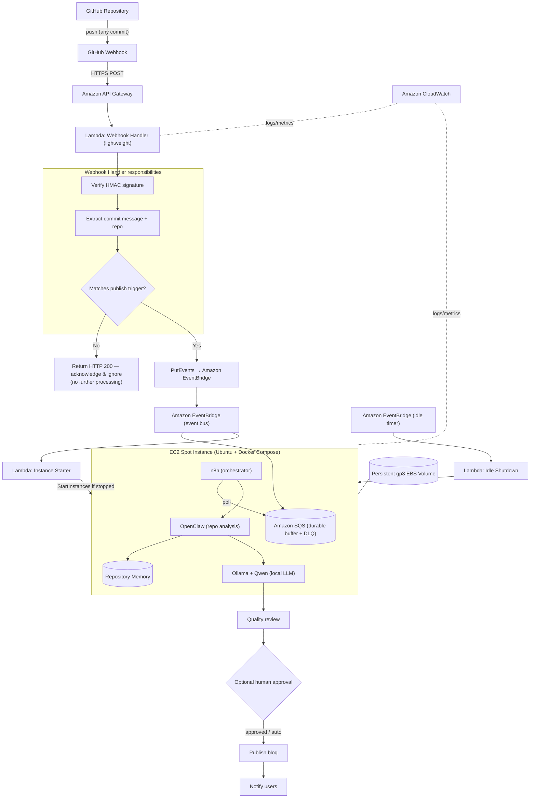
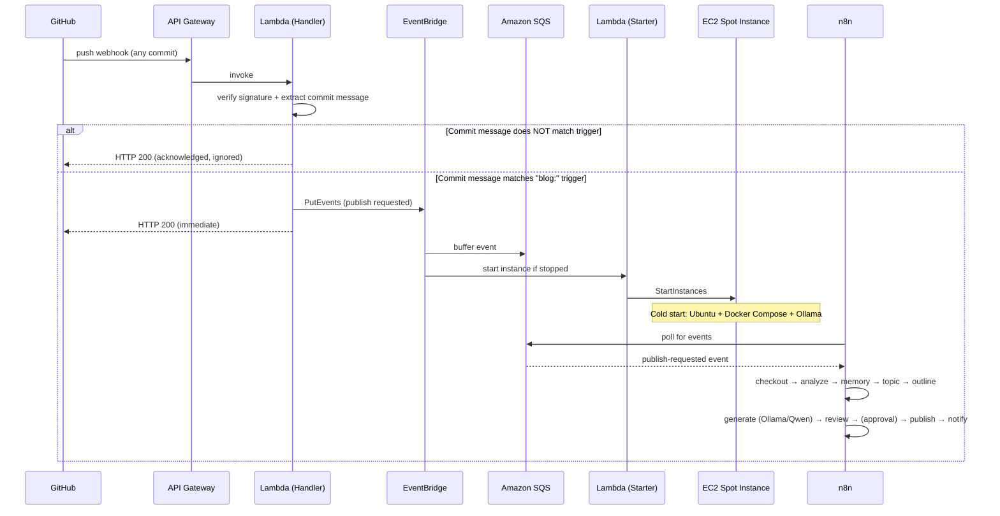
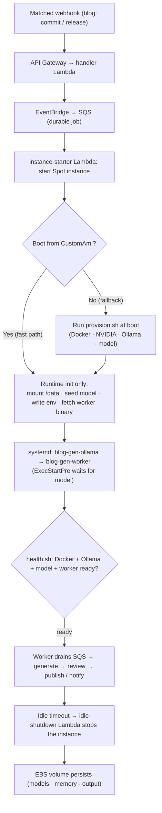
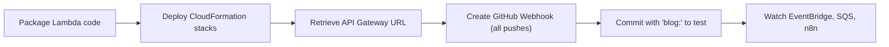

<div align="center">

# GitHub AI Blog Generator

**Event-driven, fully self-hosted AI platform that turns GitHub repositories into high-quality technical content — but only when you opt in with a `blog:` commit. Powered by OpenClaw, Ollama, and local LLMs, orchestrated with n8n, triggered through Amazon EventBridge, and running on cost-optimized AWS EC2 Spot Instances provisioned entirely with AWS CloudFormation.**

[](./LICENSE)
[](./docs/development-plan.md)
[](https://go.dev/)
[](https://aws.amazon.com/cloudformation/)
[](https://aws.amazon.com/ec2/spot/)
[](https://ollama.com/)
[](https://github.com/QwenLM)
[](https://n8n.io/)
[](https://aws.amazon.com/eventbridge/)
[](https://aws.amazon.com/sqs/)
[](https://docs.github.com/webhooks)
[](./docs/contributing.md)

</div>

---

## Table of Contents

- [Overview](#overview)
- [Status](#status)
- [Core Principle](#core-principle)
- [Why This Project](#why-this-project)
- [Features](#features)
- [Repository Registration](#repository-registration)
- [Publishing Trigger](#publishing-trigger)
- [Architecture](#architecture)
- [AI Workflow](#ai-workflow)
- [Technology Stack](#technology-stack)
- [Cost Optimisation](#cost-optimisation)
- [Spot Instance Trade-offs](#spot-instance-trade-offs)
- [Optimizing Spot Instance Startup](#optimizing-spot-instance-startup)
- [Security](#security)
- [Prerequisites](#prerequisites)
- [Installation](#installation)
- [Configuration](#configuration)
- [Deployment](#deployment)
- [CloudFormation Deployment Guide](#cloudformation-deployment-guide)
- [Project Structure](#project-structure)
- [Roadmap](#roadmap)
- [Local Development Workflow](#local-development-workflow)
- [Contributing](#contributing)
- [Documentation](#documentation)
- [License](#license)

---

## Overview

**GitHub AI Blog Generator** is a fully self-hosted, event-driven AI platform that turns any GitHub repository into publication-ready technical content — **on demand, under your explicit control**.

You onboard a repository once (for the MVP, with its URL and a **GitHub Personal Access Token**); the platform validates access, creates the webhook, stores metadata, and stores the token securely in **AWS Secrets Manager**. From then on, the platform monitors the repository with **GitHub Webhooks** — but **receiving a webhook does not automatically generate anything**. Every event is first checked against a **configurable commit-message trigger** (default `blog:`). Only when a commit message matches does the platform publish the event to **Amazon EventBridge**, start a cost-optimized **EC2 Spot Instance**, and run the generation pipeline. Every other event is acknowledged with `HTTP 200` and ignored.

When a run does fire, **n8n** orchestrates a pipeline on the instance where **OpenClaw** analyses the repository, **Repository Memory** provides continuity across runs, and **Ollama** runs a **local LLM (Qwen by default)** to generate content — with **zero paid inference APIs**. After a configurable idle timeout, a Lambda automatically **stops the instance**, so you pay only when content is actually being produced.

Supported outputs include technical blog posts, README improvements, documentation, architecture summaries, API documentation, project overviews, release notes, changelogs, and technical tutorials — all emitted as clean, portable Markdown.

> This project is architected for real-world production practices: **developer-controlled generation**, self-hosting, cost optimisation, local LLM inference, AWS-native event-driven design, and Infrastructure as Code with AWS CloudFormation.

---

## Status

**The MVP is implemented and unit-tested** (a single Go module + four AWS Lambdas + an instance worker, all backed by modular CloudFormation). It has **not yet been deployed** to a live AWS account — deployment needs your AWS credentials and a GPU instance. Milestone-by-milestone detail lives in the [Development Plan](./docs/development-plan.md).

**What works end to end today:**

register repo → webhook (HMAC + commit-trigger gate) → EventBridge → SQS → EC2 Spot start → **worker**: skip-if-already-published → clone repo (go-git) → read README/docs/commits → generate 5 content types via local Ollama → quality review → optional human approval → publish Markdown files → record Repository Memory → notify → idle shutdown.

| Area | Status |
| --- | --- |
| Repository registration (URL + PAT → Secrets Manager + DynamoDB, auto webhook) | ✅ Implemented |
| Webhook handler — HMAC verify + commit-message trigger gate (no AI, never reads the PAT) | ✅ Implemented |
| Event processing — EventBridge → SQS buffer + EC2 Spot start | ✅ Implemented |
| Instance lifecycle — on-demand start, idle shutdown | ✅ Implemented |
| Content pipeline — clone, analyse, generate (5 types), review, approval, publish, memory, notify | ✅ Implemented |
| Local inference — Ollama + Qwen (no paid API) | ✅ Implemented |
| Infrastructure — modular CloudFormation (`cfn-lint`-clean) | ✅ Implemented |
| CI/CD — Go tests, cfn-lint, security scanning, opt-in OIDC deploy | ✅ Implemented |
| Deploy to AWS + end-to-end validation | ⏳ Needs your AWS account + GPU instance |
| Future roadmap — email notifications, extra trigger sources, GitHub Apps, a web approvals UI | ⏳ Planned |

> **Implementation note.** The MVP runtime is a **Go worker** (`cmd/worker`) that drains SQS and drives the pipeline — chosen for testability. The **n8n** orchestration described throughout these docs remains a valid alternative for the same seams; the pipeline stages are composable ports either can drive. See the [Development Plan](./docs/development-plan.md) for the runtime decision.

---

## Core Principle

> **AI-generated blog content is created only when a GitHub webhook event contains a commit message that matches a configurable publishing trigger. All other webhook events are acknowledged and ignored.**

This single rule keeps developers in complete control of when content is produced, prevents unwanted publishing, and eliminates the AI, compute, and storage cost of processing routine commits.

---

## Why This Project

Most "AI content" projects assume two things this project rejects: that every repository change should be processed, and that you have an unlimited budget for hosted inference APIs (OpenAI, Anthropic, Amazon Bedrock).

- **Opt-in, not automatic.** Content is generated **only** for commits you explicitly mark with a `blog:` trigger. Normal development never produces content.
- **No paid inference.** All models run locally via Ollama. You are never billed per token.
- **Pay only when you compute.** A Spot Instance starts on a trigger match and stops on idle. An idle system costs only cents per month (EBS storage).
- **Own your data.** Repository content is analysed on infrastructure you control; nothing is sent to a third-party model provider.
- **Reproducible infrastructure.** Everything is defined in modular AWS CloudFormation — no click-ops, no Terraform.

---

## Features

| Capability | Description |
| --- | --- |
| 🔌 **Repository registration** | Onboard a repo with its URL + a GitHub PAT; the platform validates access and creates the webhook |
| 🔑 **Secure PAT storage** | The token is stored in AWS Secrets Manager; only a secret reference is kept in the metadata store |
| 🗄️ **Repository metadata store** | Per-repo metadata (owner, webhook ID, trigger pattern, secret reference, last commit) in DynamoDB |
| 🎯 **Commit-message trigger gate** | Generation runs **only** when a commit message matches the configurable trigger (default `blog:`) |
| 🪝 **GitHub Webhook ingress** | Push events are received, verified, and evaluated — never blindly processed |
| 🔐 **Signature validation** | Every delivery is verified with HMAC SHA-256 before evaluation |
| 🧭 **EventBridge event bus** | Matched events are published to EventBridge, which starts compute and buffers the run |
| 📥 **Durable buffering** | Events are held in Amazon SQS so nothing is lost while the instance boots |
| ⚡ **On-demand compute** | The EC2 Spot Instance is started only when there is a triggered run to process |
| 🧠 **Local LLM inference** | Ollama runs Qwen (or any local model) — no external API, no per-token cost |
| 🔍 **Deep repository analysis** | OpenClaw inspects README, source, structure, IaC, Docker, CI/CD, and docs |
| 🗂️ **Repository Memory** | Persistent per-repo memory of prior analyses and published topics for continuity and de-duplication |
| ✅ **Quality review** | A review stage checks generated content before publishing |
| 🙋 **Optional human approval** | An optional gate lets a human approve content before it is published |
| 🔗 **n8n orchestration** | Composable, observable pipeline with branching, retries, and notifications |
| ✍️ **Multi-format output** | Blog posts, READMEs, docs, architecture summaries, changelogs, tutorials |
| 📝 **Markdown-native** | All content is emitted as clean, portable GitHub-flavoured Markdown |
| ▶️ **Manual execution** | Trigger a run for any repository on demand, without a webhook |
| 🔁 **Retry & error handling** | Failed stages retry with backoff; poison messages route to a dead-letter queue |
| 🪵 **Structured logging** | CloudWatch logs and metrics across every stage of the pipeline |
| 🔔 **Notifications** | Users are notified when content is published or a run fails |
| 💤 **Automatic shutdown** | An idle-timeout Lambda stops the instance so you pay only for active work |
| 💾 **Persistent storage** | A gp3 EBS volume keeps models, n8n state, and Repository Memory across cycles |

---

## Repository Registration

For the **MVP**, you connect a repository by providing two things:

| Input | Purpose |
| --- | --- |
| **GitHub Repository URL** | The repository to monitor and analyse |
| **GitHub Personal Access Token (PAT)** | Access repository contents, register the webhook, read metadata, and (future) synchronise the repo |

### How onboarding works



> **To register a repo**, POST the repository URL + PAT to the registration API
> Gateway endpoint. That route **requires an `x-api-key` header** (403 without it).
> Copy-paste commands, including how to fetch the API key: **[First Deploy → Register the repository](./docs/first-deploy.md#5-register-the-repository)**.

### Why a PAT for the MVP

A PAT keeps onboarding simple while providing a clear migration path to **GitHub Apps** in future releases (see [Roadmap](#roadmap)). The token is required to access repository contents, create the webhook, and read repository metadata.

### How credentials are stored

- The PAT is stored as a secret in **AWS Secrets Manager** — **never in plain text**, and never in source, config, environment variables, or the metadata database.
- The metadata store keeps only a **reference** to the secret (its ARN/name), plus non-sensitive metadata: repository ID, owner, name, URL, default branch, webhook ID, trigger pattern, enabled status, last processed commit SHA, and registration timestamp.
- The PAT is retrieved **only when required** (to clone the repository or manage the webhook), under least-privilege IAM.

This keeps the platform **secure** (secrets isolated, least privilege, never logged), **simple** (two inputs to onboard), and **cost-effective** (repository and token validation happen up front, before any compute or AI runs). See [Security](./docs/security.md) and [Requirements → Repository Registration](./docs/requirements.md#12-repository-registration-requirements-mvp).

> **GitHub App authentication is a future enhancement, not part of the MVP.**

---

## Publishing Trigger

Content is generated **only** when a commit message matches the configured publishing trigger.

### Default trigger

```text
blog:
```

Any commit whose message begins with `blog:` requests a blog run. Examples:

```text
blog: Added GitHub Webhook Support
blog: Introduced Repository Memory
blog: Release v1.2 Architecture Improvements
```

### Developer experience — you stay in control

Routine development commits are **acknowledged and ignored** — they never generate content:

```text
fix(auth): resolve token refresh issue      # ignored
refactor(api): simplify routing             # ignored
docs: update README                         # ignored
```

Only commits explicitly intended for content creation trigger the workflow:

```text
blog: Added OAuth Authentication            # triggers a run
blog: Repository Memory Implementation      # triggers a run
```

### Configurable trigger patterns

The default is `blog:`, but each repository can set its own **Trigger Pattern** at registration (stored in metadata, evaluated per delivery):

- `blog:` — literal prefix (default)
- `[blog]` — any literal prefix works
- `regex:^(blog|post):` — a `regex:`-prefixed regular expression

Pass `trigger_pattern` when registering; invalid regexes are rejected. Additional entry points (releases, tags, PR labels, manual runs, scheduled summaries) remain [planned](#roadmap).

---

## Architecture

The platform is **event-driven and opt-in**. A webhook is received on every push, but the pipeline only advances when the commit message matches the trigger.



### Request lifecycle

1. **GitHub** emits a webhook on every push.
2. **API Gateway** invokes the **Webhook Handler Lambda**.
3. The **handler** resolves the repository's metadata, verifies the HMAC signature using that repo's webhook secret (from Secrets Manager), extracts the commit message, and **validates it against the repository's trigger pattern**:
   - **No match** → return **HTTP 200** and stop. Nothing else runs.
   - **Match** → **publish the event to Amazon EventBridge** and return HTTP 200.
4. **EventBridge** routes the matched event to two targets: the **SQS** durable buffer, and the **Instance Starter Lambda**, which starts the **EC2 Spot Instance** if it is stopped.
5. The instance boots Ubuntu with Docker Compose running **n8n**, **OpenClaw**, and **Ollama**.
6. **n8n polls SQS** and runs the pipeline: checkout → analysis → **Repository Memory** → topic identification → outline → **AI generation (Ollama/Qwen)** → quality review → **optional human approval** → publish → notify.
7. **EventBridge**'s idle timer triggers the **Idle Shutdown Lambda**, which stops the instance once the system is idle.

For a deeper treatment, see [`docs/architecture.md`](./docs/architecture.md).

---

## AI Workflow



The full node-by-node n8n pipeline is documented in [`docs/workflows.md`](./docs/workflows.md).

---

## Technology Stack

| Layer | Technology | Purpose |
| --- | --- | --- |
| **Onboarding** | Registration API (API Gateway + Lambda) | Validate repo + PAT, create webhook, store metadata/secret |
| **Credentials** | AWS Secrets Manager | Securely store GitHub PATs and webhook secrets |
| **Metadata** | Amazon DynamoDB | Per-repository metadata (secret reference, trigger pattern, …) |
| **Trigger** | GitHub Webhooks | Deliver push events |
| **Gate** | Commit-message trigger (`blog:`) | Decide whether a run should happen at all |
| **Ingress** | Amazon API Gateway | Public HTTPS endpoint for webhooks and registration |
| **Serverless** | AWS Lambda | Registration, handler (validate + publish), instance starter, idle shutdown |
| **Event bus** | Amazon EventBridge | Route matched events; start compute; buffer via SQS |
| **Queue** | Amazon SQS | Durable buffer so events are never lost during cold start |
| **Compute** | EC2 Spot Instance (Ubuntu) | Cost-optimized host for AI processing |
| **Storage** | gp3 EBS Volume | Persistent models, n8n state, and Repository Memory |
| **Runtime** | Docker + Docker Compose | Reproducible service topology on the instance |
| **Orchestration** | n8n | Workflow engine that drives the pipeline |
| **Analysis** | OpenClaw | Repository cloning and structural/code analysis |
| **Memory** | Repository Memory | Per-repo continuity and topic de-duplication |
| **Inference** | Ollama | Local model server |
| **Model** | Qwen (default) | Local LLM for content generation |
| **IaC** | AWS CloudFormation | Modular, reusable infrastructure templates |
| **Observability** | Amazon CloudWatch | Logs, metrics, and alarms |

> **No Amazon Bedrock. No OpenAI. No Anthropic. No paid inference API.** All AI inference runs locally through Ollama.

---

## Cost Optimisation

This project is engineered to keep AWS costs as close to zero as possible when idle.

### Trigger pre-filtering — a primary cost-saving mechanism

Validating the commit-message trigger **in the lightweight Lambda, before any compute or AI runs**, is one of the platform's biggest cost levers. Because the vast majority of commits never match `blog:`, the platform:

- **never starts the EC2 Spot Instance** for routine commits,
- **never invokes the local LLM** for content nobody asked for,
- **never stores** unwanted output,
- and **never runs** an unnecessary pipeline.

The handler simply returns `HTTP 200` and stops. You pay for AI processing only on the commits you explicitly opt in.

### Other design principles

- **Event-driven compute.** Nothing runs until a *matched* event arrives. There is no always-on server.
- **Pay only when you process.** The Spot Instance is started on demand and stopped after an idle timeout.
- **Spot pricing.** Spot Instances are typically **70–90% cheaper** than On-Demand.
- **Local inference.** Ollama runs the model locally, so there are **no per-token API fees**.
- **Persistent EBS, ephemeral compute.** Models, n8n state, and Repository Memory live on a persistent gp3 volume; only cheap storage cost persists while stopped.

### How SQS prevents event loss during cold start

Starting a Spot Instance is not instantaneous (the **cold start**). To ensure no matched event is lost: EventBridge writes the event to **Amazon SQS**, which durably retains it (up to 14 days) regardless of instance state; when n8n comes online it **polls SQS** and processes the backlog; a **visibility timeout** and **dead-letter queue** handle retries and poison messages.

Full numbers and tuning guidance: [`docs/cost-optimization.md`](./docs/cost-optimization.md).

---

## Spot Instance Trade-offs

Spot Instances are the right default for this asynchronous, interruptible, batch-style workload.

**Why Spot was selected** — runs are short, bursty, and tolerant of interruption; cost is the primary constraint, and Spot delivers the largest EC2 saving.

**Advantages** — 70–90% cheaper than On-Demand; same instance types and performance; ideal for GPU-backed AI batch jobs.

**Disadvantages** — interruptible (two-minute reclaim warning); availability varies by type/AZ; requires idempotent, resumable processing.

**Mitigations** — work lives in SQS, so an interrupted job returns to the queue and is retried; models, state, and Repository Memory persist on EBS; processing is idempotent; On-Demand fallback is on the [roadmap](#roadmap).

---

## Optimizing Spot Instance Startup

Because the instance is stopped when idle and (re)launched per job, **startup time is on the critical path** for every generation. A stock Ubuntu boot would spend ~10–15 minutes installing NVIDIA drivers, Docker, the Ollama image, and pulling the ~4.7 GB model before it could process anything. The optimization removes almost all of that from the boot path.

### Strategy

- **Pre-baked custom AMI.** All slow, network-heavy setup is baked into an AMI once, so it isn't repeated on every launch. The image is defined in code ([`packer/blog-gen.pkr.hcl`](./packer/blog-gen.pkr.hcl) + [`scripts/ami/provision.sh`](./scripts/ami/provision.sh)) and rebuilt with one command.
- **Baked model seed.** The model is baked in and *copied* to the persistent volume at first boot — **no multi-GB download at launch**.
- **Runtime-only boot work.** Boot does just the instance-specific bits: mount `/data`, seed the model, write the worker env from stack params, drop in the small worker binary (from S3), and start the services.
- **systemd auto-start + health gating.** `blog-gen-ollama` and `blog-gen-worker` are enabled units, so they start automatically on every boot; the worker waits (`ExecStartPre`) until Ollama has the model loaded, and `health.sh` reports overall readiness.
- **Persistent storage unchanged.** Models, Repository Memory, and generated output live on a `Retain` gp3 EBS volume that survives Spot interruption and stop/start.

### Why a custom AMI

The heavy work (GPU driver install — which alone is minutes and can need a reboot; Docker; the container image; the model) is identical on every launch and **has no per-instance inputs**. Baking it is the highest-leverage way to cut startup time while keeping the architecture and cost model unchanged. The only per-launch download is the few-MB worker binary.

### Build & update process

Fully automated — no manual AMI id to copy:

1. **Actions → build-ami → Run workflow** (or `scripts/build-ami.sh` locally). It builds the image and **writes the AMI id to SSM** (`/blog-gen/worker-ami`).
2. **Redeploy** (merge to main / run `deploy.yml`). Deploy **reads the AMI id from SSM automatically** and launches instances from it.

Rebuild only when **runtime dependencies** change (model, Docker/NVIDIA/Ollama, or `provision.sh`) — ordinary app changes just redeploy the worker binary. Set the `CUSTOM_AMI` variable only to *pin* a specific image. Full details in [docs/ami.md](./docs/ami.md).

### Startup workflow



### Expected improvement, cost & trade-offs

| Aspect | Stock AMI (fallback) | Custom AMI (optimized) |
| --- | --- | --- |
| Time to "ready for jobs" | ~10–15 min (driver + Docker + image + 4.7 GB model) | **< 1 min** typical (services start; model already present) |
| Network at boot | Hundreds of MB + model | worker binary only (few MB) |
| Reproducibility | script at boot | same script, baked; one-command rebuild |

**Cost implications** — the baked AMI stores an EBS snapshot (~5 GB incl. the model): a few cents/month. Faster startup also means the (expensive) GPU instance spends **less time booting and idle**, so per-job cost typically *drops*. The trade-off is an occasional AMI rebuild when dependencies change, and per-region AMI management. Use `--no-bake-model` to shrink the image at the cost of a one-time model pull on first boot.

**Operational note** — if `CUSTOM_AMI` is unset, deploys still work: the instance falls back to running `provision.sh` at boot (slower, but nothing breaks).

---

## Security

Security is built in by default (full detail in [`docs/security.md`](./docs/security.md)):

- **Least-privilege IAM roles** — each Lambda and the EC2 instance profile is scoped to only what it needs.
- **GitHub webhook signature validation** — HMAC SHA-256 (constant-time) before any event is evaluated or published.
- **Security groups** — inbound tightly restricted; SSH limited to known IPs; n8n and Ollama ports never publicly exposed.
- **HTTPS only** — the API Gateway webhook endpoint accepts TLS traffic only.
- **Environment variables & secrets** — the webhook secret and trigger config are injected via environment/secret stores, never committed.
- **SSH key authentication** — key-pair auth only; password login disabled.

---

## Prerequisites

- An **AWS account** with permissions to create VPC, EC2, Lambda, API Gateway, EventBridge, SQS, IAM, and CloudWatch resources.
- The **AWS CLI v2** installed and configured (`aws configure`).
- A **key pair** for SSH access to the EC2 instance.
- A **GitHub account** with admin access to the repositories you want to process (to create webhooks).
- **Docker** and **Docker Compose** knowledge for local development (optional).
- A shared **webhook secret** for HMAC signature validation.

> **No Amazon Bedrock, OpenAI, or Anthropic access is required** — all inference runs locally via Ollama.

---

## Installation

```bash
# 1. Clone the repository
git clone https://github.com/<your-org>/github-ai-blog-generator.git
cd github-ai-blog-generator

# 2. Review and copy the environment template
cp .env.example .env

# 3. Configure your AWS CLI (if not already done)
aws configure
```

---

## Configuration

Configuration is provided through environment variables and CloudFormation parameters. Key values:

| Variable / Parameter | Description | Example |
| --- | --- | --- |
| `AWS_REGION` | Deployment region | `us-east-1` |
| `WEBHOOK_SECRET` | Shared secret for GitHub HMAC validation | `a-long-random-string` |
| `PUBLISH_TRIGGER` | Commit-message trigger that gates generation | `blog:` |
| `INSTANCE_TYPE` | EC2 instance type for the Spot request | `g4dn.xlarge` |
| `SPOT_MAX_PRICE` | Maximum Spot price you are willing to pay | `0.20` |
| `IDLE_TIMEOUT_MINUTES` | Minutes of inactivity before auto-shutdown | `15` |
| `OLLAMA_MODEL` | Local model to run | `qwen2.5:7b` |
| `EBS_VOLUME_SIZE_GB` | Size of the persistent gp3 volume | `100` |
| `KEY_PAIR_NAME` | EC2 key pair for SSH access | `blog-generator-key` |
| `REQUIRE_HUMAN_APPROVAL` | Require manual approval before publishing | `false` |

Secrets such as `WEBHOOK_SECRET` must **never** be committed. See [`docs/security.md`](./docs/security.md).

---

## Deployment



1. Package the Lambda functions and upload them (or deploy inline).
2. Deploy the CloudFormation stacks (network → serverless → compute → observability).
3. Copy the **API Gateway invoke URL** from the stack outputs.
4. Add a **webhook** to your repository pointing at that URL, using your `WEBHOOK_SECRET`. Send **all pushes** — the handler filters by trigger.
5. Push a commit whose message starts with `blog:` and watch the pipeline run. Push a normal commit and confirm it is acknowledged and ignored.

Full instructions: [`docs/deployment.md`](./docs/deployment.md).

---

## CloudFormation Deployment Guide

All infrastructure is provisioned with **AWS CloudFormation** — no Terraform. Templates are **modular and reusable**.

Provisioned resources include: **VPC, Public Subnet, Internet Gateway, Route Tables, Security Groups, IAM Roles, EC2 Spot Instance, persistent gp3 EBS Volume, API Gateway, Lambda functions, Amazon EventBridge, Amazon SQS, and CloudWatch.**

| Stack | Template | Responsibility |
| --- | --- | --- |
| **Network** | `network.yaml` | VPC, public subnet, IGW, route tables, security groups |
| **Serverless** | `serverless.yaml` | API Gateway, Lambdas, EventBridge bus + rules, SQS + DLQ, IAM |
| **Compute** | `compute.yaml` | EC2 Spot request, gp3 EBS volume, instance IAM role, user data |
| **Observability** | `observability.yaml` | CloudWatch log groups, metrics, alarms |

```bash
# 1. Network layer
aws cloudformation deploy \
  --template-file infrastructure/network.yaml \
  --stack-name blog-gen-network \
  --capabilities CAPABILITY_NAMED_IAM

# 2. Serverless layer (API Gateway, Lambdas, EventBridge, SQS)
aws cloudformation deploy \
  --template-file infrastructure/serverless.yaml \
  --stack-name blog-gen-serverless \
  --parameter-overrides ArtifactsBucket=$ARTIFACTS_BUCKET PublishTrigger=$PUBLISH_TRIGGER \
  --capabilities CAPABILITY_NAMED_IAM

# 3. Compute layer (EC2 Spot + persistent EBS)
aws cloudformation deploy \
  --template-file infrastructure/compute.yaml \
  --stack-name blog-gen-compute \
  --parameter-overrides \
      InstanceType=$INSTANCE_TYPE \
      SpotMaxPrice=$SPOT_MAX_PRICE \
      KeyPairName=$KEY_PAIR_NAME \
  --capabilities CAPABILITY_NAMED_IAM

# 4. Retrieve the API Gateway URL for your GitHub webhook
aws cloudformation describe-stacks \
  --stack-name blog-gen-serverless \
  --query "Stacks[0].Outputs[?OutputKey=='WebhookUrl'].OutputValue" \
  --output text
```

See [`docs/infrastructure.md`](./docs/infrastructure.md) for the full parameter reference and stack outputs.

---

## Project Structure

Single Go module (monorepo): shared code in `internal/`, entry points under `lambdas/` and `cmd/`.

```text
ai-github-repository-blog-generator/
├── README.md · LICENSE · Makefile · go.mod · .env.example
├── .github/workflows/         # CI: go, cloudformation, security, deploy (OIDC, opt-in)
├── infrastructure/            # AWS CloudFormation (modular; cfn-lint clean)
│   ├── bootstrap.yaml         # artifacts bucket + OIDC provider + deploy role (once)
│   ├── network.yaml
│   ├── serverless.yaml        # API Gateway, Lambdas, EventBridge, SQS, Secrets Manager, DynamoDB
│   ├── compute.yaml           # EC2 Spot + persistent gp3 EBS
│   └── observability.yaml     # log groups, alarms, dashboard
├── lambdas/                   # Lambda entry points (Go)
│   ├── registration/          # validate repo + PAT → create webhook → store metadata + secret
│   ├── webhook-handler/       # resolve metadata, verify HMAC, trigger gate, publish
│   ├── instance-starter/      # start the Spot Instance on a matched event
│   └── idle-shutdown/         # stop the instance when idle
├── cmd/
│   └── worker/                # instance worker: drain SQS → run the content pipeline
├── internal/                  # shared library code (Clean Architecture, ports + adapters)
│   ├── config · logging · apperror · app          # foundation
│   ├── github · repo · registration · secrets · metadata   # onboarding
│   ├── trigger · githubsig · webhook · eventbus            # trigger + events
│   ├── awsec2 · awssqs · lifecycle                         # instance lifecycle
│   ├── reposource · processing                            # clone (go-git) + retrieval
│   └── ollama · generation · review · approval · memory · publish · notify · pipeline
├── instance/
│   └── docker-compose.yml     # n8n + Ollama (OpenClaw placeholder)
├── scripts/
│   └── bootstrap.sh           # one-time deploy bootstrap
└── docs/                      # architecture, requirements, development-plan, deployment, …
```

---

## Roadmap

- [ ] **GitHub App authentication** (recommended long-term approach, replacing per-repo PATs) + OAuth login
- [ ] Automatic webhook management, fine-grained permissions, and secret rotation
- [ ] Multiple repositories per user, repository groups/organisations, multi-user workspaces
- [x] Approvals dashboard — CLI over the pending queue (`approve -all` auto-approves); web UI still planned
- [x] Configurable custom trigger patterns (`[blog]`, `regex:`, per-repo rules)
- [x] GitHub **Releases** as a trigger source (a published release always triggers); Git Tags / PR labels still planned
- [ ] Manual blog generation from the application, and scheduled repository summaries
- [ ] On-Demand fallback when Spot capacity is unavailable; multi-model support

The living roadmap is maintained in [`docs/roadmap.md`](./docs/roadmap.md).

---

## Local Development Workflow

This project ships versioned Git hooks and an [`act`](https://nektosact.com) integration that mirror GitHub Actions locally, so problems are caught **before** they reach CI. The hooks **complement** GitHub Actions — CI remains the source of truth — and are designed to keep commits fast.

### Install the hooks

```bash
make hooks          # or: ./scripts/install-hooks.sh
```

This sets `git config core.hooksPath .githooks` (no files are copied — the hooks are versioned and update with the repo). Uninstall with `git config --unset core.hooksPath`.

### What runs, and when

```
write code
   │
   ▼
git commit ──▶ pre-commit         (fast, no Docker)
   │            • gofmt  (auto-formats & re-stages your staged Go files)
   │            • go vet (static analysis; golangci-lint too, if installed)
   │            • go test ./...    (unit tests)
   │
   ▼         commit-msg
   │            • Conventional Commits validation
   ▼
git commit succeeds
   │
   ▼
git push ───▶ pre-push
   │            • act runs the primary CI workflow (.github/workflows/go.yml)
   ▼
GitHub Actions  ──▶  review  ──▶  merge
```

The `pre-commit` and CI both call the **same scripts** in [`scripts/hooks/`](./scripts/hooks) (`format.sh`, `lint.sh`, `tests.sh`), so local and CI checks never drift. Running them locally means fewer red builds on GitHub.

### The `act` pre-push mirror

[`act`](https://nektosact.com) runs your GitHub Actions workflows in Docker. The `pre-push` hook runs the primary `go` workflow before every push; if it fails, the push is aborted with the failing job shown.

**Requirements**

| Requirement | Install |
| --- | --- |
| Docker (running daemon) | [Docker Desktop](https://docs.docker.com/get-docker/) (macOS/Windows) or Docker Engine (Linux) |
| `act` | `brew install act` (macOS) · `curl -fsSL https://raw.githubusercontent.com/nektos/act/master/install.sh \| sudo bash` (Linux) |
| OS | Linux or macOS (on Windows use **WSL2**) |

The runner image is pinned in [`.actrc`](./.actrc) to `catthehacker/ubuntu:act-latest` (act's "medium" image — includes Go and git). Run it any time with `make act`.

**Graceful by design:** if Docker or `act` is missing, `pre-push` prints an actionable message and **allows the push** (it does not block contributors who haven't installed `act`). Set `PREPUSH_STRICT=1` to require it instead.

### Escape hatches

| Situation | Command |
| --- | --- |
| Skip all commit hooks (emergency) | `git commit --no-verify` |
| Skip the `act` mirror for one push | `SKIP_ACT=1 git push` |
| Bypass pre-push entirely | `git push --no-verify` |
| Run checks manually | `make check` (fmt-check · lint · test) |

### Troubleshooting

- **`gofmt not found` / `Go toolchain not found`** — install Go (<https://go.dev/dl/>); the hooks read the pinned version from `go.mod`.
- **`Docker ... daemon is not reachable`** — start Docker Desktop (macOS) or the Docker service (Linux), then retry.
- **`act` is slow on first run** — it pulls the runner image once (~ hundreds of MB); subsequent runs are cached.
- **Apple Silicon** — if a workflow needs amd64, add `--container-architecture linux/amd64` via `ACT_EXTRA_ARGS`.
- **"staged files need formatting but also have unstaged changes"** — stage or stash the unstaged edits first, so the hook never commits partial work on your behalf.

See [`docs/local-workflow.md`](./docs/local-workflow.md) for the full reference, and **Future enhancements** (commitizen, CHANGELOG automation, semantic-release, commit signing, secret/vulnerability scanning) documented there.

---

## Contributing

Contributions are welcome! Please read [`docs/contributing.md`](./docs/contributing.md) for the development workflow, coding standards, and pull-request process.

---

## Documentation

| Document | Description |
| --- | --- |
| [Development Plan](./docs/development-plan.md) | MVP milestones, implementation decisions, and current status |
| [Architecture](./docs/architecture.md) | Components, trigger path, data flow, and design decisions |
| [Requirements](./docs/requirements.md) | Functional, non-functional, infrastructure, and security requirements |
| [Infrastructure](./docs/infrastructure.md) | CloudFormation stacks, parameters, and outputs |
| [Custom AMI](./docs/ami.md) | Building/updating the pre-baked worker AMI for fast Spot startup |
| [First Deploy](./docs/first-deploy.md) | One-page runbook: bootstrap → deploy → register → trigger → verify |
| [Deployment](./docs/deployment.md) | Step-by-step deployment guide |
| [Workflows](./docs/workflows.md) | Trigger validation and the n8n pipeline, node by node |
| [Cost Optimisation](./docs/cost-optimization.md) | Trigger pre-filtering, Spot strategy, cold start, shutdown |
| [Security](./docs/security.md) | IAM, signature validation, secrets, and SSH |
| [Monitoring](./docs/monitoring.md) | CloudWatch logs, metrics, and alarms |
| [Local Development](./docs/local-development.md) | Running the stack locally with Docker Compose |
| [Local Workflow](./docs/local-workflow.md) | Git hooks, Conventional Commits, and the `act` CI mirror |
| [CI/CD](./docs/ci-cd.md) | Continuous integration and delivery |
| [Contributing](./docs/contributing.md) | How to contribute |
| [Roadmap](./docs/roadmap.md) | Planned features |

---

## License

This project is licensed under the terms of the [MIT License](./LICENSE).
