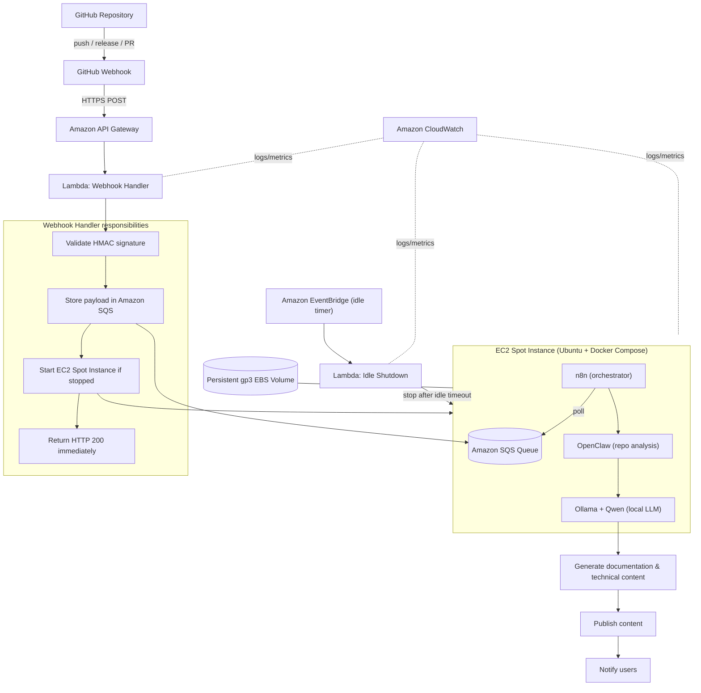
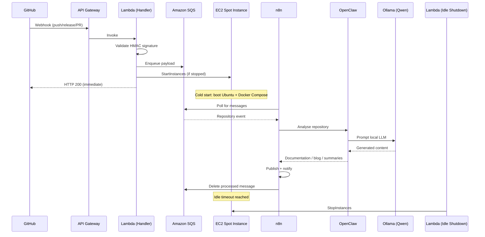
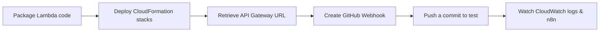

<div align="center">

# GitHub AI Blog Generator

**Event-driven, fully self-hosted AI platform that automatically transforms GitHub repositories into high-quality technical content — powered by OpenClaw, Ollama, and local LLMs, orchestrated with n8n, and running on cost-optimized AWS EC2 Spot Instances provisioned entirely with AWS CloudFormation.**

[](./LICENSE)
[](https://aws.amazon.com/cloudformation/)
[](https://aws.amazon.com/ec2/spot/)
[](https://ollama.com/)
[](https://github.com/QwenLM)
[](https://n8n.io/)
[](https://aws.amazon.com/sqs/)
[](https://docs.github.com/webhooks)
[](./docs/contributing.md)

</div>

---

## Table of Contents

- [Overview](#overview)
- [Why This Project](#why-this-project)
- [Features](#features)
- [Architecture](#architecture)
- [AI Workflow](#ai-workflow)
- [Technology Stack](#technology-stack)
- [Cost Optimisation](#cost-optimisation)
- [Spot Instance Trade-offs](#spot-instance-trade-offs)
- [Security](#security)
- [Prerequisites](#prerequisites)
- [Installation](#installation)
- [Configuration](#configuration)
- [Deployment](#deployment)
- [CloudFormation Deployment Guide](#cloudformation-deployment-guide)
- [Project Structure](#project-structure)
- [Roadmap](#roadmap)
- [Contributing](#contributing)
- [Documentation](#documentation)
- [License](#license)

---

## Overview

**GitHub AI Blog Generator** is a fully self-hosted, event-driven AI platform that automatically turns any GitHub repository into publication-ready technical content. When a repository changes, a **GitHub Webhook** fires, an **AWS Lambda** function validates the signature and enqueues the event in **Amazon SQS**, and a cost-optimized **EC2 Spot Instance** is started on demand. On that instance, **n8n** orchestrates a pipeline where **OpenClaw** analyses the repository and **Ollama** runs a **local LLM (Qwen by default)** to generate documentation and technical articles — with **zero paid inference APIs**.

Every run can produce a bundle of assets:

- Technical blog posts
- README improvements
- Project documentation
- Architecture summaries
- API documentation
- Project overviews
- Release notes
- Changelogs
- Technical tutorials

All AI inference happens **locally** on the instance. When processing is complete and the system has been idle for a configurable timeout, a Lambda function automatically **stops the EC2 Spot Instance**, so you pay only when AI work is actually being done.

> This project is architected for real-world production practices: self-hosting, cost optimisation, local LLM inference, AWS-native services, event-driven compute, and Infrastructure as Code with AWS CloudFormation.

---

## Why This Project

Most "AI content" projects assume an unlimited budget for hosted inference APIs (OpenAI, Anthropic, Amazon Bedrock). This project takes the opposite stance:

- **No paid inference.** All models run locally via Ollama. You are never billed per token.
- **Pay only when you compute.** Event-driven EC2 Spot Instances start on a webhook and stop on idle. An idle system costs only cents per month (EBS storage).
- **Own your data.** Repository content is analysed on infrastructure you control; nothing is sent to a third-party model provider.
- **Reproducible infrastructure.** Everything is defined in modular AWS CloudFormation — no click-ops, no Terraform.
- **Open-source best practices.** Clear documentation, least-privilege IAM, secrets management, structured logging, and a public roadmap.

---

## Features

| Capability | Description |
| --- | --- |
| 🪝 **GitHub Webhook triggers** | Push, release, and pull-request events start a generation run automatically |
| 🔐 **Signature validation** | Every delivery is verified with HMAC SHA-256 before processing |
| 📥 **Durable event queue** | Payloads are stored in Amazon SQS so nothing is lost while the instance boots |
| ⚡ **On-demand compute** | Lambda starts an EC2 Spot Instance only when there is work to do |
| 🧠 **Local LLM inference** | Ollama runs Qwen (or any local model) — no external API, no per-token cost |
| 🔍 **Deep repository analysis** | OpenClaw inspects README, source, structure, IaC, Docker, CI/CD, and docs |
| 🔗 **n8n orchestration** | Composable, observable pipeline with branching, retries, and notifications |
| ✍️ **Multi-format output** | Blog posts, READMEs, docs, architecture summaries, changelogs, tutorials |
| 📝 **Markdown-native** | All content is emitted as clean, portable GitHub-flavoured Markdown |
| ▶️ **Manual execution** | Trigger a run for any repository on demand, without waiting for a webhook |
| 🔁 **Retry & error handling** | Failed stages retry with backoff; poison messages route to a dead-letter queue |
| 🪵 **Structured logging** | CloudWatch logs and metrics across every stage of the pipeline |
| 🔔 **Notifications** | Users are notified when content is published or a run fails |
| 💤 **Automatic shutdown** | An idle-timeout Lambda stops the instance so you pay only for active work |
| 💾 **Persistent storage** | A gp3 EBS volume keeps models and n8n state across start/stop cycles |

---

## Architecture

The platform is **event-driven**: nothing runs until a repository changes. A webhook triggers a lightweight serverless front door, which buffers work in a queue and wakes up a Spot Instance to do the heavy AI lifting.



### Request lifecycle

1. **GitHub** emits a webhook when a supported event occurs.
2. **API Gateway** receives the HTTPS request and invokes the **Webhook Handler Lambda**.
3. The **Lambda** validates the GitHub signature, stores the payload in **Amazon SQS**, starts the **EC2 Spot Instance** if it is stopped, and returns **HTTP 200** immediately (so GitHub never times out).
4. The **EC2 Spot Instance** boots Ubuntu with Docker Compose running **n8n**, **OpenClaw**, and **Ollama**.
5. **n8n polls SQS**, pulls the queued event, and drives the pipeline.
6. **OpenClaw** clones and analyses the repository; **Ollama** performs **local inference** with Qwen.
7. Content is **generated**, **published**, and **users are notified**.
8. **EventBridge** tracks activity; when the system is idle beyond the configured timeout, an **Idle Shutdown Lambda** stops the instance.

For a deeper treatment of components and data flow, see [`docs/architecture.md`](./docs/architecture.md).

---

## AI Workflow



The full node-by-node n8n pipeline is documented in [`docs/workflows.md`](./docs/workflows.md).

---

## Technology Stack

| Layer | Technology | Purpose |
| --- | --- | --- |
| **Trigger** | GitHub Webhooks | Fire on repository events |
| **Ingress** | Amazon API Gateway | Public HTTPS endpoint for webhooks |
| **Serverless** | AWS Lambda | Signature validation, enqueue, start/stop instance |
| **Queue** | Amazon SQS | Durable buffer so events are never lost during cold start |
| **Scheduling** | Amazon EventBridge | Drives the idle-shutdown timer |
| **Compute** | EC2 Spot Instance (Ubuntu) | Cost-optimized host for AI processing |
| **Storage** | gp3 EBS Volume | Persistent models, n8n state, and workflows |
| **Runtime** | Docker + Docker Compose | Reproducible service topology on the instance |
| **Orchestration** | n8n | Workflow engine that drives the pipeline |
| **Analysis** | OpenClaw | Repository cloning and structural/code analysis |
| **Inference** | Ollama | Local model server |
| **Model** | Qwen (default) | Local LLM for content generation |
| **IaC** | AWS CloudFormation | Modular, reusable infrastructure templates |
| **Observability** | Amazon CloudWatch | Logs, metrics, and alarms |

> **No Amazon Bedrock. No OpenAI. No Anthropic. No paid inference API.** All AI inference runs locally through Ollama.

---

## Cost Optimisation

This project is engineered to keep AWS costs as close to zero as possible when idle.

### Design principles

- **Event-driven compute.** Nothing runs until a webhook arrives. There is no always-on server.
- **Pay only when you process.** The EC2 Spot Instance is started on demand and stopped after an idle timeout, so compute charges accrue only during active generation.
- **Spot pricing.** Spot Instances are typically **70–90% cheaper** than On-Demand for the same capacity — ideal for interruptible, batch-style AI workloads.
- **Local inference.** Because Ollama runs the model locally, there are **no per-token API fees**, no matter how much content you generate.
- **Persistent EBS, ephemeral compute.** Models and n8n state live on a persistent **gp3 EBS volume**. Only the (cheap) storage cost persists while the instance is stopped; you never re-download models on each run.

### How SQS prevents webhook loss during cold start

An EC2 Spot Instance is not instantaneous — booting Ubuntu, starting Docker Compose, and warming Ollama takes time (the **cold start**). During this window, GitHub may deliver multiple webhooks. To ensure **no event is lost**:

1. The Webhook Handler Lambda writes every validated payload to **Amazon SQS** and returns HTTP 200 immediately.
2. SQS **durably retains** messages (retention configurable up to 14 days) regardless of instance state.
3. When n8n comes online, it **polls SQS** and processes the backlog in order.
4. A **visibility timeout** hides a message while it is being processed, and a **dead-letter queue** captures messages that repeatedly fail.

This decoupling means the webhook front door is always available even when the compute layer is asleep.

### Cold start, startup, and shutdown

| Phase | Trigger | Mechanism |
| --- | --- | --- |
| **Automatic startup** | Webhook received | Handler Lambda calls `StartInstances` if the instance is stopped |
| **Cold start** | Instance booting | Ubuntu + Docker Compose + Ollama warm up; SQS buffers events |
| **Automatic shutdown** | Idle timeout elapsed | EventBridge → Idle Shutdown Lambda calls `StopInstances` |

Full numbers and tuning guidance live in [`docs/cost-optimization.md`](./docs/cost-optimization.md).

---

## Spot Instance Trade-offs

Spot Instances are the right default for this workload, but the trade-offs are explicit.

**Why Spot was selected**

- The workload is **asynchronous and interruptible** — content generation is a batch job, not a latency-critical service.
- Runs are **short and bursty**, matching Spot's start-on-demand model.
- Cost is the primary constraint, and Spot delivers the largest saving available on EC2.

**Advantages**

- **70–90% cheaper** than On-Demand.
- Same instance types and performance as On-Demand.
- Ideal for GPU-backed AI batch jobs that can tolerate interruption.

**Disadvantages**

- **Interruptible.** AWS can reclaim the instance with a two-minute warning when capacity is needed.
- **Availability varies** by instance type and Availability Zone.
- Requires **idempotent, resumable** processing.

**How this project mitigates the disadvantages**

- Work lives in **SQS**, not on the instance — an interrupted job returns to the queue after its visibility timeout and is retried.
- Models and state persist on **EBS**, so a replacement instance resumes quickly.
- Processing is **idempotent**; re-running a repository event produces the same content package.
- Optionally, fall back to On-Demand when Spot capacity is unavailable (see [Roadmap](#roadmap)).

---

## Security

Security is built in by default (full detail in [`docs/security.md`](./docs/security.md)):

- **Least-privilege IAM roles** — every Lambda and the EC2 instance profile is scoped to only the actions and resources it needs.
- **GitHub webhook signature validation** — every delivery is verified with **HMAC SHA-256** (constant-time comparison) before it is enqueued.
- **Security groups** — inbound access is tightly restricted; SSH is limited to known IPs and the LLM/n8n ports are never publicly exposed.
- **HTTPS only** — the API Gateway webhook endpoint accepts TLS traffic only.
- **Environment variables & secrets** — the webhook secret and other sensitive values are injected via environment/secret stores, never committed to source.
- **Secrets management** — secrets are stored outside the repository (e.g. environment variables or a secrets store) and referenced at runtime.
- **SSH key authentication** — the EC2 instance uses key-pair authentication; password login is disabled.

---

## Prerequisites

Before deploying, ensure you have:

- An **AWS account** with permissions to create VPC, EC2, Lambda, API Gateway, SQS, EventBridge, IAM, and CloudFormation resources.
- The **AWS CLI v2** installed and configured (`aws configure`).
- A **key pair** for SSH access to the EC2 instance.
- A **GitHub account** with admin access to the repositories you want to process (to create webhooks).
- **Docker** and **Docker Compose** knowledge for local development (optional).
- A shared **webhook secret** for HMAC signature validation.

---

## Installation

```bash
# 1. Clone the repository
git clone https://github.com/<your-org>/github-ai-blog-generator.git
cd github-ai-blog-generator

# 2. Review and copy the environment template
cp .env.example .env

# 3. Configure your AWS CLI (if not already done)
aws configure
```

---

## Configuration

Configuration is provided through environment variables and CloudFormation parameters. Key values:

| Variable / Parameter | Description | Example |
| --- | --- | --- |
| `AWS_REGION` | Deployment region | `us-east-1` |
| `WEBHOOK_SECRET` | Shared secret for GitHub HMAC validation | `a-long-random-string` |
| `INSTANCE_TYPE` | EC2 instance type for the Spot request | `g4dn.xlarge` |
| `SPOT_MAX_PRICE` | Maximum Spot price you are willing to pay | `0.20` |
| `IDLE_TIMEOUT_MINUTES` | Minutes of inactivity before auto-shutdown | `15` |
| `OLLAMA_MODEL` | Local model to run | `qwen2.5:7b` |
| `EBS_VOLUME_SIZE_GB` | Size of the persistent gp3 volume | `100` |
| `KEY_PAIR_NAME` | EC2 key pair for SSH access | `blog-generator-key` |

Secrets such as `WEBHOOK_SECRET` must **never** be committed. Store them in environment variables or a secrets manager. See [`docs/security.md`](./docs/security.md).

---

## Deployment

Deployment is a two-part process: provision infrastructure with CloudFormation, then register the GitHub webhook.



1. Package the Lambda functions and upload them to an S3 bucket (or use inline deployment).
2. Deploy the CloudFormation stacks (network → serverless → compute).
3. Copy the **API Gateway invoke URL** from the stack outputs.
4. Add a **webhook** to your GitHub repository pointing at that URL, using your `WEBHOOK_SECRET`.
5. Trigger an event (e.g. push a commit) and watch the pipeline run.

Full step-by-step instructions are in [`docs/deployment.md`](./docs/deployment.md).

---

## CloudFormation Deployment Guide

All infrastructure is provisioned with **AWS CloudFormation** — no Terraform. Templates are **modular and reusable** so each layer can be deployed and updated independently.

Provisioned resources include: **VPC, Public Subnet, Internet Gateway, Route Tables, Security Groups, IAM Roles, EC2 Spot Instance, persistent gp3 EBS Volume, API Gateway, Lambda functions, Amazon SQS, EventBridge, and CloudWatch.**

Suggested stack layout:

| Stack | Template | Responsibility |
| --- | --- | --- |
| **Network** | `network.yaml` | VPC, public subnet, IGW, route tables, security groups |
| **Serverless** | `serverless.yaml` | API Gateway, Lambda functions, SQS, EventBridge, IAM |
| **Compute** | `compute.yaml` | EC2 Spot request, gp3 EBS volume, instance IAM role, user data |
| **Observability** | `observability.yaml` | CloudWatch log groups, metrics, alarms |

Example deployment:

```bash
# 1. Network layer
aws cloudformation deploy \
  --template-file infrastructure/network.yaml \
  --stack-name blog-gen-network \
  --capabilities CAPABILITY_NAMED_IAM

# 2. Serverless layer (API Gateway, Lambda, SQS, EventBridge)
aws cloudformation deploy \
  --template-file infrastructure/serverless.yaml \
  --stack-name blog-gen-serverless \
  --parameter-overrides WebhookSecret=$WEBHOOK_SECRET \
  --capabilities CAPABILITY_NAMED_IAM

# 3. Compute layer (EC2 Spot + persistent EBS)
aws cloudformation deploy \
  --template-file infrastructure/compute.yaml \
  --stack-name blog-gen-compute \
  --parameter-overrides \
      InstanceType=$INSTANCE_TYPE \
      SpotMaxPrice=$SPOT_MAX_PRICE \
      KeyPairName=$KEY_PAIR_NAME \
  --capabilities CAPABILITY_NAMED_IAM

# 4. Retrieve the API Gateway URL for your GitHub webhook
aws cloudformation describe-stacks \
  --stack-name blog-gen-serverless \
  --query "Stacks[0].Outputs[?OutputKey=='WebhookUrl'].OutputValue" \
  --output text
```

See [`docs/infrastructure.md`](./docs/infrastructure.md) for the full parameter reference and stack outputs.

---

## Project Structure

```text
github-ai-blog-generator/
├── README.md
├── LICENSE
├── .env.example
├── infrastructure/            # AWS CloudFormation templates (modular)
│   ├── network.yaml
│   ├── serverless.yaml
│   ├── compute.yaml
│   └── observability.yaml
├── lambdas/                   # Lambda source code
│   ├── webhook-handler/       # Validate signature, enqueue, start instance
│   └── idle-shutdown/         # Stop the instance after idle timeout
├── instance/                  # EC2 host configuration
│   ├── docker-compose.yml     # n8n + OpenClaw + Ollama
│   └── user-data.sh           # Bootstraps Docker, Compose, and services
├── workflows/                 # Exported n8n workflow definitions
└── docs/                      # Project documentation
    ├── architecture.md
    ├── requirements.md
    ├── infrastructure.md
    ├── deployment.md
    ├── workflows.md
    ├── cost-optimization.md
    ├── security.md
    ├── monitoring.md
    ├── local-development.md
    ├── ci-cd.md
    ├── contributing.md
    └── roadmap.md
```

---

## Roadmap

- [ ] On-Demand fallback when Spot capacity is unavailable
- [ ] Multi-model support (switch models per content type)
- [ ] GPU auto-detection and model right-sizing
- [ ] Direct publishing integrations (Dev.to, Medium, Hashnode)
- [ ] Web dashboard for run history and content review
- [ ] Multi-repository batch processing
- [ ] Fine-tuned local models for documentation style

The living roadmap is maintained in [`docs/roadmap.md`](./docs/roadmap.md).

---

## Contributing

Contributions are welcome! Please read [`docs/contributing.md`](./docs/contributing.md) for the development workflow, coding standards, and pull-request process. Good first issues are labelled in the issue tracker.

---

## Documentation

| Document | Description |
| --- | --- |
| [Architecture](./docs/architecture.md) | Components, data flow, and design decisions |
| [Requirements](./docs/requirements.md) | Functional, non-functional, infrastructure, and security requirements |
| [Infrastructure](./docs/infrastructure.md) | CloudFormation stacks, parameters, and outputs |
| [Deployment](./docs/deployment.md) | Step-by-step deployment guide |
| [Workflows](./docs/workflows.md) | n8n pipeline, node by node |
| [Cost Optimisation](./docs/cost-optimization.md) | Spot strategy, cold start, and shutdown tuning |
| [Security](./docs/security.md) | IAM, signature validation, secrets, and SSH |
| [Monitoring](./docs/monitoring.md) | CloudWatch logs, metrics, and alarms |
| [Local Development](./docs/local-development.md) | Running the stack locally with Docker Compose |
| [CI/CD](./docs/ci-cd.md) | Continuous integration and delivery |
| [Contributing](./docs/contributing.md) | How to contribute |
| [Roadmap](./docs/roadmap.md) | Planned features |

---

## License

This project is licensed under the terms of the [MIT License](./LICENSE).
