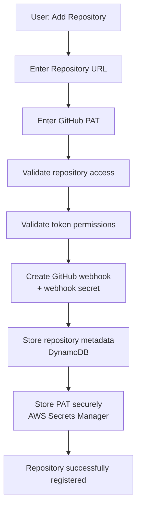
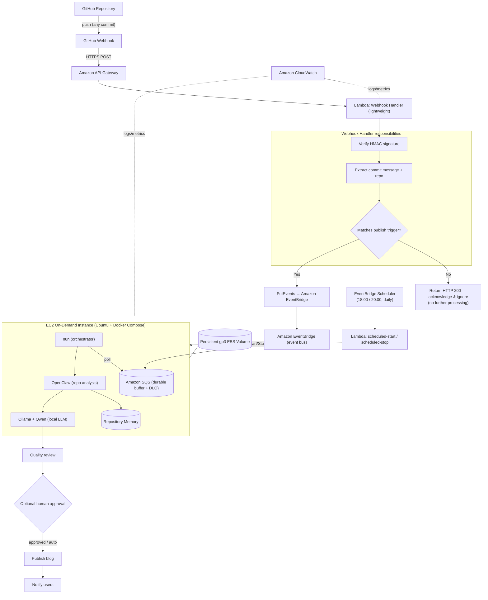
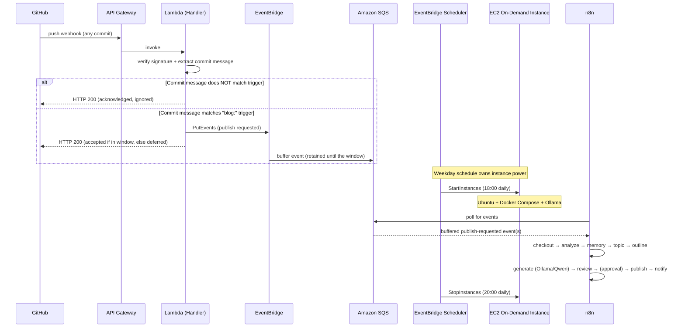
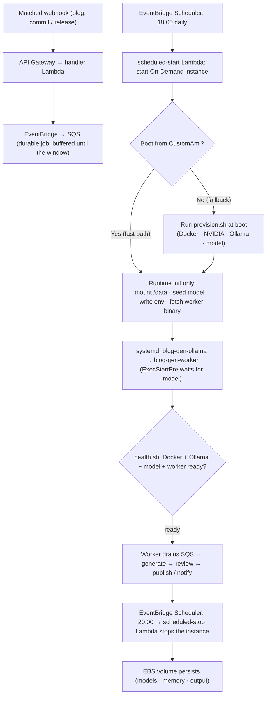
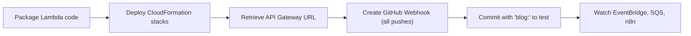
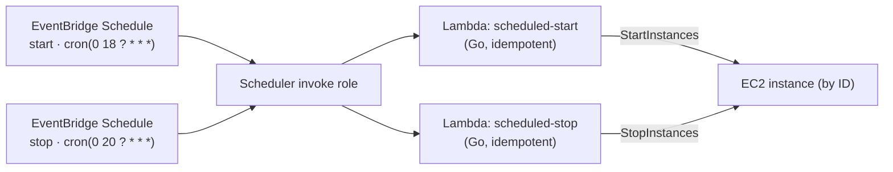

<div align="center">

<picture>
  <source media="(prefers-color-scheme: dark)" srcset="./docs/assets/brand/icon-dark.svg">
  
</picture>

# GitHub AI Blog Generator

**Event-driven, fully self-hosted AI platform that turns GitHub repositories into high-quality technical content — but only when you opt in with a `blog:` commit. Powered by OpenClaw, Ollama, and local LLMs, orchestrated with n8n, triggered through Amazon EventBridge, and running on a scheduled On-Demand AWS EC2 instance provisioned entirely with AWS CloudFormation.**

[](./LICENSE)
[](./docs/development-plan.md)
[](https://go.dev/)
[](https://aws.amazon.com/cloudformation/)
[](https://aws.amazon.com/ec2/)
[](https://ollama.com/)
[](https://github.com/QwenLM)
[](https://n8n.io/)
[](https://aws.amazon.com/eventbridge/)
[](https://aws.amazon.com/sqs/)
[](https://docs.github.com/webhooks)
[](./docs/contributing.md)

</div>

---

## Table of Contents

- [Overview](#overview)
- [Status](#status)
- [Core Principle](#core-principle)
- [Why This Project](#why-this-project)
- [Features](#features)
- [Repository Registration](#repository-registration)
- [Publishing Trigger](#publishing-trigger)
- [Architecture](#architecture)
- [AI Workflow](#ai-workflow)
- [Technology Stack](#technology-stack)
- [Cost Optimisation](#cost-optimisation)
- [Why On-Demand (Scheduled Runtime)](#why-on-demand-scheduled-runtime)
- [Optimizing Instance Startup](#optimizing-instance-startup)
- [Security](#security)
- [Prerequisites](#prerequisites)
- [Installation](#installation)
- [Configuration](#configuration)
- [Deployment](#deployment)
- [CloudFormation Deployment Guide](#cloudformation-deployment-guide)
- [Project Structure](#project-structure)
- [Roadmap](#roadmap)
- [Local Development Workflow](#local-development-workflow)
- [Contributing](#contributing)
- [Documentation](#documentation)
- [License](#license)

---

## Overview

**GitHub AI Blog Generator** is a fully self-hosted, event-driven AI platform that turns any GitHub repository into publication-ready technical content — **on demand, under your explicit control**.

You onboard a repository once (for the MVP, with its URL and a **GitHub Personal Access Token**); the platform validates access, creates the webhook, stores metadata, and stores the token securely in **AWS Secrets Manager**. From then on, the platform monitors the repository with **GitHub Webhooks** — but **receiving a webhook does not automatically generate anything**. Every event is first checked against a **configurable commit-message trigger** (default `blog:`). Only when a commit message matches does the platform publish the event to **Amazon EventBridge**, which durably buffers it in **Amazon SQS**. The compute host — an **On-Demand EC2 instance** — runs on a fixed **daily schedule (18:00–20:00, 7 days a week)** driven by EventBridge Scheduler, and the worker drains the buffered events while it is up. Every non-matching event is acknowledged with `HTTP 200` and ignored.

AI processing can be initiated in **two ways**, both feeding the *same* pipeline (EventBridge → SQS → worker):

- **Automatically, by a GitHub webhook** — a push whose commit matches the trigger, or a published release.
- **Manually, by calling the authenticated `POST /process` endpoint** — an on-demand run for a specific repository, which also **starts the compute host** if it is outside the scheduled window. See [Manual Trigger](./docs/manual-trigger.md).

When a run does fire, **n8n** orchestrates a pipeline on the instance where **OpenClaw** analyses the repository, **Repository Memory** provides continuity across runs, and **Ollama** runs a **local LLM (Qwen by default)** to generate content — with **zero paid inference APIs**. The instance is started and stopped by the schedule, so compute cost is bounded by that window rather than by webhook volume.

Supported outputs include technical blog posts, README improvements, documentation, architecture summaries, API documentation, project overviews, release notes, changelogs, and technical tutorials — all emitted as clean, portable Markdown.

> This project is architected for real-world production practices: **developer-controlled generation**, self-hosting, cost optimisation, local LLM inference, AWS-native event-driven design, and Infrastructure as Code with AWS CloudFormation.

---

## Status

**The MVP is implemented and unit-tested** (a single Go module + four AWS Lambdas + an instance worker, all backed by modular CloudFormation). It has **not yet been deployed** to a live AWS account — deployment needs your AWS credentials and a GPU instance. Milestone-by-milestone detail lives in the [Development Plan](./docs/development-plan.md).

**What works end to end today:**

register repo → **trigger** (webhook HMAC + commit-trigger gate, _or_ authenticated `POST /process`) → EventBridge → SQS → (scheduled 18:00 On-Demand start, or manual on-demand start) → **worker** → quality review → optional human approval → publish Markdown files → record Repository Memory → notify → scheduled 20:00 stop.

The worker drives **two automated paths** through the same review/approval/publish stages:

- **A published GitHub Release** → SemVer gate → Release Context → the **complete content suite** (blog, storyboard, voice-over, YouTube, Shorts, TikTok, visual assets, SEO, architecture, LinkedIn, X thread) — generated automatically, **no manual step**. See [Full Content Suite](./docs/content-suite.md).
- **A matching `blog:` commit** → clone repo (go-git) → read README/docs/commits → generate the written core (blog, README, docs, architecture summary, release notes, architecture diagram) via local Ollama.

`cmd/generate-all` runs the *same* content-suite orchestrator manually (local/CI/one-off) — the manual door onto the pipeline the release path runs automatically.

| Area | Status |
| --- | --- |
| Repository registration (URL + PAT → Secrets Manager + DynamoDB, auto webhook) | ✅ Implemented |
| Webhook handler — HMAC verify + commit-message trigger gate (no AI, never reads the PAT) | ✅ Implemented |
| Event processing — EventBridge → SQS buffer (drained during the scheduled window) | ✅ Implemented |
| Instance lifecycle — scheduled daily start/stop (EventBridge Scheduler) | ✅ Implemented |
| Release pipeline — published Release → SemVer gate → Release Context → **full content suite** (11 artifacts) → review, approval, publish | ✅ Implemented |
| Commit pipeline — `blog:` commit → clone, analyse, generate written core, review, approval, publish, memory, notify | ✅ Implemented |
| Local inference — Ollama + Qwen (no paid API) | ✅ Implemented |
| Infrastructure — modular CloudFormation (`cfn-lint`-clean) | ✅ Implemented |
| CI/CD — Go tests, cfn-lint, security scanning, opt-in OIDC deploy | ✅ Implemented |
| Deploy to AWS + end-to-end validation | ⏳ Needs your AWS account + GPU instance |
| Future roadmap — email notifications, extra trigger sources, GitHub Apps, a web approvals UI | ⏳ Planned |

> **Implementation note.** The MVP runtime is a **Go worker** (`cmd/worker`) that drains SQS and drives the pipeline — chosen for testability. The **n8n** orchestration described throughout these docs remains a valid alternative for the same seams; the pipeline stages are composable ports either can drive. See the [Development Plan](./docs/development-plan.md) for the runtime decision.

---

## Core Principle

> **AI-generated content is produced only on an explicit signal: a GitHub webhook whose commit message matches a configurable publishing trigger (or a published release), _or_ an authenticated manual call to `POST /process`. All other webhook events are acknowledged and ignored.**

This keeps developers in complete control of when content is produced, prevents unwanted publishing, and eliminates the AI, compute, and storage cost of processing routine commits. Both paths are deliberate actions — a matched/opted-in commit, or an authenticated API request — never an automatic reaction to every change.

---

## Why This Project

Most "AI content" projects assume two things this project rejects: that every repository change should be processed, and that you have an unlimited budget for hosted inference APIs (OpenAI, Anthropic, Amazon Bedrock).

- **Opt-in, not automatic.** Content is generated **only** for commits you explicitly mark with a `blog:` trigger. Normal development never produces content.
- **No paid inference.** All models run locally via Ollama. You are never billed per token.
- **Bounded, scheduled compute.** The On-Demand instance runs only during a fixed daily window (18:00–20:00, 7 days a week); outside it the system costs only cents per month (EBS storage).
- **Own your data.** Repository content is analysed on infrastructure you control; nothing is sent to a third-party model provider.
- **Reproducible infrastructure.** Everything is defined in modular AWS CloudFormation — no click-ops, no Terraform.

---

## Features

| Capability | Description |
| --- | --- |
| 🔌 **Repository registration** | Onboard a repo with its URL + a GitHub PAT; the platform validates access and creates the webhook |
| 🔑 **Secure PAT storage** | The token is stored in AWS Secrets Manager; only a secret reference is kept in the metadata store |
| 🗄️ **Repository metadata store** | Per-repo metadata (owner, webhook ID, trigger pattern, secret reference, last commit) in DynamoDB |
| 🎯 **Commit-message trigger gate** | Generation runs **only** when a commit message matches the configurable trigger (default `blog:`) |
| 🪝 **GitHub Webhook ingress** | Push events are received, verified, and evaluated — never blindly processed |
| 🎛️ **Manual API trigger** | Authenticated `POST /process` (API key) forces a run via the same pipeline — **starts the On-Demand host on demand** if it is stopped ([docs](./docs/manual-trigger.md)) |
| 🧠 **Release Context Builder** | Authenticated `POST /release-context` analyzes a repo + release into a structured, AI-ready **Release Context** (JSON) — the canonical input for content generation ([docs](./docs/release-context.md)) |
| 🎬 **Storyboard Generator** | Turns a generated technical blog + Release Context into a scene-by-scene **video storyboard** (JSON + Markdown) — the Video Planning engine, grounded in real Mermaid diagrams ([docs](./docs/storyboard.md)) |
| 🎙️ **Voice-over Generator** | Enriches a storyboard into a synchronized **voice-over script** (JSON + Markdown) — the Narration engine: timestamps, pacing, pronunciation, emphasis, pauses, and sync cues, ready for any TTS provider or human narrator ([docs](./docs/voiceover.md)) |
| 📺 **YouTube Script Generator** | Combines the Release Context, blog, storyboard, and voice-over into a production-ready **long-form YouTube script** (JSON + Markdown) — the Long-form Video engine: hook, chapters, demos, callouts, CTAs, and SEO metadata ([docs](./docs/youtube.md)) |
| 📱 **YouTube Shorts Generator** | Mines the release package for the best moments and plans multiple standalone **30–60s Shorts** (JSON + Markdown) — the Short-form Video engine: hooks, scene breakdowns, timed captions, grounded visuals, CTAs, and hashtags ([docs](./docs/shorts.md)) |
| 🎵 **TikTok Generator** | Adapts the release package into multiple **20–60s TikTok videos** (JSON + Markdown) — the Social Video engine: native hooks, problem/solution scripts, engagement prompts, timed captions, grounded visuals, hashtags, and a retention score ([docs](./docs/tiktok.md)) |
| 🎨 **Visual Asset Generator** | Turns the release package into **provider-neutral AI image prompts** (JSON + Markdown) for thumbnails, social graphics, blog headers, banners, and technical illustrations — the Visual Design engine: grounded prompts, negative prompts, a shared brand identity, and text placeholders (no baked-in text) ([docs](./docs/visual-assets.md)) |
| 🔎 **SEO Metadata Generator** | Aggregates the whole pipeline into **canonical SEO metadata** (JSON + Markdown) for blog, YouTube, short-form, and social — the SEO engine: keyword taxonomy, slugs, excerpts, hashtags, Open Graph, JSON-LD/RSS/sitemap, platform limits, and a confidence score ([docs](./docs/seo.md)) |
| 📐 **Architecture Diagram Generator** | Renders grounded **AWS architecture diagrams** (Mermaid + Graphviz DOT + SVG + PNG metadata) from the Release Context — the Architecture Visualization engine: analysis → one shared graph → three synchronized renderings, with edges only when explicit ([docs](./docs/architecture-diagrams.md)) |
| 💼 **LinkedIn Content Generator** | Composes multiple professional **LinkedIn post variations** (JSON + Markdown) from the pipeline — the Professional Marketing engine: audience-targeted posts, grounded technical highlights, engagement prompts, CTAs, hashtags, and references to existing visuals ([docs](./docs/linkedin.md)) |
| 🧵 **X Thread Generator** | Composes technical **X (Twitter) threads** (JSON + Markdown) from the pipeline — the Social Marketing engine: configurable-length threads with 280-char-enforced posts, grounded code snippets, key takeaways, engagement prompts, CTAs, and hashtags ([docs](./docs/xthread.md)) |
| 🎛️ **Full Content Suite** | One command turns a single Release Context into **every artifact (Milestones 3–13)** — blog, storyboard, voice-over, YouTube script, Shorts, TikTok, visual assets, SEO, architecture, LinkedIn, and X thread — by orchestrating the dedicated generators in dependency order; fault-tolerant (a failed stage is recorded, not fatal) and correlated by a `manifest.json` (the `generate-all` CLI) ([docs](./docs/content-suite.md)) |
| 🚀 **Publishing Automation** | Distributes **approved** content to multiple platforms (Dev.to, Medium, Hashnode, YouTube, GitHub) — the Content Distribution engine: a common Publisher interface, scheduling, retries with backoff, per-platform metadata, publication tracking, and a full audit trail; **never publishes unapproved content** ([docs](./docs/publishing.md)) |
| 🛡️ **Review & Approval Workflow** | The governance layer every asset passes before publishing — deterministic validation, AI quality review grounded in the Release Context, 8-dimension scoring, a revision loop, human approval gates, publication-readiness checks, and a full audit trail; **never approves hallucinated content** ([docs](./docs/governance.md)) |
| 📊 **Social Media Intelligence** | Cross-platform performance tracking for YouTube, Instagram, X, and TikTok — the Analytics engine: immutable daily snapshots, growth trends, content effectiveness (virality/evergreen), subscriber conversion, cross-platform comparison, a daily morning briefing, and a Business Advisory Council package, with grounded AI insights that **never fabricate statistics** ([docs](./docs/social-intelligence.md)) |
| 📈 **Content Analytics & Performance** | Per-publication performance measurement across Dev.to, Medium, Hashnode, and YouTube — the Content Analytics engine: one normalized model, immutable daily/weekly/monthly snapshots, trend analysis (DoD/WoW/MoM, best/worst, top tags/keywords/times), structured reports, dashboard datasets, CloudWatch metrics, and a grounded OptimizationSignals bundle for AI optimization; **produces analytics only, never fabricated** ([docs](./docs/content-analytics.md)) |
| 🧠 **AI Content Optimization** | Continuous-improvement engine that consumes the analytics engine's output — winning/losing pattern recognition, grounded confidence-scored recommendations, multi-horizon trend detection, prompt-template versioning with human-approval and rollback, and Bedrock/Ollama reasoning with a deterministic fallback; **explainable, auditable, reproducible, and never auto-replaces a prompt** ([docs](./docs/content-optimization.md)) |
| 🧩 **Extensibility Platform** | Plugin-style provider abstraction layer for the whole system — a thread-safe registry with capability-based selection, priority, health checks, and fallback; interface + reference implementation for LLM, image, video, voice, translation, vector-DB, publishing, MCP, workflow, and content-format providers; a configuration framework and semver API-compatibility — **new providers are added by implementing an interface, never by editing existing code** ([docs](./docs/platform-extensibility.md)) |
| 🔌 **MCP Integration & Tool Ecosystem** | The standardized integration layer — one secure `Client` speaks the Model Context Protocol (`2025-06-18`) to nine self-registering server plug-ins (repository, filesystem, documentation, database, cloudformation, mermaid, aws, publishing, context) exposing tools **and** resources; every call runs discovery → deny-by-default authorization → credential resolution (env/Secrets Manager, never logged) → input validation → timeout → bounded retry → audit; least-privilege allow-lists and per-caller rate limiting throughout — **new integrations plug in via one interface, never by editing the client** (the `mcp` CLI) ([docs](./docs/mcp.md)) |
| 📀 **Shared Baked AMI** | The AI Platform Base AMI — a reusable, semver-versioned, hardened golden image (Docker, Ollama, FFmpeg, Go, Python, CloudWatch + SSM agents) baked with Packer or EC2 Image Builder, published to SSM Parameter Store + CloudFormation Exports, consumed by downstream projects via a reusable Launch Template, with lifecycle cleanup and instant metadata-based rollback — **one hardened image shared across every AI platform project** ([docs](./docs/baked-ami.md)) |
| 🧱 **Reusable CloudFormation Modules** | A platform-engineering module library — versioned, cfn-lint-clean CloudFormation for network, IAM, compute, storage, DynamoDB, monitoring, and messaging, composed by a nested root stack with centralized per-environment config; every resource is shared via predictable CloudFormation Exports + SSM Parameter Store contracts, so any AI project consumes shared infrastructure by import — **modular, secure-by-default, and never duplicated** ([docs](./docs/cfn-modules.md)) |
| 🔐 **Signature validation** | Every delivery is verified with HMAC SHA-256 before evaluation |
| 🧭 **EventBridge event bus** | Matched events are published to EventBridge, which buffers the run in SQS |
| 📥 **Durable buffering** | Events are held in Amazon SQS so nothing is lost while the instance is outside its window |
| ⏰ **Scheduled compute** | The On-Demand EC2 instance runs on a fixed daily window (18:00–20:00, 7 days a week) via EventBridge Scheduler |
| 🧠 **Local LLM inference** | Ollama runs Qwen (or any local model) — no external API, no per-token cost |
| 🔍 **Deep repository analysis** | OpenClaw inspects README, source, structure, IaC, Docker, CI/CD, and docs |
| 🗂️ **Repository Memory** | Persistent per-repo memory of prior analyses and published topics for continuity and de-duplication |
| ✅ **Quality review** | A review stage checks generated content before publishing |
| 🙋 **Optional human approval** | An optional gate lets a human approve content before it is published |
| 🔗 **n8n orchestration** | Composable, observable pipeline with branching, retries, and notifications |
| ✍️ **Multi-format output** | Blog posts, READMEs, docs, architecture summaries, changelogs, tutorials |
| 📝 **Markdown-native** | All content is emitted as clean, portable GitHub-flavoured Markdown |
| ▶️ **Manual execution** | Trigger a run for any repository on demand, without a webhook |
| 🔁 **Retry & error handling** | Failed stages retry with backoff; poison messages route to a dead-letter queue |
| 🪵 **Structured logging** | CloudWatch logs and metrics across every stage of the pipeline |
| 🔔 **Notifications** | Users are notified when content is published or a run fails |
| 💤 **Automatic shutdown** | An idle-timeout Lambda stops the instance so you pay only for active work |
| 💾 **Persistent storage** | A gp3 EBS volume keeps models, n8n state, and Repository Memory across cycles |

---

## Repository Registration

For the **MVP**, you connect a repository by providing two things:

| Input | Purpose |
| --- | --- |
| **GitHub Repository URL** | The repository to monitor and analyse |
| **GitHub Personal Access Token (PAT)** | Access repository contents, register the webhook, read metadata, and (future) synchronise the repo |

### How onboarding works



> **To register a repo**, POST the repository URL + PAT to the registration API
> Gateway endpoint. That route **requires an `x-api-key` header** (403 without it).
> Copy-paste commands, including how to fetch the API key: **[First Deploy → Register the repository](./docs/first-deploy.md#5-register-the-repository)**.

### Why a PAT for the MVP

A PAT keeps onboarding simple while providing a clear migration path to **GitHub Apps** in future releases (see [Roadmap](#roadmap)). The token is required to access repository contents, create the webhook, and read repository metadata.

### How credentials are stored

- The PAT is stored as a secret in **AWS Secrets Manager** — **never in plain text**, and never in source, config, environment variables, or the metadata database.
- The metadata store keeps only a **reference** to the secret (its ARN/name), plus non-sensitive metadata: repository ID, owner, name, URL, default branch, webhook ID, trigger pattern, enabled status, last processed commit SHA, and registration timestamp.
- The PAT is retrieved **only when required** (to clone the repository or manage the webhook), under least-privilege IAM.

This keeps the platform **secure** (secrets isolated, least privilege, never logged), **simple** (two inputs to onboard), and **cost-effective** (repository and token validation happen up front, before any compute or AI runs). See [Security](./docs/security.md) and [Requirements → Repository Registration](./docs/requirements.md#12-repository-registration-requirements-mvp).

> **GitHub App authentication is a future enhancement, not part of the MVP.**

---

## Publishing Trigger

Content is generated **only** when a commit message matches the configured publishing trigger.

### Default trigger

```text
blog:
```

Any commit whose message begins with `blog:` requests a blog run. Examples:

```text
blog: Added GitHub Webhook Support
blog: Introduced Repository Memory
blog: Release v1.2 Architecture Improvements
```

### Developer experience — you stay in control

Routine development commits are **acknowledged and ignored** — they never generate content:

```text
fix(auth): resolve token refresh issue      # ignored
refactor(api): simplify routing             # ignored
docs: update README                         # ignored
```

Only commits explicitly intended for content creation trigger the workflow:

```text
blog: Added OAuth Authentication            # triggers a run
blog: Repository Memory Implementation      # triggers a run
```

### Configurable trigger patterns

The default is `blog:`, but each repository can set its own **Trigger Pattern** at registration (stored in metadata, evaluated per delivery):

- `blog:` — literal prefix (default)
- `[blog]` — any literal prefix works
- `regex:^(blog|post):` — a `regex:`-prefixed regular expression

Pass `trigger_pattern` when registering; invalid regexes are rejected. Additional entry points (releases, tags, PR labels, manual runs, scheduled summaries) remain [planned](#roadmap).

---

## Architecture

The platform is **event-driven and opt-in**. A webhook is received on every push, but the pipeline only advances when the commit message matches the trigger.



### Request lifecycle

1. **GitHub** emits a webhook on every push.
2. **API Gateway** invokes the **Webhook Handler Lambda**.
3. The **handler** resolves the repository's metadata, verifies the HMAC signature using that repo's webhook secret (from Secrets Manager), extracts the commit message, and **validates it against the repository's trigger pattern**:
   - **No match** → return **HTTP 200** and stop. Nothing else runs.
   - **Match** → **publish the event to Amazon EventBridge** and return HTTP 200.
4. **EventBridge** routes the matched event to the **SQS** durable buffer. The webhook does **not** start the instance; the handler reports `accepted` if the host is currently running (inside the window) or `deferred` if it is not.
5. **EventBridge Scheduler** starts the **On-Demand EC2 instance** at **18:00 (daily)**; it boots Ubuntu with Docker Compose running **n8n**, **OpenClaw**, and **Ollama**.
6. **n8n polls SQS** and runs the pipeline over the buffered backlog: checkout → analysis → **Repository Memory** → topic identification → outline → **AI generation (Ollama/Qwen)** → quality review → **optional human approval** → publish → notify.
7. **EventBridge Scheduler** stops the instance at **20:00 (daily)** via the **scheduled-stop Lambda**.

For a deeper treatment, see [`docs/architecture.md`](./docs/architecture.md).

---

## AI Workflow



The full node-by-node n8n pipeline is documented in [`docs/workflows.md`](./docs/workflows.md).

---

## Technology Stack

| Layer | Technology | Purpose |
| --- | --- | --- |
| **Onboarding** | Registration API (API Gateway + Lambda) | Validate repo + PAT, create webhook, store metadata/secret |
| **Credentials** | AWS Secrets Manager | Securely store GitHub PATs and webhook secrets |
| **Metadata** | Amazon DynamoDB | Per-repository metadata (secret reference, trigger pattern, …) |
| **Trigger** | GitHub Webhooks | Deliver push events |
| **Gate** | Commit-message trigger (`blog:`) | Decide whether a run should happen at all |
| **Ingress** | Amazon API Gateway | Public HTTPS endpoint for webhooks and registration |
| **Serverless** | AWS Lambda | Registration, handler (validate + publish), scheduled start/stop |
| **Event bus** | Amazon EventBridge | Route matched events; buffer via SQS |
| **Scheduler** | Amazon EventBridge Scheduler | Start/stop the instance on the daily window (18:00–20:00, 7 days a week) |
| **Queue** | Amazon SQS | Durable buffer so events survive until the next scheduled window |
| **Compute** | EC2 On-Demand Instance (Ubuntu) | Scheduled host for AI processing |
| **Storage** | gp3 EBS Volume | Persistent models, n8n state, and Repository Memory |
| **Runtime** | Docker + Docker Compose | Reproducible service topology on the instance |
| **Orchestration** | n8n | Workflow engine that drives the pipeline |
| **Analysis** | OpenClaw | Repository cloning and structural/code analysis |
| **Memory** | Repository Memory | Per-repo continuity and topic de-duplication |
| **Inference** | Ollama | Local model server |
| **Model** | Qwen (default) | Local LLM for content generation |
| **IaC** | AWS CloudFormation | Modular, reusable infrastructure templates |
| **Observability** | Amazon CloudWatch | Logs, metrics, and alarms |

> **No Amazon Bedrock. No OpenAI. No Anthropic. No paid inference API.** All AI inference runs locally through Ollama.

---

## Cost Optimisation

This project is engineered to keep AWS costs as close to zero as possible when idle.

### Trigger pre-filtering — a primary cost-saving mechanism

Validating the commit-message trigger **in the lightweight Lambda, before any compute or AI runs**, is one of the platform's biggest cost levers. Because the vast majority of commits never match `blog:`, the platform:

- **never processes** routine commits (they are dropped at the Lambda),
- **never invokes the local LLM** for content nobody asked for,
- **never stores** unwanted output,
- and **never runs** an unnecessary pipeline.

The handler simply returns `HTTP 200` and stops. You pay for AI processing only on the commits you explicitly opt in.

### Other design principles

- **Scheduled compute.** The instance runs only during a fixed **daily window (18:00–20:00, 7 days a week)** set by EventBridge Scheduler. Outside that window there is no running server — only cheap EBS storage.
- **Bounded, predictable cost.** Compute is capped at ~2 h/day × 5 days ≈ **40 h/month**, known in advance rather than driven by webhook volume.
- **On-Demand, not Spot.** Availability is the priority inside the window; On-Demand removes the Spot-capacity/interruption risk so a scheduled start always succeeds. See [Why On-Demand](#why-on-demand-scheduled-runtime).
- **Local inference.** Ollama runs the model locally, so there are **no per-token API fees**.
- **Persistent EBS, ephemeral compute.** Models, n8n state, and Repository Memory live on a persistent gp3 volume; only cheap storage cost persists while stopped.

### How SQS defers events to the next window

A matched event that arrives while the instance is stopped must not be lost. EventBridge writes every matched event to **Amazon SQS**, which durably retains it (up to 14 days) regardless of instance state. When the schedule starts the instance at 18:00, the worker **drains the backlog**; a **visibility timeout** and **dead-letter queue** handle retries and poison messages. A webhook that lands during the window is processed within seconds; one that lands outside it is **deferred** (the handler reports `deferred`) and picked up at the next start.

Full numbers and tuning guidance: [`docs/cost-optimization.md`](./docs/cost-optimization.md).

---

## Why On-Demand (Scheduled Runtime)

The compute host is an **On-Demand** EC2 instance powered on/off by **EventBridge Scheduler** on a fixed daily window (**18:00–20:00, 7 days a week**). The schedule — not the webhook — is the authority for instance availability.

**Why On-Demand was selected over Spot** — the earlier design started a **Spot** instance per matched event. Spot is ~70–90% cheaper but is **interruptible** (two-minute reclaim) and a start only succeeds if there is **capacity at your max price** in the AZ — for scarce GPU types this regularly fails with `InsufficientInstanceCapacity`. Pinning the host to a **short, known daily window** already caps compute cost (~40 h/month), so the marginal saving from Spot no longer justifies the availability risk. On-Demand guarantees the scheduled start succeeds and the host stays up for the whole window, so a webhook that arrives inside it is processed immediately.

**Trade-off** — On-Demand's hourly rate is higher, but total spend is bounded by the schedule and predictable in advance. Cost math: [`docs/cost-optimization.md`](./docs/cost-optimization.md).

**Availability model** — the instance runs only 18:00–20:00 every day. A matched event outside that window is durably buffered in SQS and processed at the next scheduled start (see [above](#how-sqs-defers-events-to-the-next-window)). A one-off maintenance run is a manual start (or invoking the scheduled-start Lambda); details in [`docs/scheduling.md`](./docs/scheduling.md).

---

## Optimizing Instance Startup

Because the instance is stopped outside its window and started at 18:00, **startup time still matters**: the sooner it is healthy, the more of the window is usable for work. A stock Ubuntu boot would spend ~10–15 minutes installing NVIDIA drivers, Docker, the Ollama image, and pulling the ~4.7 GB model before it could process anything. The optimization removes almost all of that from the boot path.

### Strategy

- **Pre-baked custom AMI.** All slow, network-heavy setup is baked into an AMI once, so it isn't repeated on every launch. The image is defined in code ([`packer/worker/blog-gen.pkr.hcl`](./packer/worker/blog-gen.pkr.hcl) + [`scripts/ami/provision.sh`](./scripts/ami/provision.sh)) and rebuilt with one command.
- **Baked model seed.** The model is baked in and *copied* to the persistent volume at first boot — **no multi-GB download at launch**.
- **Runtime-only boot work.** Boot does just the instance-specific bits: mount `/data`, seed the model, write the worker env from stack params, drop in the small worker binary (from S3), and start the services.
- **systemd auto-start + health gating.** `blog-gen-ollama` and `blog-gen-worker` are enabled units, so they start automatically on every boot; the worker waits (`ExecStartPre`) until Ollama has the model loaded, and `health.sh` reports overall readiness.
- **Persistent storage unchanged.** Models, Repository Memory, and generated output live on a `Retain` gp3 EBS volume that survives the daily stop/start (and instance replacement).

### Why a custom AMI

The heavy work (GPU driver install — which alone is minutes and can need a reboot; Docker; the container image; the model) is identical on every launch and **has no per-instance inputs**. Baking it is the highest-leverage way to cut startup time while keeping the architecture and cost model unchanged. The only per-launch download is the few-MB worker binary.

### Build & update process

Fully automated — no manual AMI id to copy:

1. **Actions → build-ami → Run workflow** (or `scripts/build-ami.sh` locally). It builds the image and **writes the AMI id to SSM** (`/blog-gen/worker-ami`).
2. **Redeploy** (merge to main / run `deploy.yml`). Deploy **reads the AMI id from SSM automatically** and launches instances from it.

Rebuild only when **runtime dependencies** change (model, Docker/NVIDIA/Ollama, or `provision.sh`) — ordinary app changes just redeploy the worker binary. The AMI id flows automatically through SSM (`/blog-gen/worker-ami`); there's no variable to set. Full details in [docs/ami.md](./docs/ami.md).

### Startup workflow



### Expected improvement, cost & trade-offs

| Aspect | Stock AMI (fallback) | Custom AMI (optimized) |
| --- | --- | --- |
| Time to "ready for jobs" | ~10–15 min (driver + Docker + image + 4.7 GB model) | **< 1 min** typical (services start; model already present) |
| Network at boot | Hundreds of MB + model | worker binary only (few MB) |
| Reproducibility | script at boot | same script, baked; one-command rebuild |

**Cost implications** — the baked AMI stores an EBS snapshot (~5 GB incl. the model): a few cents/month. Faster startup also means the (expensive) GPU instance spends **less time booting and idle**, so per-job cost typically *drops*. The trade-off is an occasional AMI rebuild when dependencies change, and per-region AMI management. Use `--no-bake-model` to shrink the image at the cost of a one-time model pull on first boot.

**Operational note** — if no AMI has been built (the SSM value is absent), deploys still work: the instance falls back to running `provision.sh` at boot (slower, but nothing breaks).

---

## Security

Security is built in by default (full detail in [`docs/security.md`](./docs/security.md)):

- **Least-privilege IAM roles** — each Lambda and the EC2 instance profile is scoped to only what it needs.
- **GitHub webhook signature validation** — HMAC SHA-256 (constant-time) before any event is evaluated or published.
- **Security groups** — inbound tightly restricted; SSH limited to known IPs; n8n and Ollama ports never publicly exposed.
- **HTTPS only** — the API Gateway webhook endpoint accepts TLS traffic only.
- **Environment variables & secrets** — the webhook secret and trigger config are injected via environment/secret stores, never committed.
- **SSH key authentication** — key-pair auth only; password login disabled.

---

## Prerequisites

- An **AWS account** with permissions to create VPC, EC2, Lambda, API Gateway, EventBridge, SQS, IAM, and CloudWatch resources.
- The **AWS CLI v2** installed and configured (`aws configure`).
- A **key pair** for SSH access to the EC2 instance.
- A **GitHub account** with admin access to the repositories you want to process (to create webhooks).
- **Docker** and **Docker Compose** knowledge for local development (optional).
- A shared **webhook secret** for HMAC signature validation.

> **No Amazon Bedrock, OpenAI, or Anthropic access is required** — all inference runs locally via Ollama.

---

## Installation

```bash
# 1. Clone the repository
git clone https://github.com/<your-org>/github-ai-blog-generator.git
cd github-ai-blog-generator

# 2. Review and copy the environment template
cp .env.example .env

# 3. Configure your AWS CLI (if not already done)
aws configure

# 4. Bootstrap the deploy pipeline (one-time, uses your admin credentials)
#    Creates the artifacts bucket + GitHub OIDC provider + deploy IAM role,
#    then prints the GitHub Actions secrets/variables to set.
scripts/bootstrap.sh --owner <your-org> --repo <your-repo>
```

### Bootstrapping the deploy pipeline

[`scripts/bootstrap.sh`](./scripts/bootstrap.sh) is a **one-time** step run with your **admin AWS credentials**. It deploys [`infrastructure/bootstrap.yaml`](./infrastructure/bootstrap.yaml) — the artifacts **S3 bucket**, the **GitHub OIDC identity provider**, and the least-privilege **deploy IAM role** — so GitHub Actions can deploy the app **without any long-lived AWS keys**. An account may have only one GitHub OIDC provider, so the script auto-detects and reuses an existing one.

| Flag | Default | Purpose |
| --- | --- | --- |
| `--region` | `us-east-1` | AWS region to bootstrap in |
| `--owner` | `teddynted` | GitHub org/user that owns the repo |
| `--repo` | `ai-github-repository-blog-generator` | Repository name (scopes the OIDC trust) |
| `--project` | `blog-gen` | Resource name prefix |
| `--no-oidc-provider` | — | Don't create an OIDC provider (reuse only) |
| `--existing-oidc-arn <arn>` | — | Reuse a specific OIDC provider ARN |

When it finishes, it prints the values to set on the repository under **Settings → Secrets and variables → Actions**:

- **Secret** `AWS_DEPLOY_ROLE_ARN` — the deploy role the workflow assumes via OIDC
- **Variables** `ARTIFACTS_BUCKET`, `AWS_REGION`, `KEY_PAIR_NAME`, `OPERATOR_CIDR` *(optional)*, and `DEPLOY_ENABLED=true` to arm the workflow

Then merge to `main` (or run the deploy workflow) to deploy the app stacks — see [Deployment](#deployment).

> **Recovery:** if a resource already exists outside the stack (e.g. an artifacts bucket retained from a previously deleted bootstrap stack), a plain run fails with `... already exists`. Re-run with `IMPORT_EXISTING=1 scripts/bootstrap.sh …` to adopt it instead of recreating it (requires **AWS CLI v2 ≥ 2.22**).

---

## Configuration

Configuration is provided through environment variables and CloudFormation parameters. Key values:

| Variable / Parameter | Description | Example |
| --- | --- | --- |
| `AWS_REGION` | Deployment region | `us-east-1` |
| `WEBHOOK_SECRET` | Shared secret for GitHub HMAC validation | `a-long-random-string` |
| `PUBLISH_TRIGGER` | Commit-message trigger that gates generation | `blog:` |
| `INSTANCE_TYPE` | EC2 instance type for the On-Demand instance | `g4dn.xlarge` |
| `StartExpression` | Scheduler cron for the daily START | `cron(0 18 ? * * *)` |
| `StopExpression` | Scheduler cron for the daily STOP | `cron(0 20 ? * * *)` |
| `ScheduleTimezone` | IANA timezone the crons evaluate in | `Etc/UTC` |
| `OLLAMA_MODEL` | Local model to run | `qwen2.5:7b` |
| `EBS_VOLUME_SIZE_GB` | Size of the persistent gp3 volume | `100` |
| `KeyPairName` | (optional) existing key pair; blank = stack-managed key | (managed) |
| `REQUIRE_HUMAN_APPROVAL` | Require manual approval before publishing | `false` |

Secrets such as `WEBHOOK_SECRET` must **never** be committed. See [`docs/security.md`](./docs/security.md).

---

## Deployment



1. Package the Lambda functions and upload them (or deploy inline).
2. Deploy the CloudFormation stacks (network → serverless → compute → scheduler → observability).
3. Copy the **API Gateway invoke URL** from the stack outputs.
4. Add a **webhook** to your repository pointing at that URL, using your `WEBHOOK_SECRET`. Send **all pushes** — the handler filters by trigger.
5. Push a commit whose message starts with `blog:` and watch the pipeline run. Push a normal commit and confirm it is acknowledged and ignored.

Full instructions: [`docs/deployment.md`](./docs/deployment.md).

---

## CloudFormation Deployment Guide

All infrastructure is provisioned with **AWS CloudFormation** — no Terraform. Templates are **modular and reusable**.

Provisioned resources include: **VPC, Public Subnet, Internet Gateway, Route Tables, Security Groups, IAM Roles, On-Demand EC2 Instance, persistent gp3 EBS Volume, API Gateway, Lambda functions, Amazon EventBridge, EventBridge Scheduler, Amazon SQS, and CloudWatch.**

| Stack | Template | Responsibility |
| --- | --- | --- |
| **Network** | `network.yaml` | VPC, public subnet, IGW, route tables, security groups |
| **Serverless** | `serverless.yaml` | API Gateway, Lambdas, EventBridge bus + rule, SQS + DLQ, IAM |
| **Compute** | `compute.yaml` | On-Demand EC2 instance, gp3 EBS volume, instance IAM role, user data |
| **Scheduler** | `scheduler.yaml` | EventBridge Schedules + 2 Go Lambdas that start/stop the instance on the daily window (owns instance power) ([docs](./docs/scheduling.md)) |
| **Observability** | `observability.yaml` | CloudWatch log groups, metrics, alarms |

```bash
# 1. Network layer
aws cloudformation deploy \
  --template-file infrastructure/network.yaml \
  --stack-name blog-gen-network \
  --capabilities CAPABILITY_NAMED_IAM

# 2. Serverless layer (API Gateway, Lambdas, EventBridge, SQS)
aws cloudformation deploy \
  --template-file infrastructure/serverless.yaml \
  --stack-name blog-gen-serverless \
  --parameter-overrides ArtifactsBucket=$ARTIFACTS_BUCKET PublishTrigger=$PUBLISH_TRIGGER \
  --capabilities CAPABILITY_NAMED_IAM

# 3. Compute layer (On-Demand EC2 + persistent EBS)
aws cloudformation deploy \
  --template-file infrastructure/compute.yaml \
  --stack-name blog-gen-compute \
  --parameter-overrides \
      InstanceType=$INSTANCE_TYPE \
  --capabilities CAPABILITY_NAMED_IAM

# 4. Scheduler layer — start 18:00 / stop 20:00, daily (owns instance power)
INSTANCE_ID=$(aws cloudformation describe-stacks --stack-name blog-gen-compute \
  --query "Stacks[0].Outputs[?OutputKey=='InstanceId'].OutputValue" --output text)
aws cloudformation deploy \
  --template-file infrastructure/scheduler.yaml \
  --stack-name blog-gen-scheduler \
  --parameter-overrides \
      InstanceId=$INSTANCE_ID \
      ArtifactsBucket=$ARTIFACTS_BUCKET \
  --capabilities CAPABILITY_NAMED_IAM

# 5. Retrieve the API Gateway URL for your GitHub webhook
aws cloudformation describe-stacks \
  --stack-name blog-gen-serverless \
  --query "Stacks[0].Outputs[?OutputKey=='WebhookUrl'].OutputValue" \
  --output text
```

See [`docs/infrastructure.md`](./docs/infrastructure.md) for the full parameter reference and stack outputs.

---

## Scheduled Power Management

The `scheduler.yaml` stack **owns instance power** for the platform: it starts
the On-Demand host in the evening and stops it later the same night — keeping it
available during a fixed window (default **18:00 → 20:00, daily**) without
paying for compute the rest of the week. It targets an instance by ID (wired to
the compute stack's `InstanceId`) and its Lambdas are otherwise independent of
the application stacks, so the same stack can schedule any instance.



- **EventBridge Scheduler** (preferred over Rules) evaluates the cron in a
  configurable **IANA timezone** (`ScheduleTimezone`), handling DST — no
  hardcoded UTC.
- Two **Go Lambdas** (`provided.al2023`, arm64) read `INSTANCE_ID`, check current
  state, and start/stop **only when needed** (idempotent); actions are logged as
  structured JSON.
- **Least-privilege IAM**: `ec2:Start/StopInstances` scoped to the single target
  instance ARN.

```bash
# Build, package, and deploy in one step
INSTANCE_ID=i-0123456789abcdef0 TIMEZONE=Africa/Johannesburg \
  scripts/deploy-scheduler.sh
```

Running 2 h/day, 7 days a week (~56 h/month) instead of 24×7 cuts compute cost by
**~94%** (≈$7/mo vs ≈$121/mo for an On-Demand `t3.xlarge`). Full details —
parameters, timezone, cost math, manual/maintenance start-stop, and
troubleshooting — in [**`docs/scheduling.md`**](./docs/scheduling.md).

---

## Project Structure

Single Go module (monorepo): shared code in `internal/`, entry points under `lambdas/` and `cmd/`.

```text
ai-github-repository-blog-generator/
├── README.md · LICENSE · Makefile · go.mod · .env.example
├── .github/workflows/         # CI: go, cloudformation, security, deploy (OIDC, opt-in)
├── infrastructure/            # AWS CloudFormation (modular; cfn-lint clean)
│   ├── bootstrap.yaml         # artifacts bucket + OIDC provider + deploy role (once)
│   ├── network.yaml
│   ├── serverless.yaml        # API Gateway, Lambdas, EventBridge, SQS, Secrets Manager, DynamoDB
│   ├── compute.yaml           # On-Demand EC2 + persistent gp3 EBS
│   ├── scheduler.yaml         # EventBridge Scheduler + start/stop Lambdas (daily window)
│   └── observability.yaml     # log groups, alarms, dashboard
├── lambdas/                   # Lambda entry points (Go)
│   ├── registration/          # validate repo + PAT → create webhook → store metadata + secret
│   ├── webhook-handler/       # resolve metadata, verify HMAC, trigger gate, publish, window gate
│   ├── manual-trigger/        # authenticated POST /process — manual run via the shared intake module
│   ├── release-context/       # authenticated POST /release-context — builds the structured Release Context
│   ├── scheduled-start/       # start the On-Demand instance at 18:00 daily
│   └── scheduled-stop/        # stop the instance at 20:00 daily
├── cmd/
│   ├── worker/                # instance worker: drain SQS → run the content pipeline
│   └── release/               # semantic-versioning release CLI (tag, changelog, GitHub Release)
├── CHANGELOG.md · .release.json                    # release management (see docs/releases.md)
├── internal/                  # shared library code (Clean Architecture, ports + adapters)
│   ├── config · logging · apperror · app          # foundation
│   ├── semver · conventional · changelog · release  # release management
│   ├── github · repo · registration · secrets · metadata   # onboarding
│   ├── trigger · githubsig · webhook · intake · eventbus   # trigger + shared intake + events
│   ├── awsec2 · awssqs · lifecycle · power                 # instance lifecycle + scheduled power
│   ├── reposource · processing                            # clone (go-git) + retrieval
│   └── ollama · generation · review · approval · memory · publish · notify · pipeline
├── instance/
│   └── docker-compose.yml     # n8n + Ollama (OpenClaw placeholder)
├── scripts/
│   └── bootstrap.sh           # one-time deploy bootstrap
└── docs/                      # architecture, requirements, development-plan, deployment, …
```

---

## Roadmap

- [ ] **GitHub App authentication** (recommended long-term approach, replacing per-repo PATs) + OAuth login
- [ ] Automatic webhook management, fine-grained permissions, and secret rotation
- [ ] Multiple repositories per user, repository groups/organisations, multi-user workspaces
- [x] Approvals dashboard — CLI over the pending queue (`approve -all` auto-approves); web UI still planned
- [x] Configurable custom trigger patterns (`[blog]`, `regex:`, per-repo rules)
- [x] GitHub **Releases** as a trigger source (a published release always triggers); Git Tags / PR labels still planned
- [ ] Manual blog generation from the application, and scheduled repository summaries
- [x] On-Demand EC2 on a scheduled daily runtime (replaced per-event Spot start)
- [ ] Multi-model support and configurable per-repo schedules

The living roadmap is maintained in [`docs/roadmap.md`](./docs/roadmap.md).

---

## Local Development Workflow

This project ships versioned Git hooks and an [`act`](https://nektosact.com) integration that mirror GitHub Actions locally, so problems are caught **before** they reach CI. The hooks **complement** GitHub Actions — CI remains the source of truth — and are designed to keep commits fast.

### Install the hooks

```bash
make hooks          # or: ./scripts/install-hooks.sh
```

This sets `git config core.hooksPath .githooks` (no files are copied — the hooks are versioned and update with the repo). Uninstall with `git config --unset core.hooksPath`.

### What runs, and when

```
write code
   │
   ▼
git commit ──▶ pre-commit         (fast, no Docker)
   │            • gofmt  (auto-formats & re-stages your staged Go files)
   │            • go vet (static analysis; golangci-lint too, if installed)
   │            • go test ./...    (unit tests)
   │
   ▼         commit-msg
   │            • Conventional Commits validation
   ▼
git commit succeeds
   │
   ▼
git push ───▶ pre-push
   │            • act runs the primary CI workflow (.github/workflows/go.yml)
   ▼
GitHub Actions  ──▶  review  ──▶  merge
```

The `pre-commit` and CI both call the **same scripts** in [`scripts/hooks/`](./scripts/hooks) (`format.sh`, `lint.sh`, `tests.sh`), so local and CI checks never drift. Running them locally means fewer red builds on GitHub.

### The `act` pre-push mirror

[`act`](https://nektosact.com) runs your GitHub Actions workflows in Docker. The `pre-push` hook runs the primary `go` workflow before every push; if it fails, the push is aborted with the failing job shown.

**Requirements**

| Requirement | Install |
| --- | --- |
| Docker (running daemon) | [Docker Desktop](https://docs.docker.com/get-docker/) (macOS/Windows) or Docker Engine (Linux) |
| `act` | `brew install act` (macOS) · `curl -fsSL https://raw.githubusercontent.com/nektos/act/master/install.sh \| sudo bash` (Linux) |
| OS | Linux or macOS (on Windows use **WSL2**) |

The runner image is pinned in [`.actrc`](./.actrc) to `catthehacker/ubuntu:act-latest` (act's "medium" image — includes Go and git). Run it any time with `make act`.

**Graceful by design:** if Docker or `act` is missing, `pre-push` prints an actionable message and **allows the push** (it does not block contributors who haven't installed `act`). Set `PREPUSH_STRICT=1` to require it instead.

### Escape hatches

| Situation | Command |
| --- | --- |
| Skip all commit hooks (emergency) | `git commit --no-verify` |
| Skip the `act` mirror for one push | `SKIP_ACT=1 git push` |
| Bypass pre-push entirely | `git push --no-verify` |
| Run checks manually | `make check` (fmt-check · lint · test) |

### Troubleshooting

- **`gofmt not found` / `Go toolchain not found`** — install Go (<https://go.dev/dl/>); the hooks read the pinned version from `go.mod`.
- **`Docker ... daemon is not reachable`** — start Docker Desktop (macOS) or the Docker service (Linux), then retry.
- **`act` is slow on first run** — it pulls the runner image once (~ hundreds of MB); subsequent runs are cached.
- **Apple Silicon** — if a workflow needs amd64, add `--container-architecture linux/amd64` via `ACT_EXTRA_ARGS`.
- **"staged files need formatting but also have unstaged changes"** — stage or stash the unstaged edits first, so the hook never commits partial work on your behalf.

See [`docs/local-workflow.md`](./docs/local-workflow.md) for the full reference, and **Future enhancements** (commitizen, CHANGELOG automation, semantic-release, commit signing, secret/vulnerability scanning) documented there.

---

## Contributing

Contributions are welcome! Please read [`docs/contributing.md`](./docs/contributing.md) for the development workflow, coding standards, and pull-request process.

---

## Documentation

| Document | Description |
| --- | --- |
| [Development Plan](./docs/development-plan.md) | MVP milestones, implementation decisions, and current status |
| [Architecture](./docs/architecture.md) | Components, trigger path, data flow, and design decisions |
| [Requirements](./docs/requirements.md) | Functional, non-functional, infrastructure, and security requirements |
| [Infrastructure](./docs/infrastructure.md) | CloudFormation stacks, parameters, and outputs |
| [Scheduled Power Management](./docs/scheduling.md) | Daily start/stop of an EC2 instance via EventBridge Scheduler + Go Lambdas |
| [Custom AMI](./docs/ami.md) | Building/updating the pre-baked worker AMI for fast instance startup |
| [First Deploy](./docs/first-deploy.md) | One-page runbook: bootstrap → deploy → register → trigger → verify |
| [Deployment](./docs/deployment.md) | Step-by-step deployment guide |
| [Workflows](./docs/workflows.md) | Trigger validation and the n8n pipeline, node by node |
| [Cost Optimisation](./docs/cost-optimization.md) | Trigger pre-filtering, scheduled runtime, On-Demand rationale, cost math |
| [Registration](./docs/registration.md) | `/repositories` API — shared-secret credential storage, register/update/delete, PAT scopes, responses, migration |
| [Manual Trigger](./docs/manual-trigger.md) | `POST /process` API — auth, payload, responses, errors, CloudFormation |
| [Release Context](./docs/release-context.md) | `POST /release-context` API + the Content Intelligence schema, analyzers, and design |
| [Blog Generation](./docs/blog-generation.md) | Long-form technical blog + social/SEO generation from a Release Context (the `blog` CLI) |
| [Storyboard Generation](./docs/storyboard.md) | Scene-by-scene video storyboard from a blog + Release Context — the Video Planning engine (the `storyboard` CLI) |
| [Voice-over Generation](./docs/voiceover.md) | Synchronized narration script from a storyboard — the Narration engine, TTS-agnostic (the `voiceover` CLI) |
| [YouTube Script Generation](./docs/youtube.md) | Long-form YouTube script from the release package (context + blog + storyboard + voice-over) — the Long-form Video engine (the `youtube` CLI) |
| [YouTube Shorts Generation](./docs/shorts.md) | Multiple standalone 30–60s Shorts mined from the release package — the Short-form Video engine (the `shorts` CLI) |
| [TikTok Generation](./docs/tiktok.md) | Multiple 20–60s TikTok videos adapted from the release package — the Social Video engine (the `tiktok` CLI) |
| [Visual Asset Generation](./docs/visual-assets.md) | Provider-neutral AI image prompts for thumbnails, social, blog headers, banners, and illustrations — the Visual Design engine (the `visualassets` CLI) |
| [SEO Metadata Generation](./docs/seo.md) | Canonical SEO metadata for every channel — keywords, slugs, hashtags, Open Graph, and structured data (the `seo` CLI) |
| [Architecture Diagram Generation](./docs/architecture-diagrams.md) | Grounded AWS architecture diagrams — Mermaid, Graphviz DOT, SVG, PNG metadata — the Architecture Visualization engine (the `architecture` CLI) |
| [LinkedIn Content Generation](./docs/linkedin.md) | Professional LinkedIn post variations from the pipeline — the Professional Marketing engine (the `linkedin` CLI) |
| [X Thread Generation](./docs/xthread.md) | Technical X (Twitter) threads from the pipeline — configurable length, 280-char posts, grounded code snippets (the `xthread` CLI) |
| [Full Content Suite](./docs/content-suite.md) | One command → every release artifact (M3–M13) via the `generate-all` orchestrator — dependency-ordered, fault-tolerant, manifest-correlated |
| [Publishing Automation](./docs/publishing.md) | Distribute approved content to Dev.to, Medium, Hashnode, YouTube, and GitHub — scheduling, retries, tracking, and audit (the `distribute` CLI) |
| [Review & Approval Workflow](./docs/governance.md) | Content governance — validation, AI review, scoring, approval gates, readiness, and audit trail (the `govern` CLI) |
| [Social Media Intelligence](./docs/social-intelligence.md) | Cross-platform tracking (YouTube/Instagram/X/TikTok) — immutable snapshots, trends, effectiveness, subscriber conversion, morning briefing, and advisory package (the `socialintel` CLI) |
| [Content Analytics & Performance](./docs/content-analytics.md) | Per-publication analytics (Dev.to/Medium/Hashnode/YouTube) — normalized model, immutable daily/weekly/monthly snapshots, trends, reports, dashboards, CloudWatch, and M18 optimization signals (the `contentanalytics` CLI) |
| [AI Content Optimization](./docs/content-optimization.md) | Consumes analytics to detect winning/losing patterns, generate grounded recommendations, version prompt templates with human approval, and reason via Bedrock/Ollama — explainable and auditable (the `contentoptimizer` CLI) |
| [Platform Extensibility](./docs/platform-extensibility.md) | Plugin architecture — provider registry, capability selection, fallback, config framework, and interface + reference impl for LLM/image/video/voice/translation/vector/publishing/MCP/workflow/content (the `platform` CLI) |
| [MCP Integration & Tool Ecosystem](./docs/mcp.md) | The standardized MCP integration layer — a secure `Client` (discovery, deny-by-default authz, credential isolation, validation, timeout/retry, rate limiting, audit) over nine self-registering server plug-ins exposing tools + resources; extend by implementing one interface (the `mcp` CLI) |
| [Shared Baked AMI](./docs/baked-ami.md) | AI Platform Base AMI — golden-image build (Packer/Image Builder), semver + metadata, SSM/CloudFormation publishing, reusable Launch Template, lifecycle cleanup, rollback, and downstream consumption (with all lifecycle diagrams) |
| [Reusable CloudFormation Modules](./docs/cfn-modules.md) | Cross-stack platform library — network/IAM/compute/storage/database/monitoring/messaging modules, nested root stack, Exports + SSM contracts, naming standards, versioning, migration guide, and consumer example (with all dependency/flow diagrams) |
| [Runbook: Release → Content](./docs/runbook-release-to-content.md) | End-to-end live validation — publish a release, verify a blog post is generated and published |
| [Configuration Reference](./docs/configuration.md) | Every environment variable — purpose, required/optional, default, example, format, and validation |
| [Security](./docs/security.md) | IAM, signature validation, secrets, and SSH |
| [Monitoring](./docs/monitoring.md) | CloudWatch logs, metrics, and alarms |
| [Local Development](./docs/local-development.md) | Running the stack locally with Docker Compose |
| [Local Workflow](./docs/local-workflow.md) | Git hooks, Conventional Commits, and the `act` CI mirror |
| [CI/CD](./docs/ci-cd.md) | Continuous integration and delivery |
| [Releases](./docs/releases.md) | Semantic Versioning, Conventional Commits, tags, CHANGELOG, GitHub Releases, the `release` CLI |
| [Contributing](./docs/contributing.md) | How to contribute |
| [Roadmap](./docs/roadmap.md) | Planned features |

---

## License

This project is licensed under the terms of the [MIT License](./LICENSE).
