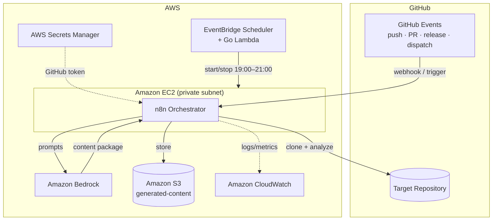
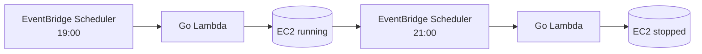
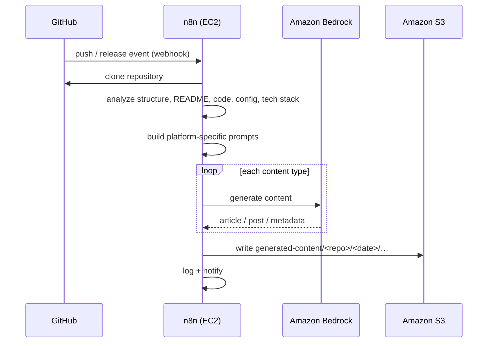

<div align="center">

# AI GitHub Repository Blog Generator

**An AI-powered developer content engine that analyzes any GitHub repository and generates a complete, publication-ready content package — powered by Amazon Bedrock.**

[](./LICENSE)
[](https://www.terraform.io/)
[](https://aws.amazon.com/)
[](https://aws.amazon.com/bedrock/)
[](https://n8n.io/)
[](https://go.dev/)
[](./.github/workflows)
[](./docs/contributing.md)

</div>

---

## Overview

**AI GitHub Repository Blog Generator** is an AI-powered developer content engine. Point it at a GitHub repository and it analyzes the project — structure, README, source code, configuration, technology stack, and architecture — then uses [Amazon Bedrock](https://aws.amazon.com/bedrock/) to generate a **complete, publication-ready content package**.

Instead of producing a single blog post, it generates an entire bundle of platform-specific content: a technical blog article, Medium / Dev.to / Hashnode versions, a LinkedIn post, an X (Twitter) thread, a Reddit post, a newsletter edition, an FAQ, SEO metadata, cover-image prompts, and more — all from one repository, with minimal effort.

Orchestration runs on [n8n](https://n8n.io/). Infrastructure is provisioned entirely with [Terraform](https://www.terraform.io/) on AWS. Cost is kept low by automatically starting and stopping the compute host on a schedule.

> This is an open-source **portfolio project** demonstrating production-grade AI Engineering, Amazon Bedrock, AWS, Terraform, n8n, workflow automation, Infrastructure as Code, and operable, observable software engineering.

---

## Features

| Capability | Description |
| --- | --- |
| 🔍 **GitHub repository analysis** | Understands a repository end to end from its content and metadata |
| ⬇️ **Automatic repository cloning** | Clones the target repository for local analysis |
| 🗂️ **Repository structure analysis** | Maps the file tree, modules, and project layout |
| 📖 **README analysis** | Extracts purpose, usage, and positioning from the README |
| 💻 **Source code analysis** | Samples representative source files to understand implementation |
| ⚙️ **Configuration file analysis** | Reads manifests and config (`package.json`, `go.mod`, `Dockerfile`, `*.tf`, CI, …) |
| 🧩 **Technology stack detection** | Infers languages, frameworks, build tools, and infrastructure |
| 🏛️ **Architecture understanding** | Synthesizes how the pieces fit together |
| 🧠 **Amazon Bedrock integration** | Generates content with configurable foundation models |
| 🔗 **n8n workflow orchestration** | Composable, observable pipeline with branching and retries |
| ✍️ **AI-generated technical content** | A full multi-platform content package (see below) |
| 🪣 **S3 storage** | Versioned, dated storage for every generated package |
| 🪵 **Logging** | Structured logs to CloudWatch across every stage |
| 🛡️ **Error handling & retries** | Explicit failure handling with exponential backoff |
| 💰 **Cost optimization** | Scheduled EC2 start/stop keeps infrastructure cheap |

---

## Generated Content

The engine produces an **entire content package** per run — not a single article. A typical package includes:

### Long-form articles

| Asset | File | Optimized for |
| --- | --- | --- |
| Technical blog article | `blog.md` | Personal & company engineering blogs, any Markdown platform |
| Medium article | `medium.md` | Medium |
| Dev.to article | `devto.md` | Dev.to |
| Hashnode article | `hashnode.md` | Hashnode |
| Newsletter article | `newsletter.md` | Email newsletters |

### Social & community

| Asset | File | Platform |
| --- | --- | --- |
| LinkedIn post | `linkedin.md` | LinkedIn |
| X (Twitter) thread | `twitter-thread.md` | X / Twitter |
| Reddit post | `reddit.md` | Reddit |

### Supporting assets

| Asset | File | Purpose |
| --- | --- | --- |
| FAQ | `faq.md` | Anticipated reader questions |
| README improvement suggestions | `readme-suggestions.md` | Actionable README upgrades for the source repo |
| Cover image prompts | `image-prompts.md` | Prompts for AI image generation |
| SEO metadata | `seo.json` | SEO title, description, keywords |
| Package metadata | `metadata.json` | Tags, reading time, social captions, call-to-action suggestions |

**`metadata.json`** and **`seo.json`** additionally carry: SEO title, SEO description, SEO keywords, platform-specific tags, estimated reading time, social media captions, and call-to-action suggestions.

---

## Publication-Ready Content

Each long-form article is written to be **platform-specific and publish-ready**, optimized for:

- **Medium**
- **Dev.to**
- **Hashnode**
- **Personal blogs**
- **Company engineering blogs**
- **Any Markdown-compatible publishing platform**

Every generated article aims to include:

- An engaging **title** (and **subtitle** where the platform supports one)
- **Introduction**
- **Table of contents**
- Well-organized **sections**
- **Code examples** where appropriate
- **Architecture explanations**
- **Best practices**
- **Challenges and trade-offs**
- **Conclusion**
- **Call to action**
- **SEO metadata**
- **Platform-specific tags**
- **Estimated reading time**

---

## Architecture Overview



**Pipeline:** a GitHub event (or manual trigger) starts an n8n workflow → the repository is cloned and analyzed (structure, README, source, config, tech stack, architecture) → structured prompts are built → Amazon Bedrock generates the full content package → results are written to S3 → notifications and logs are emitted.

Full detail: **[docs/architecture.md](./docs/architecture.md)** and **[docs/workflows.md](./docs/workflows.md)**.

---

## Infrastructure Overview

Infrastructure is provisioned **entirely with Terraform**. Resources include:

| Category | Resources |
| --- | --- |
| Networking | VPC, public subnets, private subnets, Internet Gateway, route tables, security groups |
| Identity | IAM roles, IAM policies (least privilege) |
| Compute | Amazon EC2 (n8n host), AWS Lambda (Go — EC2 start/stop) |
| AI | Amazon Bedrock |
| Storage | Amazon S3 (generated content + Terraform state) |
| Secrets | AWS Secrets Manager (GitHub tokens) |
| Scheduling | Amazon EventBridge, EventBridge Scheduler |
| Observability | Amazon CloudWatch (logs, metrics, alarms) |

See **[docs/infrastructure.md](./docs/infrastructure.md)**.

---

## Cost Optimization

The compute host (EC2, which runs n8n) is the only always-on cost driver — so the project **does not leave it running continuously**. An **EventBridge Scheduler** rule invokes a small **Go AWS Lambda** to start and stop the instance on a fixed daily window:

| Action | Time | Mechanism |
| --- | --- | --- |
| **Start EC2** | **19:00** | EventBridge Scheduler → Go Lambda → `StartInstances` |
| **Stop EC2** | **21:00** | EventBridge Scheduler → Go Lambda → `StopInstances` |



This keeps the instance running only during the daily operating window instead of 24/7, dramatically reducing infrastructure cost. The schedule is configurable via Terraform variables. More detail and cost estimates: **[docs/cost-optimization.md](./docs/cost-optimization.md)**.

---

## Security

Security is built in by default (full detail in **[docs/security.md](./docs/security.md)**):

- **Least-privilege IAM** — every role is scoped to only the actions and resources it needs.
- **Secrets Manager for GitHub tokens** — credentials live in AWS Secrets Manager, never in code.
- **No hardcoded credentials** — no secrets in source, images, or Terraform state.
- **Secure Bedrock access** — model invocation is scoped by IAM to specific model ARNs.
- **Secure S3 access** — buckets block public access, enforce TLS, and encrypt at rest.
- **CloudWatch logging** — auditable, structured logs with no secret material.

---

## Prerequisites

| Requirement | Notes |
| --- | --- |
| AWS account | With permissions for VPC, EC2, Lambda, S3, IAM, EventBridge, Secrets Manager, CloudWatch |
| Amazon Bedrock model access | Requested in the Bedrock console for your Region |
| [Terraform](https://developer.hashicorp.com/terraform/downloads) ≥ 1.6 | Infrastructure as Code |
| [AWS CLI](https://docs.aws.amazon.com/cli/) v2 | Configured credentials |
| [Docker](https://www.docker.com/) & Docker Compose | Run n8n locally |
| [Go](https://go.dev/dl/) ≥ 1.22 | Build the EC2 scheduler Lambda |
| [Git](https://git-scm.com/) | Version control |
| GitHub personal access token | For cloning/private repos and event webhooks |

---

## Local Setup

Run n8n locally to develop and test workflows:

```bash
# 1. Clone
git clone https://github.com/<your-org>/ai-github-repository-blog-generator.git
cd ai-github-repository-blog-generator

# 2. Configure local environment
cd docker
cp .env.example .env          # fill in AWS region, Bedrock model, n8n creds

# 3. Start n8n
docker compose up -d
docker compose logs -f n8n    # n8n → http://localhost:5678
```

Then import the workflows from `workflows/n8n/` (see **[docs/workflows.md](./docs/workflows.md)**). Full guide: **[docs/local-development.md](./docs/local-development.md)**.

---

## AWS Deployment

### Terraform deployment

```bash
# 1. Bootstrap remote state (once per account/region)
./scripts/bootstrap.sh --region us-east-1 --state-bucket <tfstate-bucket> --lock-table tf-locks

# 2. Configure variables
cp terraform/terraform.tfvars.example terraform/terraform.tfvars
#   edit: region, bedrock_model_id, ec2_instance_type, ec2_start_cron, ec2_stop_cron, ...

# 3. Provision
cd terraform
terraform init
terraform fmt -check && terraform validate
terraform plan -out tfplan
terraform apply tfplan
```

After apply, populate secrets and verify the deployment. Full guide with rollback: **[docs/deployment.md](./docs/deployment.md)**.

### n8n setup

1. Reach the n8n editor on the EC2 host via **SSM Session Manager** port-forwarding (no public ingress).
2. **Import** each workflow JSON from `workflows/n8n/`.
3. Configure **credentials** (AWS, GitHub) — these reference Secrets Manager.
4. **Activate** the workflows.

Detailed steps: **[docs/workflows.md](./docs/workflows.md#8-importing-workflows)**.

### GitHub integration

The engine can be triggered by GitHub events delivered to the n8n webhook (or via manual/scheduled runs). Supported triggers:

| Event | Use |
| --- | --- |
| **Push** | Generate content when code changes |
| **Pull Request** | Draft content from a proposed change |
| **Release** | Generate release-oriented content |
| **Repository creation** | Kick off content for a brand-new project |
| **Workflow dispatch** | Trigger from GitHub Actions |
| **Manual trigger** | Run on demand from n8n or the API |

Store the GitHub token in Secrets Manager and configure the webhook/secret in your repository settings.

### Amazon Bedrock setup

1. In the AWS Console, open **Bedrock → Model access** and request access to your chosen foundation model in the deployment Region.
2. Set `bedrock_model_id`, `bedrock_max_tokens`, and `bedrock_temperature` in `terraform.tfvars`.
3. Verify access:

```bash
aws bedrock list-foundation-models --region us-east-1 \
  --query "modelSummaries[].modelId" --output table
```

---

## Example Workflow



---

## Example Generated Content

Each run writes a dated content package to S3 under `generated-content/`:

```text
generated-content/
└── repository-name/
    └── YYYY-MM-DD/
        ├── medium.md              # Medium article
        ├── devto.md               # Dev.to article
        ├── hashnode.md            # Hashnode article
        ├── blog.md                # Generic technical blog article
        ├── linkedin.md            # LinkedIn post
        ├── twitter-thread.md      # X (Twitter) thread
        ├── reddit.md              # Reddit post
        ├── newsletter.md          # Newsletter edition
        ├── faq.md                 # FAQ
        ├── readme-suggestions.md  # README improvement suggestions
        ├── image-prompts.md       # Cover-image prompts for AI image generation
        ├── seo.json               # SEO title, description, keywords
        └── metadata.json          # Tags, reading time, captions, CTAs
```

Example `metadata.json`:

```json
{
  "source_repository": "https://github.com/acme/widget",
  "generated_at": "2026-07-05T19:12:00Z",
  "model": "us.anthropic.claude-sonnet-4-...",
  "reading_time_minutes": 8,
  "tags": ["go", "aws", "terraform", "ai"],
  "platform_tags": {
    "devto": ["go", "aws", "tutorial", "devops"],
    "hashnode": ["golang", "cloud", "bedrock"]
  },
  "social_captions": {
    "linkedin": "How we built …",
    "twitter": "🧵 A deep dive into …"
  },
  "call_to_action": "Star the repo and try it on your own project."
}
```

---

## Documentation

| Document | Description |
| --- | --- |
| [Requirements](./docs/requirements.md) | Functional, non-functional, infra, security, AI, workflow, storage, monitoring, cost |
| [Architecture](./docs/architecture.md) | System, AWS, and data-flow architecture |
| [Deployment](./docs/deployment.md) | AWS deployment with Terraform |
| [Local Development](./docs/local-development.md) | Running and developing locally |
| [Workflows](./docs/workflows.md) | Every n8n workflow, documented |
| [Infrastructure](./docs/infrastructure.md) | Every AWS service and Terraform module |
| [Security](./docs/security.md) | IAM, secrets, encryption, auditing |
| [Monitoring](./docs/monitoring.md) | CloudWatch metrics, logs, and alerts |
| [Cost Optimization](./docs/cost-optimization.md) | Cost controls and estimates |
| [CI/CD](./docs/ci-cd.md) | GitHub Actions pipelines |
| [Roadmap](./docs/roadmap.md) | Planned features and releases |
| [Contributing](./docs/contributing.md) | How to contribute |

---

## Roadmap

Current focus is a robust single-repository content engine. Planned enhancements include multi-language generation, scheduled repository rescans, AI-generated diagrams (architecture, sequence, flowcharts), release notes and documentation generation, video/short/podcast scripts, multi-model support, content quality scoring, and automatic publishing to platforms (Medium, Dev.to, Hashnode, WordPress, Ghost).

See the full **[Roadmap](./docs/roadmap.md)** and the [Future Enhancements](./docs/requirements.md#10-future-enhancements) section of the requirements.

---

## Contributing

Contributions are welcome! Please read the **[Contributing Guide](./docs/contributing.md)** for the development workflow, branch naming, commit conventions, and the pull-request process.

---

## License

Released under the [MIT License](./LICENSE).
