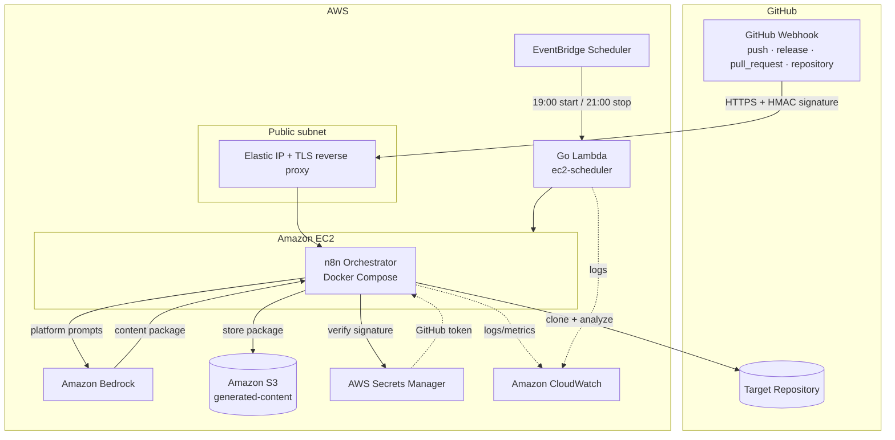
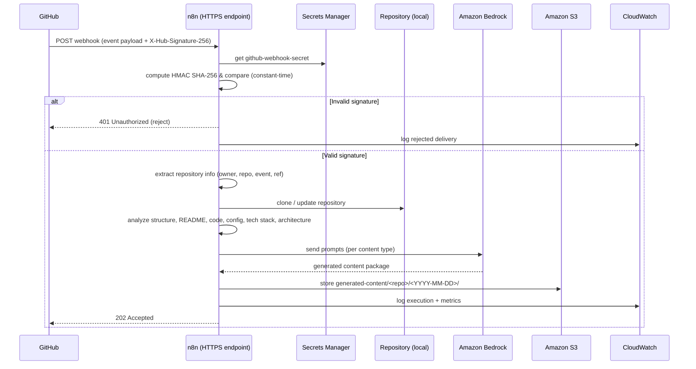
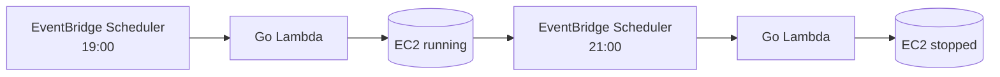
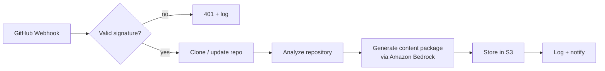

<div align="center">

# AI GitHub Repository Blog Generator

**An AI-powered developer content engine that analyzes any GitHub repository and generates a complete, publication-ready content package — triggered automatically by GitHub Webhooks and powered by Amazon Bedrock.**

[](./LICENSE)
[](https://www.terraform.io/)
[](https://aws.amazon.com/)
[](https://aws.amazon.com/bedrock/)
[](https://n8n.io/)
[](https://go.dev/)
[](https://docs.github.com/webhooks)
[](./.github/workflows)
[](./docs/contributing.md)

</div>

---

## Overview

**AI GitHub Repository Blog Generator** is an AI-powered developer content engine. Whenever a repository is updated, a **GitHub Webhook** triggers the platform to analyze the project — structure, README, source code, configuration, technology stack, and architecture — and use [Amazon Bedrock](https://aws.amazon.com/bedrock/) to generate a **complete, publication-ready content package**.

Instead of producing a single blog post, it generates an entire bundle of platform-specific content: a technical blog article, Medium / Dev.to / Hashnode versions, a LinkedIn post, an X (Twitter) thread, a Reddit post, a newsletter edition, an FAQ, SEO metadata, cover-image prompts, and more — all from one repository event, with minimal effort.

The **primary integration mechanism is GitHub Webhooks**, enabling automatic content generation on push, release, pull request, and other repository events. Orchestration runs on [n8n](https://n8n.io/); infrastructure is provisioned entirely with [Terraform](https://www.terraform.io/) on AWS; and cost is kept low by starting and stopping the compute host on a daily schedule.

> This is an open-source **portfolio project** — architected for production practices today and a future SaaS evolution — demonstrating AI Engineering, Amazon Bedrock, AWS, Terraform, n8n, webhook automation, Infrastructure as Code, and operable, observable software engineering.

---

## Features

| Capability | Description |
| --- | --- |
| 🪝 **GitHub Webhook integration** | Primary trigger; content is generated automatically on repository events |
| 🔐 **Webhook signature validation** | HMAC SHA-256 verification of every delivery before processing |
| 🔍 **GitHub repository analysis** | Understands a repository end to end from its content and metadata |
| ⬇️ **Automatic repository cloning** | Clones (or updates) the target repository for local analysis |
| 🗂️ **Repository structure analysis** | Maps the file tree, modules, and project layout |
| 📖 **README analysis** | Extracts purpose, usage, and positioning from the README |
| 💻 **Source code analysis** | Samples representative source files to understand implementation |
| ⚙️ **Configuration file analysis** | Reads manifests and config (`package.json`, `go.mod`, `Dockerfile`, `*.tf`, CI, …) |
| 🧩 **Technology stack detection** | Infers languages, frameworks, build tools, and infrastructure |
| 🏛️ **Architecture understanding** | Synthesizes how the pieces fit together |
| 🧠 **Amazon Bedrock integration** | Generates content with configurable foundation models |
| 🔗 **n8n workflow orchestration** | Composable, observable pipeline with branching and retries |
| ✍️ **AI-generated technical content** | A full multi-platform content package (see below) |
| 🪣 **S3 storage** | Versioned, dated storage for every generated package |
| 🪵 **CloudWatch logging** | Structured logs and metrics across every stage |
| 🛡️ **Error handling & retries** | Explicit failure handling with exponential backoff |

---

## Architecture Overview



Full detail: **[docs/architecture.md](./docs/architecture.md)**.

---

## End-to-End Workflow

1. A repository is updated (e.g. a `push` or `release`).
2. GitHub delivers a **webhook** over HTTPS to the n8n endpoint.
3. n8n **validates the HMAC SHA-256 signature** using the webhook secret from Secrets Manager.
4. The **repository information** (owner, name, event, ref) is extracted.
5. The repository is **cloned or updated** on the EC2 host.
6. **Repository analysis** runs (structure, README, source, config, tech stack, architecture).
7. The analysis is turned into prompts and sent to **Amazon Bedrock**.
8. Bedrock **generates the technical content** package.
9. The package is **stored in Amazon S3** under a dated key.
10. Execution is **logged in CloudWatch**.
11. **Transient failures are retried** where appropriate.

---

## GitHub Webhook Integration

GitHub Webhooks are the **primary trigger mechanism**. A single secured HTTPS endpoint (exposed by n8n) receives events, verifies them, and starts the pipeline.



> **Operating window:** the webhook endpoint is available while the EC2 host is running (its daily window — see [Cost Optimization](#cost-optimization)). GitHub automatically **retries** failed deliveries, and the window is configurable. A always-on ingestion buffer for 24/7 capture is on the [roadmap](./docs/roadmap.md).

Configuration steps are in [GitHub webhook configuration](#github-webhook-configuration).

---

## Supported GitHub Events

### Primary (supported)

| Event | Fires when | Example generated content |
| --- | --- | --- |
| `push` | Commits are pushed | Updated technical article · documentation updates · social media updates |
| `release` | A release is published | Release announcement · blog article · newsletter · LinkedIn post · X thread |
| `pull_request` | A PR is opened/updated/merged | Feature spotlight · architecture changes · technical summary |
| `workflow_dispatch` | Manually triggered from GitHub Actions | On-demand full content package |
| `repository` | A repository is created | Initial project overview · introduction article · technology stack overview |

### Optional (future support)

`issues` · `issue_comment` · `discussion` · `discussion_comment` · `milestone` · `package` · `deployment` · `deployment_status` · `registry_package` · `star` (watch) · `fork`

These are **future work** — see [Roadmap](./docs/roadmap.md) and [Future Enhancements](./docs/requirements.md#11-future-enhancements). They would enable content such as community round-ups, milestone recaps, deployment notes, and release/package announcements.

---

## Webhook Security

| Control | Description |
| --- | --- |
| **Secret validation** | Every delivery is validated against the GitHub webhook secret |
| **HMAC SHA-256** | `X-Hub-Signature-256` is verified with a constant-time comparison |
| **Reject invalid signatures** | Deliveries that fail verification are rejected (`401`) and logged |
| **HTTPS only** | The endpoint accepts TLS traffic only |
| **IAM least privilege** | Components hold only the permissions they need |
| **Secrets Manager** | The webhook secret and GitHub token live in AWS Secrets Manager |
| **No hardcoded secrets** | Nothing sensitive is committed to source, images, or state |
| **Audit logging** | All deliveries (accepted and rejected) are logged to CloudWatch |

Details: **[docs/security.md](./docs/security.md#10-webhook-security)**.

---

## AWS Infrastructure Overview

Infrastructure is provisioned **entirely with Terraform**. Each service has a clear responsibility:

| Service | Responsibility |
| --- | --- |
| **VPC** | Network isolation boundary for all resources |
| **Public subnets** | Host the internet-facing webhook endpoint (Elastic IP + TLS) |
| **Private subnets** | Reserved for internal/optional components; defense in depth |
| **Internet Gateway** | Ingress/egress to the internet |
| **Route tables** | Direct traffic between subnets, IGW, and endpoints |
| **Security groups** | Restrict inbound 443 to GitHub webhook IP ranges; allow SSM |
| **IAM roles** | Assign short-lived, least-privilege identities to compute |
| **IAM policies** | Define the exact permitted actions and resources |
| **Amazon EC2** | Runs the n8n orchestrator (clone, analyze, generate, store) |
| **Amazon Bedrock** | Foundation model inference for content generation |
| **Amazon S3** | Stores generated content packages and Terraform state |
| **Secrets Manager** | Stores the GitHub token and webhook secret |
| **CloudWatch** | Logs, metrics, dashboards, and alarms |
| **EventBridge** | Event bus and rules |
| **EventBridge Scheduler** | Fires the daily EC2 start/stop schedule |
| **AWS Lambda** | Go function that starts/stops the EC2 host on schedule |

Full detail: **[docs/infrastructure.md](./docs/infrastructure.md)**.

---

## Generated Content

The engine produces an **entire content package** per run — not a single article.

### Long-form articles

| Asset | File | Optimized for |
| --- | --- | --- |
| Technical blog article | `blog.md` | Personal & company engineering blogs, any Markdown platform |
| Medium article | `medium.md` | Medium |
| Dev.to article | `devto.md` | Dev.to |
| Hashnode article | `hashnode.md` | Hashnode |
| Newsletter article | `newsletter.md` | Email newsletters |

### Social & community

| Asset | File | Platform |
| --- | --- | --- |
| LinkedIn post | `linkedin.md` | LinkedIn |
| X (Twitter) thread | `twitter-thread.md` | X / Twitter |
| Reddit post | `reddit.md` | Reddit |

### Supporting assets

| Asset | File | Purpose |
| --- | --- | --- |
| FAQ | `faq.md` | Anticipated reader questions |
| README improvement suggestions | `readme-suggestions.md` | Actionable README upgrades for the source repo |
| Cover image prompts | `image-prompts.md` | Prompts for AI image generation |
| SEO metadata | `seo.json` | SEO title, description, keywords |
| Package metadata | `metadata.json` | Tags, reading time, social captions, call-to-action suggestions |

**`metadata.json`** and **`seo.json`** additionally carry: SEO title, SEO description, SEO keywords, platform-specific tags, estimated reading time, social media captions, and call-to-action suggestions.

### Publication-ready content

Each long-form article is written to be **platform-specific and publish-ready**, optimized for **Medium**, **Dev.to**, **Hashnode**, **personal blogs**, **company engineering blogs**, and **any Markdown-compatible publishing platform**. Every article aims to include:

- An engaging **title** (and **subtitle** where the platform supports one)
- **Introduction** · **table of contents** · well-organized **sections**
- **Code examples** where appropriate · **architecture explanations**
- **Best practices** · **challenges and trade-offs**
- **Conclusion** · **call to action**
- **SEO metadata** · **platform-specific tags** · **estimated reading time**

---

## Cost Optimization

The compute host (EC2, which runs n8n) is the only always-on cost driver — so the project **does not leave it running continuously**. An **EventBridge Scheduler** rule invokes a small **Go AWS Lambda** to start and stop the instance on a fixed daily window:

| Action | Time (daily) | Mechanism |
| --- | --- | --- |
| **Start EC2** | **19:00** | EventBridge Scheduler → Go Lambda → `StartInstances` |
| **Stop EC2** | **21:00** | EventBridge Scheduler → Go Lambda → `StopInstances` |



This prevents the instance from running continuously (~2h/day instead of 24/7), dramatically reducing infrastructure cost. The schedule is configurable via Terraform variables. Estimates and levers: **[docs/cost-optimization.md](./docs/cost-optimization.md)**.

---

## Security

Security is built in by default (full detail in **[docs/security.md](./docs/security.md)**):

- **Least-privilege IAM** — every role is scoped to only the actions and resources it needs.
- **GitHub webhook secret validation** — HMAC SHA-256 verification of every delivery.
- **Secrets Manager for GitHub secrets** — the GitHub token and webhook secret live in AWS Secrets Manager.
- **No hardcoded credentials** — no secrets in source, images, or Terraform state.
- **Secure Bedrock access** — model invocation scoped by IAM to specific model ARNs.
- **Secure S3 access** — buckets block public access, enforce TLS, and encrypt at rest.
- **CloudWatch logging** — auditable, structured logs with no secret material.
- **IAM roles instead of static credentials** — compute uses instance/Lambda roles; CI uses OIDC.
- **TLS encryption** — all traffic (webhooks, AWS APIs, GitHub) uses TLS.
- **Encryption at rest** — S3, EBS, and Secrets Manager are encrypted.

---

## Prerequisites

| Requirement | Notes |
| --- | --- |
| AWS account | With permissions for VPC, EC2, Lambda, S3, IAM, EventBridge, Secrets Manager, CloudWatch |
| Amazon Bedrock model access | Requested in the Bedrock console for your Region |
| [Terraform](https://developer.hashicorp.com/terraform/downloads) ≥ 1.6 | Infrastructure as Code |
| [AWS CLI](https://docs.aws.amazon.com/cli/) v2 | Configured credentials |
| [Docker](https://www.docker.com/) & Docker Compose | Run n8n locally |
| [Go](https://go.dev/dl/) ≥ 1.22 | Build the EC2 scheduler Lambda |
| [Git](https://git-scm.com/) | Version control |
| GitHub repository (admin) | To configure the webhook and secret |

---

## Local Setup

```bash
# 1. Clone
git clone https://github.com/<your-org>/ai-github-repository-blog-generator.git
cd ai-github-repository-blog-generator

# 2. Configure local environment
cd docker
cp .env.example .env          # AWS region, Bedrock model, n8n creds, webhook secret

# 3. Start n8n
docker compose up -d
docker compose logs -f n8n    # n8n → http://localhost:5678
```

Import the workflows from `workflows/n8n/`, then send a **test webhook** (GitHub's "Recent Deliveries → Redeliver", or `curl` with a signed payload). Full guide: **[docs/local-development.md](./docs/local-development.md)**.

---

## AWS Deployment

### Terraform deployment

```bash
# 1. Bootstrap remote state (once per account/region)
./scripts/bootstrap.sh --region us-east-1 --state-bucket <tfstate-bucket> --lock-table tf-locks

# 2. Configure variables
cp terraform/terraform.tfvars.example terraform/terraform.tfvars
#   edit: region, bedrock_model_id, ec2_instance_type,
#         ec2_start_cron, ec2_stop_cron, webhook_dns_name, ...

# 3. Provision
cd terraform
terraform init
terraform fmt -check && terraform validate
terraform plan -out tfplan
terraform apply tfplan
```

After apply, populate secrets and verify the deployment. Full guide with rollback: **[docs/deployment.md](./docs/deployment.md)**.

### n8n setup

1. Reach the n8n editor via **SSM Session Manager** port-forwarding (the management UI is not publicly exposed).
2. **Import** each workflow JSON from `workflows/n8n/`.
3. Configure **credentials** (AWS, GitHub) — these reference Secrets Manager.
4. **Activate** the workflows and note the webhook path (e.g. `/webhook/github`).

### GitHub webhook configuration

1. Generate a strong random **webhook secret** and store it in Secrets Manager:
   ```bash
   aws secretsmanager put-secret-value \
     --secret-id blog-generator/github-webhook-secret \
     --secret-string "$(openssl rand -hex 32)" --region us-east-1
   ```
2. In your repository (or org): **Settings → Webhooks → Add webhook**.
3. **Payload URL:** `https://<your-webhook-host>/webhook/github`
4. **Content type:** `application/json`
5. **Secret:** paste the same value stored in Secrets Manager.
6. **Events:** select *push*, *release*, *pull request*, *repository* (or "Send me everything").
7. Save, then confirm a green **✓ delivery** under *Recent Deliveries*.

### Amazon Bedrock setup

1. In the AWS Console, open **Bedrock → Model access** and request access to your chosen foundation model in the deployment Region.
2. Set `bedrock_model_id`, `bedrock_max_tokens`, and `bedrock_temperature` in `terraform.tfvars`.
3. Verify access:
   ```bash
   aws bedrock list-foundation-models --region us-east-1 \
     --query "modelSummaries[].modelId" --output table
   ```

---

## Example Workflow



---

## Example Generated Content

Each run writes a dated content package to S3 under `generated-content/`:

```text
generated-content/
└── repository-name/
    └── YYYY-MM-DD/
        ├── medium.md              # Medium article
        ├── devto.md               # Dev.to article
        ├── hashnode.md            # Hashnode article
        ├── blog.md                # Generic technical blog article
        ├── linkedin.md            # LinkedIn post
        ├── twitter-thread.md      # X (Twitter) thread
        ├── reddit.md              # Reddit post
        ├── newsletter.md          # Newsletter edition
        ├── faq.md                 # FAQ
        ├── readme-suggestions.md  # README improvement suggestions
        ├── image-prompts.md       # Cover-image prompts for AI image generation
        ├── seo.json               # SEO title, description, keywords
        └── metadata.json          # Tags, reading time, captions, CTAs
```

Example `metadata.json`:

```json
{
  "source_repository": "https://github.com/acme/widget",
  "trigger_event": "release",
  "generated_at": "2026-07-05T19:12:00Z",
  "model": "us.anthropic.claude-sonnet-4-...",
  "reading_time_minutes": 8,
  "tags": ["go", "aws", "terraform", "ai"],
  "platform_tags": {
    "devto": ["go", "aws", "tutorial", "devops"],
    "hashnode": ["golang", "cloud", "bedrock"]
  },
  "social_captions": {
    "linkedin": "How we built …",
    "twitter": "🧵 A deep dive into …"
  },
  "call_to_action": "Star the repo and try it on your own project."
}
```

---

## Documentation

| Document | Description |
| --- | --- |
| [Requirements](./docs/requirements.md) | Functional, non-functional, webhook, AI, infra, security, workflow, storage, monitoring, cost |
| [Architecture](./docs/architecture.md) | System, AWS, webhook, and data-flow architecture |
| [Deployment](./docs/deployment.md) | AWS deployment with Terraform |
| [Local Development](./docs/local-development.md) | Running and developing locally |
| [Workflows](./docs/workflows.md) | Every n8n workflow, documented |
| [Infrastructure](./docs/infrastructure.md) | Every AWS service and Terraform module |
| [Security](./docs/security.md) | IAM, webhook security, secrets, encryption, auditing |
| [Monitoring](./docs/monitoring.md) | CloudWatch metrics, logs, and alerts |
| [Cost Optimization](./docs/cost-optimization.md) | Cost controls and estimates |
| [CI/CD](./docs/ci-cd.md) | GitHub Actions pipelines |
| [Roadmap](./docs/roadmap.md) | Planned features and releases |
| [Contributing](./docs/contributing.md) | How to contribute |

---

## Roadmap

Current focus is a robust webhook-driven, single-repository content engine. Planned enhancements include **automatic publishing** (Medium, Dev.to, Hashnode, WordPress, Ghost), multi-language generation, scheduled repository rescans, AI-generated diagrams (architecture, sequence, flowcharts), release notes and documentation generation, video/short/podcast scripts, multi-model support, content quality scoring, and duplicate-content detection.

See the full **[Roadmap](./docs/roadmap.md)** and [Future Enhancements](./docs/requirements.md#11-future-enhancements).

---

## Contributing

Contributions are welcome! Please read the **[Contributing Guide](./docs/contributing.md)** for the development workflow, branch naming, commit conventions, and the pull-request process.

---

## License

Released under the [MIT License](./LICENSE).
