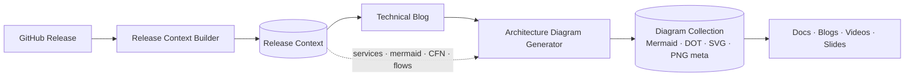
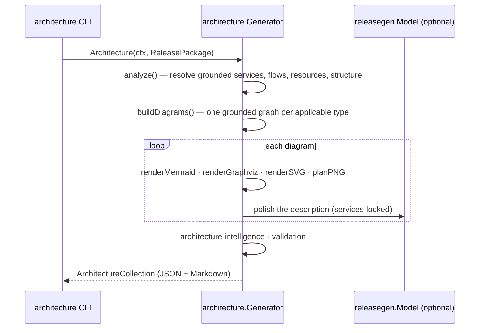

# AWS Architecture Diagram Generation (Milestone 11)

Milestone 11 converts the [Release Context](./release-context.md) (M2) and
downstream artifacts ([Blog](./blog-generation.md) M3, [Storyboard](./storyboard.md)
M4) into production-ready **architecture diagrams** — Mermaid, Graphviz DOT, and
SVG — plus PNG export metadata. It is the **Architecture Visualization** engine.

It focuses on visualization, not provisioning, and it **never invents
infrastructure**: nodes come only from the Release Context's AWS services, parsed
Mermaid, CloudFormation resources, components, and repository structure, and
**edges are drawn only when explicitly present** (parsed Mermaid edges,
event-driven flows, or factual containment).

Related: [Visual Assets](./visual-assets.md) · [Release Context](./release-context.md) · [Storyboard](./storyboard.md) · [Architecture](./architecture.md).

---

## 1. Pipeline



`Generator.Architecture(ctx, ReleasePackage) → ArchitectureCollection`, where
`ReleasePackage{Context, Blog, Storyboard}` supplies the ground truth and titling.

### Sequence



## 2. Design — analysis → graph → renderers

The engine lives in [`internal/architecture`](../internal/architecture). The core
decision is a **shared, format-agnostic graph model** (`graph{Nodes, Edges,
Groups}`) that every renderer consumes, so the Mermaid, Graphviz, and SVG outputs
stay **synchronized** — one grounded graph, three renderings.

```
Release Context ──► analyze() ──► diagram builders ──► graph ──┬─► renderMermaid
                                                                ├─► renderGraphviz (DOT)
                                                                └─► renderSVG
```

| Concern | Produced by |
| --- | --- |
| Infrastructure analysis (services → categories, flows, resources) | Deterministic, grounded |
| Diagram selection (which diagrams apply) | Deterministic, conditional on grounded data |
| Graph construction (nodes + **explicit** edges + grouping) | Deterministic |
| Mermaid · Graphviz DOT · SVG rendering | Deterministic |
| PNG export metadata, diagram metadata, intelligence | Deterministic |
| Validation (grounding, syntax, uniqueness) | Deterministic |
| Titles & descriptions | LLM (`releasegen.Model`) with a grounded fallback |

When `Model` is nil, generation is fully deterministic.

## 3. Grounding rules

- **Nodes** come only from `Architecture.AWSServices`, `CloudFormation.Services/
  Resources`, parsed `Mermaid.Nodes`, `Architecture.Components`, and
  `RepositoryStructure.Directories`.
- **Edges** are added only when explicit: reused from parsed `Mermaid.Edges`,
  extracted from `Architecture.EventDrivenFlows`, or a factual containment
  (repo → directory; workflow → CloudFormation → provisioned service). The graph
  refuses to connect undefined nodes, so no relationship is invented.
- **Grouping** (Mermaid subgraphs / DOT clusters / SVG columns) is layout only —
  not a relationship.
- **AWS icons** are *referenced* by their canonical AWS Architecture Icons path
  (e.g. `Compute/AWS-Lambda`), not embedded — the icons are AWS assets a
  downstream rasterizer supplies.

## 4. Diagram types

Chosen based on what the Release Context can ground:

| Diagram | Grounded on |
| --- | --- |
| High-Level Architecture (flowchart) | AWS services grouped by category |
| Data Flow Diagram (flowchart) | the parsed Mermaid diagram's real nodes + edges |
| Event-Driven Architecture (flowchart) | `EventDrivenFlows` chains |
| Sequence Diagram (`sequenceDiagram`) | the primary ordered flow |
| Component Diagram (flowchart) | the repository's top-level directories |
| CI/CD Pipeline (flowchart) | workflow → CloudFormation → provisioned services |

## 5. Schema (abridged)

```json
{
  "schemaVersion": "1.0.0",
  "metadata": { "repository": "acme/widget", "release": "v0.2.0", "diagramCount": 6 },
  "diagrams": [
    {
      "id": 1, "title": "widget v0.2.0 — High-Level AWS Architecture", "type": "High-Level Architecture",
      "mermaidType": "flowchart", "description": "...",
      "mermaid": "flowchart TD\n  subgraph Serverless...",
      "graphviz": "digraph Architecture { ... }",
      "svg": "<svg role=\"img\" ...>...</svg>",
      "png": { "recommendedResolution": "1920x1080", "aspectRatio": "16:9", "dpi": 144 },
      "awsServices": ["AWS Lambda", "Amazon SQS"],
      "references": ["docs/architecture.md"],
      "metadata": { "complexity": "low", "nodeCount": 5, "edgeCount": 2, "confidence": 100 }
    }
  ],
  "contentIntelligence": { "architectureStyle": "Event-driven serverless", "deploymentPattern": "...", "diagramConfidence": 100 }
}
```

The schema is versioned and additive-only, so future visualization engines extend
it without breaking.

## 6. Validation

`ArchitectureCollection.Validate(pkg)` enforces the Milestone 11 invariants (empty ⇒ valid):

- Every diagram is grounded and non-empty.
- Every AWS service named in a diagram exists in the Release Context.
- Mermaid syntax validates (known directive, balanced `subgraph`/`end`).
- Graphviz syntax validates (DOT wrapper, balanced braces).
- SVG is valid and accessible (`<svg>` root, `role="img"`, `<title>`/`<desc>`).
- No duplicate diagram types; graphs have unique node IDs and no orphan edges.

## 7. Running it

The `architecture` CLI reads a Release Context (and optional blog), then emits
Markdown (default) or JSON, and can write the SVG assets to disk:

```bash
# Offline from a context (deterministic), also export SVGs:
go run ./cmd/architecture --context ctx.json --offline --svg-dir ./diagrams

# With a blog, output JSON:
go run ./cmd/architecture --context ctx.json --blog post.md --format json --out arch.json
```

Flags: `--context` (required), `--blog`, `--storyboard`, `--svg-dir`, `--format
md|json`, `--model` (Anthropic model id, provider default when empty), `--offline`,
`--out`, `--timeout`.

## 8. Status

**Implemented:** the architecture engine (infrastructure analysis; High-Level,
Data-Flow, Event-Driven, Sequence, Component, and CI/CD diagram builders; a shared
graph model; Mermaid, Graphviz, and SVG renderers; PNG export + diagram metadata;
architecture intelligence), the versioned JSON schema, the Markdown renderer,
structural + syntax validation, and the `architecture` CLI. Unit-tested at 80%+
with deterministic and model-backed paths.

**Next (future milestones):** rasterize the SVGs to PNG with real AWS icons, and
embed the same canonical diagrams across blogs, docs, videos, and slides — every
channel references one grounded architecture.
