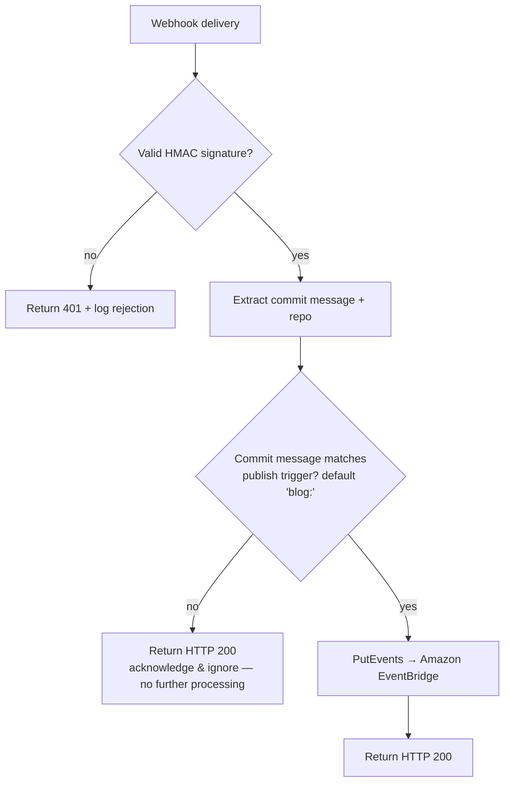
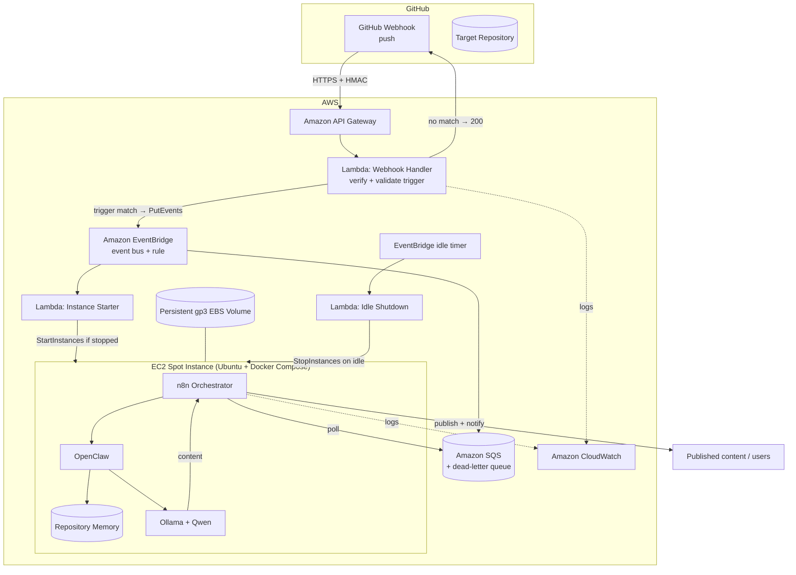
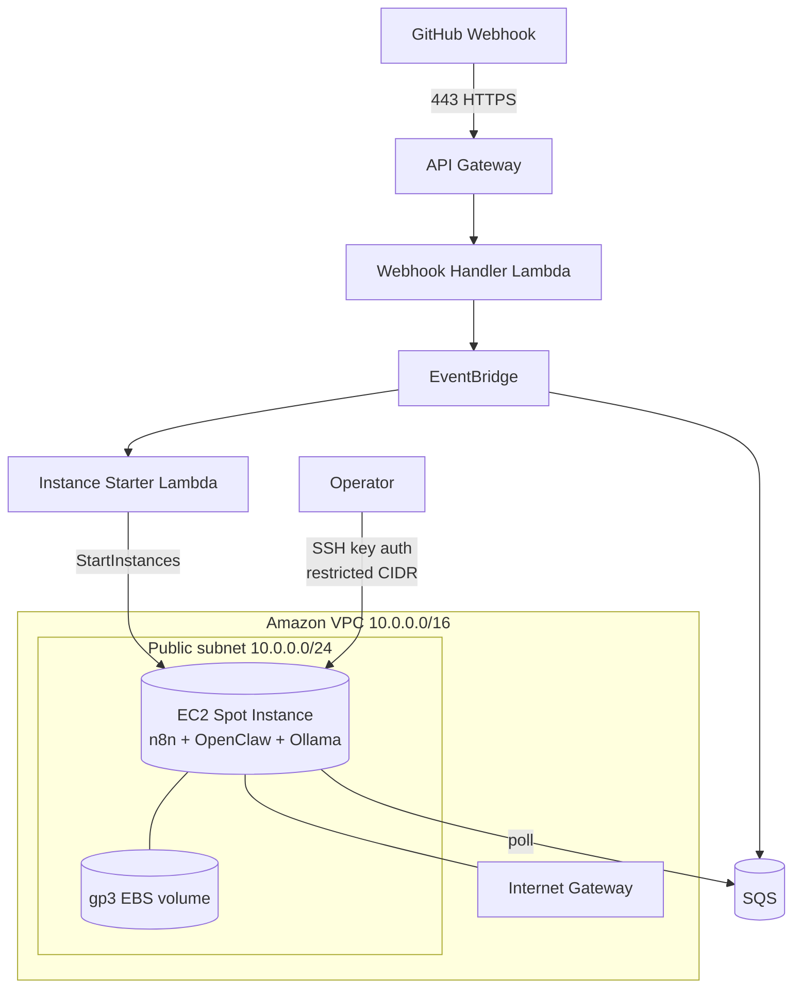
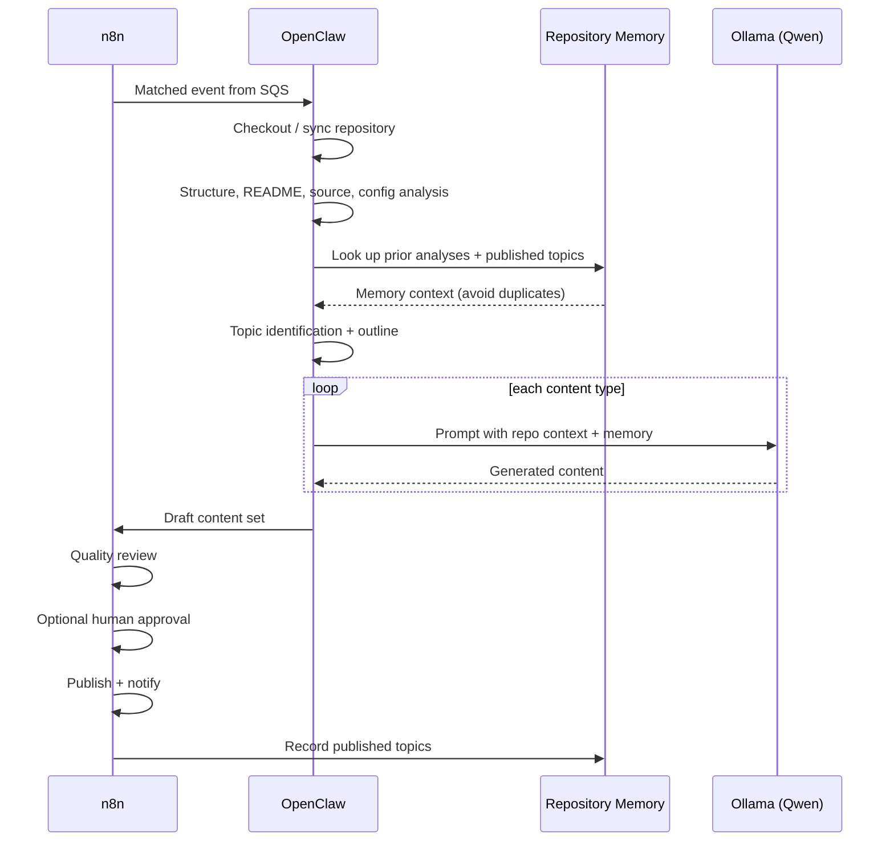
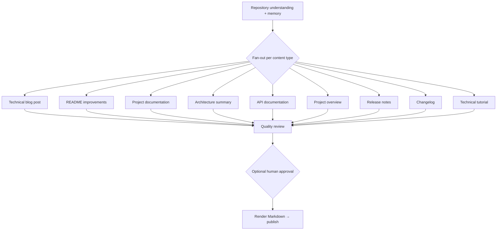
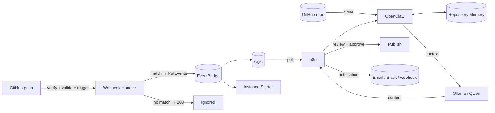
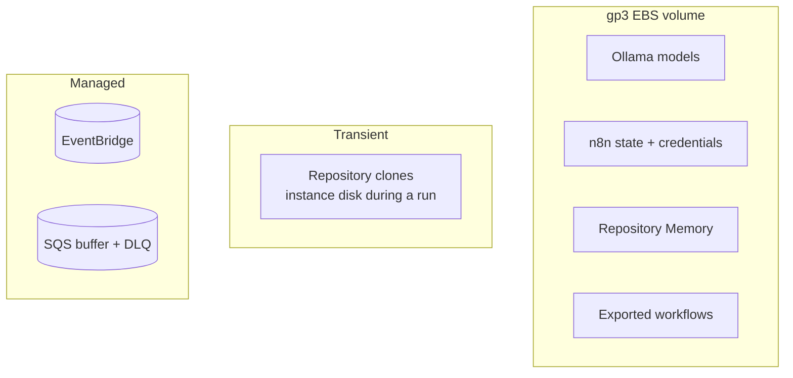

# Architecture

This document describes the architecture of the **GitHub AI Blog Generator**: the design principles, the **commit-message trigger gate**, the event-driven trigger path, the AWS deployment topology, the analysis and local-inference pipeline, content generation, data flow, and storage.

Related: [Requirements](./requirements.md) · [Infrastructure](./infrastructure.md) · [Workflows](./workflows.md) · [Cost Optimisation](./cost-optimization.md).

---

## 1. Design Principles

- **Opt-in generation** — a webhook is received on every push, but a run happens **only** when the commit message matches a configurable publishing trigger (default `blog:`). All other events are acknowledged and ignored.
- **Event-driven** — matched events are published to **Amazon EventBridge**, which starts compute and buffers work. Nothing runs speculatively.
- **Self-hosted inference** — all AI runs locally via **Ollama** with a local **Qwen** model. No Amazon Bedrock, OpenAI, Anthropic, or any paid inference API.
- **Pay only when you compute** — a cost-optimized **EC2 Spot Instance** starts on a matched event and stops after an idle timeout.
- **Durable buffering** — every matched event is stored in **Amazon SQS** so nothing is lost while the instance is stopped or booting.
- **Persistent state, ephemeral compute** — models, n8n state, and **Repository Memory** live on a persistent **gp3 EBS volume**; the compute layer is disposable.
- **Everything as code** — infrastructure is AWS CloudFormation; workflows are versioned n8n JSON; services run via Docker Compose.
- **Least privilege & encryption everywhere** — each component gets only the permissions it needs.

---

## 2. Commit-Message Trigger Gate

The trigger gate is the platform's defining architectural decision. It lives in the **Webhook Handler Lambda** and runs before any compute or AI is invoked.

- The trigger pattern is configurable via `PublishTrigger` (default `blog:`). Custom patterns (`[blog]`, regex, per-repo rules) are [planned](./roadmap.md).
- A non-matching event is a **terminal success**: the handler returns `200` and does nothing else. This is what prevents unwanted processing and cost.
- Only a **matching** event is published to EventBridge, which begins the rest of the flow.

See [Cost Optimisation → Trigger Pre-Filtering](./cost-optimization.md#1-trigger-pre-filtering) for why this is a primary cost lever, and [Requirements → Publishing Trigger](./requirements.md#2-publishing-trigger-requirements).

---

## 3. High-Level Architecture

**Component responsibilities**

| Component | Responsibility |
| --- | --- |
| GitHub Webhook | Delivers push events over HTTPS (every push, matched or not) |
| API Gateway | Public HTTPS ingress |
| Webhook Handler (Lambda) | Verify signature, extract commit message, **validate trigger**, publish matched events to EventBridge, return 200 quickly. Does **no** analysis or inference |
| Amazon EventBridge | Central event bus for matched events; routes to SQS and the instance starter; extension point for future trigger sources |
| Amazon SQS | Durable buffer so no matched event is lost during cold start; visibility timeout + DLQ |
| Instance Starter (Lambda) | Starts the EC2 Spot Instance if stopped |
| EC2 Spot Instance | Cost-optimized host running n8n, OpenClaw, Ollama via Docker Compose |
| n8n (on EC2) | Polls SQS, orchestrates the full pipeline |
| OpenClaw | Clones and analyses the repository, assembles context |
| Repository Memory | Persistent per-repo record of prior analyses and published topics |
| Ollama + Qwen | Local LLM inference — no external API |
| Idle Shutdown (Lambda) | Stops the instance after a configurable idle timeout |
| CloudWatch | Central logs, metrics, and alarms |

---

## 4. Webhook Handler Responsibilities

The handler is intentionally **lightweight** so it returns to GitHub in milliseconds. It is limited to:

1. Verify the GitHub webhook signature (HMAC SHA-256, constant-time).
2. Parse the webhook payload.
3. Extract commit information (message, ref, author).
4. Determine the affected repository.
5. **Validate the configured commit-message trigger.**
6. **Publish an event to EventBridge only when the trigger matches.**
7. Return a successful HTTP response to GitHub as quickly as possible.

The handler **must not** clone repositories, perform analysis, invoke Repository Memory, or run AI models — all of that happens downstream on the EC2 instance ([Requirements → Webhook Handler](./requirements.md#3-webhook-handler-requirements)).

---

## 5. AWS Deployment Topology

The webhook front door (API Gateway + Lambda + EventBridge + SQS) is fully serverless and **always available even when the EC2 instance is stopped**. The compute host runs in a **public subnet**; inbound access is tightly restricted by security groups.

- **Ingress:** GitHub reaches the platform through **API Gateway** (managed TLS), not the instance. The instance's inbound is limited to **SSH (22) from operator IPs**; the **n8n and Ollama ports are never publicly exposed**.
- **Egress:** the **Internet Gateway** provides outbound access for cloning, image pulls, and model downloads.
- **Decoupling:** the instance never receives inbound webhook traffic — it **polls SQS** when up.

See [Infrastructure](./infrastructure.md) and [Security](./security.md).

---

## 6. Analysis & Generation Pipeline

Once the instance is up, n8n drains SQS and runs the pipeline. **OpenClaw** analyses the repository, **Repository Memory** provides continuity, and **Ollama** runs the local model.

**Repository Memory** is a persistent, per-repository record (stored on the EBS volume) of previous analyses, identified topics, and published posts. It gives runs continuity — so the platform avoids regenerating duplicate content and can build on what it has already written ([Requirements → Repository Memory](./requirements.md#5-repository-memory-requirements)).

**Optional human approval** is a configurable gate (`REQUIRE_HUMAN_APPROVAL`) that pauses the pipeline for a human to approve or reject content before it is published.

---

## 7. Content Generation

Each run can produce a bundle of assets rather than a single document.

All output is clean, portable **GitHub-flavoured Markdown**. A failure on a content type routes to the error/notification path without corrupting previously generated output ([FR-5.5](./requirements.md#16-reliability-retry-logging--error-handling)).

---

## 8. Data Flow

**Stages and payloads**

| Stage | Input | Output |
| --- | --- | --- |
| Trigger gate | webhook payload | matched event → EventBridge, or 200 + stop |
| Route & buffer | matched event | SQS message + instance start |
| Poll | SQS message | in-flight run on EC2 |
| Analyse | working copy + memory | structured repository understanding |
| Generate | context + prompts | per-type Markdown content |
| Review & approve | draft content | approved content (or rejection) |
| Publish & notify | approved content | published content + notification + memory update |

---

## 9. Storage Architecture

The only **persistent** store is the **gp3 EBS volume** attached to the instance.

| Store | Contents | Notes |
| --- | --- | --- |
| gp3 EBS volume | Ollama models, n8n state, **Repository Memory**, workflows | Survives start/stop; encrypted; avoids re-downloading models |
| Repository clones | Working copy during a run | Transient — discarded after the run |
| Amazon SQS | Buffered matched events + DLQ | Durable; retention up to 14 days |

Persisting models and Repository Memory on EBS is what makes the start/stop cost model viable and gives runs continuity. Published Markdown is written to whatever destination the deployment configures (a Git repository, an object store, or a CMS). The platform does not mandate a specific content store.
