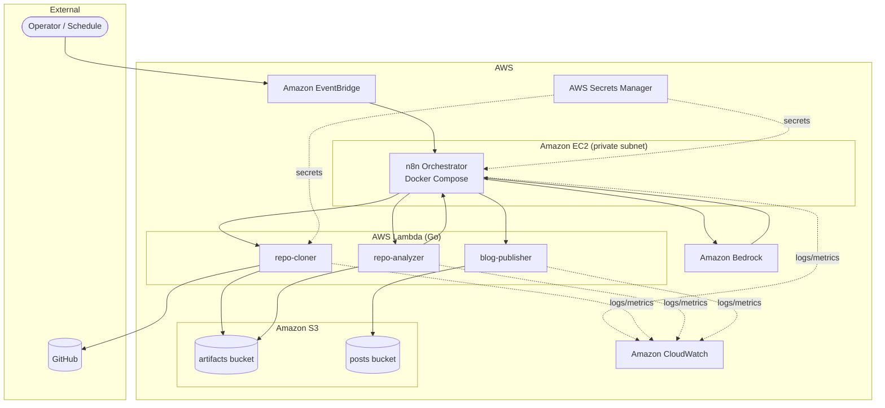
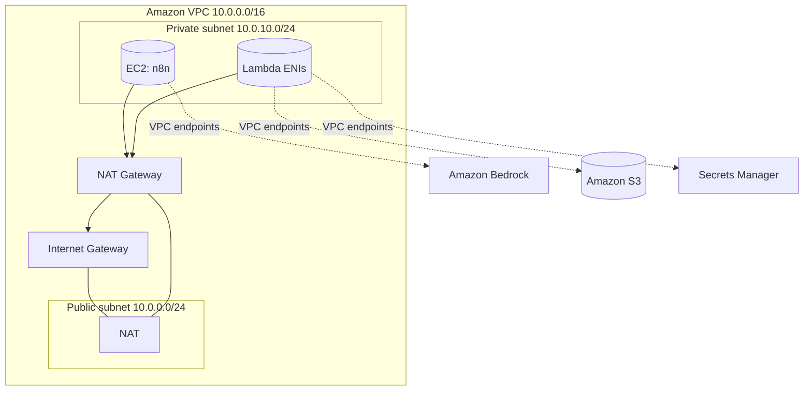
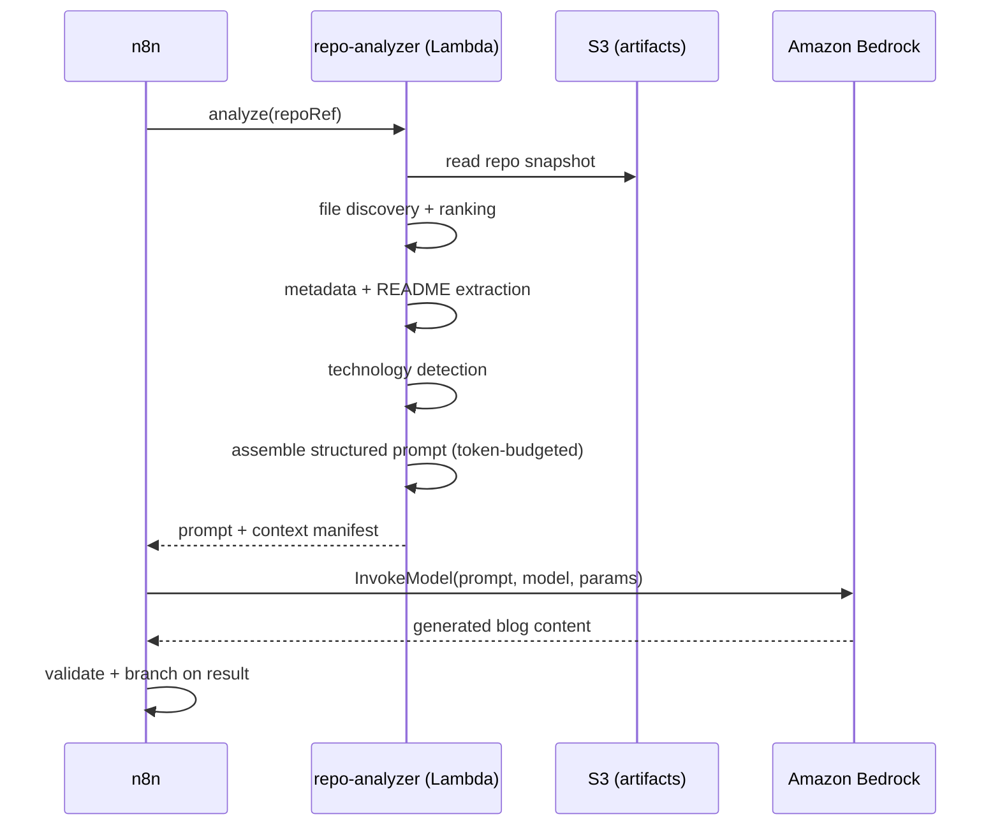
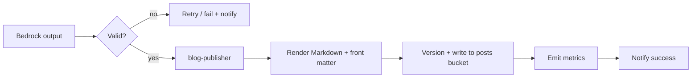
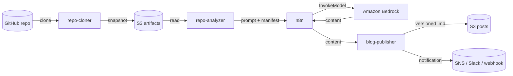
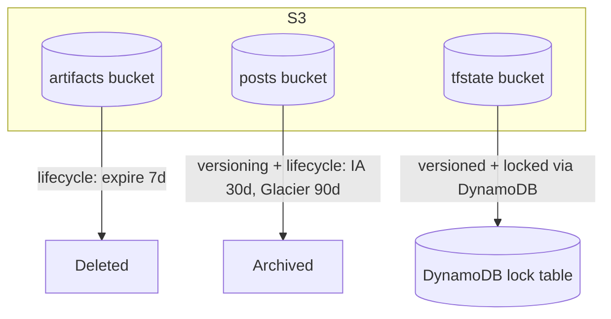

# Architecture

This document describes the architecture of the **AI GitHub Repository Blog Generator**: the high-level design, AWS deployment topology, the AI and blog-generation workflows, data flow, and storage.

Related: [Requirements](./requirements.md) · [Infrastructure](./infrastructure.md) · [Workflows](./workflows.md).

---

## 1. Design Principles

- **Event-driven & serverless-first** — stateless Lambda functions do the heavy lifting; managed services provide durability and scale.
- **Orchestration over glue code** — n8n owns the control flow, retries, and branching; Lambdas own discrete, testable units of work.
- **Everything as code** — all infrastructure is Terraform; all workflows are versioned JSON.
- **Least privilege & encryption everywhere** — each component gets only the permissions it needs.
- **Cost-aware** — the only always-on cost driver (the EC2 n8n host) is schedule-managed.

---

## 2. High-Level Architecture

**Component responsibilities**

| Component | Responsibility |
| --- | --- |
| EventBridge | Triggers runs (scheduled or manual) and manages EC2 start/stop |
| n8n | Orchestrates stages, holds credentials, handles retries/branching |
| `repo-cloner` | Clones the repo, normalizes it, uploads to the artifacts bucket |
| `repo-analyzer` | Discovers files, extracts metadata, detects tech, builds the prompt |
| Amazon Bedrock | Generates blog content from the prompt |
| `blog-publisher` | Renders Markdown, versions it, writes to the posts bucket, notifies |
| Secrets Manager | Stores GitHub token, n8n credentials, notification secrets |
| CloudWatch | Central logs, metrics, dashboards, alarms |

---

## 3. AWS Architecture (Deployment Topology)

- The **n8n EC2 host** runs in a **private subnet**; outbound internet (GitHub, package pulls) is via a **NAT gateway**. Administrative access is via **AWS Systems Manager Session Manager** (no public SSH).
- **Lambda functions** run in the VPC (or with VPC access to endpoints) and reach AWS services through **VPC gateway/interface endpoints** to keep traffic off the public internet where possible.
- **Security groups** allow only required flows; see [Infrastructure](./infrastructure.md#7-security-groups).

---

## 4. AI Workflow

The AI workflow converts a repository snapshot into a generation-ready prompt and invokes Amazon Bedrock.

**Prompt assembly** combines: repository metadata, README summary, ranked source excerpts, and detected technologies, formatted against a configurable template and truncated deterministically to respect the model context window (see [FR-8.2](./requirements.md#18-ai-prompt-generation)).

---

## 5. Blog Generation Workflow

The `blog-publisher` Lambda renders the model output into Markdown with YAML front matter, writes it to the posts bucket under a deterministic, versioned key, emits CloudWatch metrics, and triggers a success notification. Any failure routes to the error/notification path without overwriting existing content ([FR-16.3](./requirements.md#116-error-handling)).

---

## 6. Data Flow

**Stages and payloads**

| Stage | Input | Output |
| --- | --- | --- |
| Clone | repo URL | normalized snapshot in artifacts bucket |
| Analyze | snapshot reference | structured prompt + context manifest |
| Generate | prompt + params | raw blog content |
| Publish | blog content + metadata | versioned Markdown in posts bucket |
| Notify | run result | notification message |

---

## 7. Storage Architecture

Two S3 buckets separate transient inputs from durable outputs, plus a state bucket for Terraform.

| Bucket | Contents | Versioning | Lifecycle |
| --- | --- | --- | --- |
| `artifacts` | Cloned repo snapshots, intermediate analysis | Off | Expire after 7 days |
| `posts` | Generated Markdown blog posts | **On** | IA at 30d, Glacier at 90d |
| `tfstate` | Terraform remote state | **On** | Retain; DynamoDB lock table |

Key scheme for posts: `posts/<repo-owner>/<repo-name>/<UTC-timestamp>.md` (see [FR-13.2](./requirements.md#113-content-storage)). All buckets enforce encryption at rest, block public access, and require TLS.

See [Infrastructure](./infrastructure.md) for the concrete Terraform modules and [Cost Optimization](./cost-optimization.md) for lifecycle rationale.
