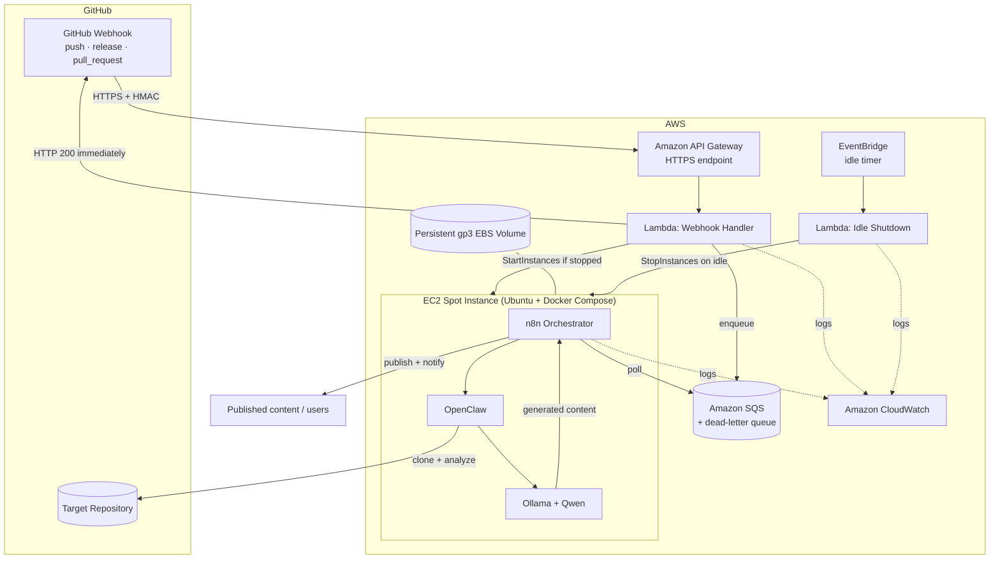
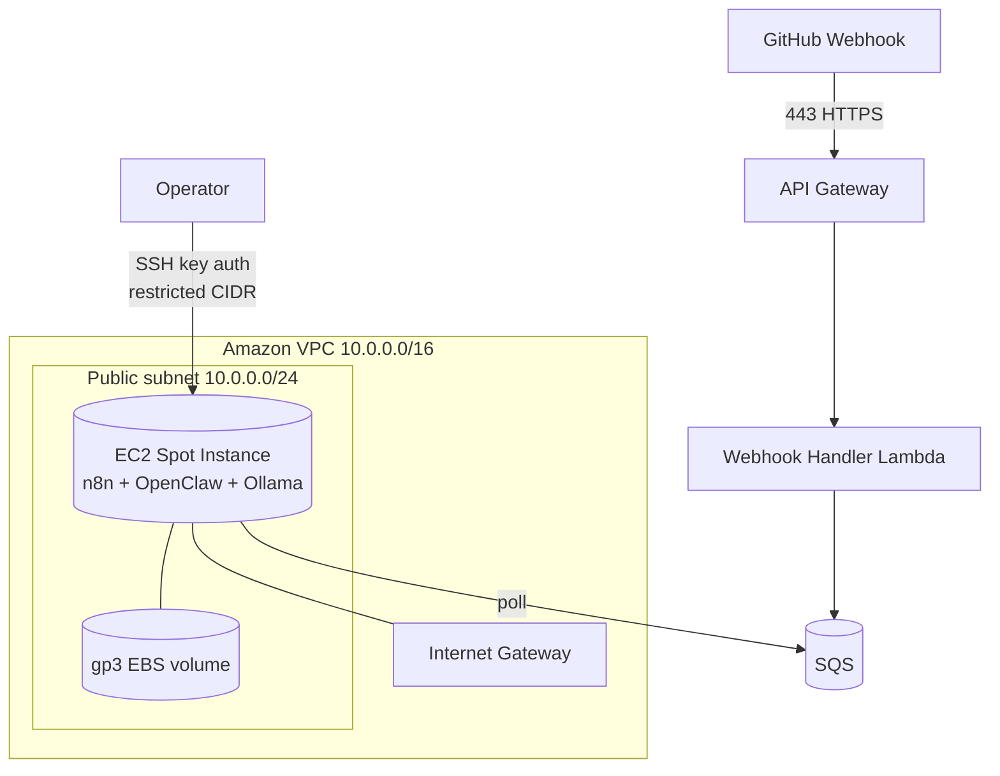
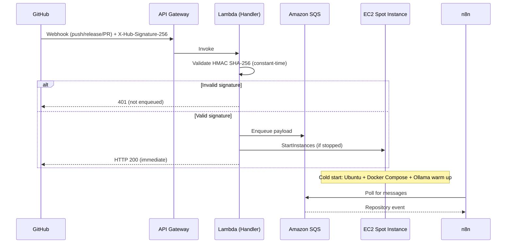
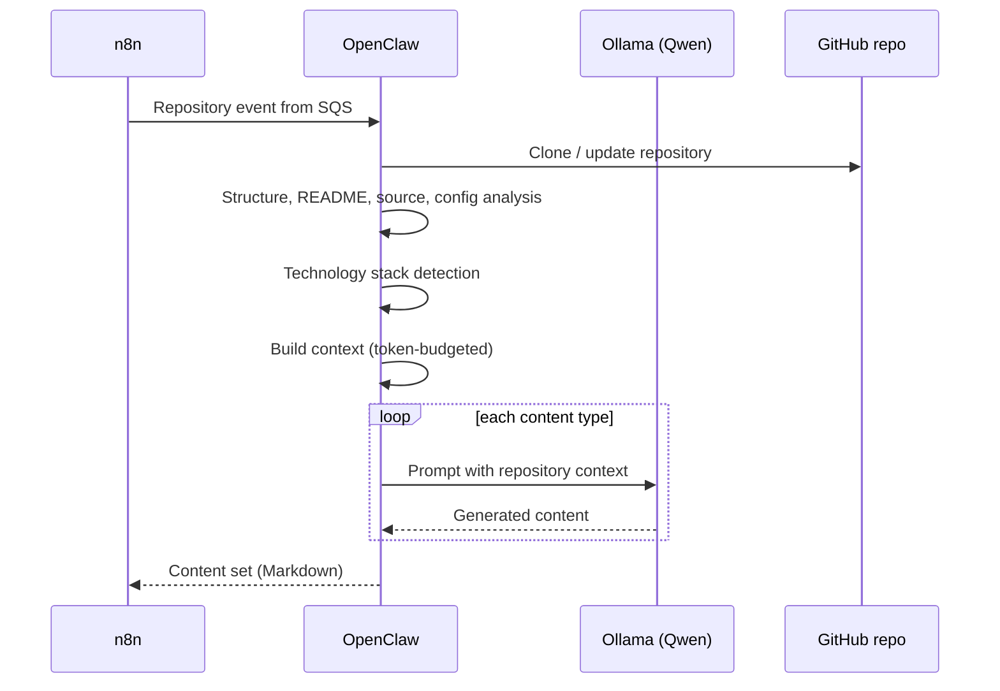
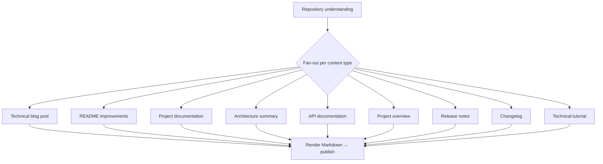
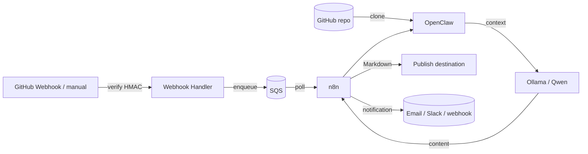
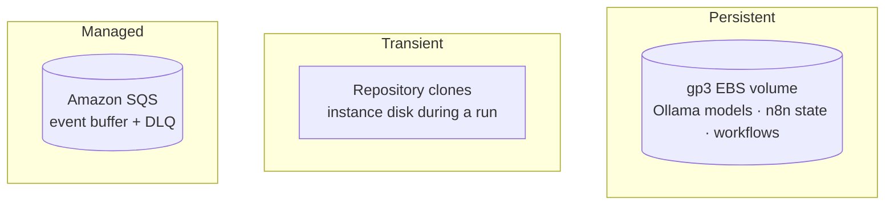

# Architecture

This document describes the architecture of the **GitHub AI Blog Generator**: the high-level design, AWS deployment topology, the event-driven trigger path, the analysis and local-inference workflow, content generation, data flow, and storage.

Related: [Requirements](./requirements.md) · [Infrastructure](./infrastructure.md) · [Workflows](./workflows.md) · [Cost Optimisation](./cost-optimization.md).

---

## 1. Design Principles

- **Event-driven** — nothing runs until a repository changes. A GitHub Webhook is the primary trigger; manual runs are also supported.
- **Self-hosted inference** — all AI runs locally on the instance via **Ollama** with a local **Qwen** model. No Amazon Bedrock, OpenAI, Anthropic, or any paid inference API.
- **Pay only when you compute** — a cost-optimized **EC2 Spot Instance** is started on demand and stopped after an idle timeout, so compute charges accrue only during active generation.
- **Durable buffering** — every validated event is stored in **Amazon SQS** so nothing is lost while the instance is stopped or booting.
- **Persistent state, ephemeral compute** — models and n8n state live on a persistent **gp3 EBS volume**; the compute layer is disposable.
- **Everything as code** — all infrastructure is AWS CloudFormation; all workflows are versioned n8n JSON; all services run via Docker Compose.
- **Least privilege & encryption everywhere** — each component gets only the permissions it needs.

---

## 2. High-Level Architecture

**Component responsibilities**

| Component | Responsibility |
| --- | --- |
| GitHub Webhook | Primary trigger — delivers repository events over HTTPS |
| API Gateway | Public HTTPS ingress for webhook deliveries |
| Webhook Handler (Lambda) | Validates the HMAC signature, enqueues the payload in SQS, starts the Spot Instance if stopped, returns HTTP 200 immediately |
| Amazon SQS | Durable buffer so no event is lost during cold start; visibility timeout + dead-letter queue |
| EC2 Spot Instance | Cost-optimized host running n8n, OpenClaw, and Ollama via Docker Compose |
| n8n (on EC2) | Polls SQS, orchestrates clone → analysis → generation → publish → notify |
| OpenClaw | Clones and analyses the repository, assembles model context |
| Ollama + Qwen | Local LLM inference — no external API |
| gp3 EBS volume | Persists model weights and n8n state across start/stop cycles |
| EventBridge + Idle Shutdown (Lambda) | Stops the instance after a configurable idle timeout |
| CloudWatch | Central logs, metrics, and alarms |

---

## 3. AWS Deployment Topology

The webhook front door is fully serverless (API Gateway + Lambda + SQS) and is **always available even when the EC2 instance is stopped**. The compute host runs in a **public subnet** so it can clone repositories and pull container images; inbound access is tightly restricted by security groups.

- **Ingress:** GitHub reaches the platform through **API Gateway** (managed TLS), not the instance directly. The instance's own inbound is limited to **SSH (22) from known operator IPs**; the **n8n and Ollama ports are never publicly exposed**.
- **Egress:** the **Internet Gateway** provides outbound access for cloning repositories, pulling Docker images, and downloading model weights.
- **SQS decoupling:** the Lambda writes to SQS and returns immediately; the instance polls SQS when it is up. The instance never receives inbound webhook traffic.

See [Infrastructure](./infrastructure.md) for the CloudFormation stacks and [Security](./security.md) for the network controls.

---

## 4. Event-Driven Trigger Path

The handler does the minimum required to accept the event safely and quickly: **validate → enqueue → start → return 200**. All heavy work happens asynchronously on the instance. Because the payload is durably stored in SQS, GitHub receives its 200 even though generation has not started yet, and no event is lost while the instance boots (the **cold start**).

---

## 5. Analysis & Local-Inference Workflow

Once the instance is up, n8n drains SQS and drives the pipeline. **OpenClaw** builds a structured understanding of the repository and **Ollama** runs the local model for each content type.

**Context assembly** combines repository structure, README, source excerpts, configuration, and detected technologies, formatted against per-output templates and truncated deterministically to respect the local model's context window (see [AI Requirements](./requirements.md#3-ai--local-inference-requirements)).

---

## 6. Content Generation

Each run can produce a bundle of assets rather than a single document.

All output is emitted as clean, portable **GitHub-flavoured Markdown**. Any failure on a content type routes to the error/notification path without corrupting previously generated output ([FR-5.5](./requirements.md#15-reliability-retry-logging--error-handling)).

---

## 7. Data Flow

**Stages and payloads**

| Stage | Input | Output |
| --- | --- | --- |
| Trigger | GitHub Webhook (verified) / manual | run request `{ repo, event, ref }` |
| Enqueue | verified payload | SQS message |
| Poll | SQS message | in-flight run on EC2 |
| Clone & analyse | repo URL | structured repository understanding |
| Generate | context + prompts | per-type Markdown content |
| Publish | content set | content at the configured destination |
| Notify | run result | notification message |

---

## 8. Storage Architecture

Storage is deliberately minimal. The only **persistent** store is the **gp3 EBS volume** attached to the instance; everything else is either transient or a managed queue.

| Store | Contents | Notes |
| --- | --- | --- |
| gp3 EBS volume | Ollama model weights, n8n state and credentials, exported workflows | Survives start/stop; encrypted at rest; avoids re-downloading models |
| Repository clones | Working copy during a run | Transient — on instance disk, discarded after the run |
| Amazon SQS | Buffered webhook events + dead-letter queue | Durable; retention configurable up to 14 days |

Persisting model weights on EBS is what makes the start/stop cost model viable: a restarted instance re-attaches the volume and is ready to infer without re-downloading multi-gigabyte models. See [Storage & Cost](./cost-optimization.md) and [Infrastructure](./infrastructure.md).

Published Markdown is written to whatever destination the deployment configures (for example a Git repository, an object store, or a CMS via the publishing workflow). The platform itself does not mandate a specific content store.
