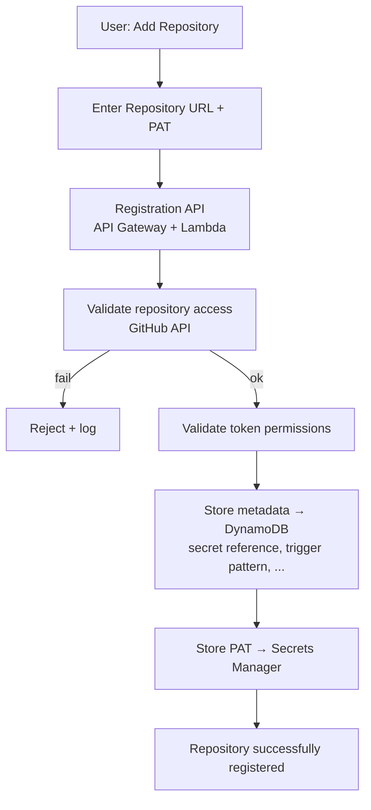
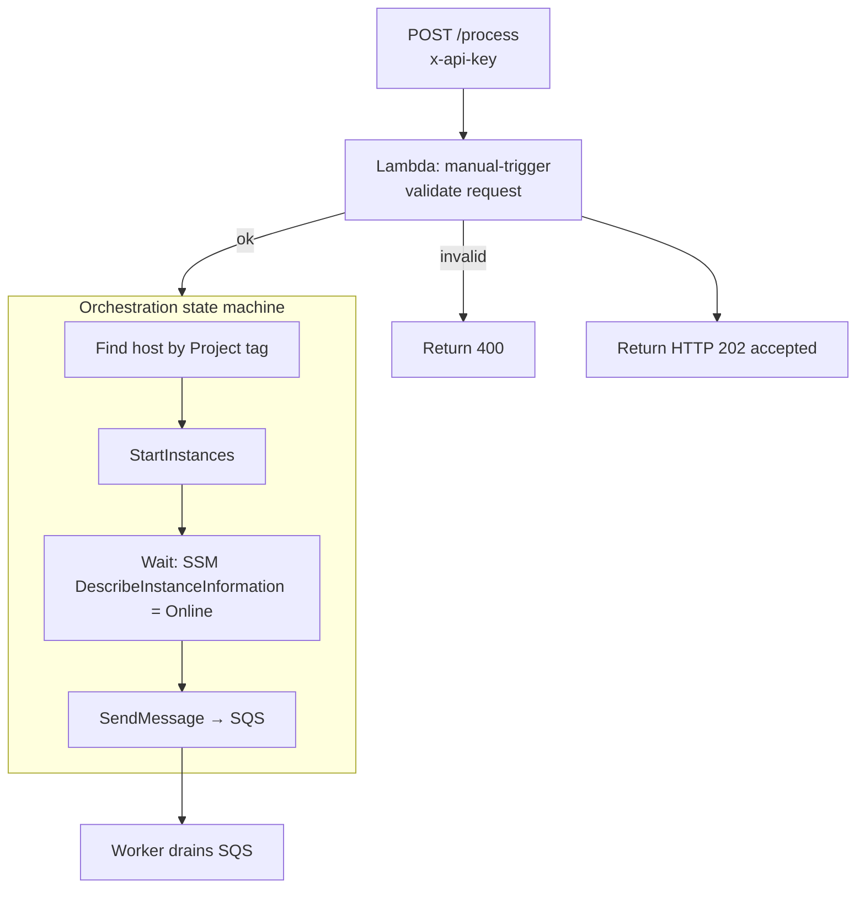
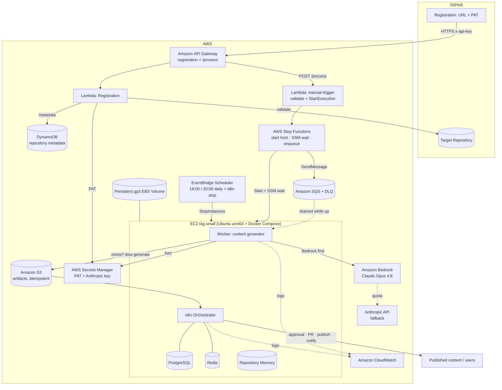
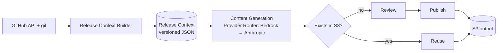
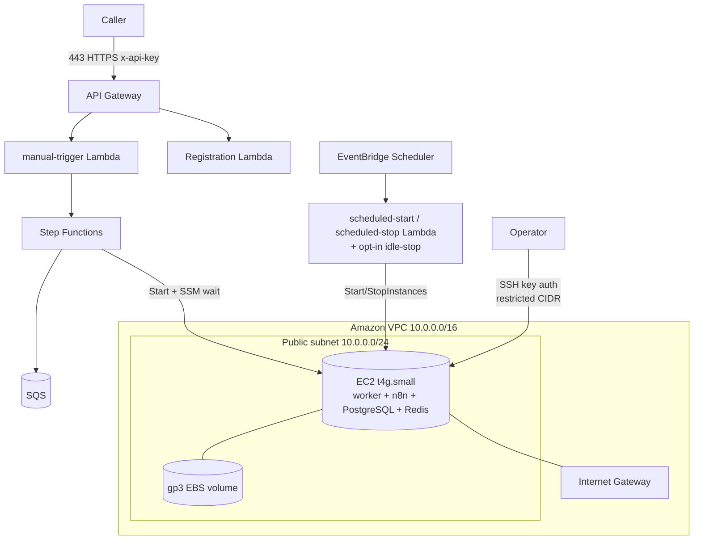
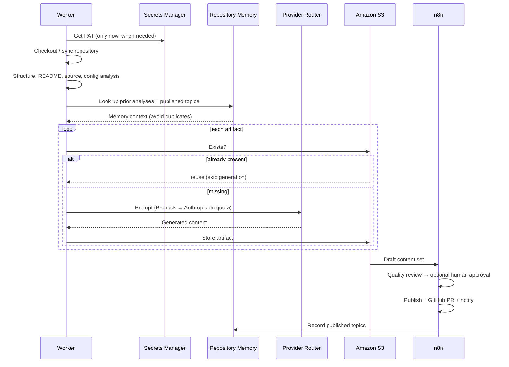
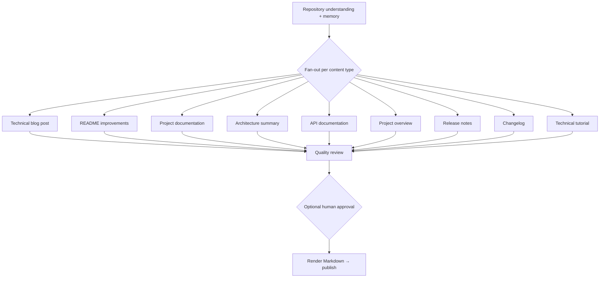
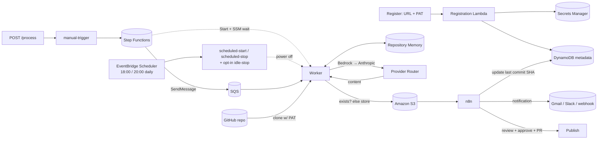

# Architecture

This document describes the architecture of the **GitHub AI Blog Generator**: the design principles, **repository registration (MVP)**, the **`POST /process` → Step Functions** trigger path, the AWS deployment topology, the analysis and generation pipeline, content generation, data flow, and storage.

Related: [Requirements](./requirements.md) · [Infrastructure](./infrastructure.md) · [Workflows](./workflows.md) · [Cost Optimisation](./cost-optimization.md) · [Security](./security.md) · [AI Provider Router](./hybrid-ai-routing.md).

---

## 1. Design Principles

- **Simple MVP onboarding** — users connect a repository with its URL and a **GitHub Personal Access Token (PAT)**; the PAT is stored in **AWS Secrets Manager** and only a reference is kept in the metadata store. GitHub App authentication is a future enhancement.
- **On-demand, opt-in generation** — a run happens **only** when the authenticated **`POST /process`** endpoint is called (naming a repository, optionally a release). Nothing runs on repository changes.
- **One trigger, one pipeline** — `POST /process` starts an **AWS Step Functions** execution; future sources (CLI, Slack, cron, release webhooks) can start the same execution, so the downstream pipeline is identical regardless of how it was triggered.
- **Managed Claude inference** — every artifact is generated through the **AI Provider Router**: **Amazon Bedrock (Claude Opus 4.8)** first, with automatic fallback to the **Anthropic API** on a quota/throttle error. No local model, no GPU. See [AI Provider Router](./hybrid-ai-routing.md).
- **Never regenerate** — before generating an artifact the worker checks **Amazon S3**; existing Markdown is reused, never rebuilt, so a re-run spends no tokens on content that already exists.
- **On-demand compute** — a small **On-Demand t4g.small EC2 instance** is started by the state machine and stopped by a fixed daily window + opt-in idle-stop; compute cost is bounded and predictable.
- **Durable buffering** — the state machine hands the job to **Amazon SQS** so nothing is lost while the instance boots.
- **Persistent state, ephemeral compute** — n8n + PostgreSQL state and **Repository Memory** live on a persistent **gp3 EBS volume**.
- **Secure by default** — least-privilege IAM, secrets in Secrets Manager (never logged), API-key-gated endpoints, encryption everywhere.
- **Everything as code** — infrastructure is AWS CloudFormation; workflows are versioned n8n JSON; services run via Docker Compose.

---

## 2. Repository Registration (MVP)

Onboarding connects a repository using a **GitHub PAT**. It validates access, stores metadata, and stores the PAT securely — all before any content is ever generated.

**What the PAT is used for:** accessing repository contents, reading repository metadata, and opening pull requests. (GitHub webhook ingress has been removed; registration no longer creates a GitHub webhook.)

**Where things are stored:**

| Data | Store | Notes |
| --- | --- | --- |
| GitHub PAT | **AWS Secrets Manager** | Never in plain text, source, config, env vars, or the database |
| Repository metadata | **Amazon DynamoDB** | Repository ID, owner, name, URL, default branch, **trigger pattern**, enabled status, **secret reference (ARN)**, last processed commit SHA, registration timestamp |

The metadata store holds only a **reference** to the secret — never the PAT itself. The PAT is retrieved **only when required** (clone, pull request), under least-privilege IAM ([Security → Credentials](./security.md#2-github-pat--secret-storage), [Requirements §12–§14](./requirements.md#12-repository-registration-requirements-mvp)).

> **GitHub App authentication is a future enhancement, not part of the MVP** ([Roadmap](./roadmap.md)).

---

## 3. The `POST /process` Trigger → Step Functions

A run always starts with an authenticated request to `POST /process`. The manual-trigger Lambda validates it and starts a **Step Functions** execution, which owns the compute-host lifecycle and the job hand-off.

- The request names the repository and, optionally, a `releaseTag` (release-suite path) or nothing (repository path).
- The state machine is **idempotent to instance state**: `StartInstances` is a no-op if the host is already running, and the SSM wait loop tolerates a not-yet-registered instance.
- Instance power-**off** stays with the scheduler stack (fixed window / idle-stop), not the state machine.

See [Manual Trigger](./manual-trigger.md) and [Cost Optimisation](./cost-optimization.md).

---

## 4. High-Level Architecture

**Component responsibilities**

| Component | Responsibility |
| --- | --- |
| Registration API (API Gateway + Lambda) | Validate repo access + token permissions, store metadata (DynamoDB) and the PAT (Secrets Manager) |
| AWS Secrets Manager | Shared secret holding all repos' PATs (JSON keyed by owner/name) + the Anthropic API key; retrieved only when needed |
| Amazon DynamoDB | Repository metadata (secret reference, trigger pattern, …) — **never the PAT** |
| API Gateway | HTTPS ingress for registration + `/process` + `/release-context` (all API-key gated) |
| manual-trigger (Lambda) | Validate the `POST /process` request and start a Step Functions execution. **No analysis or inference** |
| AWS Step Functions | Resolve the host by tag, start it, wait for SSM `Online`, then enqueue the job onto SQS |
| Amazon SQS | Durable buffer between the state machine and the worker; DLQ |
| EventBridge Scheduler | Authority for instance power-off — the daily window + opt-in idle-stop |
| scheduled-start / scheduled-stop (Lambda) | Start/stop the On-Demand instance on the schedule (idempotent) |
| idle-stop (Lambda, opt-in) | Stop the instance after sustained idleness (CPU/network + n8n checks) — see [scheduling](./scheduling.md) |
| EC2 On-Demand Instance (t4g.small) | Host running the worker + n8n + PostgreSQL + Redis via Docker Compose |
| Worker (`cmd/worker`) | Drain SQS, clone + analyse the repo, generate via the Provider Router, store to S3 (skipping existing artifacts) |
| AI Provider Router (`internal/airouter`) | Bedrock (Claude Opus 4.8) primary → Anthropic API fallback on quota |
| Amazon S3 | Generated artifacts; the idempotency check reuses existing Markdown |
| Repository Memory | Per-repo continuity and topic de-duplication |
| n8n | Human approval, GitHub PRs, publishing, and notifications |
| Release Context API (Lambda: `release-context`) | Build and persist the structured Release Context (`POST /release-context`) |
| Release Context Builder (`internal/releasecontext`) | Analyse repo, release, commits, changed files, docs, CloudFormation, and Mermaid into a versioned, AI-ready Release Context |
| Content Generation (`internal/releasegen`) | Generate a long-form blog plus release summary, social, and SEO variants from a Release Context via the Provider Router |

---

### Content Intelligence & Generation (Milestones 2–3)

Beyond the trigger, the platform turns a repository + release into
publication-ready content. This is **Content Intelligence** (analysis) feeding
**Content Generation** (writing):

- The **Release Context** is the single, versioned source of truth
  (`schemaVersion 2.0.0`) — what changed, how it was implemented, why it
  matters, and how it fits the architecture. It is built by pure, decoupled
  analyzers behind a `Sources` port, so it is reusable from a Lambda, the worker,
  or a CLI.
- **Generation** is decoupled by a `Model` port (the Provider Router), grounded
  strictly in the context, and produces a long-form blog post (with SEO front
  matter and accurate embedded Mermaid) plus other formats.
- On a **release run**, the worker runs this end to end automatically; reads use
  the repository's registered PAT. See
  [Release Context](./release-context.md) and [Blog Generation](./blog-generation.md).

---

## 5. manual-trigger Responsibilities

The manual-trigger Lambda is intentionally **lightweight** so it returns to the caller in milliseconds. It is limited to:

1. **Validate** the JSON request (owner, repository, optional `releaseTag`).
2. **Start a Step Functions execution** whose input is the job the worker consumes.
3. Return **HTTP 202** with the request id.

The Lambda **must not** clone repositories, perform analysis, invoke AI models, start the instance itself, or **retrieve/log the PAT** — the state machine owns the compute-host lifecycle and the worker owns generation.

---

## 6. AWS Deployment Topology

The front door (API Gateway + Lambda + Step Functions + SQS + Secrets Manager + DynamoDB) is fully serverless and **always available even when the EC2 instance is stopped**. The compute host runs in a **public subnet**; inbound access is tightly restricted.

- **Ingress:** callers reach the platform through **API Gateway** (managed TLS, API-key gated). The instance's inbound is limited to **SSH (22) from operator IPs**; the **n8n port is never publicly exposed** (SSH tunnel only). SSM (via the instance role) provides the readiness signal, not an inbound port.
- **Egress:** the **Internet Gateway** provides outbound access for cloning, image pulls, and Bedrock/Anthropic API calls.

---

## 7. Analysis & Generation Pipeline

Once the instance is up, the **worker** drains SQS, clones the repository (retrieving the PAT from Secrets Manager only now), consults **Repository Memory**, and generates each artifact through the **Provider Router** — reusing anything already in S3. **n8n** then reviews, approves, publishes, and notifies.

**Optional human approval** (`REQUIRE_HUMAN_APPROVAL`) pauses before publishing for a human decision.

---

## 8. Content Generation

Each run can produce a bundle of assets rather than a single document.

All output is clean, portable **GitHub-flavoured Markdown**.

---

## 9. Data Flow

---

## 10. Storage Architecture

| Store | Contents | Notes |
| --- | --- | --- |
| **AWS Secrets Manager** | Shared secret (all repos' PATs, keyed by owner/name) + the Anthropic API key | Encrypted; retrieved only when needed; **never** in the database or logs |
| **Amazon DynamoDB** | Repository metadata (incl. secret reference) | Encrypted at rest; **never** stores the PAT |
| **Amazon S3** | Generated artifacts (blog, social, video, SEO, …) | Idempotent — the worker reuses existing Markdown instead of regenerating |
| **gp3 EBS volume** | n8n + PostgreSQL state, **Repository Memory**, work dirs | Persistent across start/stop; encrypted |
| Repository clones | Working copy during a run | Transient — discarded after the run |
| **Amazon SQS** | Buffered jobs + DLQ | Durable; retention up to 14 days |

Persisting n8n/PostgreSQL state and Repository Memory on EBS makes the start/stop cost model viable; keeping PATs and the Anthropic key in Secrets Manager (with only references in DynamoDB) keeps credentials isolated and least-privilege. Generated Markdown is written to S3, where the idempotency check reuses it on re-runs.
