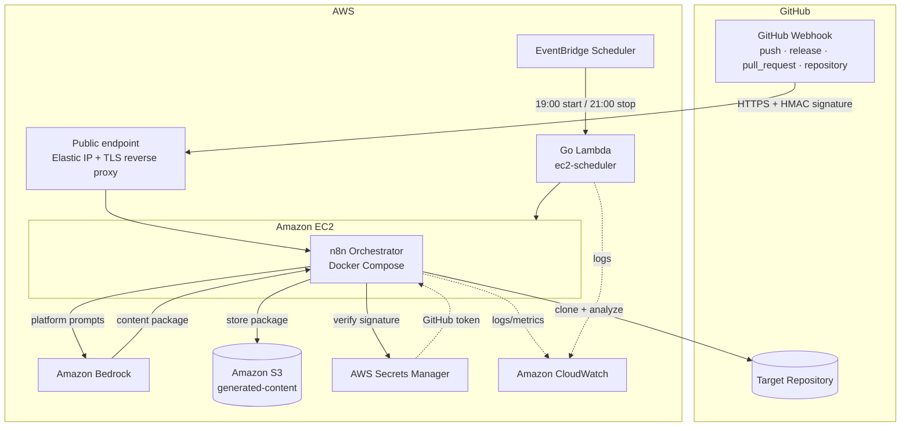
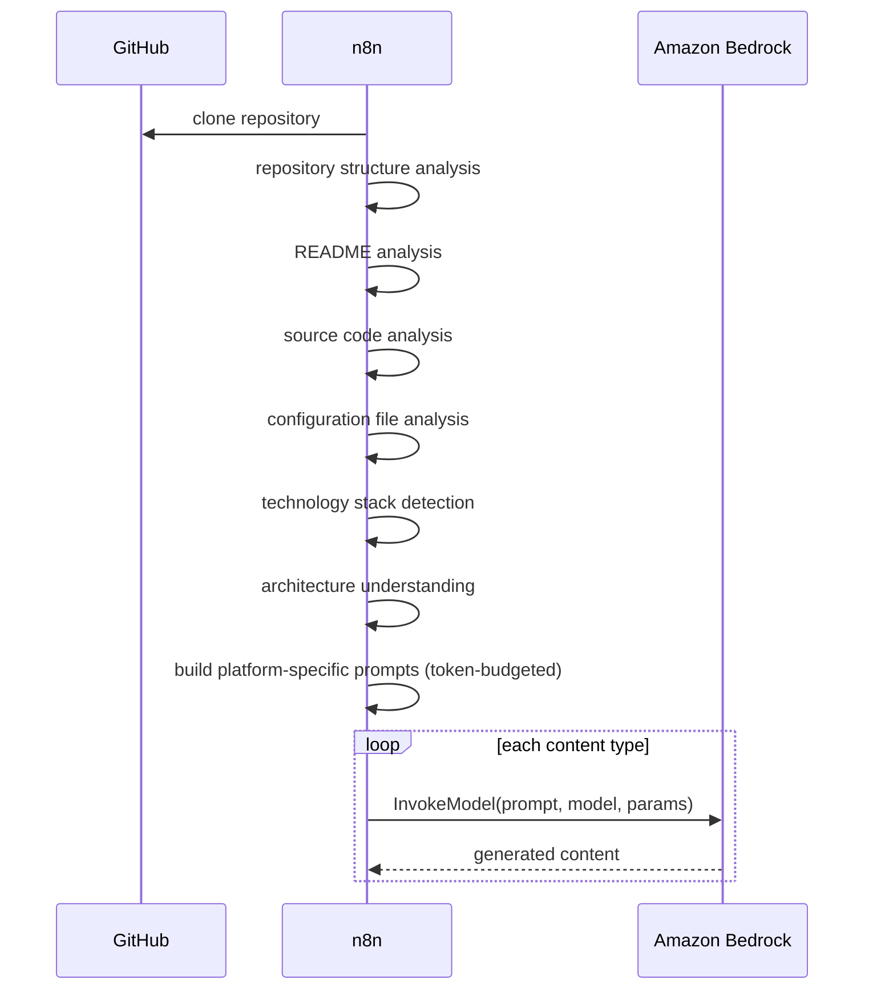
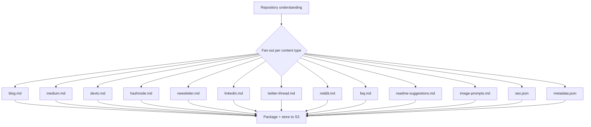
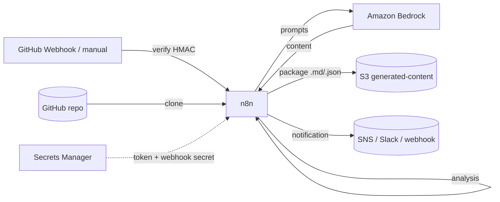
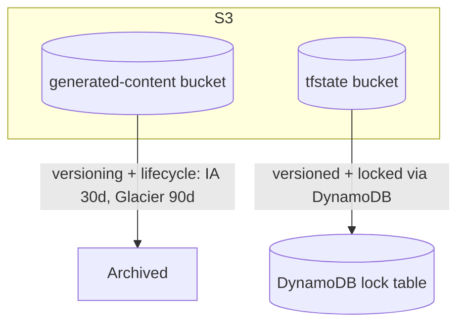

# Architecture

This document describes the architecture of the **AI GitHub Repository Blog Generator**: the high-level design, AWS deployment topology, the analysis and AI workflows, content-package generation, data flow, and storage.

Related: [Requirements](./requirements.md) · [Infrastructure](./infrastructure.md) · [Workflows](./workflows.md).

---

## 1. Design Principles

- **Orchestration-first** — n8n owns the pipeline: cloning, analysis, prompt building, Bedrock calls, packaging, retries, and branching.
- **Managed services for durability & scale** — Amazon Bedrock, S3, Secrets Manager, and CloudWatch provide the heavy lifting.
- **Webhook-driven** — GitHub Webhooks (and manual triggers) start runs; deliveries are signature-verified before processing.
- **Everything as code** — all infrastructure is Terraform; all workflows are versioned JSON.
- **Cost-aware** — the only always-on cost driver (the EC2 n8n host) is started/stopped on a schedule by a small Go Lambda.
- **Least privilege & encryption everywhere** — each component gets only the permissions it needs.

---

## 2. High-Level Architecture



**Component responsibilities**

| Component | Responsibility |
| --- | --- |
| GitHub Webhook | Primary trigger — delivers repository events over HTTPS |
| Public endpoint (Elastic IP + TLS) | Terminates TLS and forwards the webhook path to n8n |
| EventBridge Scheduler | Fires the EC2 start/stop schedule |
| `ec2-scheduler` (Go Lambda) | Starts/stops the EC2 host on schedule |
| `ec2-scheduler` (Go Lambda) | Starts/stops the EC2 host on schedule |
| n8n (on EC2) | Validates webhooks, clones, analyzes, builds prompts, invokes Bedrock, packages, stores, notifies |
| Amazon Bedrock | Generates each content type in the package |
| Amazon S3 | Stores the versioned, dated content package |
| Secrets Manager | Stores the GitHub token and webhook secret |
| CloudWatch | Central logs, metrics, dashboards, alarms |

---

## 3. AWS Architecture (Deployment Topology)

Because GitHub Webhooks must reach the platform, the n8n host exposes an **inbound HTTPS endpoint**. It runs in a **public subnet** with an **Elastic IP**; a TLS reverse proxy terminates HTTPS and forwards only the webhook path to n8n. The **management UI is never publicly exposed** — admin access is via SSM.

```mermaid
flowchart TB
    GH[GitHub Webhook] -->|443 HTTPS| IGW
    subgraph VPC["Amazon VPC 10.0.0.0/16"]
        IGW[Internet Gateway]
        subgraph Public["Public subnet 10.0.0.0/24"]
            EC2[(EC2: n8n + TLS proxy<br/>Elastic IP)]
        end
        subgraph Private["Private subnet 10.0.10.0/24"]
            RES[Reserved for internal/<br/>optional components]
        end
        VPCE["VPC Endpoints:<br/>S3 · Secrets Manager ·<br/>Bedrock · CloudWatch Logs · SSM"]
    end

    EC2 --- IGW
    EC2 -. private .-> VPCE
    VPCE -. .-> BR[Amazon Bedrock]
    VPCE -. .-> S3[(Amazon S3)]
```

- **Inbound:** only **443** is open, and the **security group restricts it to GitHub's published webhook IP ranges** ([Infrastructure §7](./infrastructure.md#7-security-groups)). Administrative access is via **SSM Session Manager** — no public SSH, no public n8n UI.
- **Outbound & internal:** traffic to **S3, Secrets Manager, Bedrock, CloudWatch, and SSM** goes through **VPC endpoints** to keep it on the AWS network; general egress (GitHub clone, image pulls) uses the Internet Gateway.
- Private subnets remain part of the VPC for defense-in-depth and future internal components.

---

## 4. Analysis & AI Workflow

n8n converts a repository into a set of generation-ready prompts and invokes Amazon Bedrock for each content type.



**Prompt assembly** combines repository structure, README, source excerpts, configuration, and detected technologies, formatted against per-platform templates and truncated deterministically to respect the model context window (see [AI Requirements](./requirements.md#4-ai-requirements)).

---

## 5. Content-Package Generation

Rather than a single article, each run produces a **content package** — many platform-specific assets.



Any failure on a content type routes to the error/notification path without overwriting an existing package ([FR-6.3](./requirements.md#16-error-handling--retries)). See [Content Generation](./requirements.md#12-content-generation) for the full asset list.

---

## 6. Data Flow



**Stages and payloads**

| Stage | Input | Output |
| --- | --- | --- |
| Trigger | GitHub Webhook (verified) / manual | run request `{ repo, event, ref }` |
| Clone | repo URL | local working copy on EC2 |
| Analyze | working copy | structured repository understanding |
| Generate | prompts + params | per-type content |
| Package & store | content set | versioned package in S3 |
| Notify | run result | notification message |

---

## 7. Storage Architecture

One S3 bucket holds generated content; a separate bucket holds Terraform state. Repository clones are transient and live on the EC2 host's ephemeral disk, not in S3.



| Bucket | Contents | Versioning | Lifecycle |
| --- | --- | --- | --- |
| `generated-content` | Generated content packages | **On** | IA at 30d, Glacier at 90d |
| `tfstate` | Terraform remote state | **On** | Retain; DynamoDB lock table |

**Key scheme** for a package:

```text
generated-content/<repository-name>/<YYYY-MM-DD>/<asset>
```

All buckets enforce encryption at rest, block public access, and require TLS. See [Storage Requirements](./requirements.md#8-storage-requirements), [Infrastructure](./infrastructure.md) for the Terraform modules, and [Cost Optimization](./cost-optimization.md) for lifecycle rationale.
