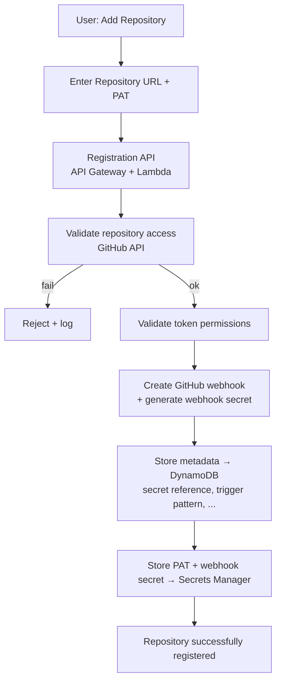
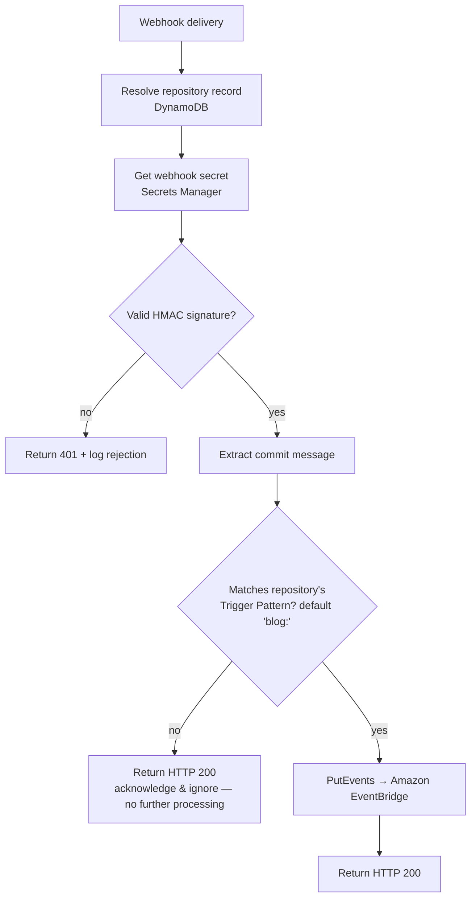
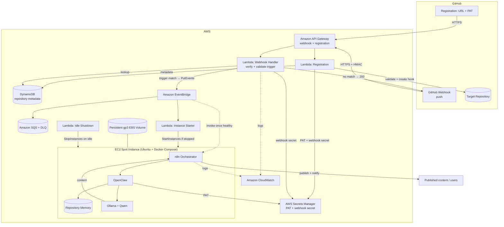
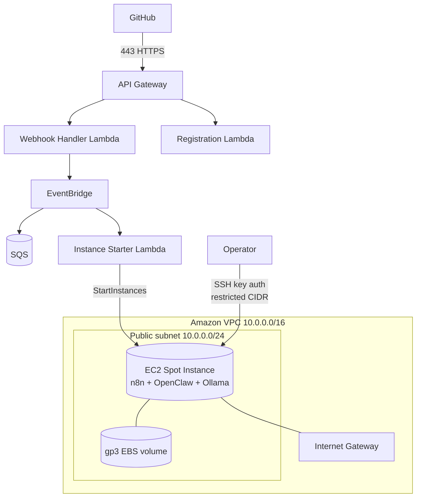
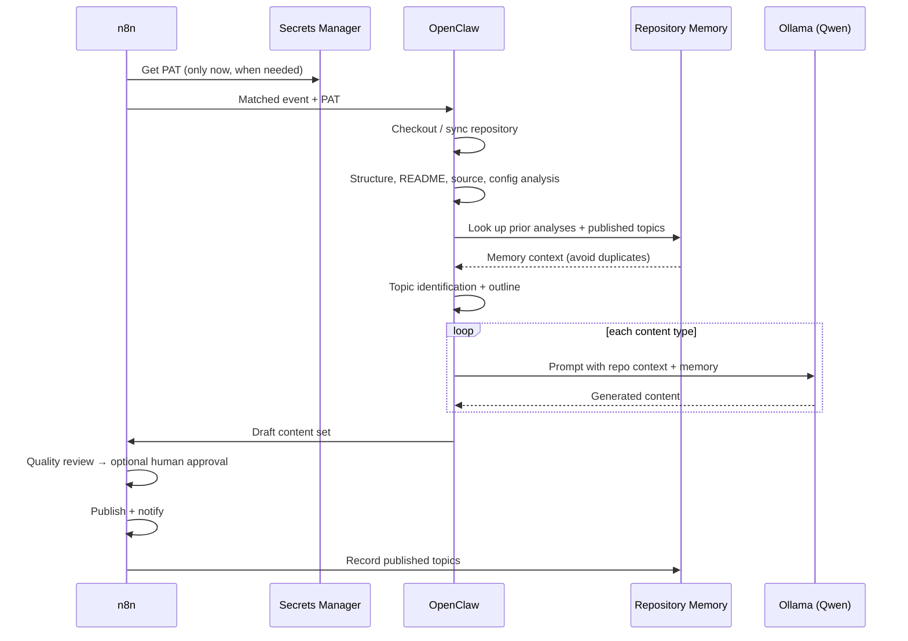
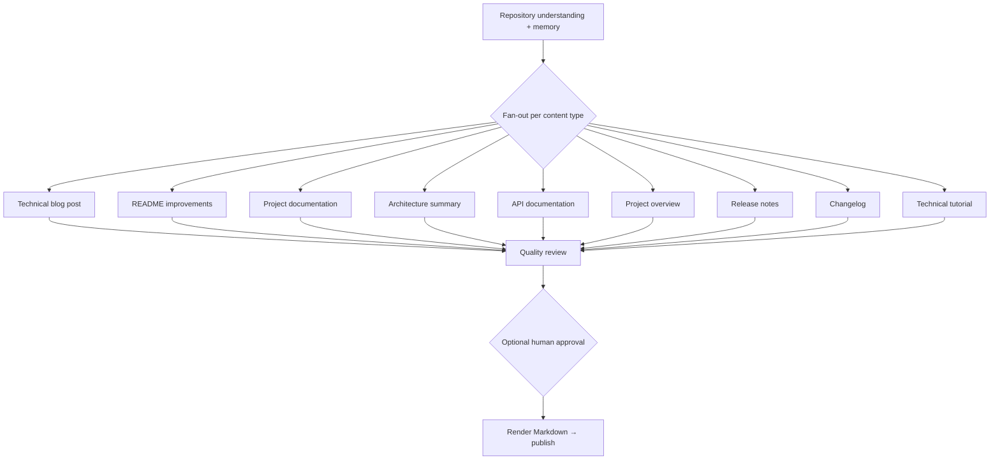
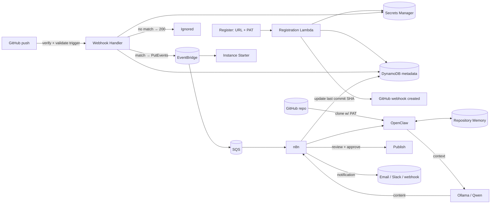

# Architecture

This document describes the architecture of the **GitHub AI Blog Generator**: the design principles, **repository registration (MVP)**, the **commit-message trigger gate**, the event-driven trigger path, the AWS deployment topology, the analysis and local-inference pipeline, content generation, data flow, and storage.

Related: [Requirements](./requirements.md) · [Infrastructure](./infrastructure.md) · [Workflows](./workflows.md) · [Cost Optimisation](./cost-optimization.md) · [Security](./security.md).

---

## 1. Design Principles

- **Simple MVP onboarding** — users connect a repository with its URL and a **GitHub Personal Access Token (PAT)**; the PAT is stored in **AWS Secrets Manager** and only a reference is kept in the metadata store. GitHub App authentication is a future enhancement.
- **Opt-in generation** — a webhook is received on every push, but a run happens **only** when the commit message matches the repository's publishing trigger (default `blog:`). All other events are acknowledged and ignored.
- **Event-driven** — matched events are published to **Amazon EventBridge**, which starts compute and delivers the run. Nothing runs speculatively.
- **Self-hosted inference** — all AI runs locally via **Ollama** with a local **Qwen** model. No Amazon Bedrock, OpenAI, Anthropic, or any paid inference API.
- **Pay only when you compute** — a cost-optimized **EC2 Spot Instance** starts on a matched event and stops after workflow completion / idle timeout.
- **Durable buffering** — every matched event is buffered in **Amazon SQS** so nothing is lost while the instance is stopped or booting.
- **Persistent state, ephemeral compute** — models, n8n state, and **Repository Memory** live on a persistent **gp3 EBS volume**.
- **Secure by default** — least-privilege IAM, secrets in Secrets Manager (never logged), HMAC-verified webhooks, encryption everywhere.
- **Everything as code** — infrastructure is AWS CloudFormation; workflows are versioned n8n JSON; services run via Docker Compose.

---

## 2. Repository Registration (MVP)

Onboarding connects a repository using a **GitHub PAT**. It validates access, creates the webhook, stores metadata, and stores the PAT securely — all before any content is ever generated.

**What the PAT is used for:** accessing repository contents, registering the GitHub webhook, reading repository metadata, and (future) repository synchronisation.

**Where things are stored:**

| Data | Store | Notes |
| --- | --- | --- |
| GitHub PAT | **AWS Secrets Manager** | Never in plain text, source, config, env vars, or the database |
| Webhook signing secret | **AWS Secrets Manager** | Per repository |
| Repository metadata | **Amazon DynamoDB** | Repository ID, owner, name, URL, default branch, webhook ID, **trigger pattern**, enabled status, **secret reference (ARN)**, last processed commit SHA, registration timestamp |

The metadata store holds only a **reference** to the secret — never the PAT itself. The PAT is retrieved **only when required** (clone, webhook management), under least-privilege IAM ([Security → Credentials](./security.md#2-github-pat--secret-storage), [Requirements §12–§14](./requirements.md#12-repository-registration-requirements-mvp)).

> **GitHub App authentication is a future enhancement, not part of the MVP** ([Roadmap](./roadmap.md)).

---

## 3. Commit-Message Trigger Gate

The trigger gate lives in the **Webhook Handler Lambda** and runs before any compute or AI is invoked.

- The trigger pattern is **per repository** (stored in metadata, default `blog:`). Custom patterns (`[blog]`, regex) are [planned](./roadmap.md).
- A non-matching event is a **terminal success**: the handler returns `200` and does nothing else.
- Only a **matching** event is published to EventBridge.

See [Cost Optimisation → Trigger Pre-Filtering](./cost-optimization.md#2-trigger-pre-filtering) and [Requirements → Publishing Trigger](./requirements.md#2-publishing-trigger-requirements).

---

## 4. High-Level Architecture

**Component responsibilities**

| Component | Responsibility |
| --- | --- |
| Registration API (API Gateway + Lambda) | Validate repo access + token permissions, create webhook, store metadata (DynamoDB) and PAT/webhook secret (Secrets Manager) |
| AWS Secrets Manager | Securely store PATs and per-repo webhook secrets; retrieved only when needed |
| Amazon DynamoDB | Repository metadata (secret reference, trigger pattern, webhook ID, …) — **never the PAT** |
| API Gateway | Public HTTPS ingress for webhook + registration |
| Webhook Handler (Lambda) | Resolve repo metadata, verify signature, **validate trigger**, publish matched events. **No analysis or inference; never fetches the PAT** |
| Amazon EventBridge | Route matched events; start compute; deliver the run |
| Amazon SQS | Durable buffer so no matched event is lost during cold start; DLQ |
| Instance Starter (Lambda) | Start the EC2 Spot Instance if stopped |
| EC2 Spot Instance | Host running n8n, OpenClaw, Ollama via Docker Compose |
| OpenClaw | Clone (using the PAT) and analyse the repository |
| Repository Memory | Per-repo continuity and topic de-duplication |
| Ollama + Qwen | Local LLM inference |
| Idle Shutdown (Lambda) | Stop the instance after workflow completion / idle timeout |

---

## 5. Webhook Handler Responsibilities

The handler is intentionally **lightweight** so it returns to GitHub in milliseconds. It is limited to:

1. **Resolve the repository record** (metadata) for the delivery.
2. Retrieve the repository's **webhook secret** and verify the signature (HMAC SHA-256, constant-time).
3. Parse the payload and extract commit information (message, ref, author).
4. **Validate the commit message against the repository's Trigger Pattern.**
5. **Publish an event to EventBridge only when the trigger matches.**
6. Return a successful HTTP response to GitHub as quickly as possible.

The handler **must not** clone repositories, perform analysis, access Repository Memory, invoke AI models, or **retrieve/log the PAT** ([Requirements → Webhook Handler](./requirements.md#3-webhook-handler-requirements)).

---

## 6. AWS Deployment Topology

The front door (API Gateway + Lambda + EventBridge + SQS + Secrets Manager + DynamoDB) is fully serverless and **always available even when the EC2 instance is stopped**. The compute host runs in a **public subnet**; inbound access is tightly restricted.

- **Ingress:** GitHub reaches the platform through **API Gateway** (managed TLS). The instance's inbound is limited to **SSH (22) from operator IPs**; the **n8n and Ollama ports are never publicly exposed**.
- **Egress:** the **Internet Gateway** provides outbound access for cloning, image pulls, and model downloads.

---

## 7. Analysis & Generation Pipeline

Once the instance is up and n8n is invoked, it runs the pipeline. **OpenClaw** clones the repository (retrieving the PAT from Secrets Manager only now), **Repository Memory** provides continuity, and **Ollama** runs the local model.

**Optional human approval** (`REQUIRE_HUMAN_APPROVAL`) pauses before publishing for a human decision.

---

## 8. Content Generation

Each run can produce a bundle of assets rather than a single document.

All output is clean, portable **GitHub-flavoured Markdown**.

---

## 9. Data Flow

---

## 10. Storage Architecture

| Store | Contents | Notes |
| --- | --- | --- |
| **AWS Secrets Manager** | GitHub PATs, per-repo webhook secrets | Encrypted; retrieved only when needed; **never** in the database or logs |
| **Amazon DynamoDB** | Repository metadata (incl. secret reference) | Encrypted at rest; **never** stores the PAT |
| **gp3 EBS volume** | Ollama models, n8n state, **Repository Memory**, workflows | Persistent across start/stop; encrypted |
| Repository clones | Working copy during a run | Transient — discarded after the run |
| **Amazon SQS** | Buffered matched events + DLQ | Durable; retention up to 14 days |

Persisting models and Repository Memory on EBS makes the start/stop cost model viable; keeping PATs in Secrets Manager (with only references in DynamoDB) keeps credentials isolated and least-privilege. Published Markdown is written to whatever destination the deployment configures.
