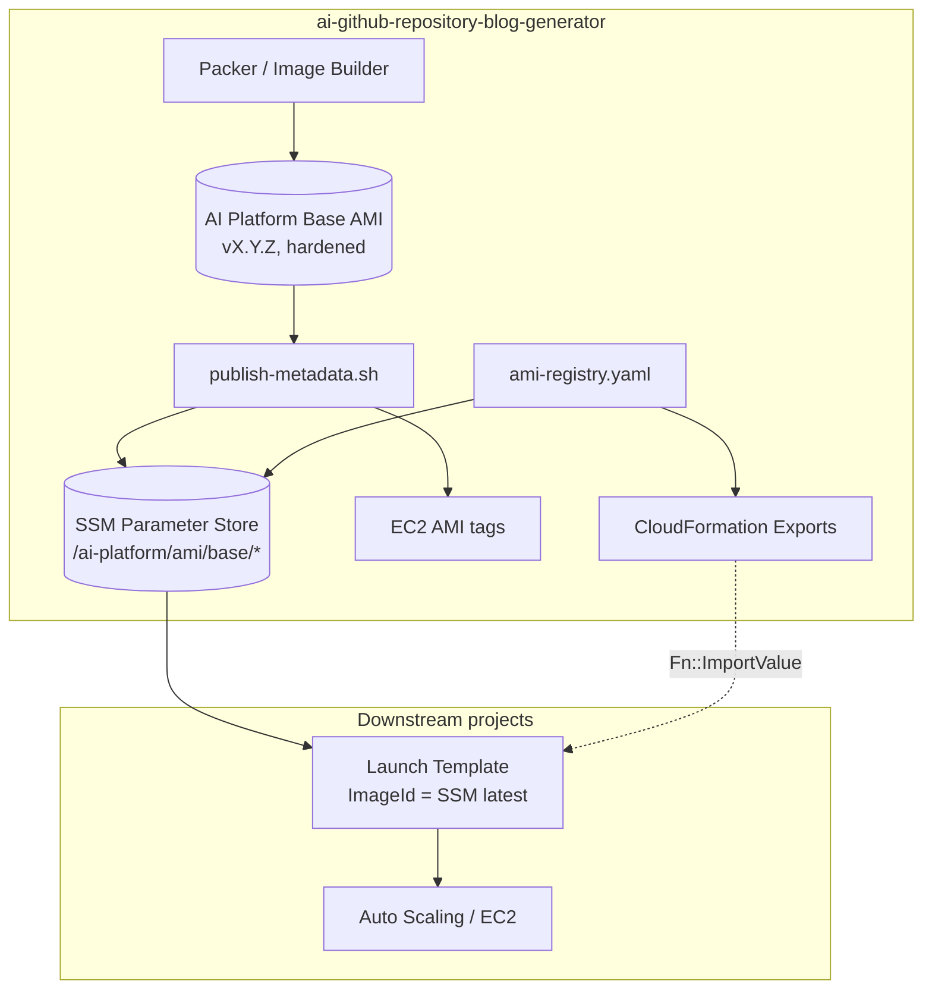
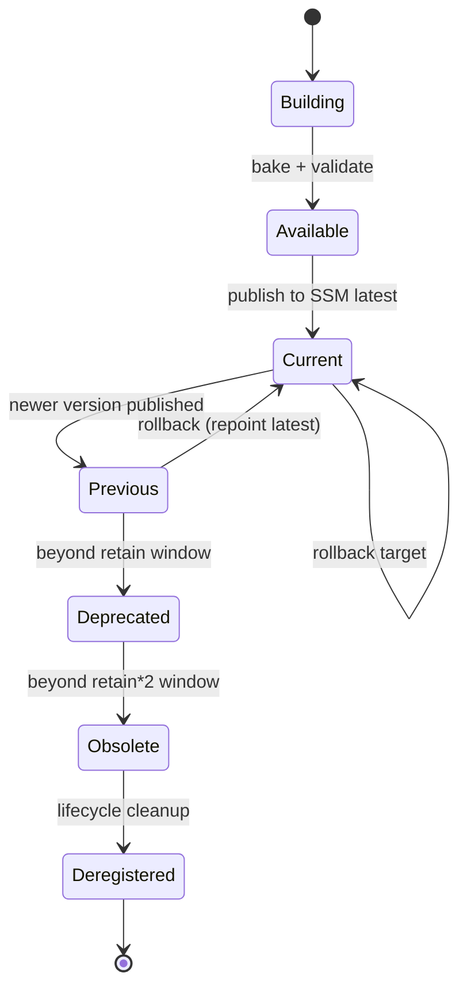
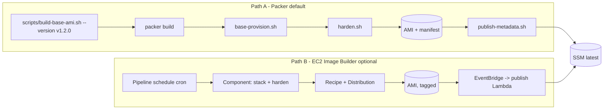
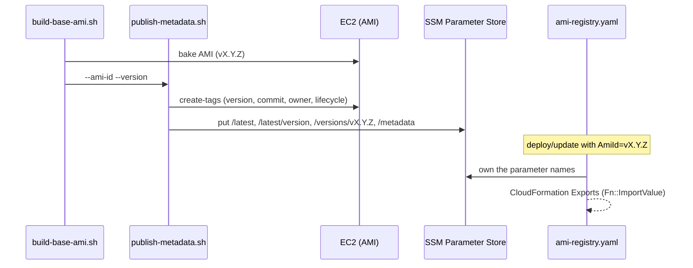
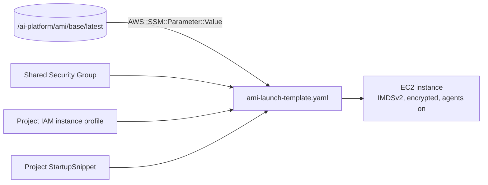
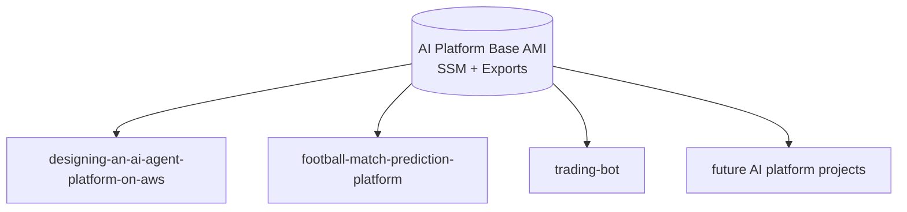
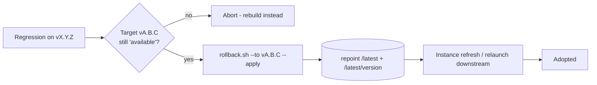

# Shared Baked AMI Management & Image Lifecycle (Milestone 20)

This repository owns the lifecycle of the **AI Platform Base AMI** — a reusable,
versioned, hardened golden image shared across multiple CloudFormation stacks and
AWS projects. Instead of every project baking and maintaining its own image, they
consume this one artifact, improving deployment consistency, cutting EC2 startup
time, simplifying maintenance, and reducing cost and duplication.

Downstream consumers: `designing-an-ai-agent-platform-on-aws`,
`football-match-prediction-platform`, `trading-bot`, and future AI platform
projects.

Built to the **AWS Well-Architected Framework** — Operational Excellence,
Security, Reliability, Performance Efficiency, and Cost Optimization.

Related: [Infrastructure](./infrastructure.md) · [Deployment](./deployment.md) · [Security](./security.md) · [Monitoring](./monitoring.md).

---

## 1. Architecture overview

The base AMI is **project-agnostic**: it carries everything common to AI
workloads and nothing specific to any one project. Projects layer their own
model, binary, and config at launch (UserData) or in a thin child AMI.

| Layer | Contents | Where |
|-------|----------|-------|
| **Golden base AMI** (this repo) | hardened Ubuntu 22.04, Docker, Ollama, FFmpeg, Git, Go, Python, CloudWatch + SSM agents, startup hook, log config | `packer/base/ai-platform-base.pkr.hcl` |
| **Publishing surface** | SSM Parameter Store + CloudFormation Exports | `infrastructure/ami-registry.yaml` |
| **Consumption** | reusable Launch Template resolving the AMI from SSM | `infrastructure/ami-launch-template.yaml` |
| **Automation** | optional Image Builder pipeline; scheduled lifecycle cleanup | `ami-image-builder.yaml`, `ami-lifecycle.yaml` |



## 2. What's in the image (startup optimization)

Pre-installing the heavy, network-bound dependencies at bake time is what makes
downstream instances boot in seconds instead of minutes:

`hardened Linux` · `Docker` · `Ollama` (runtime; models pulled per-project) ·
`FFmpeg` · `Git` · `Go` · `Python 3` · `CloudWatch Agent` · `SSM Agent` ·
`AWS CLI v2` · a first-boot `startup` hook (`/opt/ai-platform/startup.sh` +
`startup.d/`) · CloudWatch log config · a queryable manifest at
`/etc/ai-platform/ami-metadata.json`.

Provisioning is split into [`scripts/ami/base-provision.sh`](../scripts/ami/base-provision.sh)
(software stack) and [`scripts/ami/harden.sh`](../scripts/ami/harden.sh) (OS
hardening), run in that order by Packer.

## 3. Hardened base image (Security pillar)

Applied at bake time so every launched instance inherits the baseline:

- **IMDSv2 only** — enforced on the build instance (`imds_support = v2.0`) and on
  every launch (`MetadataOptions.HttpTokens: required`, hop limit 1).
- **SSH hardening** — key-only, no root login, no empty passwords, `MaxAuthTries 3`,
  idle timeouts, no X11/TCP forwarding (`/etc/ssh/sshd_config.d/90-hardening.conf`,
  validated with `sshd -t`).
- **Disabled unused services** — cups, avahi, bluetooth, rpcbind masked.
- **Automatic security updates** — `unattended-upgrades` for `-security` origins.
- **Audit logging** — `auditd` rules on sudoers, credentials, sshd, time changes.
- **Kernel/network sysctl hardening** + **secure filesystem permissions** +
  restrictive `umask 027` + login banner.
- **Least privilege** — the image carries no credentials; instances get scoped IAM
  roles at launch. Bake-time SSH keys and logs are scrubbed before capture.
- **Encrypted root volume** (gp3) on build and launch.
- **CloudWatch integration** — agent + base config baked, log groups
  `/ai-platform/base/*`.

## 4. Semantic versioning & metadata

Every AMI is versioned `vMAJOR.MINOR.PATCH` (e.g. `v1.0.0`, `v1.1.0`, `v2.0.0`).
`scripts/build-base-ami.sh` **requires** a SemVer and refuses anything else.

Published for each image (SSM + AMI tags + the on-box manifest):

| Field | Example |
|-------|---------|
| AMI ID | `ami-0abc123…` |
| Version | `v1.2.0` |
| Build Date | `2026-07-21T…Z` |
| Base OS | `ubuntu-22.04` |
| Architecture | `x86_64` |
| Git Commit | `804151a` |
| Repository Release | `v0.16.0` |
| Owner / Lifecycle | `ai-github-repository-blog-generator` / `current` |

Version bump policy: **major** = breaking base change (OS upgrade, removed
tooling); **minor** = additive tooling; **patch** = security/patch rebuild.

## 5. AMI lifecycle



Retention (default, tunable): keep newest **N=3** as current/previous (rollback
headroom); **deprecate** ranks N+1..2N; **deregister + delete snapshots** beyond
2N. The live `latest` image is never touched. Enforced by
[`scripts/ami/lifecycle.sh`](../scripts/ami/lifecycle.sh) (dry-run by default) and
the scheduled `ami-lifecycle.yaml` Lambda.

## 6. Image build pipeline

Two supported paths — same hardened result:



- **Manual / CI build**: `scripts/build-base-ami.sh --version vX.Y.Z --publish`.
- **Automated build**: deploy `infrastructure/ami-image-builder.yaml` — a
  scheduled, serverless pipeline that builds, tags, distributes, and auto-publishes
  the new AMI id to SSM on completion.

## 7. Publishing workflow & metadata export



SSM parameters (the source of truth):

```
/ai-platform/ami/base/latest              -> ami-...    (current image id)
/ai-platform/ami/base/latest/version      -> v1.2.0
/ai-platform/ami/base/versions/v1.2.0     -> ami-...    (immutable, rollback target)
/ai-platform/ami/base/metadata            -> {json}
```

CloudFormation Exports (for `Fn::ImportValue` consumers):
`ai-platform-base-ami-id`, `ai-platform-base-ami-version`,
`ai-platform-base-ami-parameter`, `ai-platform-base-ami-arch`.

## 8. Launch Template integration



`infrastructure/ami-launch-template.yaml` resolves the AMI from SSM (never
hard-coded), enforces IMDSv2, encrypts the root volume, enables detailed
monitoring, and appends the project's startup snippet to the base hook. Downstream
stacks reference the exported Launch Template id or copy the template.

## 9. Downstream project consumption

Three interchangeable consumption paths — pick per project:

**A. SSM parameter (recommended)** — in the project's CloudFormation:

```yaml
Parameters:
  BaseAmi:
    Type: AWS::SSM::Parameter::Value<AWS::EC2::Image::Id>
    Default: /ai-platform/ami/base/latest
# ... LaunchTemplateData: { ImageId: !Ref BaseAmi, MetadataOptions: { HttpTokens: required } }
```

**B. CloudFormation Export** — `ImageId: !ImportValue ai-platform-base-ami-id`.

**C. Shared Launch Template** — reference `ai-platform-base-launch-template-id`.



Pin a project to a specific version by pointing at
`/ai-platform/ami/base/versions/vX.Y.Z` instead of `/latest`.

## 10. Rollback



Rollback is a **metadata operation** — [`scripts/ami/rollback.sh`](../scripts/ami/rollback.sh)
repoints `latest` at a previously published, still-registered version. No rebuild,
instant, reversible. It validates the target AMI is `available` before applying.
**Compatibility**: same-major rollbacks are always safe; crossing a major (e.g.
v2→v1) may require the consuming project to revert its launch config too.

**Downgrade procedure**: `rollback.sh --to vA.B.C` (dry-run) → review →
`--apply` → trigger a downstream ASG instance refresh → validate the SSM value and
a canary instance's `/etc/ai-platform/ami-metadata.json`.

## 11. Security patch / update strategy

- **Monthly rebuild** — Image Builder pipeline (or `build-base-ami.sh`) on a cron
  (`cron(0 6 1 * ? *)`), bumping the **patch** version; the baked
  `unattended-upgrades` keeps interim drift bounded.
- **Emergency / critical CVE** — out-of-band rebuild, patch bump, expedited
  publish; deprecate the vulnerable version immediately (`lifecycle.sh`).
- **Testing before publish** — the Packer/Image Builder `validate` phase asserts
  Docker/Ollama/FFmpeg/Python are present; a canary launch runs the base
  `health`/startup hook before repointing `latest`.
- **Version publishing** — every rebuild publishes a new immutable
  `/versions/vX.Y.Z` and only then moves `latest`.

## 12. Operational runbooks

**Cut a new base AMI**
```bash
scripts/build-base-ami.sh --version v1.3.0 --publish --region us-east-1
# then pin the registry stack to it (Exports for Fn::ImportValue consumers):
aws cloudformation deploy --template-file infrastructure/ami-registry.yaml \
  --stack-name ai-platform-ami-registry \
  --parameter-overrides AmiId=ami-0xxxx AmiVersion=v1.3.0
```

**Deploy the reusable Launch Template**
```bash
aws cloudformation deploy --template-file infrastructure/ami-launch-template.yaml \
  --stack-name ai-platform-base-lt \
  --parameter-overrides SecurityGroupId=sg-xxxx InstanceProfileArn=arn:aws:iam::...:instance-profile/...
```

**Run lifecycle cleanup** (preview, then enforce)
```bash
scripts/ami/lifecycle.sh --retain 3            # dry-run
scripts/ami/lifecycle.sh --retain 3 --apply    # enforce
```

**Roll back**
```bash
scripts/ami/rollback.sh --to v1.2.0            # dry-run
scripts/ami/rollback.sh --to v1.2.0 --apply
```

**Enable the automated pipeline + scheduled cleanup**
```bash
aws cloudformation deploy --template-file infrastructure/ami-image-builder.yaml --stack-name ai-platform-ami-builder --capabilities CAPABILITY_NAMED_IAM
aws cloudformation deploy --template-file infrastructure/ami-lifecycle.yaml   --stack-name ai-platform-ami-lifecycle --capabilities CAPABILITY_NAMED_IAM
```

## 13. Troubleshooting

| Symptom | Likely cause | Fix |
|---------|--------------|-----|
| Downstream stack launches an old AMI | consumer cached the SSM value / no instance refresh | trigger an ASG instance refresh; SSM resolves at launch, not continuously |
| `publish-metadata.sh` fails on `ssm put-parameter` | missing `ssm:PutParameter` permission | grant the CI/build role write to `/ai-platform/ami/base/*` |
| `rollback.sh` aborts: target not `available` | the version was deregistered by cleanup | roll forward / rebuild; keep `RetainCount` high enough |
| Instance can't reach IMDS | app uses IMDSv1 | update SDK/app to IMDSv2 (token) — hop limit is 1 |
| Image Builder pipeline fails in `validate` | a package install failed | check the SNS notification + build logs; re-run the pipeline |
| Snapshots left after deregister | image deregistered outside `lifecycle.sh` | run `lifecycle.sh --apply`; it deletes orphaned base-ami snapshots |
| Build instance blocked from metadata | IMDSv2 hop limit too low for containerized build | keep builds on the host, not nested containers |

## 14. Acceptance checklist

Reusable production AMIs ✓ · SemVer ✓ · metadata export ✓ · SSM + CloudFormation
Outputs publishing ✓ · Launch Templates ✓ · lifecycle management ✓ · rollback ✓ ·
minimized startup time ✓ · consistency across projects ✓ · reduced duplication ✓ ·
multi-repo consumption ✓ · Well-Architected ✓ · documented ✓ · diagrams ✓ ·
templates `cfn-lint`-clean & scripts `bash -n`-clean ✓.
