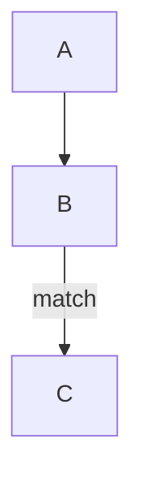

# Technical Blog Generation (Milestone 3)

Milestone 3 turns the structured **Release Context** ([Milestone 2](./release-context.md))
into a polished, long-form **technical blog post** — plus release summaries,
documentation, and social/SEO variants — via local inference.

Related: [Release Context](./release-context.md) · [Architecture](./architecture.md) · [Workflows](./workflows.md).

---

## 1. Design

The engine lives in [`internal/releasegen`](../internal/releasegen) and depends
only on a **`Model` port** (`Generate(ctx, prompt) (string, error)`), satisfied
by the **AI Provider Router** (**Amazon Bedrock** primary, **Anthropic API**
fallback) — so generation is decoupled from any specific LLM.

Blog generation is a **hybrid** of deterministic assembly and LLM prose, so the
result is both accurate and reliable:

| Part | Produced by | Why |
| --- | --- | --- |
| Title, meta description, tags (SEO front matter) | Deterministic, from `contentIntelligence` | Never hallucinated; meta clamped to ≤160 chars |
| Long-form article body | LLM, from a section-structured prompt | High-quality narrative |
| Mermaid architecture diagrams | Deterministic, from the context's parsed diagrams | Accurate — reconstructed from real edges, not invented |

The prompt is **strictly grounded**: it embeds a compact block rendered from the
context (repository, release, changelog, implementation, architecture,
technologies, content intelligence) and instructs the model to *"ground every
statement in the Release Context; if a detail is missing, say it was not
available rather than guessing."*

## 2. Article structure

The body follows a fixed long-form structure (1,500–2,500 words), including only
sections the context supports:

Introduction · Background and Context · What Was Implemented · Architecture and
Design · Implementation Details · Repository and Code Changes · Benefits and
Outcomes · How to Use or Extend the Feature · Conclusion.

## 3. Output

A complete, publication-ready Markdown document with YAML front matter for
Dev.to / Medium / a personal blog:

```markdown
---
title: "Inside widget v0.2.0: What Changed and Why It Matters"
description: "widget v0.2.0 delivers 4 analyzed changes (2 features, 1 fix) …"
tags: [go, aws-lambda, amazon-sqs, serverless, event-driven-architecture, release-notes]
---

# Inside widget v0.2.0: What Changed and Why It Matters

## Introduction
…

## Architecture and Design
…

## Architecture Diagrams

_flowchart diagram with 3 nodes and 2 relationships. (docs/architecture.md)_


```

Other formats (`release-summary`, `documentation`, `linkedin`, `youtube-shorts`,
`tiktok`, `seo-metadata`) are produced by `Generator.Generate` /
`Generator.GenerateAll`.

## 4. Running it

The `blog` CLI reads a Release Context JSON (from the `/release-context`
endpoint or S3) and generates content through the Provider Router (Anthropic locally) — the same
model that runs on the instance:

```bash
# Blog post to stdout
go run ./cmd/blog --context ctx.json

# To a file, choosing the model
go run ./cmd/blog --context ctx.json --out post.md --model claude-opus-4-8

# A LinkedIn post from a piped context
cat ctx.json | go run ./cmd/blog --format linkedin
```

Flags: `--context` (`-` = stdin), `--format`, `--model` (Anthropic model id, provider default when empty), `--out`, `--timeout`.

## 5. Status

**Implemented:** the `releasegen` engine (`Model` port, seven formats, grounded
prompts, `GenerateAll` error aggregation) and the dedicated long-form `Blog`
generator (SEO front matter, fixed section structure, accurate Mermaid
embedding). Unit-tested at 90%+ coverage with a fake model; the `blog` CLI runs
it through the Provider Router (Anthropic locally).

**Closing the loop:** [`internal/releasepipeline`](../internal/releasepipeline)
composes the Release Context Builder (M2), this generator (M3), and the
platform's existing **review → publish → notify** stages into one flow:

```
Request (owner, repo, releaseTag)
  → Builder.Build      → ReleaseContext        (Milestone 2)
  → Generator          → assets (blog + …)     (Milestone 3)
  → Reviewer.Review    → quality gate          (internal/review)
  → Publisher.Publish  → Markdown to disk/S3   (internal/publish)
  → Notifier.Notify    → outcome email/webhook (optional)
```

Each stage is a small port satisfied by an existing type, so the whole flow is
unit-tested end to end. A single format failing review is dropped, not fatal, so
the rest still publish.

### Triggered automatically on a published release

The instance **worker** ([`cmd/worker`](../cmd/worker)) dispatches on the event
source: a **published-release** event (`source: "release"`, `ref:
refs/tags/<tag>`) runs the release-content pipeline above, while push events keep
using the existing snapshot pipeline. So publishing a GitHub Release now flows
end to end — webhook → EventBridge → SQS → worker → Release Context → content →
review → publish — with no manual call.

The worker reads the repository via the GitHub API using **that repo's
registered PAT** (resolved from the shared secret, the same credential used for
cloning), so private repos work with no extra configuration. A `GITHUB_TOKEN`
env var on the instance is the fallback for public or unregistered repos.

The same release run can be triggered **manually** by calling
`POST /process` with a `releaseTag` (see [Manual Trigger](./manual-trigger.md)) —
useful for regenerating content for an existing release without re-publishing it.

**Next:** deploy and run end to end against a real release.
