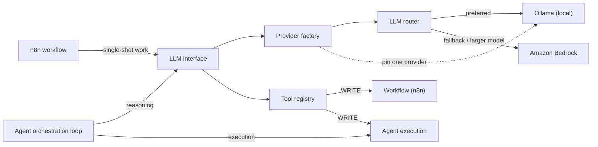

# Documentation as Discipline: Keeping an AWS-Native AI Agent Platform's Architecture Honest

## Why Milestone 17 Meant Redrawing the Diagram Instead of Patching It

Two artifacts changed hands when this platform crossed Milestone 17: `platform-as-built.svg` and the set of living diagrams under `docs/architecture`. Both got redrawn, not patched. That distinction is the whole point of this piece.

A platform built from an event-driven pipeline, a scheduled compute host, and an LLM routing layer doesn't sit still. Every milestone adds an edge somewhere — a new SNS topic wired to CloudWatch alarms, a queue that now drains into a dead-letter queue after N failed receives, a router that starts preferring one model provider over another. If the diagram only gets small edits, it accumulates the visual equivalent of technical debt: boxes that no longer exist, arrows that point at abandoned designs, labels that describe last quarter's architecture. Redrawing the as-built diagram at Milestone 17 was a decision to treat the diagram as a snapshot of the deployed system at a point in time, not a document that gets nudged forward indefinitely. The cost is real — someone has to sit down and re-derive the picture from what's actually running, across CloudFormation templates spanning Budgets, CE, CloudTrail, CloudWatch, EC2, Events, IAM, KMS, Lambda, Logs, S3, SNS, SQS, Scheduler, and SecretsManager. But the alternative — an as-built diagram that's actually an as-built-eight-milestones-ago diagram — is worse for anyone doing technical review or onboarding, because a wrong diagram is more dangerous than no diagram. It looks authoritative right up until someone builds a mental model from it and gets burned.

## The Changelog We Let a Bot Write, and the Diagram We Didn't

Not every documentation artifact deserves the same treatment. The changelog entry for the prior milestone landed as a commit from `github-actions[bot]`, generated in CI without a human touching it. The architecture diagrams did not get that treatment — they were redrawn by hand.

That split is deliberate, and it's worth naming why. A changelog is a mechanical transformation: commit messages in, categorized bullet list out. There's no judgment call in deciding that a commit tagged `architecture:` belongs under a documentation heading. A diagram is different. Redrawing `platform-as-built.svg` means deciding which relationships are load-bearing enough to draw, which ones are transient implementation detail, and which future-facing edges are worth showing even though the thing they describe isn't built yet. A CI job can diff a CloudFormation template against the previous version and tell you a resource got added. It cannot tell you that the addition changes the story the diagram is telling.

| Artifact | Generator | Why |
|---|---|---|
| Changelog | `github-actions[bot]` in CI | Mechanical categorization of commits; no interpretation required |
| `platform-as-built.svg` and living diagrams | Manual redraw | Encodes judgment about which relationships matter and which are still aspirational |

The cost of the manual path is obvious: it doesn't happen unless someone schedules it. The cost of automating it would be subtler and worse — a diagram that's syntactically current but semantically wrong, because a script drew every resource in the CloudFormation stack with equal visual weight, when in practice a webhook receiver and a dead-letter queue don't deserve the same prominence in a document meant for onboarding.

## What the Router Edge to Ollama and Bedrock Actually Encodes

The architecture graph has a router node with two outbound edges: one to Ollama labeled "local (preferred)," one to Amazon Bedrock labeled "fallback / larger model." There's also a separate edge straight from the provider factory to Ollama, labeled "pin one provider," bypassing the router entirely.

Reading that as box-and-arrow decoration undersells it. That pair of edges is a cost and control decision made visible. Ollama runs locally — on the EC2 host this platform already keeps around — so routing there first means inference that costs nothing beyond compute already paid for, with no round trip to a managed API and no data leaving the boundary the platform controls. Bedrock is the fallback: reached only when the local model can't do the job, in exchange for capability the local model doesn't have and a cost profile that scales with usage instead of being sunk into a host that's already running. The factory's separate direct edge to Ollama — "pin one provider" — exists because sometimes you don't want the router's decision logic in the loop at all; you want a deterministic provider for a specific workload, and the diagram makes that an explicit, separate path rather than a router state you'd have to trace through code to find.

This is the part of the architecture where an accurate diagram earns its keep the most, because the trade-off it encodes is invisible in a code review. Nobody reading `router.go` in isolation gets a clean read on "prefer cheap and local, fall back to expensive and capable." The diagram states the policy in one glance. If that diagram goes stale — if the router's actual preference order drifts and the picture doesn't — the next engineer reasoning about cost will reason from a lie.

## The EventBridge Scheduler Pattern That Only Works If the Diagram Is Current

The ingestion side of this platform is serverless by design: a webhook lands, gets verified with HMAC, flows onto an event bus, gets dispatched through rules, and lands in an SQS queue that a worker drains — with a dead-letter queue catching anything that fails enough times. None of that costs anything when nothing is happening. But the platform also needs an EC2 host for work that doesn't fit the serverless model, and an EC2 host that runs continuously is a very different line item on the AWS bill than one that runs when needed.

The answer here is Amazon EventBridge Scheduler triggering an AWS Lambda function that starts and stops the EC2 instance on a schedule, with AWS Systems Manager involved in reaching the host once it's up. That's the whole cost-bounding mechanism: instead of a host running 24/7, you get a host that exists only inside a scheduled window.

The reason this pattern belongs in a piece about documentation discipline, and not just a piece about cost optimization, is that the pattern is illegible without an accurate diagram. Nothing about "EC2 instance" in a resource inventory tells you it's start/stop-managed rather than always-on. The distinction lives entirely in the relationship between the EventBridge Scheduler node and the Lambda node and the EC2 node — three boxes and two arrows that, if drawn correctly, tell a cost story a spreadsheet can't. If the diagram falls out of sync and stops showing that scheduling relationship, the next person looking at the architecture has no way to know the EC2 host isn't just running around the clock like a normal server. They'd size their expectations — and possibly their own designs — around the wrong assumption. This is also, notably, the part of the system flagged for a future worker fleet: the SQS queue's edge to EC2 is explicitly labeled "poll (future worker fleet)," which is a different topic worth its own attention.

## Diagrams as Records of Decisions Not Yet Made

That "future worker fleet" label is worth pausing on, because it reveals something about what these diagrams are actually for. They're not purely a snapshot of what's running today. The edge from SQS to EC2 describes the current shape of the pipeline — a single on-demand host polling the queue — but the label on that edge documents an intended future shape: a fleet of workers, not one host.

That's a deliberate use of the diagram as a design record, not just a current-state photograph. It means a diagram redraw at a milestone boundary isn't only an exercise in accuracy about the present; it's also a place to preserve intent about direction that hasn't been built yet. If that label got dropped during a "just fix what's wrong" patch instead of a full redraw, the platform would lose a documented decision — that the single EC2 poller is a stepping stone, not the design goal — with nothing else in the codebase obligated to say so. A CloudFormation template describes what's provisioned. It has no vocabulary for "and later this becomes something else." The diagram does, and that's a genuine advantage of treating the diagram as a design artifact worth investing hand-drawn effort in, rather than something to be regenerated mechanically from infrastructure state.

The governance side of the architecture — the IAM resources enforcing least privilege across the platform, KMS handling encryption for S3 and Secrets Manager, CloudTrail auditing API activity into its own SNS topic, Budgets and Cost Explorer feeding cost visibility into a third — sits under the same discipline, for the same reason. None of it is exciting to redraw. All of it is exactly the kind of thing that, if the diagram silently drifts, someone assumes is still true when it isn't: that CloudTrail is wired to alert on security events, that the KMS keys still cover the resources they're supposed to, that the IAM boundaries drawn eight milestones ago still match the boundaries actually enforced. Security review runs on the same document as onboarding. If the document lies, both fail quietly.

## What the Discipline Actually Buys

None of this — the redraw, the CI-generated changelog, the router's fallback edge, the scheduler pattern — is impressive on its own. What's worth taking away is narrower: an architecture that's genuinely event-driven and evolving needs a maintenance cadence for its documentation that's tied to the system's own milestones, not to a release calendar or a one-time onboarding push. And not every artifact in that documentation set benefits from the same kind of automation. Letting a bot assemble a changelog from commits is safe because the transformation is mechanical. Letting a bot redraw an architecture diagram would be a mistake, because the diagram's value comes precisely from the judgment a human applies about what to show, what to label as provisional, and what to quietly retire. The cost of that judgment is that it has to be scheduled and paid for on purpose, at every milestone, indefinitely. That's the deal. There isn't a version of this platform where the diagrams stay honest for free.
