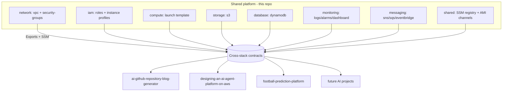
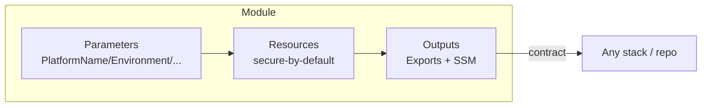
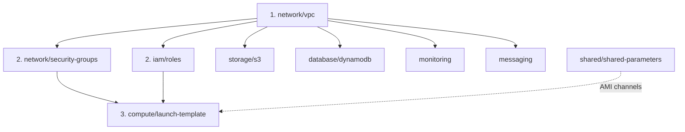
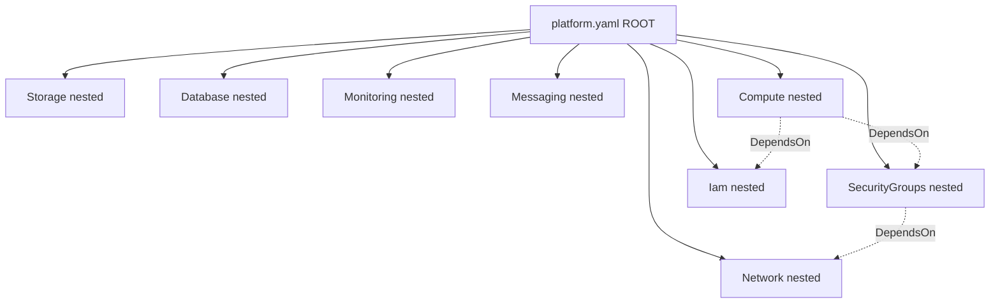
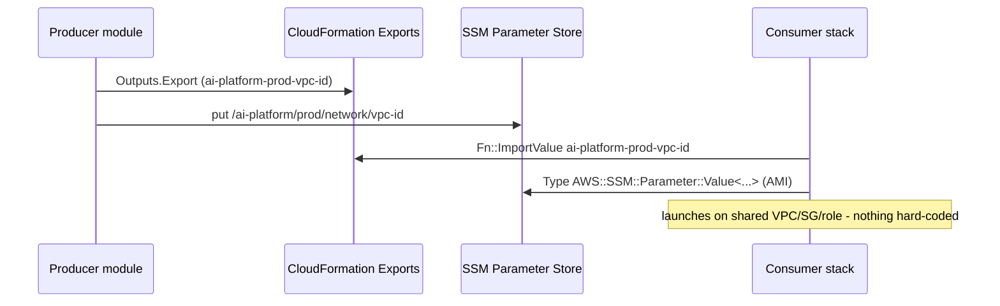

# Reusable CloudFormation Modules & Cross-Stack Sharing (Milestone 21)

This repository provides a **reusable AWS infrastructure platform**: a library of
versioned CloudFormation modules that any AI project can consume to stand up
networking, IAM, compute, storage, databases, monitoring, and messaging without
duplicating infrastructure. Modules expose **predictable cross-stack contracts**
(CloudFormation Exports + SSM Parameter Store), are **secure-by-default**, and are
**independently deployable**.

Consumers: `ai-github-repository-blog-generator`,
`designing-an-ai-agent-platform-on-aws`, `football-prediction-platform`, and
future AI projects.

Built to the **AWS Well-Architected Framework** — least-privilege IAM, encrypted
storage, IMDSv2, environment isolation, cost optimization, and idempotent IaC.

Related: [Shared Baked AMI (M20)](./baked-ami.md) · [Infrastructure](./infrastructure.md) · [Security](./security.md) · [Deployment](./deployment.md).

---

## 1. Architecture overview



## 2. Repository structure

```
infrastructure/
  platform.yaml                 # root NESTED stack (composes modules, centralized Mappings)
  modules/
    network/    vpc.yaml  security-groups.yaml
    iam/        roles.yaml
    compute/    launch-template.yaml
    storage/    s3-bucket.yaml
    database/   dynamodb.yaml
    monitoring/ observability.yaml
    messaging/  messaging.yaml
    shared/     shared-parameters.yaml   # SSM registry + versioned AMI channels
  examples/
    consumer-stack.yaml         # how a downstream project consumes the platform
```

Each module is a standalone, parameterized template: deploy it directly, or
compose it through `platform.yaml`.

## 3. Module design

Every module follows the same contract shape:

- **Inputs**: `PlatformName` + `Environment` (drive naming/isolation) plus
  module-specific knobs with safe defaults.
- **Secure defaults**: encryption on (S3/DynamoDB/SQS/SNS), IMDSv2 required,
  public access blocked, least-privilege IAM, TLS-only bucket policy.
- **Outputs**: exported under a predictable name **and** (where useful) mirrored
  to SSM Parameter Store, so consumers pick either integration style.
- **Loose coupling**: modules reference each other only through `Fn::ImportValue`
  of the documented contract — never by resource reference.



## 4. Deployment order & dependencies

Modules form a dependency DAG. Deploy in this order (the root `platform.yaml`
encodes it with `DependsOn`):



| Module | Depends on (imports) |
|--------|----------------------|
| network/vpc | — |
| network/security-groups | `*-vpc-id` |
| iam/roles | — |
| compute/launch-template | `*-app-sg-id`, `*-ec2-profile-arn`, SSM AMI |
| storage / database / monitoring / messaging | — (independent) |
| shared/shared-parameters | AMI ids (from M20) |

## 5. Nested stack hierarchy



The root stack injects **centralized configuration** from a `Mappings` block
(per-environment instance type, NAT toggle, log retention, VPC CIDR), so those
values live in exactly one place.

## 6. Cross-stack exports & imports

### Naming convention (predictable, greppable)

| Artifact | Pattern | Example |
|----------|---------|---------|
| Stack | `<platform>-<env>-<module>` | `ai-platform-prod-network` |
| Export | `<platform>-<env>-<resource>` | `ai-platform-prod-vpc-id` |
| SSM param | `/<platform>/<env>/<domain>/<key>` | `/ai-platform/prod/network/vpc-id` |
| AMI channel | `/<platform>/amis/<channel>` | `/ai-platform/amis/latest` |
| S3 bucket | `<platform>-<env>-<purpose>-<acct>-<region>` | `ai-platform-prod-artifacts-…` |
| IAM role | `<platform>-<env>-<role>-role` | `ai-platform-prod-ec2-role` |
| Log group | `/<platform>/<env>/<component>` | `/ai-platform/prod/platform` |

### Exported contracts

VPC + subnets + CIDR · web/app/data/operator security groups · EC2/Lambda/Bedrock/
GitHub-Actions role ARNs + instance profile · launch template id + version · S3
bucket name/ARN · DynamoDB table name/ARN · log group + alarm topic + dashboard ·
SNS topic + SQS queue/DLQ + EventBridge bus.

### Import + SSM flow



### Cross-stack dependency graph

Which shared contracts each consumer imports (the platform is the stable API;
arrows are `Fn::ImportValue`/SSM reads, never resource references):

```mermaid
flowchart LR
    subgraph Exports [Platform exports]
        VPC[vpc-id / subnets]
        SG[app-sg-id]
        PROF[ec2-profile-arn]
        AMI[/amis/latest]
        BUS[event-bus-arn]
        TBL[state-table-name]
    end
    VPC --> BLOG[blog-generator]
    SG --> BLOG
    PROF --> BLOG
    AMI --> BLOG
    VPC --> AGENT[ai-agent-platform]
    PROF --> AGENT
    AMI --> AGENT
    BUS --> AGENT
    VPC --> FOOT[football-prediction]
    TBL --> FOOT
    AMI --> FOOT
```

**Import contract rules**: an export can't be deleted while a stack imports it
(CloudFormation enforces this) — so exports are a stable API. Bump the
`contract-version` SSM key on a breaking change; consumers assert compatibility.

## 7. Parameter Store relationships

```mermaid
flowchart LR
    subgraph SSM [/ai-platform]
        A1[/amis/latest]
        A2[/amis/stable]
        A3[/amis/vX.Y.Z]
        N1[/prod/network/vpc-id]
        N2[/prod/network/private-subnet-ids]
        S1[/prod/storage/artifacts-bucket]
        D1[/prod/database/state-table]
        C1[/prod/config/contract-version]
    end
    A1 --> CMP[compute launch template]
    N1 --> CONS[consumer stacks]
    S1 --> CONS
    D1 --> CONS
    C1 --> CONS
```

Shared AMI channels: `latest` (rolling), `stable` (promoted), `development`
(bleeding edge), and immutable `vX.Y.Z` pins — see [`shared-parameters.yaml`](../infrastructure/modules/shared/shared-parameters.yaml).

## 8. Versioning

- **Modules** — the template file is versioned in git; breaking changes bump the
  `contract-version` SSM key (SemVer) and are called out in the changelog.
- **Exports/contracts** — additive changes are backward-compatible; a
  breaking rename ships under a new export name for one release (dual-publish),
  then the old one is retired.
- **Shared AMIs** — SemVer channels (M20): `latest` / `stable` / `vX.Y.Z`.
- **Parameter Store** — immutable `vX.Y.Z` entries are never overwritten; rolling
  channels move.

## 9. Consuming the platform (examples)

**By SSM (recommended for AMIs)** — see [`examples/consumer-stack.yaml`](../infrastructure/examples/consumer-stack.yaml):
```yaml
Parameters:
  BaseAmi:
    Type: AWS::SSM::Parameter::Value<AWS::EC2::Image::Id>
    Default: /ai-platform/amis/latest
```

**By Export** — for network/IAM/SG contracts:
```yaml
SubnetId: !ImportValue ai-platform-prod-private-subnet-1
SecurityGroupIds: [!ImportValue ai-platform-prod-app-sg-id]
IamInstanceProfile: !ImportValue ai-platform-prod-ec2-profile-arn
```

A downstream project needs only `PlatformName` + `Environment` to align with the
shared contracts.

## 10. Deployment

```bash
# 1. Publish modules to S3 (nested-stack TemplateURL source).
aws s3 sync infrastructure/modules s3://<bucket>/modules/

# 2. Stand up a whole environment via the root nested stack.
aws cloudformation deploy --template-file infrastructure/platform.yaml \
  --stack-name ai-platform-prod --capabilities CAPABILITY_NAMED_IAM \
  --parameter-overrides Environment=prod \
    TemplateBaseUrl=https://<bucket>.s3.amazonaws.com/modules \
    OperatorCidr=<your-ip>/32

# Or deploy a single module standalone:
aws cloudformation deploy --template-file infrastructure/modules/network/vpc.yaml \
  --stack-name ai-platform-prod-network --parameter-overrides Environment=prod
```

Deployments are **idempotent** — re-running converges to the same state. Every
template is validated by `cfn-lint` in CI (`infrastructure/**/*.yaml`).

## 11. Migration strategy (from per-project infra)

1. **Inventory** the duplicated resources in each repo (VPC, SGs, roles, buckets).
2. **Stand up** the shared platform in a landing account/env (`platform.yaml`).
3. **Repoint** one consumer at a time to the exports/SSM (start with `dev`).
4. **Verify** parity, then **retire** the project-local copies.
5. **Freeze** direct resource creation in consumers — they import contracts only.

Because CloudFormation blocks deleting an imported export, migration is safe and
reversible: a consumer keeps working until it is explicitly repointed.

## 12. Security

Least-privilege IAM (scoped actions/resources, SSM-managed EC2, GitHub OIDC — no
static keys) · encrypted storage (S3 SSE, DynamoDB SSE, SQS/SNS SSE) · IMDSv2
required on all compute · public access blocked + TLS-only bucket policy ·
tiered security groups (web→app→data, one-way) · SSM `SecureString` for secrets ·
CloudTrail-ready (all API-driven, taggable, exportable) · environment isolation
via `Environment` prefixing.

## 13. Operational runbooks

**Add a new module** — create `infrastructure/modules/<domain>/<name>.yaml`
following the contract shape (PlatformName/Environment inputs, secure defaults,
predictable exports), `cfn-lint` it, add a nested-stack entry in `platform.yaml`,
document its exports here.

**Roll out a contract change** — additive: deploy and announce. Breaking:
dual-publish the new export, bump `contract-version`, migrate consumers, retire
the old export next release.

**Find who imports an export**
```bash
aws cloudformation list-imports --export-name ai-platform-prod-vpc-id
```

**Tear down an environment** — delete consumer stacks first (they import), then
`platform.yaml`. Retained resources (S3/DynamoDB have `Retain` policies) are
cleaned up manually to prevent data loss.

## 14. Troubleshooting

| Symptom | Cause | Fix |
|---------|-------|-----|
| `No export named …` | producer stack not deployed / wrong env prefix | deploy the module; check `PlatformName`/`Environment` match |
| `Export … cannot be deleted as it is in use` | a consumer still imports it | repoint/delete the consumer first (`list-imports`) |
| Nested stack `TemplateURL` fails | modules not synced to S3 | `aws s3 sync infrastructure/modules s3://<bucket>/modules/` |
| Consumer launches wrong AMI | pointed at `latest`, expected a pin | use `/ai-platform/amis/vX.Y.Z` |
| `CAPABILITY_NAMED_IAM` error | IAM roles have explicit names | add `--capabilities CAPABILITY_NAMED_IAM` |
| S3 bucket name conflict | name already taken globally | names include account+region; verify the account |

## 15. Deliverables checklist

Reusable modules (network, iam, compute, storage, database, monitoring,
messaging, shared) ✓ · nested root stack ✓ · predictable exports + SSM ✓ ·
ImportValue consumer example ✓ · versioned AMI channels + contract version ✓ ·
centralized config (Mappings) + naming standards ✓ · secure-by-default ✓ ·
migration guide + runbooks + troubleshooting ✓ · 7 Mermaid diagrams ✓ · every
template `cfn-lint`-clean (enforced in CI) ✓.
