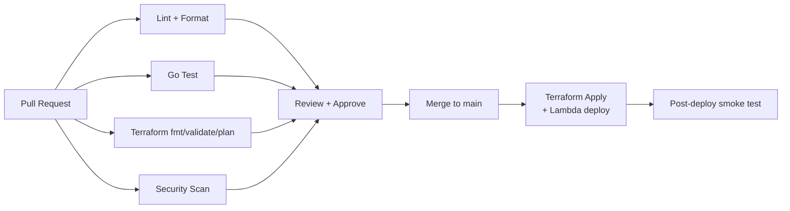
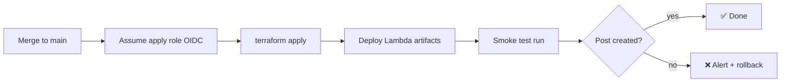

# CI/CD

Continuous integration and delivery run on **GitHub Actions**. Pipelines validate infrastructure, build and test the Go Lambdas, lint, scan for security issues, and deploy via Terraform.

Related: [Deployment](./deployment.md) · [Contributing](./contributing.md) · [Security](./security.md).

---

## 1. Pipeline Overview



Workflows live in `.github/workflows/`:

| File | Trigger | Purpose |
| --- | --- | --- |
| `lint.yml` | PR, push | ShellCheck, gofmt, terraform fmt |
| `go.yml` | PR, push | Build + test Go Lambdas |
| `terraform.yml` | PR (plan), main (apply) | Validate, plan, apply |
| `security.yml` | PR, schedule | Static analysis + scanning |

---

## 2. Terraform Jobs

| Step | Command | Gate |
| --- | --- | --- |
| Format | `terraform fmt -check -recursive` | Fails on unformatted code |
| Init | `terraform init -backend=false` (validate) / full init (plan) | — |
| Validate | `terraform validate` | Fails on invalid config |
| Plan | `terraform plan -out tfplan` | Posted as a PR comment for review |
| Apply | `terraform apply tfplan` | **main only**, after approval |

`plan` runs on every PR so reviewers see exactly what will change. `apply` runs only on `main` (optionally gated by a protected **environment** requiring manual approval).

```yaml
# excerpt: terraform.yml
jobs:
  plan:
    runs-on: ubuntu-latest
    permissions:
      id-token: write   # OIDC
      contents: read
      pull-requests: write
    steps:
      - uses: actions/checkout@v4
      - uses: hashicorp/setup-terraform@v3
      - uses: aws-actions/configure-aws-credentials@v4
        with:
          role-to-assume: ${{ secrets.AWS_DEPLOY_ROLE_ARN }}
          aws-region: us-east-1
      - run: terraform fmt -check -recursive
      - run: terraform init
      - run: terraform validate
      - run: terraform plan -out tfplan
```

---

## 3. Go Jobs

| Step | Command |
| --- | --- |
| Format check | `gofmt -l .` (must be empty) |
| Vet | `go vet ./...` |
| Test | `go test ./... -race -cover` |
| Build | `GOOS=linux GOARCH=arm64 CGO_ENABLED=0 go build -o bootstrap ./cmd/lambda` |

Each function under `lambdas/` is built and tested; the resulting `bootstrap` binary is packaged for deployment (uploaded to the deploy artifact or referenced by Terraform).

---

## 4. Linting & ShellCheck

- **ShellCheck** on all scripts under `scripts/` (`bootstrap.sh`, `deploy.sh`) and any shell in workflows.
- **gofmt / go vet** for Go.
- **terraform fmt** for HCL.
- Optional: `tflint` for provider-specific best practices.

---

## 5. AWS Authentication (OIDC)

CI authenticates to AWS using **GitHub OIDC** — no long-lived access keys stored in GitHub.

- A dedicated IAM role trusts the GitHub OIDC provider, scoped to this repository (and branch/environment for apply).
- `aws-actions/configure-aws-credentials@v4` assumes the role per job.
- The apply role is **more privileged** than the plan role and is only assumable from the `main`/protected environment.

See [Security → Credential Management](./security.md#6-credential-management).

---

## 6. Security Scanning

| Scan | Tool (example) | Scope |
| --- | --- | --- |
| IaC misconfig | `tfsec` / `checkov` | Terraform |
| Dependency vulns | `govulncheck`, Dependabot | Go modules, Actions |
| Secret detection | `gitleaks` | Whole repo, pre-merge |
| SAST | `gosec` | Go source |

Findings block the PR at an appropriate severity threshold. Dependabot keeps Actions and Go modules current.

---

## 7. Deployment Strategy

- **Trunk-based:** short-lived feature branches merge to `main` after green checks and review.
- **Plan on PR, apply on merge:** infrastructure changes are reviewed as a plan before they can apply.
- **Protected environment:** `apply` requires the `production` environment approval (manual gate).
- **Immutable artifacts:** Lambda binaries are versioned; use aliases for instant rollback ([Deployment §8](./deployment.md#8-rollback)).
- **Post-deploy smoke test:** an automated check triggers a generation run against a known repo and verifies a post lands in S3.



---

## 8. Branch Protection

Recommended settings on `main`:

- Require PR + at least one approval.
- Require status checks: `lint`, `go-test`, `terraform-plan`, `security-scan`.
- Require branches up to date before merge.
- Dismiss stale approvals on new commits.
- Restrict who can push directly (no direct pushes).
