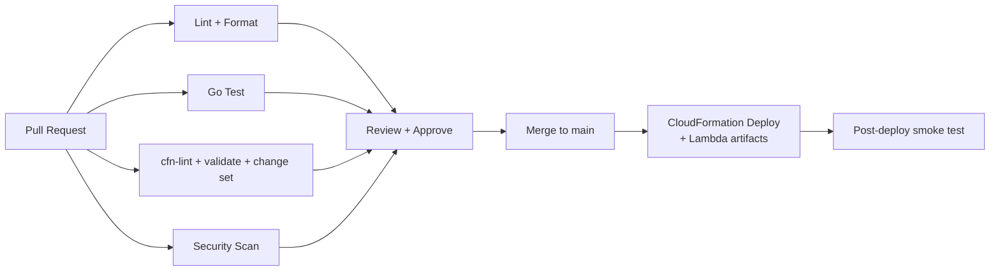
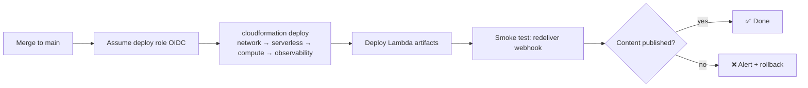

# CI/CD

Continuous integration and delivery run on **GitHub Actions**. Pipelines validate infrastructure, build and test the Go Lambdas, lint, scan for security issues, and deploy via CloudFormation.

Related: [Deployment](./deployment.md) · [Contributing](./contributing.md) · [Security](./security.md).

---

## 1. Pipeline Overview



Workflows live in `.github/workflows/`:

| File | Trigger | Purpose | Status |
| --- | --- | --- | --- |
| `go.yml` | PR, push | gofmt + vet + `go test -race` + cross-compile all Lambdas | ✅ Implemented |
| `cloudformation.yml` | PR, push — **`infrastructure/**` only** | `cfn-lint` all templates | ✅ Implemented (lint) |
| `deploy.yml` | main, dispatch | Package Lambdas → upload → deploy the four stacks (OIDC) | ✅ Implemented (opt-in) |
| `build-ami.yml` | dispatch | Build the pre-baked worker AMI with Packer; writes the AMI id to SSM (`/blog-gen/worker-ami`) for `deploy.yml` | ✅ Implemented (manual) |
| `security.yml` | PR, push — **code/infra only** — + weekly | `govulncheck` + `gosec` (SAST) + `gitleaks` (gate); `checkov` IaC (informational) | ✅ Implemented |

> **Actions cost controls.** All PR-triggered workflows use `concurrency` with
> `cancel-in-progress` on pull requests, so a follow-up push or force-push
> cancels the superseded run (only the latest commit is built; pushes to `main`
> are never cancelled). `cloudformation.yml` runs only when `infrastructure/**`
> changes, and `security.yml`'s push/PR runs are scoped to code/infra/config —
> the weekly scheduled run still scans the whole repo (and full git history for
> secrets), so nothing goes permanently unscanned.

> The lint/test/security workflows run green without any repository secrets.
> `gosec` gates on high-severity/high-confidence findings; `gitleaks` uses
> `.gitleaks.toml` (default rules + placeholder allowlist); `checkov` runs
> informationally (`--soft-fail`) until posture findings are triaged.

### Enabling `deploy.yml`

The deploy workflow is **dormant** (the job is skipped, so CI stays green) until
you arm it by setting these on the repository:

| Kind | Name | Purpose |
| --- | --- | --- |
| Secret | `AWS_DEPLOY_ROLE_ARN` | IAM role that trusts the GitHub OIDC provider |
| Variable | `AWS_REGION` | Deployment region (e.g. `us-east-1`) |
| _(auto)_ | `ARTIFACTS_BUCKET` | Derived by deploy.yml as `blog-gen-artifacts-<account>-<region>` — no variable needed |
| Variable | `OPERATOR_CIDR` | (optional) SSH source CIDR |
| Variable | `DEPLOY_ENABLED` | set to `true` to arm the workflow |
| Variable | `NOTIFY_EMAIL_FROM` / `NOTIFY_EMAIL_TO` | (optional) enable email notifications |
| Variable | `SMTP_USERNAME` / `SMTP_HOST` | (optional) Turbo SMTP account / host |
| Variable | `NOTIFY_WEBHOOK_URL` | (optional) Slack/webhook URL |
| Secret | `SMTP_PASSWORD` | (optional) if set, deploy.yml seeds it into the Secrets Manager `NotificationsSecret` each run; otherwise set the password manually via `put-secret-value` |

On merge to `main` it builds and uploads the four Lambda packages under an
SHA-versioned key (so function code actually updates), then runs
`aws cloudformation deploy` for **network → serverless → compute → observability**.

---

## 2. CloudFormation Jobs

Templates are modular (`network`, `serverless`, `compute`, `observability`), so each is linted and validated independently.

| Step | Command | Gate |
| --- | --- | --- |
| Lint | `cfn-lint infrastructure/*.yaml` | Fails on lint errors |
| Validate | `aws cloudformation validate-template` (per template) | Fails on invalid template |
| Change set | `aws cloudformation create-change-set …` + `describe-change-set` | Posted as a PR comment for review |
| Deploy | `aws cloudformation deploy …` (per stack, in order) | **main only**, after approval |

The **change set** is created on every PR so reviewers see exactly what will change. `deploy` runs only on `main` (optionally gated by a protected **environment** requiring manual approval).

```yaml
# excerpt: cloudformation.yml
jobs:
  changeset:
    runs-on: ubuntu-latest
    permissions:
      id-token: write   # OIDC
      contents: read
      pull-requests: write
    steps:
      - uses: actions/checkout@v4
      - uses: aws-actions/configure-aws-credentials@v4
        with:
          role-to-assume: ${{ secrets.AWS_DEPLOY_ROLE_ARN }}
          aws-region: us-east-1
      - run: pip install cfn-lint && cfn-lint infrastructure/*.yaml
      - run: |
          aws cloudformation create-change-set \
            --stack-name blog-gen-serverless \
            --change-set-name pr-${{ github.event.number }} \
            --template-body file://infrastructure/serverless.yaml \
            --capabilities CAPABILITY_NAMED_IAM
```

---

## 3. Go Jobs

All four Lambda functions (`registration`, `webhook-handler`, `scheduled-start`, `scheduled-stop`) are built and tested. The handler's **commit-message trigger** logic and the registration function's **validation/webhook-creation** logic should have dedicated unit tests.

| Step | Command |
| --- | --- |
| Format check | `gofmt -l .` (must be empty) — or `make check` |
| Vet | `go vet ./...` |
| Test | `go test ./... -race -cover` |
| Build | `make build` (`GOOS=linux GOARCH=arm64 CGO_ENABLED=0 go build -o dist/<fn>/bootstrap ./lambdas/<fn>`) |

The code is a **single Go module**; `make build` compiles each implemented function to `dist/<fn>/bootstrap`. The resulting binaries are zipped and uploaded so the Lambda resources reference them at deploy time. The content pipeline itself lives in n8n workflows, which are validated separately as exported JSON.

---

## 4. Linting & ShellCheck

- **ShellCheck** on all scripts under `scripts/` and the instance `user-data.sh`, plus any shell in workflows.
- **gofmt / go vet** for Go.
- **cfn-lint** for CloudFormation templates.
- Optional: `yamllint` for general YAML hygiene, and a JSON check on exported n8n workflows.

---

## 5. AWS Authentication (OIDC)

CI authenticates to AWS using **GitHub OIDC** — no long-lived access keys stored in GitHub.

- A dedicated IAM role trusts the GitHub OIDC provider, scoped to this repository (and branch/environment for apply).
- `aws-actions/configure-aws-credentials@v4` assumes the role per job.
- The apply role is **more privileged** than the plan role and is only assumable from the `main`/protected environment.

See [Security → Environment Variables & Secrets Management](./security.md#7-environment-variables--secrets-management).

---

## 6. Security Scanning

| Scan | Tool (example) | Scope |
| --- | --- | --- |
| IaC misconfig | `cfn_nag` / `checkov` | CloudFormation |
| Dependency vulns | `govulncheck`, Dependabot | Go modules, Actions |
| Secret detection | `gitleaks` | Whole repo, pre-merge |
| SAST | `gosec` | Go source |

Findings block the PR at an appropriate severity threshold. Dependabot keeps Actions and Go modules current.

---

## 7. Deployment Strategy

- **Trunk-based:** short-lived feature branches merge to `main` after green checks and review.
- **Change set on PR, deploy on merge:** infrastructure changes are reviewed as a change set before they can deploy.
- **Protected environment:** `deploy` requires the `production` environment approval (manual gate).
- **Immutable artifacts:** Lambda binaries are versioned; use aliases for instant rollback ([Deployment §8](./deployment.md#8-rollback)).
- **Post-deploy smoke test:** an automated check redelivers a `blog:` webhook to a test repo and verifies the event is published, the instance starts, the queue drains, and content is published — and separately that a routine commit is acknowledged and ignored.



---

## 8. Branch Protection

Recommended settings on `main`:

- Require PR + at least one approval.
- Require status checks: `lint`, `go-test`, `cloudformation-changeset`, `security-scan`.
- Require branches up to date before merge.
- Dismiss stale approvals on new commits.
- Restrict who can push directly (no direct pushes).
