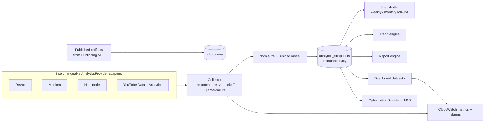
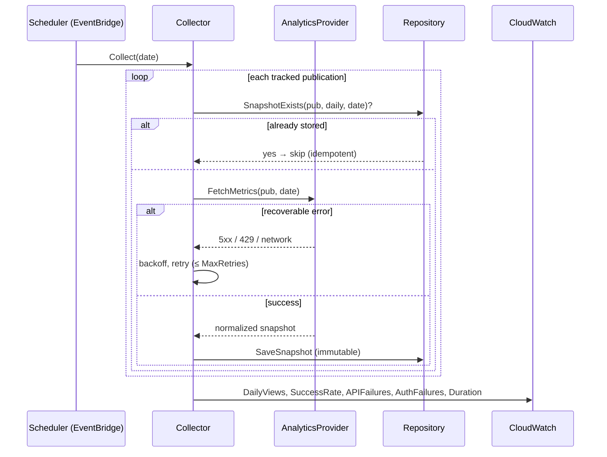

# Content Analytics & Performance (Milestone 17)

Milestone 17 is a production-grade **Content Analytics & Performance** engine. It
continuously measures how *published content* performs across every supported
platform (**Dev.to, Medium, Hashnode, YouTube**, and future social platforms),
normalizes platform-specific metrics into **one unified analytics model**, stores
**immutable daily/weekly/monthly historical snapshots**, detects trends,
generates structured reports and dashboard datasets, emits custom CloudWatch
metrics, and produces a structured **OptimizationSignals** bundle for
[Milestone 18 (AI Content Optimization)](./roadmap.md).

> This milestone **only produces analytics** — it performs no optimization. It
> ingests the artifacts distributed by [Publishing Automation (M15)](./publishing.md)
> and measures them; it complements [Social Media Intelligence (M16)](./social-intelligence.md),
> which tracks account/channel-level performance rather than per-publication content.

Related: [Publishing](./publishing.md) · [Social Media Intelligence](./social-intelligence.md) · [Architecture](./architecture.md) · [Security](./security.md) · [Monitoring](./monitoring.md) · [Scheduling](./scheduling.md).

---

## 1. Analytics flow



### Collection sequence



## 2. Architecture & provider abstraction

The engine lives in [`internal/contentanalytics`](../internal/contentanalytics)
and follows Clean Architecture with strict dependency inversion. The domain
([`model.go`](../internal/contentanalytics/model.go)) is pure; every engine
depends only on ports ([`ports.go`](../internal/contentanalytics/ports.go)),
never on concrete providers, HTTP, or a database.

| Port | Responsibility | Shipped adapter |
|------|----------------|-----------------|
| `AnalyticsProvider` | Fetch publication facts + normalized metrics | Dev.to / Medium / Hashnode / YouTube + `SyntheticProvider` |
| `ReachFetcher` / `EngagementFetcher` / `WatchFetcher` / `AudienceFetcher` | Optional finer-grained capabilities a provider composes | implemented as each platform exposes |
| `Repository` | Persist publications + immutable snapshots | `MemoryRepository` (SQLite DDL in [`content-analytics-schema.sql`](./content-analytics-schema.sql)) |
| `MetricsPublisher` | Emit CloudWatch custom metrics | `LogMetricsPublisher` / `nopMetricsPublisher` |
| `Clock` / `Sleeper` | Time + delay (deterministic in tests) | `time.Now` / `realSleeper` |
| `HTTPDoer` | HTTP for provider adapters | `*http.Client` / mock |

**Extending — adding a new platform** (LinkedIn, X, TikTok, …):

1. Add a `Platform` constant in `model.go` (the future ones already exist).
2. Write `provider_<name>.go` implementing `AnalyticsProvider` (and any of the
   fine-grained fetchers the platform supports) over the `HTTPDoer` port.
3. Register it with the collector.

No change to the collector, normalization, trend, report, dashboard, or
optimization code is required — that is the whole point of the abstraction. A
provider **never fabricates** metrics: fields the platform does not report are
left zero and the snapshot is flagged `Partial`.

## 3. Unified analytics model

Each platform's response is normalized into one `MetricsSnapshot` with families:

| Family | Fields |
|--------|--------|
| **Reach** | views, impressions, unique viewers, audience reach |
| **Engagement** | likes, reactions, comments, replies, shares, reposts, saves, bookmarks |
| **Watch** | watch-time minutes, avg view duration, retention %, completion rate |
| **Click** | CTR, thumbnail CTR, link clicks, external clicks |
| **Growth** | subscribers gained/lost, followers gained, audience growth |
| **Traffic** | per-source view breakdown |

`EngagementRate = totalEngagements / views × 100`. CTR is derived from link
clicks / views only when the platform doesn't report it directly — never invented.

## 4. Historical storage & data lifecycle

- **Immutable & append-only.** A `(publication, period, date)` snapshot is written
  once; a duplicate is rejected (`ErrDuplicateSnapshot`), never overwritten.
- **Three cadences.** The collector writes **daily** snapshots (cumulative
  platform metrics as of that date). The `Snapshotter` derives **weekly** (ISO
  week, Monday key) and **monthly** (first-of-month key) roll-ups by taking the
  latest daily snapshot within each bucket — idempotently, so re-running never
  double-writes.
- **Retention.** `Config.RetentionDays` bounds series length for trend windows;
  raw history is preserved for audit.

## 5. Trend analysis

[`trends.go`](../internal/contentanalytics/trends.go) computes, grounded entirely
in stored snapshots:

- **Growth** — day-over-day, week-over-week, month-over-month (absolute + %),
  looked up **by date** (not array index) so gaps don't distort deltas.
- **Best / worst performing** content via a blended 0–100 score (engagement,
  reach, CTR, retention).
- **Platform comparisons** (per-platform aggregate summaries).
- **Top tags, top keywords, top publishing times** (weekday+hour).

## 6. Reporting

[`report.go`](../internal/contentanalytics/report.go) assembles a structured
`Report` with: **Executive Summary, Platform Summary, Content Performance,
Engagement Breakdown, Growth Trends, Top Articles, Top Videos, Worst Performing,
Recommendations, Historical Comparisons, and Data Quality**. It renders to JSON
or Markdown ([`markdown.go`](../internal/contentanalytics/markdown.go)). The
report is deterministic and grounded — no AI, no fabrication.

## 7. Dashboards

[`dashboard.go`](../internal/contentanalytics/dashboard.go) builds
dashboard-ready datasets (daily series + platform summaries + headline totals)
targeting **CloudWatch** today and **Grafana / a web dashboard / the Business
Advisory Council** in future. `Publish` pushes the headline and per-platform
metrics to the `MetricsPublisher`.

## 8. CloudWatch metrics & alarms

The collector and dashboard emit custom metrics under the `ContentAnalytics`
namespace:

| Metric | Meaning |
|--------|---------|
| `TotalViews`, `DailyViews` | cumulative / per-day views |
| `EngagementRate`, `CTR`, `WatchTimeMinutes` | engagement + watch |
| `PublishingSuccessRate` | collected / attempted |
| `APIFailures`, `AuthenticationFailures`, `FailedCollections` | error signals |
| `APILatencyMs`, `CollectionDurationMs` | performance |
| `MissingAnalytics` | a run that collected nothing |

**Recommended alarms:** `FailedCollections > 0`, a sustained `APIFailures`
increase, `AuthenticationFailures > 0`, and `MissingAnalytics > 0`. A real
CloudWatch `PutMetricData` adapter drops in behind `MetricsPublisher` with no
caller changes.

## 9. Error handling

[`errors.go`](../internal/contentanalytics/errors.go) classifies every failure as
**recoverable** (network, timeout, `429`, `5xx`, partial) or **permanent** (auth
`401/403`, quota `402`, not-found `404`). The collector retries only recoverable
errors with **capped exponential backoff**, tolerates **partial failures** (one
platform failing never aborts the run), and is **idempotent** (dedupe by
`SnapshotExists`). GraphQL/pagination and auth-refresh live in the provider
adapters over the `HTTPDoer` port.

## 10. CLI

[`cmd/contentanalytics`](../cmd/contentanalytics) drives the pipeline. `--offline`
runs the deterministic `SyntheticProvider` with **no network and no secrets** —
ideal for demos, CI, and reviewing output shapes.

```bash
# Offline demo: seed 30 days of synthetic history, print the report.
go run ./cmd/contentanalytics report --offline --days 30

# Dashboard dataset + optimization signals (JSON) for M18.
go run ./cmd/contentanalytics dashboard --offline
go run ./cmd/contentanalytics signals --offline

# Real collection for today (needs env credentials + a publications file).
go run ./cmd/contentanalytics collect --publications pubs.json
```

Commands: `collect` · `rollup` · `report` · `dashboard` · `signals`.

## 11. AI integration (structured output for Milestone 18)

[`optimization.go`](../internal/contentanalytics/optimization.go) produces the
`OptimizationSignals` bundle — **only grounded observations, no optimization**:
best publishing times, best-performing topics, strongest hashtags, highest-CTR
content, best audience retention, successful content patterns, and platform
recommendations. Milestone 18 consumes this to drive AI content optimization.

## 12. Security

Credentials are read from the environment via
[`credentials.go`](../internal/contentanalytics/credentials.go) and are **never
logged, serialized, or embedded in errors** — only their presence is checked, and
the audit log records only the credential env-var **name**, never its value.

| Variable | Platform |
|----------|----------|
| `DEVTO_API_KEY` | Dev.to |
| `HASHNODE_TOKEN` | Hashnode |
| `MEDIUM_STATS_URL`, `MEDIUM_INTEGRATION_TOKEN` | Medium (no public analytics API — stats feed) |
| `YOUTUBE_API_KEY` | YouTube Data API v3 |
| `YOUTUBE_ACCESS_TOKEN` | YouTube Analytics API (OAuth) |

Rotation is transparent — each call re-reads the environment. In production,
source secrets from AWS Secrets Manager / SSM and inject them as env vars.

## 13. Database schema

The shipped `MemoryRepository` implements the `Repository` port. A production
deployment implements the same interface over SQLite/Postgres using
[`content-analytics-schema.sql`](./content-analytics-schema.sql) — tables
`publications`, `analytics_snapshots` (+ optional `platform_metrics`,
`engagement_metrics`, `watch_metrics`), `traffic_sources`, `subscribers`, and
`trends`. The immutability invariant is enforced at the schema level with
`UNIQUE(publication_id, period, snapshot_date)` and `INSERT … ON CONFLICT DO NOTHING`.

## 14. Testing

`go test ./internal/contentanalytics/` (**90%+ coverage**) covers analytics
aggregation, provider abstraction, the SQLite-shaped repository (immutability +
dedupe), normalization, trend calculations, CloudWatch publishing, API failures
and classification, retries/backoff, and daily/weekly/monthly historical
snapshots — all via a mock `HTTPDoer`, with **no network or real credentials**.
