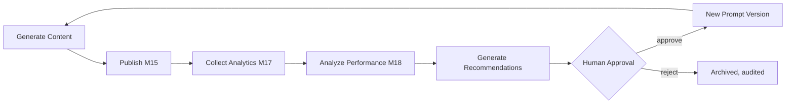
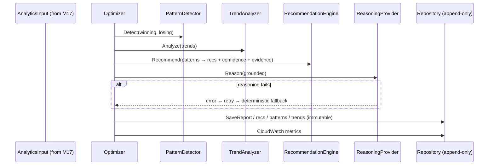

# AI Content Optimization (Milestone 18)

Milestone 18 is a production-grade **AI Content Optimization** engine. It consumes
the historical analytics produced by [Milestone 17](./content-analytics.md),
identifies high- and low-performing content patterns, generates grounded,
confidence-scored recommendations, analyzes and versions content-generation
**prompt templates**, detects multi-horizon trends, and produces structured
optimization intelligence for future content generation.

> The optimizer is **deterministic, explainable, auditable, and reproducible**.
> Every recommendation references the analytics that produced it and carries a
> confidence score. It **never invents** a recommendation the data can't support,
> **never overwrites** historical optimization data, and **never auto-replaces a
> prompt** — prompt changes are proposals that require human approval.

Related: [Content Analytics (M17)](./content-analytics.md) · [Governance](./governance.md) · [Architecture](./architecture.md) · [Monitoring](./monitoring.md) · [Security](./security.md).

---

## 1. Optimization lifecycle



The loop is **iterative and repeatable**. M18 closes it by turning measured
performance into grounded proposals — but a human decides whether a prompt
changes, and every decision is recorded in an append-only audit.

### Optimization run (sequence)



## 2. Architecture & provider abstraction

The engine lives in [`internal/contentoptimizer`](../internal/contentoptimizer)
and follows Clean Architecture with strict dependency inversion. The domain
([`model.go`](../internal/contentoptimizer/model.go)) is pure; every engine
depends only on ports ([`ports.go`](../internal/contentoptimizer/ports.go)).

| Port | Responsibility | Shipped implementation |
|------|----------------|------------------------|
| `PatternDetector` | Detect winning/losing patterns | `DefaultPatternDetector` |
| `TrendAnalyzer` | Multi-horizon trend detection | `DefaultTrendAnalyzer` |
| `RecommendationEngine` | Grounded, scored recommendations | `DefaultRecommendationEngine` |
| `PromptAnalyzer` | Analyze prompt history, propose changes | `DefaultPromptAnalyzer` |
| `ReasoningProvider` | Structured AI reasoning (grounded) | `DeterministicReasoner` / `ModelReasoner` (Bedrock/Ollama) |
| `Repository` | Append-only persistence | `MemoryRepository` (SQLite DDL in [schema](./content-optimizer-schema.sql)) |
| `MetricsPublisher` | CloudWatch custom metrics | `LogMetricsPublisher` / `nopMetricsPublisher` |
| `Clock` | Time (deterministic in tests) | `time.Now` / fixed |

**Extending — a new optimization model** (a different LLM, a bespoke reasoner):
implement `ReasoningProvider` and pass it via `Optimizer.WithReasoner`. No
business-logic change. The deterministic reasoner always remains the fallback, so
the run can never fail because a model is unavailable.

## 3. Grounded input (the M17 seam)

The optimizer consumes its own `AnalyticsInput`, not M17 types — the two packages
are decoupled. [`input.go`](../internal/contentoptimizer/input.go) provides
`FromContentAnalytics(report, signals, series)` as the single adapter. Typed
metrics cover the common cases; `PerformanceRecord.Extra` carries **future
metrics by name**, so new metrics need no architectural change.

## 4. Pattern recognition

[`patterns.go`](../internal/contentoptimizer/patterns.go) ranks records by their
blended score, isolates the top and bottom quantiles, and reports the metric
signals that distinguish them:

```
High CTR → Strong hook (retention) → Longer watch time → High engagement  ⇒ replicate
Low engagement → Weak hook (low CTR) → Poor retention                     ⇒ alternative
```

Each pattern includes its **signal chain**, **support** (how many records back
it), grounded **evidence** (metric vs baseline), examples, and a **confidence**
from sample size + effect separation. A pattern below `MinSupport` or without a
measurable separation is **not** emitted — no fabrication.

## 5. Trend analysis

[`trends.go`](../internal/contentoptimizer/trends.go) produces one report per
horizon (**daily, weekly, monthly, quarterly, long-term**) that the data can
support, detecting **emerging** and **declining** topics (recent vs prior cohort),
**publishing windows**, **seasonal** shifts, and **content fatigue**. A horizon is
skipped when the series is too short to measure it honestly.

## 6. Recommendation engine

[`recommend.go`](../internal/contentoptimizer/recommend.go) turns patterns +
aggregates into recommendations across every required area — **content strategy,
publishing, SEO, social, video, narration, thumbnail, prompt, and platform**.
Each carries a **confidence score**, an **expected impact** (low/medium/high), a
**priority**, and the **evidence** metrics that produced it.

## 7. Prompt optimization & versioning

[`prompts.go`](../internal/contentoptimizer/prompts.go) makes every prompt
template **versioned and measurable**:

- **Versions are append-only.** `Register` seeds v1 (approved baseline); `Propose`
  creates the next version as `proposed`. A version record is immutable.
- **Human approval, not auto-replace.** `Approve` / `Reject` record an immutable
  decision; a version's **effective status** is resolved from the append-only
  approval audit — the version row is never mutated.
- **Rollback** = adopt an earlier version (re-approve it) or simply read it; all
  history is retained.
- The `DefaultPromptAnalyzer` proposes grounded aspect improvements (hook, intro,
  storytelling, technical explanation, SEO, CTA, formatting, pacing, transitions,
  educational flow) tied to the analytics (e.g. low retention → hook proposal).

## 8. AI reasoning

[`reasoning.go`](../internal/contentoptimizer/reasoning.go) produces structured
reasoning: **why content performed well/poorly, supporting evidence, trade-offs,
suggested improvements, confidence, and expected impact**. The `ModelReasoner`
(Amazon Bedrock / Ollama) is prompted with the analytics + patterns and forbidden
to invent numbers; on any error or unparseable output the optimizer **falls back**
to `DeterministicReasoner`, so reasoning is always grounded and the run never
fails.

## 9. Optimization report

`Optimizer.Optimize` assembles an `OptimizationReport` with: **Executive Summary,
Winning/Losing Patterns, Recommendations, Prompt Analysis, Trends, Reasoning,
Platform Comparison, Priority Improvements, Future Opportunities, overall
Confidence, and Data Quality** — rendered as JSON or Markdown
([`report.go`](../internal/contentoptimizer/report.go)).

## 10. CloudWatch metrics

Under the `ContentOptimization` namespace:

| Metric | Meaning |
|--------|---------|
| `OptimizationRuns` | runs executed |
| `RecommendationCount` | recommendations generated |
| `PromptVersion` | highest analyzed prompt version |
| `OptimizationConfidence` | overall run confidence |
| `TrendDetectionCount` | emerging+declining topics detected |
| `OptimizationDurationMs` | run duration |
| `RecommendationAcceptanceRate` | approved / decided recommendations |

`PerformanceImprovement` and `PredictionAccuracy` are reserved for the closed-loop
comparison once adopted recommendations accrue outcomes. Alarm on a drop in
`OptimizationRuns`, low `OptimizationConfidence`, or a falling acceptance rate.

## 11. Error handling

[`errors.go`](../internal/contentoptimizer/errors.go) classifies failures. The
optimizer retries recoverable reasoning failures, then **degrades gracefully** to
deterministic reasoning; runs are **idempotent** (a repeated RunID returns the
stored report); persistence is **append-only**; and structured logging + the
approval audit provide the trail. Partial optimization is supported — a missing
signal simply yields fewer grounded outputs, never a fabricated one.

## 12. CLI

[`cmd/contentoptimizer`](../cmd/contentoptimizer) runs the full **M17 → M18**
pipeline. `--offline` runs the real analytics engine on synthetic data (no
network/secrets), then optimizes over its output.

```bash
# Full pipeline offline → Markdown report.
go run ./cmd/contentoptimizer report --offline --days 30

# Recommendations / patterns / trends / prompt analysis as JSON.
go run ./cmd/contentoptimizer recommendations --offline
go run ./cmd/contentoptimizer patterns --offline
go run ./cmd/contentoptimizer trends --offline
go run ./cmd/contentoptimizer prompts --offline

# Grounded AI reasoning via Ollama (falls back to deterministic on error).
go run ./cmd/contentoptimizer report --offline --ai
```

## 13. Database schema

The shipped `MemoryRepository` implements the `Repository` port. A production
deployment implements the same interface over SQLite/Postgres using
[`content-optimizer-schema.sql`](./content-optimizer-schema.sql) — tables
`optimization_reports`, `recommendations`, `patterns`, `trends`,
`prompt_versions`, `prompt_metrics`, `approvals`, and `confidence_scores`. Every
table is append-only; adoption/rollback are recorded as approvals, never as
in-place edits.

## 14. Security

The optimizer stores no secrets. Reasoning credentials (Bedrock/Ollama) are
handled by the existing `releasegen`/`ollama` layers and never logged. All AI
output is grounded in supplied analytics and validated on parse; unparseable
output is discarded in favor of deterministic reasoning.

## 15. Testing

`go test ./internal/contentoptimizer/` (**90%+ coverage**) covers pattern
recognition, trend detection, the recommendation engine, prompt versioning +
approval + rollback, the prompt analyzer, deterministic and model reasoning
(parse + fallback), the append-only repository, analytics parsing (the M17
adapter), CloudWatch publishing, confidence scoring, and idempotent end-to-end
optimization — with a mock model and **no network or real credentials**.
