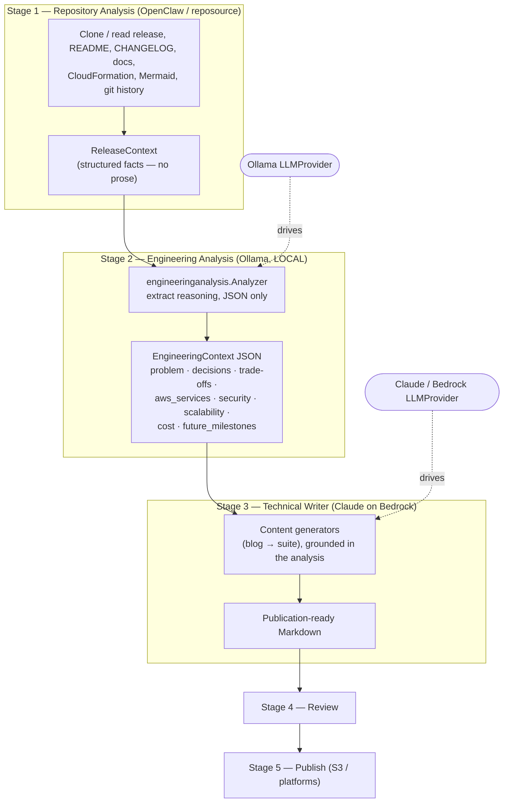
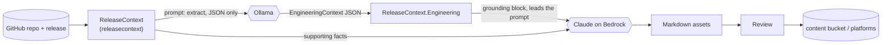

# Content Pipeline Redesign — Ollama analyses, Claude writes

The content pipeline is split by **responsibility** so each model does what it is
best at: a local model (Ollama) performs the deterministic engineering analysis,
and Claude (via Amazon Bedrock) performs the publication-quality writing. A
typed, inspectable **Engineering Context JSON** is the contract between them.

This replaces the previous design where Ollama was asked to write the whole blog
— which produced technically accurate but generic, release-notes-flavoured prose
with little narrative, few trade-offs, and weak architectural reasoning.

## Why split the models

| Concern | Before | After |
| --- | --- | --- |
| Engineering analysis | mixed into the writing prompt | **Ollama** → structured JSON (local, cheap, deterministic) |
| Writing | Ollama | **Claude on Bedrock** (paid, quality-critical), grounded in the JSON |
| Cost | free but low quality | analysis stays free; only the writing spends tokens |
| Auth | — | Bedrock uses **IAM** (instance role) — no API key to store or leak |
| Fallback | — | no `BEDROCK_MODEL_ID` → Ollama writes (zero-paid default) |

Each model has a **single responsibility**: Ollama never writes the article;
Claude never sees the raw repository dump — only the curated analysis + context.

## Architecture



## Sequence

```mermaid
sequenceDiagram
    participant P as releasepipeline.Pipeline
    participant B as ReleaseContext Builder
    participant O as Ollama (analysis)
    participant C as Claude / Bedrock (writer)
    participant R as Reviewer
    participant Pub as Publisher

    P->>B: Build(request)
    B-->>P: ReleaseContext (facts)
    P->>O: Analyze(ReleaseContext)
    O-->>P: EngineeringContext JSON
    Note over P: attach to context;\nfailure is non-fatal (facts-only fallback)
    P->>C: Generate(blog … full suite) grounded in analysis
    C-->>P: Markdown assets
    P->>R: Review(assets)
    R-->>P: passed / issues
    P->>Pub: Publish(passed)
    Pub-->>P: done → notify
```

## Data flow



## Responsibilities by model

- **OpenClaw / `reposource` / `releasecontext`** — repository inspection and fact
  extraction. Never generates prose.
- **Ollama (`engineeringanalysis`)** — reads the facts and extracts the structured
  `EngineeringContext` (the "why"). JSON only, never an article.
- **Claude (`bedrockclaude`)** — long-form writing, storytelling, engineering
  reasoning, readability, SEO. Assumes the voice of the engineer who built the
  platform. Consumes the analysis, never the raw repo dump.

## The contract: `EngineeringContext`

Defined in `internal/releasecontext/engineering.go` and attached to
`ReleaseContext.Engineering`. Shape (abridged):

```json
{
  "release": { "version": "v0.3.0" },
  "problem": "…",
  "engineering_decisions": [{ "decision": "…", "rationale": "…" }],
  "tradeoffs": [{ "choice": "…", "alternatives": [], "advantages": [], "disadvantages": [] }],
  "aws_services": [{ "name": "SQS", "purpose": "…", "rationale": "…" }],
  "security": ["…"],
  "scalability": { "current": "…", "future": "…" },
  "cost_optimizations": ["…"],
  "future_milestones": ["…"],
  "implementation_notes": ["…"]
}
```

Because the contract is typed and serialisable, the two model stages are fully
decoupled: either model can be swapped through the **Provider Abstraction Layer**
(`internal/platform`, `LLMProvider`) or a future **MCP** source without touching
the other, and the extraction can be cached, inspected, and reviewed on its own.

## Configuration

The Stage-3 writer is chosen by **preference: Anthropic API → Amazon Bedrock →
local Ollama**. The first one configured wins; if none is, Ollama writes
(zero-paid default).

| Env | Effect |
| --- | --- |
| `ANTHROPIC_API_KEY_SECRET` | Secrets Manager id/ARN holding an Anthropic API key. **Key present → Claude via api.anthropic.com** (needs no AWS model access). Resolved at startup; never in plaintext env. `ANTHROPIC_API_KEY` is the local-dev equivalent. |
| `ANTHROPIC_MODEL` | Anthropic API model id (e.g. `claude-sonnet-4-5`); blank uses the client default. |
| `BEDROCK_MODEL_ID` | Bedrock Claude model id. Used when no Anthropic key is set. Auth is IAM via the instance role (`bedrock:InvokeModel`); the model must be authorized in the account. |
| `AWS_REGION` | Region for the Bedrock endpoint. |
| `OLLAMA_MODEL` / `OLLAMA_BASE_URL` / `OLLAMA_TIMEOUT` | The local model — always Stage 2, and Stage 3 when no Claude provider is configured. |

**Resilience:** the chosen Claude writer is wrapped in a per-call fallback
(`internal/modelfallback`) — if a provider is configured but an invocation fails
(Bedrock "Operation not allowed" without model access, an Anthropic auth/rate
error, an outage), that stage degrades to the local Ollama model instead of
losing content. The run never hard-fails on a writer error.

**Setting the Anthropic key (production):** the compute stack creates an empty
`<project>/anthropic/api-key` secret; put the real key in without it ever
touching the template or repo:

```bash
aws secretsmanager put-secret-value \
  --secret-id blog-gen/anthropic/api-key --secret-string 'sk-ant-...' --region us-east-1
```

## Where it lives

- `internal/releasecontext/engineering.go` — the `EngineeringContext` type + grounding.
- `internal/engineeringanalysis/` — Stage 2 analyzer (Ollama → JSON).
- `internal/bedrockclaude/` — Stage 3 Claude-on-Bedrock model.
- `internal/releasepipeline/pipeline.go` — the `Analyzer` stage wiring.
- `cmd/worker/main.go` — model selection (analysis vs writer) and pipeline assembly.
