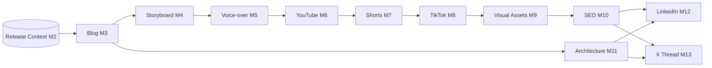

# Full Content Suite — one release, every artifact

`internal/contentsuite` + `cmd/generate-all` turn a single Release Context into
the **complete set of release artifacts (Milestones 3–13) in one run**. Before
this, the rich multimedia generators (storyboard, voice-over, YouTube, shorts,
TikTok, visual assets, SEO, architecture, LinkedIn, X thread) were driven only by
their individual CLIs, so producing everything meant running ~10 commands by hand
and threading each stage's output file into the next.

The orchestrator composes the existing, tested generator packages **in dependency
order** — it adds no generation logic of its own:



## Fault tolerance & graceful degradation

Every stage is isolated: an issue in one stage is **recorded in the manifest and
the run continues** — one weak input never aborts the whole pipeline. Each stage
resolves to one of three states in `manifest.json`:

- **`ok`** — the artifact was produced.
- **`skipped`** — the generator had nothing groundable to produce and *refused to
  fabricate* (e.g. a documentation-only release with no infrastructure to diagram,
  or a small release with no Short-worthy moments / TikTok-worthy topics). This is
  a healthy outcome, not an error.
- **`failed`** — the stage genuinely errored (e.g. a completely empty blog).

The manifest reports `produced` / `skipped` / `failed` counts. This is deliberate:
the generators keep their strict grounding, and the orchestrator degrades
gracefully around a refusal instead of aborting. Small releases, documentation-only
releases, and bug-fix releases therefore produce a coherent subset of artifacts
with the rest cleanly skipped. (Graceful degradation also applies to the individual
CLIs: a section-less blog now storyboards a single overview scene, and the
architecture CLI exits `0` with a skip notice when there is no infrastructure.)

## Usage

```bash
# Fully offline / deterministic (no model). The blog generator needs a model, so
# supply a pre-generated blog; everything downstream runs deterministically.
go run ./cmd/generate-all --context ctx.json --blog post.md --offline --out ./artifacts

# Generate everything, blog included, via the Provider Router (Anthropic locally).
go run ./cmd/generate-all --context ctx.json --out ./artifacts
```

Output (`./artifacts/`): `01-blog.md` … `11-x-thread.md` plus `manifest.json`,
which correlates the release with every artifact and its stage status.

## Single source of truth (no duplicate generators)

The LinkedIn / YouTube Shorts / TikTok / SEO artifacts are produced **only** by
their dedicated packages (`internal/linkedin`, `internal/shorts`,
`internal/tiktok`, `internal/seo`). The lightweight prompt-only versions that used
to also live in `internal/releasegen` were removed — `releasegen` now covers just
the long-form written formats (blog, release summary, documentation), so there is
one implementation per artifact and no divergent output.

## Automated vs. manual — where automation begins and ends

The scheduled worker (`cmd/worker`) drains SQS and drives two automated paths that
share the same review → approval → publish stages:

| Trigger | Path | What is generated automatically |
|---------|------|---------------------------------|
| **A published GitHub Release** | `releasepipeline` → **content suite** | The **complete artifact set** (this doc): blog, storyboard, voice-over, YouTube, Shorts, TikTok, visual assets, SEO, architecture, LinkedIn, X thread — SemVer-gated, then reviewed, approved, and published. **No manual `generate-all` needed.** |
| **A matching `blog:` commit** (or `POST /process`) | `internal/pipeline` (repo-clone) | The written core: blog, README improvements, docs, architecture summary, release notes, architecture diagram. |

So **automation begins** when a GitHub Release is published (or a `blog:` commit
lands) and **ends** at the published, human-approved artifacts. The same worker,
the same Milestone 2 Release Context, and the same governance gate apply to both.

`cmd/generate-all` runs the *identical* content-suite orchestrator **manually** —
for local development, CI, one-off regeneration, or producing the suite outside a
release event. It is the manual door onto the same pipeline the release path runs
automatically; it does not duplicate any orchestration logic.
