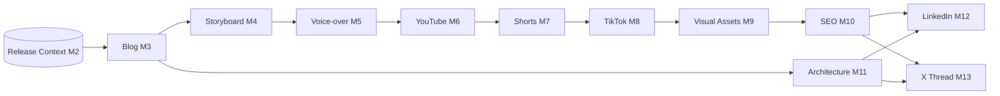

# Full Content Suite — one release, every artifact

`internal/contentsuite` + `cmd/generate-all` turn a single Release Context into
the **complete set of release artifacts (Milestones 3–13) in one run**. Before
this, the rich multimedia generators (storyboard, voice-over, YouTube, shorts,
TikTok, visual assets, SEO, architecture, LinkedIn, X thread) were driven only by
their individual CLIs, so producing everything meant running ~10 commands by hand
and threading each stage's output file into the next.

The orchestrator composes the existing, tested generator packages **in dependency
order** — it adds no generation logic of its own:



## Fault tolerance

Every stage is isolated: a stage that fails (e.g. a blog with no `##` sections, or
a release with no groundable infrastructure to diagram) is **recorded in the
manifest and the run continues** — one weak input never aborts the whole pipeline.
Inspect `manifest.json` for per-stage `ok`/`failed` status. This is deliberate: the
generators keep their strict grounding (they refuse to hallucinate), and the
orchestrator degrades gracefully around a refusal instead of aborting.

## Usage

```bash
# Fully offline / deterministic (no model). The blog generator needs a model, so
# supply a pre-generated blog; everything downstream runs deterministically.
go run ./cmd/generate-all --context ctx.json --blog post.md --offline --out ./artifacts

# Generate everything, blog included, via local Ollama.
go run ./cmd/generate-all --context ctx.json --out ./artifacts
```

Output (`./artifacts/`): `01-blog.md` … `11-x-thread.md` plus `manifest.json`,
which correlates the release with every artifact and its stage status.

## Single source of truth (no duplicate generators)

The LinkedIn / YouTube Shorts / TikTok / SEO artifacts are produced **only** by
their dedicated packages (`internal/linkedin`, `internal/shorts`,
`internal/tiktok`, `internal/seo`). The lightweight prompt-only versions that used
to also live in `internal/releasegen` were removed — `releasegen` now covers just
the long-form written formats (blog, release summary, documentation), so there is
one implementation per artifact and no divergent output.

## Relationship to the automated worker

The scheduled worker (`cmd/worker`) generates the written core (blog, README,
docs, architecture summary, release notes, architecture diagram) inline. Use
`generate-all` to additionally produce the full multimedia suite from the same
Release Context — locally, in CI, or as a follow-on step. Both consume the exact
same Milestone 2 Release Context.
