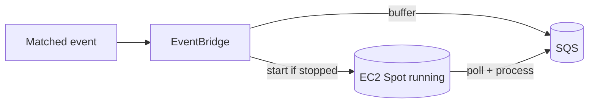
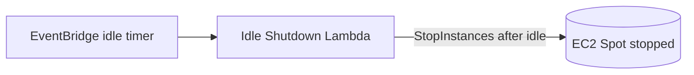

# Cost Optimisation

Cost controls for the **GitHub AI Blog Generator**. The design keeps the idle footprint tiny and — crucially — **never spends anything on commits you did not opt in to publish**. Trigger pre-filtering, event-driven Spot compute, and local inference combine to make the platform pay-per-use in the truest sense.

Related: [Infrastructure](./infrastructure.md) · [Monitoring](./monitoring.md) · [Cost Requirements](./requirements.md#10-cost-optimisation-requirements).

---

## 1. Trigger Pre-Filtering

**Validating the commit-message trigger before invoking any AI or compute is one of the platform's primary cost-saving mechanisms.**

The **Webhook Handler Lambda** checks every push against the configured trigger (default `blog:`) in milliseconds. Because the overwhelming majority of commits never match, the platform, for unmatched events:

- **never starts the EC2 Spot Instance**,
- **never invokes the local LLM**,
- **never performs repository analysis**,
- **never stores** generated output,
- and **never runs** an n8n pipeline execution.

The handler simply returns `HTTP 200` and stops. This eliminates, at the cheapest possible point in the flow:

| Cost avoided | Because |
| --- | --- |
| **AI inference cost** | The local model is never invoked for unmatched commits |
| **Compute cost** | The Spot Instance is never started for unmatched commits |
| **Storage cost** | No unwanted content is generated or stored |
| **Unnecessary executions** | No pipeline, no queue churn, no orchestration overhead |

You pay for processing only on the commits you explicitly mark with the trigger ([COST-1](./requirements.md#10-cost-optimisation-requirements), [TRG-5](./requirements.md#2-publishing-trigger-requirements)).

---

## 2. Event-Driven Compute & Automatic Startup

Nothing runs until a **matched** event arrives. On a trigger match, the handler publishes to **EventBridge**, which starts the EC2 Spot Instance via the **Instance Starter Lambda** and buffers the event in SQS.

- There is **no always-on server**.
- Compute charges accrue **only during active generation** ([COST-2](./requirements.md#10-cost-optimisation-requirements)–[COST-4](./requirements.md#10-cost-optimisation-requirements)).

---

## 3. Automatic Shutdown

An **EventBridge** idle timer drives the **Idle Shutdown Lambda**, which stops the instance after `IDLE_TIMEOUT_MINUTES` of inactivity (empty queue, no in-flight run).

- The idle timeout is configurable ([COST-5](./requirements.md#10-cost-optimisation-requirements), [COST-6](./requirements.md#10-cost-optimisation-requirements)).
- While stopped, only the **persistent EBS volume** incurs cost.

---

## 4. EC2 Spot Instances

Spot Instances are the right default for this **interruptible, batch-style** workload.

| Aspect | Detail |
| --- | --- |
| **Saving** | Typically **70–90% cheaper** than On-Demand |
| **Why suitable** | Runs are asynchronous and resumable; latency is not critical |
| **Interruption risk** | AWS may reclaim the instance with a 2-minute warning |
| **Mitigation** | Work lives in SQS; an interrupted run reappears after the visibility timeout; models, state, and memory persist on EBS |

Trade-offs in full: [README → Spot Instance Trade-offs](../README.md#spot-instance-trade-offs). On-Demand fallback is [planned](./roadmap.md) ([COST-11](./requirements.md#10-cost-optimisation-requirements)).

---

## 5. Local Inference — No Per-Token Cost

Because **Ollama** runs a **local Qwen** model on the instance, there are **no per-token inference charges** — no matter how much content a triggered run generates ([COST-9](./requirements.md#10-cost-optimisation-requirements)). The only inference cost is the already-paid-for EC2 compute time while a run is active.

---

## 6. Persistent EBS, Ephemeral Compute

Model weights, n8n state, and **Repository Memory** live on a persistent **gp3 EBS volume** that survives start/stop cycles.

- A restarted (or Spot-replaced) instance **re-attaches the volume** and is ready to infer **without re-downloading multi-gigabyte models** ([COST-7](./requirements.md#10-cost-optimisation-requirements)).
- Only cheap **storage** cost persists while the instance is stopped.

---

## 7. SQS Prevents Event Loss During Cold Start

Starting a Spot Instance is not instantaneous. During this **cold start**, several matched events may arrive. **Amazon SQS** ensures none is lost:

1. EventBridge writes each matched event to SQS.
2. SQS **durably retains** it (up to 14 days) regardless of instance state.
3. When n8n comes online it **polls SQS** and processes the backlog.
4. A **visibility timeout** protects in-flight messages; a **dead-letter queue** captures repeated failures.

This decouples the always-available front door from the on-demand compute layer ([COST-8](./requirements.md#10-cost-optimisation-requirements)).

---

## 8. Other Cost Controls

- **CloudWatch retention** defaults to **14 days** (`LogRetentionDays`) ([COST-10](./requirements.md#10-cost-optimisation-requirements)).
- **Right-size the instance and model** — pick the smallest GPU instance and Qwen variant that meet your quality bar.
- **Tune the idle timeout** — shorter timeouts stop the instance sooner at the risk of more cold starts.
- **Repository Memory** avoids regenerating duplicate content, saving compute on repeat topics.
- **Tag everything** (`project`, `environment`, `owner`) for cost allocation; consider an **AWS Budget** with alerts.

---

## 9. Estimated Monthly AWS Cost

> Illustrative estimate for **light usage** (a handful of *triggered* runs per week) in `us-east-1`. Actual cost varies by Region, instance type, model size, and how often you use the `blog:` trigger. The dominant variable is **EC2 Spot compute time**.

| Service | Assumption | Est. monthly (USD) |
| --- | --- | --- |
| EC2 Spot (`g4dn.xlarge`, a few triggered hours/week) | On-demand start/stop | ~$3–10 |
| EBS gp3 (100 GB, persistent) | Retained while stopped | ~$8 |
| Lambda (handler + starter + idle-shutdown, arm64) | A few invocations/day | ~$0 |
| API Gateway | Low request volume | ~$0–1 |
| EventBridge + SQS | Low event volume | ~$0 |
| CloudWatch (logs + metrics) | 14-day retention | ~$1–3 |
| **Inference (Ollama, local)** | No per-token fee | **$0** |
| **Baseline** | | **~$12–22** |

**Notes & levers:**
- **Trigger pre-filtering** means routine commits add **$0** — only triggered runs consume EC2 time.
- The **EBS volume** is the largest *fixed* line item because it persists while stopped — size it to your model.
- There is **no NAT gateway** and **no inference API bill**.
- To cut cost further: use a smaller instance/model, shorten the idle timeout, or reduce the EBS volume size.
