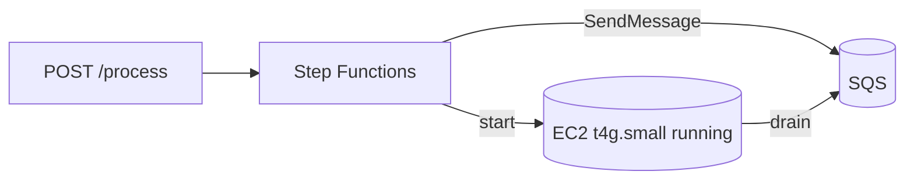

# Cost Optimisation

Cost controls for the **GitHub AI Blog Generator**. The design keeps the idle footprint tiny and never regenerates content it already has. Compute is a small **On-Demand t4g.small** started on demand and stopped by a daily window + idle-stop; inference is **managed Claude** (Bedrock → Anthropic), billed per token only for **new** artifacts.

Related: [Infrastructure](./infrastructure.md) · [Monitoring](./monitoring.md) · [Cost Requirements](./requirements.md#10-cost-optimisation-requirements).

---

## 1. Repository & Token Validation (at registration)

Repository access and PAT permissions are validated **once, at registration** — long before any AI runs. Invalid repositories or under-scoped tokens are rejected up front, so the platform never spins up compute for a repository it cannot process ([COST-1](./requirements.md#10-cost-optimisation-requirements)).

---

## 2. S3 Idempotency — Never Regenerate

**Reusing artifacts already in S3 is the primary control on paid-inference cost**, since generation is the only paid step.

Before generating an artifact the worker checks S3 for an existing Markdown file, and reuses it if present. Re-running a release therefore:

| Cost avoided | Because |
| --- | --- |
| **AI inference cost** | Existing artifacts are reused — no tokens spent regenerating them |
| **Compute cost** | A reused artifact skips the whole generation stage |
| **Duplicate work** | No re-write of content that already exists |

You pay per token only for **new** content ([COST-2](./requirements.md#10-cost-optimisation-requirements)).

---

## 3. On-Demand Compute (started on `/process`)

`POST /process` starts a **Step Functions** execution that starts the host, waits for it to report ready via SSM, and enqueues the job onto **SQS**. Nothing runs until a request comes in; a fixed daily window (18:00–20:00) plus opt-in idle-stop powers the host off.

There is **no always-on server**; the host is a tiny t4g.small, and compute charges accrue only while a job needs it ([COST-3, COST-4](./requirements.md#10-cost-optimisation-requirements)).

---

## 4. Scheduled Shutdown

**EventBridge Scheduler** stops the instance at **20:00 (daily)** via the **scheduled-stop Lambda** — a fixed off-time rather than an idle heuristic, so the maximum daily runtime is known in advance ([COST-5](./requirements.md#10-cost-optimisation-requirements)).

While stopped, only the **persistent EBS volume** incurs cost.

---

## 5. On-Demand on a Schedule (not Spot)

The compute host is **On-Demand**, powered on/off by the schedule, rather than a per-event **Spot** instance.

| Aspect | Detail |
| --- | --- |
| **Why not Spot** | Spot is cheaper but interruptible and capacity-gated — a start can fail with `InsufficientInstanceCapacity` |
| **Why On-Demand** | A start must always succeed; on a t4g.small the absolute cost is already low, so availability outweighs the marginal Spot saving |
| **Cost is low anyway** | A t4g.small plus idle-stop keeps compute cheap, so Spot's discount buys little here |
| **Durability** | Jobs are buffered in SQS; n8n/PostgreSQL state and memory persist on EBS across stop/start |

Rationale in full: [README → Why On-Demand](../README.md#why-on-demand-scheduled-runtime).

---

## 6. Managed Claude — Pay Per Use, No GPU

Inference runs on **Amazon Bedrock (Claude Opus 4.8)** with an **Anthropic API** fallback, billed **per token**. Two things keep this small: there is **no GPU instance to run or keep warm** (the host is a t4g.small making API calls), and **S3 idempotency** means tokens are spent only on **new** artifacts ([COST-9](./requirements.md#10-cost-optimisation-requirements)).

---

## 7. Persistent EBS, Ephemeral Compute

n8n + PostgreSQL state and **Repository Memory** live on a persistent **gp3 EBS volume** that survives start/stop cycles — a restarted instance re-attaches it with state intact ([COST-6](./requirements.md#10-cost-optimisation-requirements)). Only cheap storage cost persists while stopped (20 GB, no model weights).

---

## 8. SQS Buffers the Job

The host is off until a `/process` call starts it, so the Step Functions machine buffers the job in **Amazon SQS** (retention up to 14 days) so it is not lost while the instance boots. The worker drains it once the host is up, with a visibility timeout and dead-letter queue for retries ([COST-7](./requirements.md#10-cost-optimisation-requirements)).

---

## 9. Retrieve Secrets Only When Needed & Serverless Lightweight Processing

- **Secrets on demand.** The GitHub PAT is fetched from Secrets Manager **only when a run needs to clone** — minimising secret API calls ([COST-8](./requirements.md#10-cost-optimisation-requirements)).
- **Serverless front door.** Registration, the `/process` trigger, the Step Functions orchestration, and buffering all run on **serverless** services (API Gateway, Lambda, Step Functions, SQS) that cost effectively nothing at idle ([COST-10](./requirements.md#10-cost-optimisation-requirements)).

---

## 10. Other Cost Controls

- **CloudWatch retention** defaults to **14 days** ([COST-11](./requirements.md#10-cost-optimisation-requirements)).
- **DynamoDB on-demand** metadata table — no idle throughput cost.
- **Right-size the instance and model**; **narrow or widen the schedule window** (`StartExpression`/`StopExpression`) to trade availability for cost.
- **Repository Memory** avoids regenerating duplicate content, saving compute on repeat topics.
- **Tag everything** for cost allocation; consider an **AWS Budget**.

---

## 11. Estimated Monthly AWS Cost

> Illustrative estimate for the **daily window** (18:00–20:00 ≈ 60 h/month) in `us-east-1`. The dominant variable is now **per-token Claude inference**, kept low by S3 idempotency (only new artifacts are billed).

| Service | Assumption | Est. monthly (USD) |
| --- | --- | --- |
| EC2 On-Demand (`t4g.small`, ~60 h/month) | Started on demand, ~$0.0168/h | ~$1 |
| EBS gp3 (20 GB, persistent) | Retained while stopped | ~$1.60 |
| Lambda (registration + manual-trigger + release-context + scheduled) | Low volume | ~$0 |
| Step Functions | A handful of state transitions per run | ~$0 |
| API Gateway | Low request volume | ~$0–1 |
| SQS | Low message volume | ~$0 |
| Secrets Manager | shared repos secret + Anthropic key | ~$0.80 |
| DynamoDB (on-demand) | Low read/write | ~$0–1 |
| CloudWatch (logs + metrics) | 14-day retention | ~$1–3 |
| **Inference (Bedrock / Anthropic, per token)** | Only for **new** artifacts (idempotent) | **variable** |
| **Fixed baseline (single repo, excl. inference)** | | **~$5–8** |

**Notes & levers:**
- **Inference is the main variable.** S3 idempotency means a re-run of an existing release costs **$0** in tokens; you pay only when generating new content.
- **No GPU.** The t4g.small host makes API calls, so there is no GPU rate and no large instance to keep warm — the fixed compute baseline is a few dollars.
- **Secrets Manager** holds the shared repos secret plus the Anthropic key (~$0.40 each).
- There is **no NAT gateway** and **no local model server**.
- Widen/narrow the schedule window (`StartExpression`/`StopExpression`) or lean on idle-stop to trim the already-small compute line.
