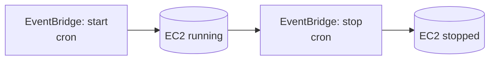

# Cost Optimization

Cost controls for the **AI GitHub Repository Blog Generator**. The design keeps the always-on footprint tiny: nearly everything is serverless and pay-per-use, and the only persistent host (the n8n EC2 instance) is schedule-managed.

Related: [Infrastructure](./infrastructure.md) · [Monitoring](./monitoring.md) · [Requirements → Cost](./requirements.md#26-cost-optimization).

---

## 1. EC2 Scheduling

The n8n host is the main fixed cost. EventBridge rules start it before the operating window and stop it afterward.

- Configure via `n8n_operating_schedule` (start/stop cron expressions).
- **Impact:** running ~8h/day on weekdays instead of 24/7 cuts EC2 compute cost by roughly **75%**.
- For fully on-demand use, keep the instance stopped and start it only for a run.
- Root EBS volume persists while stopped (small cost); n8n state survives restarts.

---

## 2. Lambda Optimization

- **arm64 (Graviton)** custom runtime — better price/performance than x86.
- **Right-size memory** using the duration/cost curve; over-provisioned memory wastes money, under-provisioned increases duration.
- **Short timeouts** and enforced **token/file budgets** bound worst-case duration ([FR-4.3](./requirements.md#14-file-discovery), [NFR-4.2](./requirements.md#24-performance)).
- Pay-per-invocation: **$0 when idle**.

---

## 3. Amazon S3 Lifecycle Policies

| Bucket | Rule | Rationale |
| --- | --- | --- |
| `artifacts` | Expire objects after **7 days** | Snapshots are transient; no need to retain |
| `posts` | **IA at 30d**, **Glacier at 90d** | Posts are durable but rarely re-read after publish |
| `tfstate` | Retain (versioned) | Small; needed for recovery |

Versioning on `posts` is paired with lifecycle rules on **non-current versions** so history is retained without unbounded growth.

---

## 4. CloudWatch Retention

- Log retention defaults to **14 days** (`log_retention_days`) — indefinite retention is a common hidden cost.
- Only necessary custom metrics are published; high-cardinality dimensions are avoided.
- Dashboards and alarms are kept minimal and purposeful.

---

## 5. Terraform Cost Optimization

- **Tag everything** (via provider `default_tags`) with `project`, `environment`, `owner` for cost allocation and budget filtering.
- Use **`terraform plan`** in CI to catch unintended, cost-increasing changes before apply ([CI/CD](./ci-cd.md)).
- Prefer **on-demand/managed** services over always-on infrastructure.
- Keep **dev** environments smaller (or destroyed when idle): `terraform destroy` on ephemeral dev stacks.
- Consider an **AWS Budget** with alerts on the project tag.

---

## 6. Estimated Monthly AWS Cost

> Illustrative estimate for **light usage** (~a few hundred generations/month) in `us-east-1`. Actual costs vary by Region, model, prompt size, and volume. **Amazon Bedrock is usage-based and typically the largest variable.**

| Service | Assumption | Est. monthly (USD) |
| --- | --- | --- |
| EC2 (`t3.small`, ~8h×22 days) | Schedule-managed | ~$4–8 |
| Lambda (arm64) | Low invocation count | ~$0–2 |
| S3 (artifacts + posts) | Lifecycle-managed, small volume | ~$1–3 |
| CloudWatch (logs + metrics) | 14-day retention | ~$1–3 |
| Secrets Manager | ~3 secrets | ~$1.20 |
| NAT Gateway | Hourly + data | ~$32+ (see note) |
| Amazon Bedrock | Per-token, model-dependent | **variable** (often dominant) |
| **Baseline (excl. Bedrock)** | | **~$40–50** |

**Notes & levers:**
- The **NAT gateway** is often the biggest *fixed* line item. For low-traffic setups, consider a **NAT instance**, an interface-endpoint-only design, or running the ingestion egress through VPC endpoints to reduce/remove NAT.
- **Bedrock** cost scales with input+output tokens — keep prompts tight and cap `max_tokens`.

---

## 7. Ways to Reduce Operational Cost

- Tighten the **EC2 schedule** or go fully on-demand.
- Replace the **NAT gateway** with a NAT instance or endpoint-only egress where feasible.
- Reduce **Bedrock** spend: trim prompt context, lower `max_tokens`, choose a smaller/cheaper model for drafts and reserve larger models for final passes.
- Shorten **artifact retention** and **log retention**.
- Batch or throttle scheduled runs to avoid redundant regeneration of unchanged repos.
- Use **cost allocation tags** + **AWS Budgets** to catch drift early.
- Cache repository analysis so unchanged repos skip cloning/analysis.
