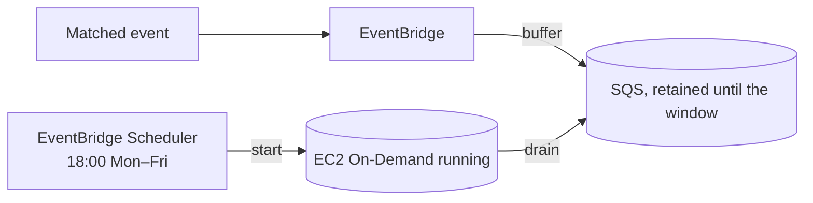
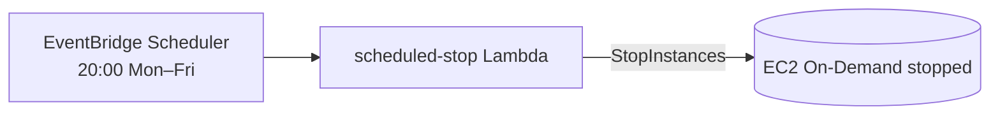

# Cost Optimisation

Cost controls for the **GitHub AI Blog Generator**. The design keeps the idle footprint tiny and spends nothing on repositories or commits that should not be processed. Validation happens as early and as cheaply as possible; compute is an **On-Demand instance on a fixed weekday schedule** (18:00–20:00, Mon–Fri); inference is local.

Related: [Infrastructure](./infrastructure.md) · [Monitoring](./monitoring.md) · [Cost Requirements](./requirements.md#10-cost-optimisation-requirements).

---

## 1. Repository & Token Validation (at registration)

Repository access and PAT permissions are validated **once, at registration** — long before any AI runs. Invalid repositories or under-scoped tokens are rejected up front, so the platform never spins up compute for a repository it cannot process ([COST-1](./requirements.md#10-cost-optimisation-requirements)).

---

## 2. Trigger Pre-Filtering

**Validating the commit-message trigger before invoking any AI or compute is a primary cost-saving mechanism.**

The **Webhook Handler Lambda** checks every push against the repository's trigger pattern (default `blog:`) in milliseconds. For unmatched commits — the overwhelming majority — the platform:

| Cost avoided | Because |
| --- | --- |
| **AI inference cost** | The local model is never invoked |
| **Compute cost** | No event is buffered, so nothing is processed when the instance next runs |
| **Storage cost** | No unwanted content is generated |
| **Unnecessary executions** | No pipeline, no queue churn, no orchestration |

The handler simply returns `HTTP 200` and stops. You pay for processing only on the commits you explicitly opt in ([COST-2](./requirements.md#10-cost-optimisation-requirements)).

---

## 3. Scheduled Compute (Fixed Weekday Window)

A matched event is published to **EventBridge** and durably **buffered in SQS** — the webhook never starts compute. Instance power is owned by **EventBridge Scheduler**, which starts the On-Demand host at **18:00** and stops it at **20:00**, **Monday–Friday**. The worker drains the buffered backlog while the host is up.

There is **no always-on server**; compute charges accrue only during the ~2 h weekday window ([COST-3, COST-4](./requirements.md#10-cost-optimisation-requirements)).

---

## 4. Scheduled Shutdown

**EventBridge Scheduler** stops the instance at **20:00 (Mon–Fri)** via the **scheduled-stop Lambda** — a fixed off-time rather than an idle heuristic, so the maximum daily runtime is known in advance ([COST-5](./requirements.md#10-cost-optimisation-requirements)).

While stopped, only the **persistent EBS volume** incurs cost.

---

## 5. On-Demand on a Schedule (not Spot)

The compute host is **On-Demand**, powered on/off by the schedule, rather than a per-event **Spot** instance.

| Aspect | Detail |
| --- | --- |
| **Why not Spot** | Spot is ~70–90% cheaper but interruptible and capacity-gated — a scheduled/GPU start can fail with `InsufficientInstanceCapacity` |
| **Why On-Demand** | A scheduled start must always succeed and stay up for the whole window; availability outweighs the marginal Spot saving |
| **Cost is bounded anyway** | The fixed ~40 h/month window already caps compute cost, so Spot's discount buys little here |
| **Durability** | Matched events are buffered in SQS; models, state, and memory persist on EBS across the daily stop/start |

Rationale in full: [README → Why On-Demand](../README.md#why-on-demand-scheduled-runtime).

---

## 6. Local Inference — No Per-Token Cost

Because **Ollama** runs a **local Qwen** model, there are **no per-token inference charges** — no matter how much content a triggered run generates ([COST-9](./requirements.md#10-cost-optimisation-requirements)). The only inference cost is the already-paid-for EC2 compute time.

---

## 7. Persistent EBS, Ephemeral Compute

Model weights, n8n state, and **Repository Memory** live on a persistent **gp3 EBS volume** that survives start/stop cycles — a restarted instance re-attaches it and is ready to infer **without re-downloading models** ([COST-6](./requirements.md#10-cost-optimisation-requirements)). Only cheap storage cost persists while stopped.

---

## 8. SQS Defers Events to the Next Window

The instance runs only 18:00–20:00 on weekdays, so a matched event can arrive while it is stopped. **Amazon SQS** buffers matched events (retention up to 14 days) so none is lost; the worker processes the backlog once the scheduled start brings the instance up, with a visibility timeout and dead-letter queue for retries ([COST-7](./requirements.md#10-cost-optimisation-requirements)). A webhook inside the window is processed within seconds; one outside it is reported `deferred` and picked up at the next start.

---

## 9. Retrieve Secrets Only When Needed & Serverless Lightweight Processing

- **Secrets on demand.** The GitHub PAT is fetched from Secrets Manager **only when a run needs to clone** — never on the webhook hot path — minimising secret API calls ([COST-8](./requirements.md#10-cost-optimisation-requirements)).
- **Serverless front door.** Registration, signature verification, trigger evaluation, event routing, and buffering all run on **serverless** services (API Gateway, Lambda, EventBridge, SQS) that cost effectively nothing at idle ([COST-10](./requirements.md#10-cost-optimisation-requirements)).

---

## 10. Other Cost Controls

- **CloudWatch retention** defaults to **14 days** ([COST-11](./requirements.md#10-cost-optimisation-requirements)).
- **DynamoDB on-demand** metadata table — no idle throughput cost.
- **Right-size the instance and model**; **narrow or widen the schedule window** (`StartExpression`/`StopExpression`) to trade availability for cost.
- **Repository Memory** avoids regenerating duplicate content, saving compute on repeat topics.
- **Tag everything** for cost allocation; consider an **AWS Budget**.

---

## 11. Estimated Monthly AWS Cost

> Illustrative estimate for the **scheduled weekday window** (18:00–20:00, Mon–Fri ≈ 40 h/month) in `us-east-1`. The dominant variable is **EC2 On-Demand compute time**, now bounded by the schedule.

| Service | Assumption | Est. monthly (USD) |
| --- | --- | --- |
| EC2 On-Demand (`g4dn.xlarge`, ~40 h/month) | Scheduled start/stop, ~$0.526/h | ~$21 |
| EBS gp3 (100 GB, persistent) | Retained while stopped | ~$8 |
| Lambda (registration + handler + scheduled-start + scheduled-stop) | Low volume | ~$0 |
| API Gateway | Low request volume | ~$0–1 |
| EventBridge + SQS | Low event volume | ~$0 |
| Secrets Manager | 1 shared secret for ALL repos | ~$0.40 flat |
| DynamoDB (on-demand) | Low read/write | ~$0–1 |
| CloudWatch (logs + metrics) | 14-day retention | ~$1–3 |
| **Inference (Ollama, local)** | No per-token fee | **$0** |
| **Baseline (single repo)** | | **~$31–34** |

**Notes & levers:**
- **The schedule caps EC2 cost.** ~40 h/month at On-Demand rates is the largest line item and is fixed regardless of webhook volume; narrow the window to cut it further.
- **Trigger pre-filtering** still means routine commits add **$0** — they never buffer work for a run to process.
- **EBS** is the largest *fixed storage* item; **Secrets Manager** is a single shared secret (~$0.40 flat, not per repo).
- There is **no NAT gateway** and **no inference API bill**.
- For comparison, an always-on (24×7) On-Demand `g4dn.xlarge` is ~$380/month — the weekday window is a **~94% compute saving**.
