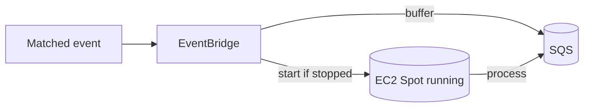
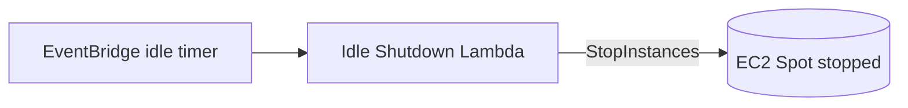

# Cost Optimisation

Cost controls for the **GitHub AI Blog Generator**. The design keeps the idle footprint tiny and spends nothing on repositories or commits that should not be processed. Validation happens as early and as cheaply as possible; compute is event-driven Spot; inference is local.

Related: [Infrastructure](./infrastructure.md) · [Monitoring](./monitoring.md) · [Cost Requirements](./requirements.md#10-cost-optimisation-requirements).

---

## 1. Repository & Token Validation (at registration)

Repository access and PAT permissions are validated **once, at registration** — long before any AI runs. Invalid repositories or under-scoped tokens are rejected up front, so the platform never spins up compute for a repository it cannot process ([COST-1](./requirements.md#10-cost-optimisation-requirements)).

---

## 2. Trigger Pre-Filtering

**Validating the commit-message trigger before invoking any AI or compute is a primary cost-saving mechanism.**

The **Webhook Handler Lambda** checks every push against the repository's trigger pattern (default `blog:`) in milliseconds. For unmatched commits — the overwhelming majority — the platform:

| Cost avoided | Because |
| --- | --- |
| **AI inference cost** | The local model is never invoked |
| **Compute cost** | The Spot Instance is never started |
| **Storage cost** | No unwanted content is generated |
| **Unnecessary executions** | No pipeline, no queue churn, no orchestration |

The handler simply returns `HTTP 200` and stops. You pay for processing only on the commits you explicitly opt in ([COST-2](./requirements.md#10-cost-optimisation-requirements)).

---

## 3. Event-Driven Compute & Automatic Startup

Nothing runs until a **matched** event arrives. On a match, the handler publishes to **EventBridge**, which starts the EC2 Spot Instance via the **Instance Starter Lambda**.

There is **no always-on server**; compute charges accrue only during active generation ([COST-3, COST-4](./requirements.md#10-cost-optimisation-requirements)).

---

## 4. Automatic Shutdown

An **EventBridge** idle timer drives the **Idle Shutdown Lambda**, which stops the instance after workflow completion / `IDLE_TIMEOUT_MINUTES` of inactivity ([COST-5](./requirements.md#10-cost-optimisation-requirements)).

While stopped, only the **persistent EBS volume** incurs cost.

---

## 5. EC2 Spot Instances

Spot Instances are the right default for this **interruptible, batch-style** workload.

| Aspect | Detail |
| --- | --- |
| **Saving** | Typically **70–90% cheaper** than On-Demand |
| **Why suitable** | Runs are asynchronous and resumable; latency is not critical |
| **Interruption risk** | AWS may reclaim the instance with a 2-minute warning |
| **Mitigation** | Work is buffered in SQS; an interrupted run reappears and is retried; models, state, and memory persist on EBS |

Trade-offs in full: [README → Spot Instance Trade-offs](../README.md#spot-instance-trade-offs).

---

## 6. Local Inference — No Per-Token Cost

Because **Ollama** runs a **local Qwen** model, there are **no per-token inference charges** — no matter how much content a triggered run generates ([COST-9](./requirements.md#10-cost-optimisation-requirements)). The only inference cost is the already-paid-for EC2 compute time.

---

## 7. Persistent EBS, Ephemeral Compute

Model weights, n8n state, and **Repository Memory** live on a persistent **gp3 EBS volume** that survives start/stop cycles — a restarted instance re-attaches it and is ready to infer **without re-downloading models** ([COST-6](./requirements.md#10-cost-optimisation-requirements)). Only cheap storage cost persists while stopped.

---

## 8. SQS Prevents Event Loss During Cold Start

Starting a Spot Instance is not instantaneous. **Amazon SQS** buffers matched events (retention up to 14 days) so none is lost during the **cold start**; the n8n workflow processes the backlog once the instance is healthy, with a visibility timeout and dead-letter queue for retries ([COST-7](./requirements.md#10-cost-optimisation-requirements)).

---

## 9. Retrieve Secrets Only When Needed & Serverless Lightweight Processing

- **Secrets on demand.** The GitHub PAT is fetched from Secrets Manager **only when a run needs to clone** — never on the webhook hot path — minimising secret API calls ([COST-8](./requirements.md#10-cost-optimisation-requirements)).
- **Serverless front door.** Registration, signature verification, trigger evaluation, event routing, and buffering all run on **serverless** services (API Gateway, Lambda, EventBridge, SQS) that cost effectively nothing at idle ([COST-10](./requirements.md#10-cost-optimisation-requirements)).

---

## 10. Other Cost Controls

- **CloudWatch retention** defaults to **14 days** ([COST-11](./requirements.md#10-cost-optimisation-requirements)).
- **DynamoDB on-demand** metadata table — no idle throughput cost.
- **Right-size the instance and model**; **tune the idle timeout**.
- **Repository Memory** avoids regenerating duplicate content, saving compute on repeat topics.
- **Tag everything** for cost allocation; consider an **AWS Budget**.

---

## 11. Estimated Monthly AWS Cost

> Illustrative estimate for **light usage** (a handful of *triggered* runs per week) in `us-east-1`. The dominant variable is **EC2 Spot compute time**.

| Service | Assumption | Est. monthly (USD) |
| --- | --- | --- |
| EC2 Spot (`g4dn.xlarge`, a few triggered hours/week) | On-demand start/stop | ~$3–10 |
| EBS gp3 (100 GB, persistent) | Retained while stopped | ~$8 |
| Lambda (registration + handler + starter + idle-shutdown) | Low volume | ~$0 |
| API Gateway | Low request volume | ~$0–1 |
| EventBridge + SQS | Low event volume | ~$0 |
| Secrets Manager | ~2 secrets per repo | ~$0.80+/repo |
| DynamoDB (on-demand) | Low read/write | ~$0–1 |
| CloudWatch (logs + metrics) | 14-day retention | ~$1–3 |
| **Inference (Ollama, local)** | No per-token fee | **$0** |
| **Baseline (single repo)** | | **~$13–24** |

**Notes & levers:**
- **Trigger pre-filtering** means routine commits add **$0** — only triggered runs consume EC2 time.
- **EBS** is the largest *fixed* line item; **Secrets Manager** adds a small per-repo cost.
- There is **no NAT gateway** and **no inference API bill**.
