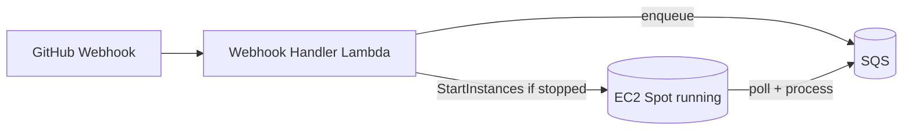
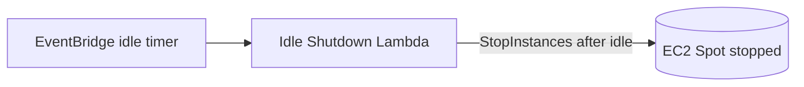

# Cost Optimisation

Cost controls for the **GitHub AI Blog Generator**. The design keeps the idle footprint tiny: the compute host is an **EC2 Spot Instance** started only when there is work, stopped after an idle timeout, and all inference is **local** (no per-token API fees).

Related: [Infrastructure](./infrastructure.md) · [Monitoring](./monitoring.md) · [Cost Requirements](./requirements.md#7-cost-optimisation-requirements).

---

## 1. Event-Driven Compute & Automatic Startup

Nothing runs until a repository changes. When a webhook arrives, the **Webhook Handler Lambda** validates it, enqueues it in SQS, and **starts the EC2 Spot Instance if it is stopped**.

- There is **no always-on server** — the instance exists only while processing.
- Compute charges accrue **only during active generation** ([COST-1](./requirements.md#7-cost-optimisation-requirements), [COST-3](./requirements.md#7-cost-optimisation-requirements)).

---

## 2. Automatic Shutdown

An **EventBridge** timer drives the **Idle Shutdown Lambda**, which stops the instance after `IDLE_TIMEOUT_MINUTES` of inactivity (empty queue, no in-flight run).

- The idle timeout is configurable via `IdleTimeoutMinutes` ([COST-4](./requirements.md#7-cost-optimisation-requirements), [COST-5](./requirements.md#7-cost-optimisation-requirements)).
- While stopped, only the **persistent EBS volume** incurs cost — a few cents per month for typical model sizes.

---

## 3. EC2 Spot Instances

Spot Instances are the right default for this **interruptible, batch-style** workload.

| Aspect | Detail |
| --- | --- |
| **Saving** | Typically **70–90% cheaper** than On-Demand for the same capacity |
| **Why suitable** | Runs are asynchronous and resumable; latency is not critical |
| **Interruption risk** | AWS may reclaim the instance with a 2-minute warning |
| **Mitigation** | Work lives in SQS; an interrupted run reappears after the visibility timeout and is retried; models/state persist on EBS |

Trade-offs in full: [README → Spot Instance Trade-offs](../README.md#spot-instance-trade-offs). Optionally fall back to On-Demand when Spot capacity is unavailable ([COST-10](./requirements.md#7-cost-optimisation-requirements), [Roadmap](./roadmap.md)).

---

## 4. Local Inference — No Per-Token Cost

Because **Ollama** runs a **local Qwen** model on the instance, there are **no per-token inference charges** — no matter how much content you generate ([COST-8](./requirements.md#7-cost-optimisation-requirements)). The only inference cost is the (already-paid-for) EC2 compute time while a run is active. This is the single biggest structural difference from hosted-model designs, where token spend usually dominates.

---

## 5. Persistent EBS, Ephemeral Compute

Model weights and n8n state live on a persistent **gp3 EBS volume** that survives start/stop cycles.

- A restarted (or Spot-replaced) instance **re-attaches the volume** and is ready to infer **without re-downloading multi-gigabyte models** ([COST-6](./requirements.md#7-cost-optimisation-requirements)).
- Only cheap **storage** cost persists while the instance is stopped; there is no idle compute cost.

---

## 6. SQS Prevents Webhook Loss During Cold Start

Starting a Spot Instance is not instantaneous — booting Ubuntu, starting Docker Compose, and warming Ollama takes time. During this **cold start**, GitHub may deliver several webhooks. **Amazon SQS** ensures none are lost:

1. The handler Lambda writes each validated payload to SQS and returns HTTP 200 immediately.
2. SQS **durably retains** messages (retention configurable up to 14 days) regardless of instance state.
3. When n8n comes online it **polls SQS** and processes the backlog in order.
4. A **visibility timeout** protects in-flight messages; a **dead-letter queue** captures repeated failures.

This decouples the always-available front door from the on-demand compute layer ([COST-7](./requirements.md#7-cost-optimisation-requirements)).

---

## 7. Other Cost Controls

- **CloudWatch retention** defaults to **14 days** (`LogRetentionDays`) — indefinite retention is a common hidden cost ([COST-9](./requirements.md#7-cost-optimisation-requirements)).
- **Right-size the instance and model** — pick the smallest GPU instance and Qwen variant that meet your quality bar.
- **Tune the idle timeout** — shorter timeouts stop the instance sooner at the risk of more cold starts.
- **Tag everything** (`project`, `environment`, `owner`) for cost allocation; consider an **AWS Budget** with alerts on the project tag.
- **Cache analysis** so unchanged repositories skip re-analysis on repeated events.

---

## 8. Estimated Monthly AWS Cost

> Illustrative estimate for **light usage** (a handful of runs per week) in `us-east-1`. Actual cost varies by Region, instance type, model size, and run volume. The dominant variable is **EC2 Spot compute time**, which is proportional to how often and how long the instance runs.

| Service | Assumption | Est. monthly (USD) |
| --- | --- | --- |
| EC2 Spot (`g4dn.xlarge`, a few active hours/week) | On-demand start/stop | ~$3–10 |
| EBS gp3 (100 GB, persistent) | Retained while stopped | ~$8 |
| Lambda (handler + idle-shutdown, arm64) | A few invocations/day | ~$0 |
| API Gateway | Low request volume | ~$0–1 |
| Amazon SQS | Low message volume | ~$0 |
| CloudWatch (logs + metrics) | 14-day retention | ~$1–3 |
| **Inference (Ollama, local)** | No per-token fee | **$0** |
| **Baseline** | | **~$12–22** |

**Notes & levers:**
- The **EBS volume** is the largest *fixed* line item because it persists while stopped — size it to your model, no larger.
- There is **no NAT gateway** (the instance sits in a public subnet with restricted security groups), removing a common fixed cost.
- **No inference API bill** — generating more content costs only more active EC2 minutes, not tokens.
- To cut cost further: use a smaller instance/model, shorten the idle timeout, or reduce the EBS volume size.
