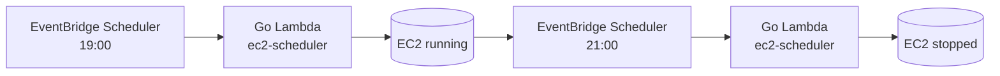

# Cost Optimization

Cost controls for the **AI GitHub Repository Blog Generator**. The design keeps the always-on footprint tiny: managed, pay-per-use services do the durable work, and the only persistent host (the n8n EC2 instance) is started and stopped on a schedule.

Related: [Infrastructure](./infrastructure.md) · [Monitoring](./monitoring.md) · [Cost Requirements](./requirements.md#9-cost-optimization-requirements).

---

## 1. EC2 Scheduling

The n8n host is the main fixed cost, so it is **not** left running continuously. An **EventBridge Scheduler** rule invokes the **`ec2-scheduler` Go AWS Lambda** to start and stop the instance on a fixed daily window.

| Action | Time | Mechanism |
| --- | --- | --- |
| **Start EC2** | **19:00** | EventBridge Scheduler → Go Lambda → `StartInstances` |
| **Stop EC2** | **21:00** | EventBridge Scheduler → Go Lambda → `StopInstances` |

- **Impact:** running ~2h/day instead of 24/7 reduces EC2 compute cost by roughly **90%**.
- The window and instance are configurable via Terraform variables (`ec2_start_cron`, `ec2_stop_cron`, `ec2_instance_id`).
- The root EBS volume persists while stopped (small cost); n8n state survives restarts.
- This prevents the instance from running continuously and keeps infrastructure cost minimal ([COST-1](./requirements.md#9-cost-optimization-requirements)–[COST-4](./requirements.md#9-cost-optimization-requirements)).

---

## 2. Lambda Optimization

- **arm64 (Graviton)** custom runtime for the `ec2-scheduler` function — better price/performance than x86.
- The function is tiny and runs only twice a day, so its cost is effectively **$0**.
- Short timeout; least-privilege role limited to start/stop the specific instance.

---

## 3. Amazon S3 Lifecycle Policies

| Bucket | Rule | Rationale |
| --- | --- | --- |
| `generated-content` | **IA at 30d**, **Glacier at 90d** | Packages are durable but rarely re-read after publishing |
| `tfstate` | Retain (versioned) | Small; needed for recovery |

Versioning on `generated-content` is paired with lifecycle rules on **non-current versions** so history is retained without unbounded growth. Repository clones are transient (EC2 ephemeral disk) and incur no S3 cost.

---

## 4. CloudWatch Retention

- Log retention defaults to **14 days** (`log_retention_days`) — indefinite retention is a common hidden cost.
- Only necessary custom metrics are published; high-cardinality dimensions are avoided.
- Dashboards and alarms are kept minimal and purposeful.

---

## 5. Terraform Cost Optimization

- **Tag everything** (via provider `default_tags`) with `project`, `environment`, `owner` for cost allocation and budget filtering.
- Use **`terraform plan`** in CI to catch unintended, cost-increasing changes before apply ([CI/CD](./ci-cd.md)).
- Prefer **on-demand/managed** services over always-on infrastructure.
- Keep **dev** environments smaller (or destroyed when idle): `terraform destroy` on ephemeral dev stacks.
- Consider an **AWS Budget** with alerts on the project tag.

---

## 6. Estimated Monthly AWS Cost

> Illustrative estimate for **light usage** (a handful of content packages per week) in `us-east-1`. Actual costs vary by Region, model, prompt size, and volume. **Amazon Bedrock is usage-based and typically the largest variable.**

| Service | Assumption | Est. monthly (USD) |
| --- | --- | --- |
| EC2 (`t3.small`, ~2h × 30 days) | Schedule-managed (19:00–21:00) | ~$1–2 |
| Lambda (`ec2-scheduler`, arm64) | 2 invocations/day | ~$0 |
| S3 (generated content) | Lifecycle-managed, small volume | ~$1–3 |
| CloudWatch (logs + metrics) | 14-day retention | ~$1–3 |
| Secrets Manager | ~2–3 secrets | ~$1.20 |
| NAT Gateway | Hourly + data | ~$32+ (see note) |
| Amazon Bedrock | Per-token, model-dependent | **variable** (often dominant) |
| **Baseline (excl. Bedrock)** | | **~$36–42** |

**Notes & levers:**
- The **NAT gateway** is often the biggest *fixed* line item. For low-traffic setups, consider a **NAT instance**, an interface-endpoint-only design, or routing egress through VPC endpoints to reduce/remove NAT.
- **Bedrock** cost scales with input+output tokens — and this project generates *many* assets per run, so it is the primary variable cost. Keep prompts tight and cap `max_tokens`.

---

## 7. Ways to Reduce Operational Cost

- Tighten or shift the **EC2 window** (`ec2_start_cron` / `ec2_stop_cron`), or run fully on demand.
- Replace the **NAT gateway** with a NAT instance or endpoint-only egress where feasible.
- Reduce **Bedrock** spend: trim prompt context, lower `max_tokens`, generate a subset of content types, or use a smaller/cheaper model for drafts and reserve larger models for final passes.
- Shorten **content retention** and **log retention**.
- Cache repository analysis so unchanged repos skip re-analysis on repeated events.
- Use **cost allocation tags** + **AWS Budgets** to catch drift early.
