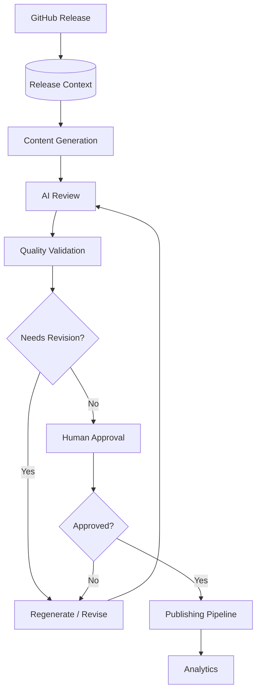

# Review & Approval Workflow (Milestone 14)

Milestone 14 is the **governance layer**: every AI-generated asset must pass
through a review-and-approval workflow before it is published. It combines
deterministic validation, AI-assisted quality review grounded in the Release
Context, quality scoring, a revision loop, human approval gates, publication-
readiness checks, and a complete audit trail — preventing low-quality,
inaccurate, incomplete, or hallucinated content from reaching any platform.

It supports both **fully automated** pipelines (the deterministic engines gate
everything) and **human-in-the-loop** review (approval roles + gates).

Related: [Blog](./blog-generation.md) · [SEO](./seo.md) · [Architecture Diagrams](./architecture-diagrams.md) · [LinkedIn](./linkedin.md) · [X Threads](./xthread.md) · [Release Context](./release-context.md).

---

## 1. Pipeline



`Generator` is replaced here by an `Engine`:
`Engine.Submit → Review → (Revise)* → Approve → Publish → Archive`.

---

## 2. Clean Architecture

The engine lives in [`internal/governance`](../internal/governance). It follows
Clean Architecture and dependency inversion — the core depends on **ports**, not
adapters:

```
        ┌────────────── domain (model.go, status.go) ──────────────┐
        │  Content · WorkflowState · Scores · QualityReport · ...    │
        └───────────────────────────────────────────────────────────┘
                     ▲                    ▲                    ▲
   ┌─────────────────┴───────┐  ┌─────────┴─────────┐  ┌───────┴────────┐
   │ engines (deterministic) │  │ application layer │  │ ports          │
   │ validation · grounding  │  │ Engine (workflow) │  │ AIReviewer     │
   │ scoring · approval      │  │ orchestration     │  │ Repository     │
   │ revision · readiness    │  │ state machine     │  │ GitHubGateway  │
   └─────────────────────────┘  └───────────────────┘  │ Clock          │
                                                        └────────────────┘
        adapters: ModelReviewer (Provider Router: Bedrock / Anthropic) · MemoryRepository · noopGitHub
```

| Concern | Component |
| --- | --- |
| Validation Engine | `ValidationEngine` — deterministic completeness/markdown/mermaid/YAML/links/refs |
| Review Engine | `ReviewEngine` — merges deterministic scores with AI notes |
| AI Reviewer | `AIReviewer` port + `ModelReviewer` (Provider Router: Bedrock / Anthropic), grounded, JSON-parsed |
| Grounding | `GroundingEngine` — verifies claims against the Release Context; fails closed |
| Quality Scoring | `ScoringEngine` — 8 dimensions → Approve / Needs Revision / Reject |
| Approval Engine | `ApprovalEngine` — role permissions + pre-approval quality gates |
| Revision Manager | `RevisionManager` — history, feedback, diffs |
| Readiness | `ReadinessEngine` — pre-publication checks |
| Orchestration | `Engine` — state machine, audit trail, revision limits |
| Storage | `Repository` port + `MemoryRepository` (SQLite/Postgres later) |

**Deterministic validation and scoring are authoritative and reproducible; the
LLM only adds qualitative notes and never changes the decision** — so approvals
are auditable and hallucinations are never approved.

---

## 3. Approval lifecycle

```
Draft → Generated → AI Reviewed → ┬→ Pending Approval → ┬→ Approved → Published → Archived
                                  ├→ Needs Revision ⇄ Updated → AI Reviewed
                                  └→ Rejected → Needs Revision / Archived
```

The state machine (`status.go`) allows only the transitions above; anything else
returns `ErrInvalidTransition`, so a gate can never be skipped. **Only `Approved`
content may be published**, and publication additionally requires the readiness
checks to pass.

---

## 4. Quality scoring

Eight dimensions (0–100): **Technical Accuracy** (from grounding), **Readability**,
**SEO**, **Architecture**, **Completeness**, **Grammar**, **Consistency**,
**Educational Value**, and a weighted **Overall** (accuracy + completeness are
weighted highest). The decision:

- **Reject** — overall below `RejectBelow`.
- **Needs Revision** — ungrounded claims, a validation error (when
  `BlockOnValidationErrors`), any dimension below `MinDimensionScore`, or overall
  below `MinOverallScore`.
- **Approve** — grounded, no blocking issues, and overall ≥ `MinOverallScore`.

**Ungrounded content is never approved** — grounding fails closed when there are
no grounding terms to verify against.

---

## 5. Quality gates (pre-approval)

Before a human approval is accepted, every gate must pass: technical accuracy,
release alignment (grounding), grammar, formatting/markdown, SEO, metadata,
architecture consistency, diagrams, references & citations, CTA quality, branding
consistency, and overall quality. A failing gate returns `ErrQualityGateFailed`.

## 6. Publication readiness

Before publishing: approval completed, required approvals/roles met, metadata
complete, SEO present, review comments resolved, the latest review passed, no open
validation errors, and type-specific assets (e.g. a blog thumbnail, a generated
diagram). A failing check returns `ErrNotReadyToPublish` and records the readiness
report.

---

## 7. Roles & configuration

Roles (`Author`, `Reviewer`, `Technical Reviewer`, `Publisher`, `Administrator`)
carry configurable permissions (`approve`, `revise`, `reject`, `publish`,
`archive`). `Config` is fully configurable:

```go
cfg := governance.DefaultConfig()   // MinOverallScore 80, RejectBelow 50, ...
cfg.RequiredApprovals = 2
cfg.RequiredRoles     = []governance.Role{governance.RoleReviewer, governance.RoleTechnicalReviewer}
cfg.RevisionLimit     = 5            // 0 = unlimited
```

---

## 8. Audit trail

Every action appends an immutable `AuditEntry` (timestamp, actor, action, from/to
status, detail): submission, generation, each AI review, revisions, approvals,
publication, and archival — a complete, replayable history per release.

---

## 9. GitHub & n8n integration

- **GitHub** is an optional port (`GitHubGateway.OnStatusChange`). A no-op adapter
  ships by default, so the core never depends on GitHub; a real adapter can mirror
  the lifecycle onto issues, PRs, labels, and review comments.
- **n8n** orchestrates the outer loop — see [`n8n-review-workflow.json`](./n8n-review-workflow.json).
  The `govern` CLI is the automation entry point: it exits `0` when content passes
  (Approved/Published), `3` when it needs revision or is rejected, so an n8n
  `IF` node (or a GitHub Actions step) can branch on the exit code.

---

## 10. Developer guide

```go
engine := governance.NewEngine(governance.DefaultConfig(), governance.NewMemoryRepository(),
    governance.NewModelReviewer(model, "claude"), time.Now)

state, _ := engine.Submit(governance.Content{
    ID: "blog-v0.2.0", Type: governance.TypeBlog, Title: "...", Body: markdown,
    Grounding: governance.Grounding{Repository: "acme/widget", Release: "v0.2.0", Terms: groundedTerms},
})
state, _ = engine.Review(ctx, state.Content.ID)          // → Pending Approval / Needs Revision / Rejected
if state.Status == governance.StatusNeedsRevision {
    state, _ = engine.Revise(state.Content.ID, revisedBody, []string{"reviewer note"}, "author")
    state, _ = engine.Review(ctx, state.Content.ID)
}
state, _ = engine.Approve(ctx, state.Content.ID, governance.Reviewer{Name: "rev", Role: governance.RoleReviewer}, true, "LGTM")
state, err := engine.Publish(ctx, state.Content.ID, "publisher")
```

### CLI

```bash
# Review a blog grounded in a release context (deterministic only):
go run ./cmd/govern --content post.md --type "Technical Blog" --context ctx.json --offline

# Full lifecycle, JSON output, AI review via the Provider Router (Anthropic):
go run ./cmd/govern --content post.md --context ctx.json --auto-approve --format json
```

Flags: `--content` (required), `--context`, `--type`, `--title`, `--auto-approve`,
`--min-score`, `--format md|json`, `--model`, `--offline`, `--out`.

---

## 11. Error handling

Typed sentinel errors let n8n / Actions branch precisely: `ErrInvalidTransition`,
`ErrNotPendingApproval`, `ErrPermissionDenied`, `ErrRevisionLimit`,
`ErrNotApproved`, `ErrNotReadyToPublish`, `ErrDuplicateApproval`,
`ErrEmptyContent`, `ErrReviewFailed`, `ErrQualityGateFailed`. A failed AI review
never blocks the workflow — the engine falls back to the deterministic review.

---

## 12. Status & future enhancements

**Implemented:** domain models + state machine, validation/grounding/scoring/
review/approval/revision/readiness engines, the AI reviewer port + Bedrock/Anthropic
adapter, in-memory repository, workflow orchestration with audit trail, the
Markdown report renderer, and the `govern` CLI. Unit + workflow + integration
tests at 80%+.

**Next:** a SQLite/PostgreSQL repository adapter, a real GitHub gateway (issues/
PRs/labels), section-level regeneration wired to the content generators, reviewer
notifications and approval-timeout handling, and per-content-type quality-weight
profiles.
