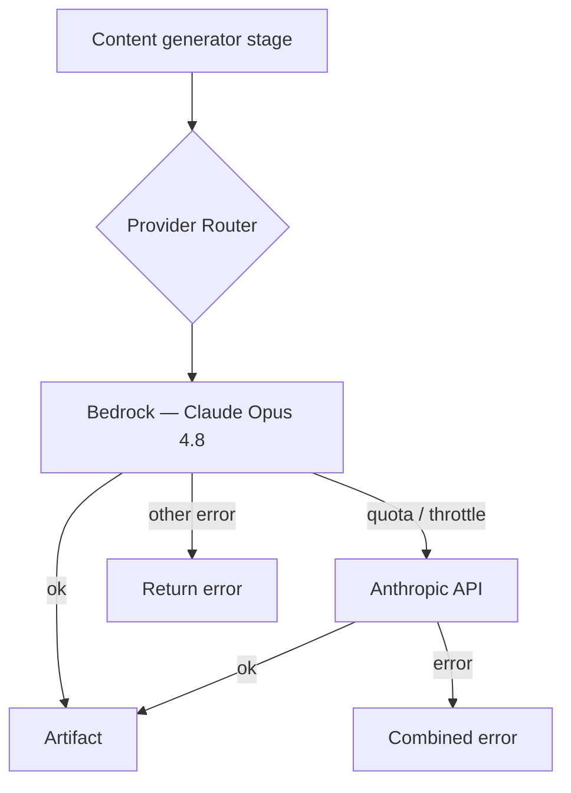

# AI Provider Router

Every artifact is generated by Claude — but through **two providers arranged as
a failover chain**, not a per-artifact policy. The **AI Provider Router** attempts
**Amazon Bedrock (Claude Opus 4.8)** first and, if Bedrock is unavailable for
capacity reasons, transparently falls back to the **Anthropic API**. There is no
local model and no per-kind provider split — quality is uniform; the chain only
exists for availability. No provider-specific logic leaks into the generators.

> Architecture: `AI Request → Provider Router → AWS Bedrock (Claude Opus 4.8) →
> if quota unavailable → Anthropic API`.

## The chain

| Position | Provider | Model | Auth |
| --- | --- | --- | --- |
| Primary | **Bedrock** | `us.anthropic.claude-opus-4-8` | IAM (instance role) — no API key |
| Fallback | **Anthropic API** | `claude-opus-4-8` (or client default) | API key from Secrets Manager |

Both legs are optional at the edges: with only `BEDROCK_MODEL_ID` set the chain
is Bedrock-only; with only an Anthropic key it is Anthropic-only. The worker
refuses to start if the chain would be empty.

## How it routes



Each `contentsuite` stage asks the router for its model by stage name
(`o.model("architecture")`). The router returns a `Model` that walks the chain on
every `Generate` call: it tries each provider in order, returns the first success,
and only advances on a **retryable** (capacity) error. The generators are unaware
of which provider produced the output.

## Fallback behaviour

Fallback is **capacity-driven**, not blanket:

- **Bedrock returns a quota/throttle signal** (markers include `throttl`, `quota`,
  `ServiceQuotaExceeded`, `too many requests`, `rate exceeded`, `rate limit`,
  `capacity`, `429`) → the router advances to the Anthropic API and logs
  `fallback=true reason=quota`.
- **Bedrock returns a non-capacity error** → it is returned as-is (no silent
  fallback that would mask a real bug); `reason=error`.
- **Every provider fails** → the router returns a combined error naming each leg.

## Configuration

Everything is config — no recompilation to change providers.

| Env | Effect |
| --- | --- |
| `BEDROCK_MODEL_ID` | Primary leg — Bedrock Claude model id (IAM auth). Blank disables the Bedrock leg. |
| `ANTHROPIC_API_KEY_SECRET` | Secrets Manager id/ARN holding the Anthropic API key for the fallback leg. |
| `ANTHROPIC_MODEL` | Fallback leg — Anthropic API model id (blank uses the client default). |

There is no routing-policy variable: the chain is fixed (Bedrock → Anthropic),
so a run is either served by the primary or, on a capacity error, the fallback.

## Observability

Every attempt is a structured log line, ready for CloudWatch Logs Insights:

- `ai provider generated` — `content_type`, `provider`, `model`, `fallback` (bool).
- `ai provider failed; trying next` — `content_type`, `provider`, `model`,
  `reason` (`quota` \| `error`).

Example Insights query for fallback frequency:

```
fields @timestamp, content_type, provider
| filter @message like /ai provider generated/ and fallback = 1
| stats count() by content_type
```

## Extending with a new provider

Adding a provider (Amazon Nova, Llama, Mistral, a future MCP provider) is an
interface implementation + a chain entry — no business-logic change:

1. Implement the shared model port (`Generate(ctx, prompt) (string, error)`).
2. Append it to the `[]airouter.Provider` chain the worker builds (order = priority).

The router, orchestrator, and generators are untouched.

## Where it lives

- `internal/airouter` — the router, the provider chain, and the fallback classifier.
- `internal/contentsuite` — `Orchestrator.ModelFor` selects the model per stage.
- `cmd/worker/main.go` — builds the `[]airouter.Provider` chain (Bedrock then
  Anthropic) and wires the router (production).
- `cmd/content` (`--hybrid`) — the same router locally, driven by your Claude Code
  subscription, so local and production routing stay identical. See the README's
  [Hybrid routing](../README.md#hybrid-routing-local-ai-provider-router) section.
