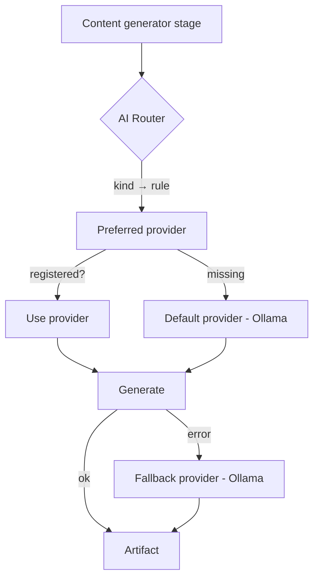

# Hybrid AI Routing

Not every artifact deserves the same model. The **Hybrid AI Router** picks a
provider per content artifact based on its importance: premium model (Claude)
for high-value, public-facing writing; the cheap local model (Ollama) for
commodity, template-driven output. This maximises quality where it matters and
minimises inference cost where it doesn't — without any provider-specific logic
leaking into the generators.

## Default policy

| Artifact | Provider | Why |
| --- | --- | --- |
| `blog` | **Claude** | Flagship long-form technical article |
| `architecture` | **Claude** | Technical reasoning, trade-offs, diagrams |
| `linkedin` | **Claude** | Professional public communication |
| `x-thread` | **Claude** | Audience engagement |
| `storyboard`, `voiceover`, `youtube` | Ollama | Intermediate scripts (feed the video chain) |
| `youtube-shorts`, `tiktok` | Ollama | Short-form, repetitive |
| `visual-assets` | Ollama | Prompt lists, template-driven |
| `seo-metadata` | Ollama | Structured metadata |

**4 of 11 artifacts** use the premium model — the rest stay local.

## How it routes



Each `contentsuite` stage asks the router for its model by stage name
(`o.model("architecture")`). The router resolves `kind → provider` from the
policy, returns the provider **wrapped in a per-call fallback**, and logs the
decision. The generators are unaware of which provider they got.

## Fallback behaviour

Routing never fails a run because a provider is unavailable:

- **Claude configured but a call fails** (Bedrock "Operation not allowed", an
  Anthropic auth/rate error, an outage) → that stage degrades to **Ollama**.
- **Claude not configured at all** → Claude-routed kinds fall through to the
  default provider (Ollama). The run still produces every artifact.
- Ollama is both the **default** (unruled kinds) and the **fallback** (errors).

## Configuration

Everything is config — no recompilation to change providers or policy.

| Env | Effect |
| --- | --- |
| `AI_ROUTING_RULES` | JSON routing policy (below). Blank = built-in default. |
| `ANTHROPIC_API_KEY_SECRET` / `ANTHROPIC_MODEL` | Registers Claude via the Anthropic API (preferred). |
| `BEDROCK_MODEL_ID` | Registers Claude via Bedrock (used if no Anthropic key). |
| `OLLAMA_MODEL` / `OLLAMA_BASE_URL` / `OLLAMA_TIMEOUT` | The local provider. |

`AI_ROUTING_RULES` accepts a **compact form** (recommended for production — no
quotes/spaces, so it passes cleanly through a GitHub repo variable →
CloudFormation parameter → systemd `EnvironmentFile`) or **JSON** (handy locally).
Aliases like `seo`, `shorts`, `xthread` are normalised.

```
# compact — provider=kinds;provider=kinds
claude=blog,architecture,linkedin,x-thread;ollama=seo-metadata,tiktok,youtube-shorts
```
```json
{ "claude": ["architecture", "linkedin", "x-thread"],
  "ollama": ["seo", "visual-assets", "youtube-shorts", "tiktok"] }
```
```json
{ "blog": "claude", "seo-metadata": "ollama" }
```

**Production override:** set the `AI_ROUTING_RULES` **repo variable** (compact
form) → `deploy.yml` passes it to the `AIRoutingRules` stack parameter →
`worker.env`. Leave it unset for the default policy.

## Observability

Every selection and fallback is a structured log line, ready for CloudWatch
Logs Insights:

- `ai routing decision` — `content_type`, `provider`, `fallback`.
- `hybrid ai routing configured` — registered `providers` + the full `decisions`
  map, logged once at start-up so the effective policy is visible.
- `primary model failed; falling back to local model` — `primary`, `error`
  (emitted by `internal/modelfallback` on a fallback event).

Example Insights query for fallback frequency:

```
fields @timestamp, primary, error
| filter @message like /falling back to local model/
| stats count() by primary
```

Provider usage / durations can be derived from the `ai routing decision` lines
and the per-stage `content suite generated` manifest; richer EMF metrics
(provider counters, estimated cost) can build on these same events.

## Cost impact

Against an all-Claude baseline (every artifact on the premium model), the
default policy sends only **4 of 11** artifacts to Claude — roughly a **64%
reduction in premium-provider calls per release**, while keeping Claude for the
content whose quality is most visible. Adjust the split via `AI_ROUTING_RULES`
to trade cost for quality per artifact.

## Extending with a new provider

Adding a provider (Amazon Nova, Llama, Mistral, DeepSeek, OpenAI, Gemini, a
future MCP provider) is an interface implementation + registration — no
business-logic change:

1. Implement `Generate(ctx, prompt) (string, error)` (the shared model port).
2. Register it in the worker's provider map under a name (e.g. `"nova"`).
3. Point rules at it: `AI_ROUTING_RULES={"nova":["tiktok","youtube-shorts"]}`.

The router, orchestrator, and generators are untouched.

## Where it lives

- `internal/airouter` — the router + policy + JSON config parser.
- `internal/contentsuite` — `Orchestrator.ModelFor` selects per stage.
- `internal/modelfallback` — the per-call fallback wrapper.
- `cmd/worker/main.go` — registers providers and builds the router.
