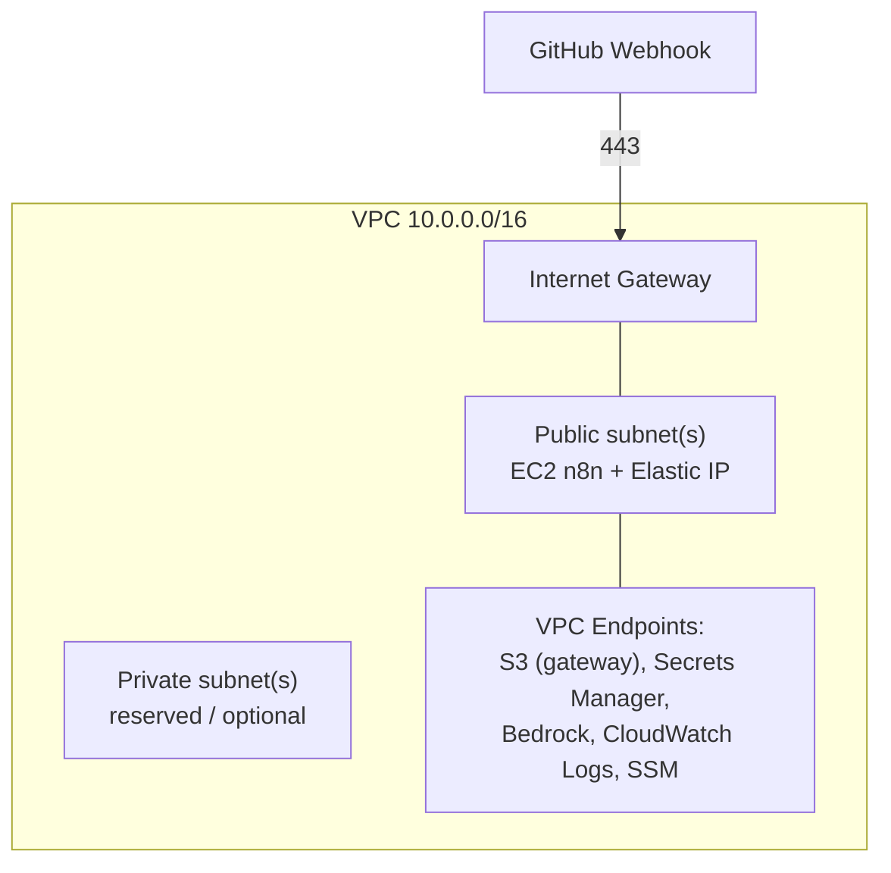

# Infrastructure

All infrastructure is provisioned with **AWS CloudFormation**. This document describes each AWS service, how it's used, the CloudFormation stack layout, deployment artifacts, networking, and encryption.

Related: [Architecture](./architecture.md) · [Deployment](./deployment.md) · [Security](./security.md) · [Cost Optimization](./cost-optimization.md).

---

## 1. Service Overview

| Service | Purpose | CloudFormation stack |
| --- | --- | --- |
| Amazon Bedrock | Foundation model inference for content generation | referenced by IAM + EC2 |
| Amazon EC2 | n8n orchestration host | `ec2.yaml` |
| AWS Lambda | Go function for scheduled EC2 start/stop | `lambda.yaml` |
| Amazon S3 | Generated content | `s3.yaml` |
| Amazon EventBridge / Scheduler | EC2 start/stop scheduling | `eventbridge.yaml` |
| Amazon CloudWatch | Logs, metrics, dashboards, alarms | `monitoring.yaml` |
| AWS Secrets Manager | Per-repository PATs and webhook secrets | `secrets.yaml` |
| AWS IAM | Least-privilege roles and policies | `iam.yaml` |
| Amazon VPC | Network isolation (subnets, IGW, route tables, SGs) | `networking.yaml` |
| Amazon DynamoDB | Repository metadata store | `dynamodb.yaml` |

---

## 2. Amazon Bedrock

- Provides foundation-model inference for content generation via `bedrock-runtime:InvokeModel`.
- The model ID/inference profile and parameters (`max_tokens`, `temperature`) are CloudFormation parameters, so the model can be swapped without code changes ([AI-2](./requirements.md#5-ai-requirements)).
- Access is granted narrowly via IAM to the n8n instance role, scoped to the specific model ARN(s).
- **Model access must be requested** in the Bedrock console per Region before first use ([Deployment §1](./deployment.md#1-aws-prerequisites)).

---

## 3. Amazon EC2

- Single instance (default `t3.small`) running **n8n via Docker Compose** in a **public subnet** with an **Elastic IP**, so GitHub Webhooks can reach it.
- A **TLS reverse proxy** (e.g. Caddy) on the instance terminates HTTPS and forwards **only the webhook path** to n8n; the **management UI is not publicly exposed**.
- n8n performs the full content pipeline: webhook validation, clone, analysis, prompt building, Bedrock calls, packaging, and storage to S3.
- Inbound is limited to **443 from GitHub webhook IP ranges**; no inbound SSH — administrative access via **SSM Session Manager**.
- Bootstrapped with user-data that installs Docker, pulls the n8n image, and starts the stack.
- **Started and stopped on a schedule** (19:00 start / 21:00 stop) to control cost ([Cost Optimization](./cost-optimization.md#1-ec2-scheduling)).
- Attached IAM instance profile grants Bedrock invoke, S3 read/write, DynamoDB read/write (repository metadata), Secrets Manager create/read (per-repository PATs + webhook secrets), and CloudWatch.

---

## 4. AWS Lambda

A single Go function handles scheduled EC2 start/stop. It is packaged as `provided.al2023` (custom runtime, `bootstrap` binary), preferably on **arm64** (Graviton).

| Function | Trigger | Responsibility |
| --- | --- | --- |
| `ec2-scheduler` | EventBridge Scheduler (19:00, 21:00) | Calls `StartInstances` / `StopInstances` on the n8n host |

It has a least-privilege role limited to `ec2:StartInstances` / `ec2:StopInstances` on the specific instance, plus CloudWatch Logs. (Content generation runs inside n8n on EC2, not in Lambda.)

---

## 5. Amazon S3

| Bucket | Contents | Config |
| --- | --- | --- |
| `<prefix>-generated-content` | Generated content packages | **Versioning on**, SSE, block public access, lifecycle IA/Glacier |
| `<prefix>-artifacts` | CloudFormation packaged templates + Lambda ZIPs | Versioning on, SSE, TLS-only |

Key scheme: `generated-content/<repository-name>/<YYYY-MM-DD>/<asset>`. Repository clones are transient and live on the EC2 host's ephemeral disk — they are **not** stored in S3. All buckets: **Block Public Access = ON**, default encryption enabled, and bucket policies requiring `aws:SecureTransport`. See [Storage Architecture](./architecture.md#7-storage-architecture).

---

## 6. Amazon DynamoDB

A single table backs the platform (CloudFormation manages its own stack state, so no lock table is required):

| Table | Purpose | Capacity |
| --- | --- | --- |
| `repositories` | Repository metadata store (one item per registered repo) | On-demand (pay-per-request) |

The `repositories` table stores: repository URL, owner, name, default branch, registration timestamp, webhook status, webhook ID, last processed commit, last successful generation, and generation status. It also holds **references** (Secrets Manager ARNs) to the repository's PAT and webhook secret — **never the secret values themselves** ([ST-7](./requirements.md#9-storage-requirements), [ST-8](./requirements.md#9-storage-requirements)). Encryption at rest is enabled; point-in-time recovery (PITR) is recommended.

---

## 7. Amazon EventBridge

- **EventBridge Scheduler** rules invoke the `ec2-scheduler` Lambda to **start EC2 at 19:00** and **stop EC2 at 21:00** ([Cost Optimization §1](./cost-optimization.md#1-ec2-scheduling)).
- Schedule expressions are configurable via CloudFormation parameters (`Ec2StartCron`, `Ec2StopCron`).
- Content runs are triggered by **GitHub Webhooks** delivered to the n8n HTTPS endpoint (or manual invocation), not by EventBridge.

---

## 8. Amazon CloudWatch

- **Log groups** for n8n and the `ec2-scheduler` Lambda, with bounded retention (`log_retention_days`, default 14).
- **Metrics** — custom namespace (`BlogGenerator`) for runs, successes, failures, latency, and token usage.
- **Dashboard** — a single operational dashboard.
- **Alarms** — failure and error alarms wired to SNS. See [Monitoring](./monitoring.md).

---

## 9. AWS Secrets Manager

Stores **per-repository GitHub PATs** and **per-repository webhook signing secrets** (used for HMAC validation), plus deployment-level secrets (the n8n credentials/encryption key and notification secrets). Per-repository secrets are created dynamically at **registration** under a stable prefix (e.g. `blog-generator/repos/<owner>/<name>/pat` and `.../webhook-secret`); deployment-level secret resources are created by CloudFormation and populated out of band ([Deployment §4](./deployment.md#4-secrets)). PATs are **never** stored in DynamoDB or plaintext. Rotation and access policy: [Security](./security.md#2-secrets-management).

---

## 10. AWS IAM

Every compute identity gets a dedicated, least-privilege role. No wildcards on resources where an ARN can be specified. Details and example policies: [Security → Least Privilege](./security.md#3-least-privilege).

---

## 11. Networking (VPC, Subnets, Endpoints)



- **Public subnets:** host the internet-facing n8n webhook endpoint (Elastic IP); the **Internet Gateway** provides ingress on 443 and general egress (GitHub clone, image pulls). **Route tables** wire the subnet to the IGW.
- **Private subnets:** reserved for internal/optional components; no inbound from the internet.
- **VPC endpoints** keep S3/Secrets Manager/Bedrock/Logs/SSM traffic on the AWS network.

### 7. Security Groups

| Security group | Inbound | Outbound |
| --- | --- | --- |
| `n8n-sg` (EC2) | **443 from GitHub webhook IP ranges**; SSM only otherwise | 443 to AWS endpoints and GitHub |
| `vpce-sg` | 443 from `n8n-sg` | — |

> GitHub publishes its webhook source ranges via the `meta` API (`hooks` list); the security group is populated from these CIDRs (refreshed as they change). An **ALB + WAF** or **API Gateway** front door is a documented hardening/scaling option ([Roadmap](./roadmap.md)).

---

## 12. CloudFormation Stacks

The stack is composed as a **root template + nested stacks**. `aws cloudformation package` uploads each nested template to the artifacts bucket and rewrites the `TemplateURL` references before deploy.

```text
cloudformation/
├── main.yaml               # root stack: parameters, nested-stack composition, outputs
├── parameters.example.json # example parameter overrides (copy to parameters.json)
└── templates/
    ├── networking.yaml      # VPC, subnets, IGW, route tables, endpoints, SGs
    ├── ec2.yaml             # n8n host, Elastic IP, instance profile, user-data
    ├── lambda.yaml          # ec2-scheduler (Go), role, log group
    ├── s3.yaml              # generated-content bucket, versioning, lifecycle, policies
    ├── dynamodb.yaml        # repositories metadata table
    ├── eventbridge.yaml     # EventBridge Scheduler start/stop rules
    ├── secrets.yaml         # Secrets Manager resources (deployment-level)
    ├── iam.yaml             # roles and policies
    └── monitoring.yaml      # dashboards, alarms, log retention
```

Each nested stack declares typed parameters and outputs and is wired together in `main.yaml`. Stacks are independently reviewable, and a single template set serves multiple environments (`dev`/`prod`) via different parameter files.

---

## 13. Stack State & Deployment Artifacts

- CloudFormation **manages stack state itself** — there is no remote state file or lock table to provision.
- The only bootstrap resource is an **artifacts S3 bucket** (versioned, encrypted) that `aws cloudformation package` uses to upload nested templates and the Lambda ZIP. Created once by `scripts/bootstrap.sh` ([Deployment §2](./deployment.md#2-bootstrap-the-artifacts-bucket)).
- Concurrent updates are serialized by CloudFormation; a failed update rolls back automatically.

---

## 14. Encryption

| Layer | Mechanism |
| --- | --- |
| S3 (all buckets) | SSE (SSE-S3 or SSE-KMS); TLS-only bucket policy |
| DynamoDB (`repositories`) | Encryption at rest enabled |
| EC2 storage | Encrypted EBS |
| Secrets Manager | KMS-encrypted at rest |
| In transit | TLS 1.2+ for all AWS API and GitHub calls |
| Deployment artifacts | Encrypted S3 + versioning |

KMS key usage and rotation: [Security → Encryption](./security.md#4-encryption).
