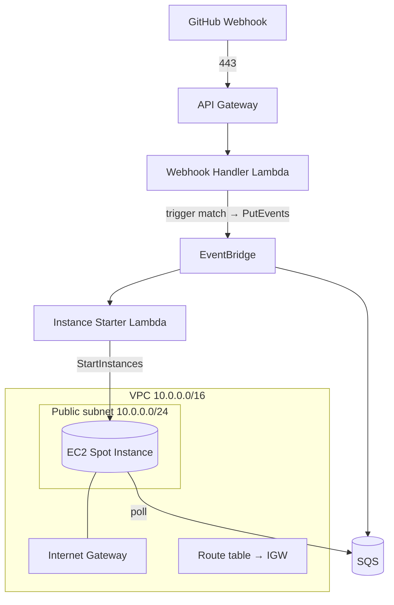

# Infrastructure

All infrastructure is provisioned with **AWS CloudFormation** — **no Terraform**. This document describes each AWS service, how it is used, the modular stack layout, networking, the persistent storage volume, and encryption.

Related: [Architecture](./architecture.md) · [Deployment](./deployment.md) · [Security](./security.md) · [Cost Optimisation](./cost-optimization.md).

---

## 1. Service Overview

| Service | Purpose | CloudFormation stack |
| --- | --- | --- |
| Amazon VPC | Network isolation (public subnet, IGW, route tables, SGs) | `network.yaml` |
| Amazon API Gateway | HTTPS ingress for webhooks **and registration** | `serverless.yaml` |
| AWS Lambda | Registration, webhook handler, instance starter, idle-shutdown | `serverless.yaml` |
| AWS Secrets Manager | GitHub PATs + per-repo webhook secrets | `serverless.yaml` |
| Amazon DynamoDB | Repository metadata store | `serverless.yaml` |
| Amazon EventBridge | Event bus for matched events + idle-shutdown timer | `serverless.yaml` |
| Amazon SQS | Durable event buffer + dead-letter queue | `serverless.yaml` |
| Amazon EC2 (Spot) | Ubuntu host running n8n + OpenClaw + Ollama | `compute.yaml` |
| Amazon EBS (gp3) | Persistent volume for models, n8n state, Repository Memory | `compute.yaml` |
| AWS IAM | Least-privilege roles and policies | each stack |
| Amazon CloudWatch | Logs, metrics, dashboards, alarms | `observability.yaml` |

All AI inference runs **locally via Ollama on the EC2 instance** — there is no managed inference service to provision.

---

## 2. Amazon VPC & Networking



- **Public subnet** hosts the EC2 Spot Instance so it can clone repositories, pull container images, and download model weights.
- **Internet Gateway** provides ingress for operator SSH and egress for outbound traffic.
- The webhook front door (API Gateway → Lambda → EventBridge → SQS) is serverless and reaches the instance only indirectly, by the instance **polling SQS**. No inbound webhook traffic hits the instance.

---

## 3. Security Groups

| Security group | Inbound | Outbound |
| --- | --- | --- |
| `instance-sg` (EC2) | **SSH (22) from operator CIDR(s) only** | 443 to GitHub, container registries, and AWS APIs |

- The **n8n UI (5678)** and **Ollama API (11434)** ports are **not** opened to the internet; access them via an SSH tunnel.
- SSH uses **key-pair authentication**; password authentication is disabled ([Security](./security.md)).
- Restrict the operator CIDR to known addresses; avoid `0.0.0.0/0`.

---

## 4. Amazon API Gateway

- Exposes **HTTPS** endpoints (managed TLS): a **webhook** route (GitHub deliveries) and a **registration** route (onboarding).
- The webhook route integrates with the **Webhook Handler Lambda**; the registration route with the **Registration Lambda**.
- Returns **HTTP 200** to GitHub immediately for both matched and ignored events.
- Stack outputs include `WebhookUrl` (for the GitHub webhook) and `RegistrationUrl`.

---

## 5. AWS Lambda

Four small functions form the serverless control plane. They are packaged as `provided.al2023` (custom runtime, `bootstrap` binary), preferably on **arm64** (Graviton).

| Function | Trigger | Responsibility |
| --- | --- | --- |
| `registration` | API Gateway (registration route) | Validate repo access + token permissions → create GitHub webhook → store metadata (DynamoDB) → store PAT + webhook secret (Secrets Manager) |
| `webhook-handler` | API Gateway (webhook route) | Resolve repo metadata → verify HMAC (per-repo secret) → **validate trigger** → publish matched events to EventBridge → return 200. **No analysis, inference, or PAT access.** |
| `instance-starter` | EventBridge (matched event) | Start the EC2 Spot Instance if stopped |
| `idle-shutdown` | EventBridge (idle timer) | Stop the EC2 Spot Instance after the configured idle timeout |

Least-privilege roles:

- `registration` — `secretsmanager:CreateSecret`/`PutSecretValue` (scoped to `blog-gen/repos/*`), `dynamodb:PutItem`/`UpdateItem` on the metadata table, CloudWatch Logs.
- `webhook-handler` — `dynamodb:GetItem` on the metadata table, `secretsmanager:GetSecretValue` on the per-repo **webhook secret**, `events:PutEvents` on the bus, CloudWatch Logs. **No PAT access.**
- `instance-starter` — `ec2:StartInstances`/`DescribeInstances` on the specific instance, CloudWatch Logs.
- `idle-shutdown` — `ec2:StopInstances`/`DescribeInstances` on the specific instance, CloudWatch Logs.

No Lambda performs content generation — that runs inside n8n/Ollama on EC2, which reads the PAT from Secrets Manager only when cloning.

---

## 5a. AWS Secrets Manager & Amazon DynamoDB

Onboarding introduces two managed stores.

**AWS Secrets Manager** holds each repository's **GitHub PAT** and **webhook signing secret** under a stable prefix (e.g. `blog-gen/repos/<owner>/<name>/pat` and `.../webhook-secret`). Secrets are KMS-encrypted; access is least-privilege and per-ARN. The PAT is **never** stored in DynamoDB, config, or logs ([Security §2](./security.md#2-github-pat--secret-storage)).

**Amazon DynamoDB** (`repositories` table, on-demand capacity, encrypted at rest) stores per-repository metadata: Repository ID, owner, name, URL, default branch, webhook ID, **trigger pattern**, enabled status, **secret reference (ARN)**, last processed commit SHA, and registration timestamp. It stores only the **reference** to the PAT secret — never the value ([Requirements §13](./requirements.md#13-repository-metadata-requirements)).

---

## 6. Amazon EventBridge

EventBridge is the central **event bus** and the extension point for future trigger sources.

- A **custom bus** receives `blog.publish.requested` events from the webhook handler on a trigger match.
- A **rule** routes those events to two targets:
  1. the **SQS `events` queue** (durable buffer for the run), and
  2. the **`instance-starter` Lambda** (start the Spot host if stopped).
- A separate **idle-timer rule** drives the **`idle-shutdown` Lambda** after `IDLE_TIMEOUT_MINUTES` of inactivity.
- Future trigger sources (releases, tags, PR labels, manual, scheduled) publish to the **same bus**, so the downstream pipeline is unchanged ([Roadmap](./roadmap.md), [TRG-7](./requirements.md#2-publishing-trigger-requirements)).

---

## 7. Amazon SQS

| Queue | Purpose |
| --- | --- |
| `events` | Durable buffer of matched events (delivered by EventBridge) |
| `events-dlq` | Dead-letter queue for messages that repeatedly fail |

- **Durability:** messages survive while the instance is stopped or booting, so **no matched event is lost during cold start** ([COST-8](./requirements.md#10-cost-optimisation-requirements)).
- **Visibility timeout** hides an in-flight message while n8n processes it; if the run fails or the Spot Instance is interrupted, the message reappears and is retried.
- **Redrive policy** routes messages exceeding the maximum receive count to the dead-letter queue.
- Encryption at rest (SSE) is enabled.

---

## 8. Amazon EC2 (Spot Instance)

- A **Spot Instance** running **Ubuntu**, chosen for its ~70–90% cost saving over On-Demand for this interruptible, batch-style workload.
- Runs **n8n**, **OpenClaw**, and **Ollama** (serving a local **Qwen** model) via **Docker Compose**.
- Bootstrapped by **user data** (`instance/user-data.sh`) that installs Docker + Docker Compose, mounts the persistent EBS volume, pulls the model into Ollama (first boot only), and starts the Compose stack.
- **Started on a matched event** (via EventBridge → instance-starter) and **stopped on idle** (via EventBridge → idle-shutdown).
- Attached instance profile grants only what the host needs: `sqs:ReceiveMessage`/`DeleteMessage`/`GetQueueAttributes` on the events queue and CloudWatch Logs.
- Key parameters: `InstanceType`, `SpotMaxPrice`, `KeyPairName`, `OllamaModel`, `IdleTimeoutMinutes`.

---

## 9. Amazon EBS (Persistent gp3 Volume)

- A **persistent gp3 volume** holds **Ollama model weights**, **n8n state and credentials**, **Repository Memory**, and **exported workflows**.
- The volume is **retained across start/stop cycles** (and independent of the Spot Instance lifecycle), so a restarted or replaced instance re-attaches it and is ready to infer **without re-downloading models** — and with its Repository Memory intact.
- Sized via `EbsVolumeSizeGb` (default 100 GB).
- Encrypted at rest.

**Repository Memory** is stored here as a persistent, per-repository record of prior analyses and published topics ([MEM requirements](./requirements.md#5-repository-memory-requirements)). Keeping it on EBS — rather than a managed database — is consistent with the self-hosted, minimal-managed-services design.

---

## 10. Amazon CloudWatch

- **Log groups** for `webhook-handler`, `instance-starter`, `idle-shutdown`, and the EC2 host (n8n), with bounded retention (`LogRetentionDays`, default 14).
- **Metrics** — a custom `BlogGenerator` namespace for triggered vs. ignored events, runs, successes, failures, latency, and queue depth, plus native AWS metrics.
- **Dashboard** — a single operational dashboard.
- **Alarms** — failure and error alarms. See [Monitoring](./monitoring.md).

---

## 11. AWS IAM

Every compute identity gets a dedicated, least-privilege role. No wildcards where an ARN can be named. Details and example policies: [Security → Least Privilege](./security.md#4-least-privilege).

---

## 12. CloudFormation Stacks

Templates are **modular and reusable** so each layer can be deployed and updated independently.

```text
infrastructure/
├── network.yaml         # VPC, public subnet, IGW, route tables, security groups
├── serverless.yaml      # API Gateway (webhook + registration), Lambdas (registration + handler + starter + idle-shutdown), Secrets Manager, DynamoDB, EventBridge bus + rules, SQS + DLQ, IAM
├── compute.yaml         # EC2 Spot request, gp3 EBS volume, instance profile, user data
└── observability.yaml   # CloudWatch log groups, metrics, alarms, dashboard
```

| Stack | Responsibility | Key outputs |
| --- | --- | --- |
| `network.yaml` | Networking and security groups | `VpcId`, `PublicSubnetId`, `InstanceSecurityGroupId` |
| `serverless.yaml` | Registration + webhook front door, secrets, metadata, event bus, queue | `WebhookUrl`, `RegistrationUrl`, `RepositoriesTableName`, `EventBusName`, `QueueUrl`, `DeadLetterQueueUrl` |
| `compute.yaml` | Spot host and persistent volume | `InstanceId`, `PersistentVolumeId` |
| `observability.yaml` | Logs, metrics, alarms | `DashboardName`, `LogGroupNames` |

Deploy order is **network → serverless → compute → observability**; the compute stack imports the queue and instance security group from earlier stacks.

---

## 13. Deployment Artifacts

- Lambda binaries are built (`GOOS=linux GOARCH=arm64`), zipped, and either uploaded to an S3 bucket for packaging or deployed inline.
- CloudFormation **manages stack state itself** — no remote state file or lock table.
- A failed update **rolls back automatically** to the last good state.

---

## 14. Encryption

| Layer | Mechanism |
| --- | --- |
| Secrets Manager (PATs, webhook secrets) | KMS-encrypted at rest |
| DynamoDB (repository metadata) | Encryption at rest |
| EBS (persistent volume + root) | Encrypted EBS |
| Amazon SQS | SSE at rest |
| In transit | TLS 1.2+ for the endpoints and all AWS API / GitHub calls |

The webhook endpoint (API Gateway) is **HTTPS only**; the instance's n8n and Ollama ports are never publicly exposed. KMS usage and rotation: [Security → Encryption](./security.md#5-encryption).
