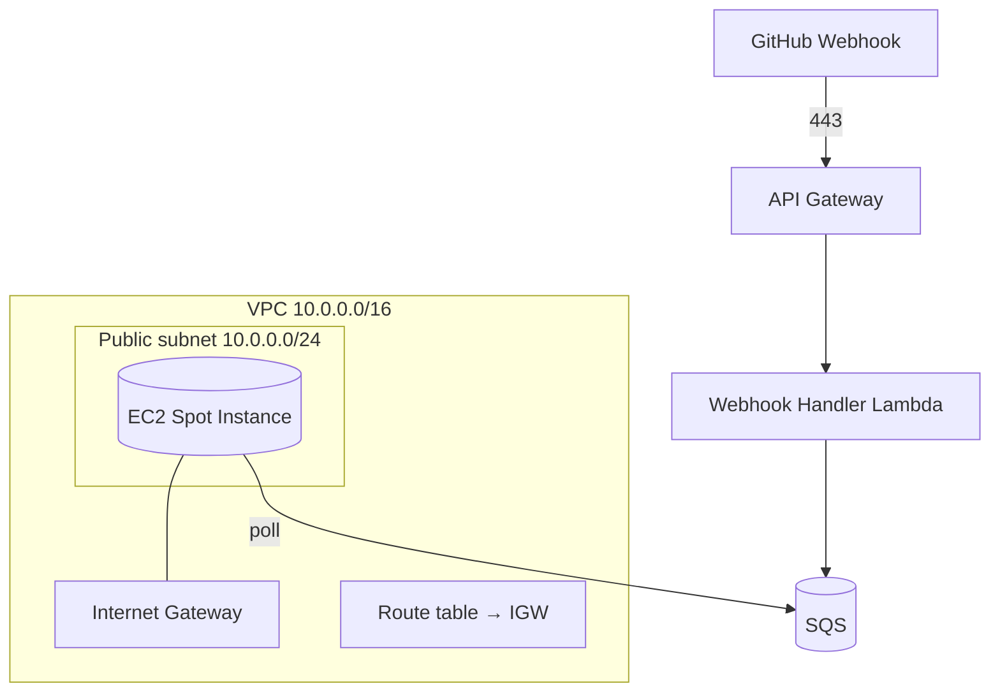

# Infrastructure

All infrastructure is provisioned with **AWS CloudFormation** — **no Terraform**. This document describes each AWS service, how it is used, the modular stack layout, networking, the persistent storage volume, and encryption.

Related: [Architecture](./architecture.md) · [Deployment](./deployment.md) · [Security](./security.md) · [Cost Optimisation](./cost-optimization.md).

---

## 1. Service Overview

| Service | Purpose | CloudFormation stack |
| --- | --- | --- |
| Amazon VPC | Network isolation (public subnet, IGW, route tables, SGs) | `network.yaml` |
| Amazon API Gateway | HTTPS webhook ingress | `serverless.yaml` |
| AWS Lambda | Webhook handler + idle-shutdown functions | `serverless.yaml` |
| Amazon SQS | Durable event buffer + dead-letter queue | `serverless.yaml` |
| Amazon EventBridge | Idle-shutdown timer | `serverless.yaml` |
| Amazon EC2 (Spot) | Ubuntu host running n8n + OpenClaw + Ollama | `compute.yaml` |
| Amazon EBS (gp3) | Persistent volume for models, n8n state, workflows | `compute.yaml` |
| AWS IAM | Least-privilege roles and policies | each stack |
| Amazon CloudWatch | Logs, metrics, dashboards, alarms | `observability.yaml` |

All AI inference runs **locally via Ollama on the EC2 instance** — there is no managed inference service to provision.

---

## 2. Amazon VPC & Networking



- **Public subnet** hosts the EC2 Spot Instance so it can clone repositories, pull container images, and download model weights.
- **Internet Gateway** provides ingress for operator SSH and egress for outbound traffic.
- **Route tables** wire the public subnet to the IGW.
- The webhook front door (API Gateway → Lambda → SQS) is serverless and reaches the instance only indirectly, by the instance **polling SQS**. No inbound webhook traffic hits the instance.

---

## 3. Security Groups

| Security group | Inbound | Outbound |
| --- | --- | --- |
| `instance-sg` (EC2) | **SSH (22) from operator CIDR(s) only** | 443 to GitHub, container registries, and AWS APIs |

- The **n8n UI (5678)** and **Ollama API (11434)** ports are **not** opened to the internet; access them via an SSH tunnel.
- SSH uses **key-pair authentication**; password authentication is disabled on the instance ([Security](./security.md)).
- Restrict the operator CIDR to known addresses; avoid `0.0.0.0/0`.

---

## 4. Amazon API Gateway

- Exposes a single **HTTPS** endpoint (managed TLS) that receives GitHub webhook deliveries.
- Integrated directly with the **Webhook Handler Lambda**.
- Returns the Lambda's **HTTP 200** to GitHub immediately so deliveries never time out.
- The invoke URL is a stack output (`WebhookUrl`) used when configuring the GitHub webhook.

---

## 5. AWS Lambda

Two small functions form the serverless control plane. They are packaged as `provided.al2023` (custom runtime, `bootstrap` binary), preferably on **arm64** (Graviton).

| Function | Trigger | Responsibility |
| --- | --- | --- |
| `webhook-handler` | API Gateway | Validate HMAC signature → enqueue payload in SQS → start the Spot Instance if stopped → return 200 |
| `idle-shutdown` | EventBridge (idle timer) | Stop the Spot Instance after the configured idle timeout |

Each has a least-privilege role:

- `webhook-handler` — `sqs:SendMessage` on the queue, `ec2:StartInstances` / `ec2:DescribeInstances` on the specific instance, CloudWatch Logs.
- `idle-shutdown` — `ec2:StopInstances` / `ec2:DescribeInstances` on the specific instance, CloudWatch Logs.

Neither Lambda performs content generation — that runs inside n8n/Ollama on EC2.

---

## 6. Amazon SQS

| Queue | Purpose |
| --- | --- |
| `events` | Durable buffer of validated webhook payloads |
| `events-dlq` | Dead-letter queue for messages that repeatedly fail |

- **Durability:** messages survive while the instance is stopped or booting, so **no event is lost during cold start** ([COST-7](./requirements.md#7-cost-optimisation-requirements)).
- **Visibility timeout** hides an in-flight message while n8n processes it; if the run fails or the Spot Instance is interrupted, the message reappears and is retried.
- **Redrive policy** routes messages that exceed the maximum receive count to the dead-letter queue for inspection.
- Encryption at rest (SSE) is enabled.

---

## 7. Amazon EventBridge

- An EventBridge rule drives the **idle-shutdown** timer, invoking the `idle-shutdown` Lambda to stop the instance after `IDLE_TIMEOUT_MINUTES` of inactivity ([Cost Optimisation](./cost-optimization.md#2-automatic-shutdown)).
- Content runs are **not** scheduled by EventBridge — they are triggered by GitHub Webhooks (or manual invocation).

---

## 8. Amazon EC2 (Spot Instance)

- A **Spot Instance** running **Ubuntu**, chosen for its ~70–90% cost saving over On-Demand for this interruptible, batch-style workload ([Spot trade-offs](../README.md#spot-instance-trade-offs)).
- Runs **n8n**, **OpenClaw**, and **Ollama** (serving a local **Qwen** model) via **Docker Compose**.
- Bootstrapped by **user data** (`instance/user-data.sh`) that installs Docker + Docker Compose, mounts the persistent EBS volume, pulls the model into Ollama (first boot only), and starts the Compose stack.
- **Started on demand** by the webhook handler Lambda and **stopped on idle** by the idle-shutdown Lambda.
- Attached instance profile grants only what the host needs: `sqs:ReceiveMessage`/`DeleteMessage`/`GetQueueAttributes` on the events queue and CloudWatch Logs.
- Key configuration parameters: `InstanceType`, `SpotMaxPrice`, `KeyPairName`, `OllamaModel`, `IdleTimeoutMinutes`.

---

## 9. Amazon EBS (Persistent gp3 Volume)

- A **persistent gp3 volume** holds **Ollama model weights**, **n8n state and credentials**, and **exported workflows**.
- The volume is **retained across start/stop cycles** (and independent of the Spot Instance lifecycle), so a restarted or replaced instance re-attaches it and is ready to infer **without re-downloading multi-gigabyte models**.
- Sized via `EbsVolumeSizeGb` (default 100 GB) — large enough for the chosen model plus headroom.
- Encrypted at rest.

This persistent-storage-with-ephemeral-compute split is the foundation of the cost model ([Cost Optimisation](./cost-optimization.md)).

---

## 10. Amazon CloudWatch

- **Log groups** for `webhook-handler`, `idle-shutdown`, and the EC2 host (n8n), with bounded retention (`LogRetentionDays`, default 14).
- **Metrics** — a custom `BlogGenerator` namespace for runs, successes, failures, latency, and queue depth, plus native AWS metrics.
- **Dashboard** — a single operational dashboard.
- **Alarms** — failure and error alarms. See [Monitoring](./monitoring.md).

---

## 11. AWS IAM

Every compute identity gets a dedicated, least-privilege role. No wildcards where an ARN can be named. Details and example policies: [Security → Least Privilege](./security.md#3-least-privilege).

---

## 12. CloudFormation Stacks

Templates are **modular and reusable** so each layer can be deployed and updated independently. A single template set serves multiple environments (`dev`/`prod`) via different parameter files.

```text
infrastructure/
├── network.yaml         # VPC, public subnet, IGW, route tables, security groups
├── serverless.yaml      # API Gateway, Lambda (handler + idle-shutdown), SQS + DLQ, EventBridge, IAM
├── compute.yaml         # EC2 Spot request, gp3 EBS volume, instance profile, user data
└── observability.yaml   # CloudWatch log groups, metrics, alarms, dashboard
```

| Stack | Responsibility | Key outputs |
| --- | --- | --- |
| `network.yaml` | Networking and security groups | `VpcId`, `PublicSubnetId`, `InstanceSecurityGroupId` |
| `serverless.yaml` | Webhook front door and queue | `WebhookUrl`, `QueueUrl`, `DeadLetterQueueUrl` |
| `compute.yaml` | Spot host and persistent volume | `InstanceId`, `EbsVolumeId` |
| `observability.yaml` | Logs, metrics, alarms | `DashboardName`, `LogGroupNames` |

Deploy order is **network → serverless → compute → observability**; the compute stack imports the queue and instance security group from the earlier stacks.

---

## 13. Deployment Artifacts

- Lambda binaries are built (`GOOS=linux GOARCH=arm64`), zipped, and either uploaded to an S3 bucket for packaging or deployed inline, depending on your pipeline.
- CloudFormation **manages stack state itself** — there is no remote state file or lock table to provision.
- A failed update **rolls back automatically** to the last good state.

---

## 14. Encryption

| Layer | Mechanism |
| --- | --- |
| EBS (persistent volume + root) | Encrypted EBS |
| Amazon SQS | SSE at rest |
| In transit | TLS 1.2+ for the webhook endpoint and all AWS API / GitHub calls |
| Secrets (webhook secret, tokens) | Provided via environment/secret configuration, never committed |

The webhook endpoint (API Gateway) is **HTTPS only**; the instance's n8n and Ollama ports are never publicly exposed. KMS usage and rotation: [Security → Encryption](./security.md#4-encryption).
