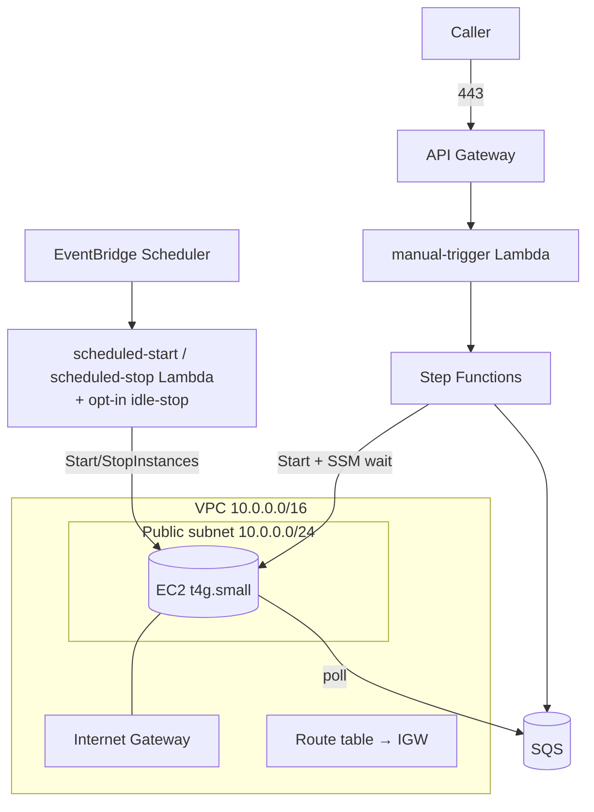

# Infrastructure

All infrastructure is provisioned with **AWS CloudFormation** — **no Terraform**. This document describes each AWS service, how it is used, the modular stack layout, networking, the persistent storage volume, and encryption.

Related: [Architecture](./architecture.md) · [Deployment](./deployment.md) · [Security](./security.md) · [Cost Optimisation](./cost-optimization.md).

---

## 1. Service Overview

| Service | Purpose | CloudFormation stack |
| --- | --- | --- |
| Amazon VPC | Network isolation (public subnet, IGW, route tables, SGs) | `network.yaml` |
| Amazon API Gateway | HTTPS ingress: registration, manual `POST /process`, and `POST /release-context` | `serverless.yaml` |
| AWS Lambda | Registration, manual-trigger, release-context (`serverless.yaml`); scheduled-start, scheduled-stop, idle-stop (`scheduler.yaml`) | `serverless.yaml` / `scheduler.yaml` |
| AWS Step Functions | Orchestration state machine — start host, wait for SSM ready, enqueue the job; plus the opt-in **video** state machine (render → manifest) | `serverless.yaml` / `video.yaml` |
| Amazon ECS Fargate + ECR + Polly | Opt-in social-video rendering (`GenerateSocialVideos`): FFmpeg + Amazon Polly renderer image on Fargate | `video.yaml` |
| AWS Secrets Manager | Shared secret holding all repos' PATs (JSON keyed by owner/name) + the Anthropic API key | `serverless.yaml` |
| Amazon DynamoDB | Repository metadata store | `serverless.yaml` |
| Amazon EventBridge Scheduler | Daily start/stop schedules (owns instance power-off) | `scheduler.yaml` |
| Amazon SQS | Durable job buffer + dead-letter queue | `serverless.yaml` |
| Amazon Bedrock | Claude Opus 4.8 inference (Provider Router primary; no resource to provision) | — |
| Amazon EC2 (On-Demand, t4g.small) | Ubuntu arm64 host running the worker + n8n + PostgreSQL + Redis | `compute.yaml` |
| Amazon S3 | Generated artifacts (idempotent — existing Markdown is reused) | bootstrap / `compute.yaml` |
| Amazon EBS (gp3) | Persistent volume for n8n + PostgreSQL state, Repository Memory | `compute.yaml` |
| AWS IAM | Least-privilege roles and policies | each stack |
| Amazon CloudWatch | Logs, metrics, dashboards, alarms | `observability.yaml` |

AI inference runs on **Amazon Bedrock** (Claude Opus 4.8), with the **Anthropic API** as the Provider Router's fallback leg — there is no local model server to provision. See [AI Provider Router](./hybrid-ai-routing.md).

---

## 2. Amazon VPC & Networking



- **Public subnet** hosts the EC2 instance so it can clone repositories, pull container images, and reach Bedrock/Anthropic.
- **Internet Gateway** provides ingress for operator SSH and egress for outbound traffic.
- The front door (API Gateway → Lambda → Step Functions → SQS) is serverless and reaches the instance only indirectly, by the instance **polling SQS**. The state machine's only inbound touch is the **SSM** readiness signal (via the instance role, not an open port).

---

## 3. Security Groups

| Security group | Inbound | Outbound |
| --- | --- | --- |
| `instance-sg` (EC2) | **SSH (22) from operator CIDR(s) only** | 443 to GitHub, container registries, Bedrock/Anthropic, and AWS APIs |

- The **n8n UI (5678)** port is **not** opened to the internet; access it via an SSH tunnel.
- SSH uses **key-pair authentication**; password authentication is disabled ([Security](./security.md)).
- Restrict the operator CIDR to known addresses; avoid `0.0.0.0/0`.

---

## 4. Amazon API Gateway

- Exposes **HTTPS** endpoints (managed TLS): a **registration** route (onboarding), a **`POST /process`** route (the Step Functions trigger), and a **`POST /release-context`** route.
- `POST /process` integrates with the **manual-trigger Lambda**; registration with the **Registration Lambda**; `/release-context` with the **release-context Lambda**.
- All routes require an **API key** (`x-api-key`) via the shared usage plan. See [Manual Trigger](./manual-trigger.md).
- `POST /process` returns **202** (the Step Functions execution has started; the host is started on demand).
- Stack outputs include `RegistrationUrl`, `ProcessUrl`, `ReleaseContextUrl`, and `StateMachineArn`.

---

## 5. AWS Lambda & Step Functions

Small functions form the serverless control plane (three request Lambdas in `serverless.yaml`, three scheduler Lambdas in `scheduler.yaml`), plus the **Step Functions state machine**. Lambdas are packaged as `provided.al2023` (custom runtime, `bootstrap` binary) on **arm64** (Graviton).

| Function | Trigger | Responsibility |
| --- | --- | --- |
| `registration` | API Gateway (registration route) | Validate repo access + token permissions → store metadata (DynamoDB) → store PAT (Secrets Manager) |
| `manual-trigger` | API Gateway (`POST /process`, API key) | Validate the JSON request → **StartExecution** on the state machine → **202**. No analysis, inference, or PAT access. See [Manual Trigger](./manual-trigger.md). |
| `release-context` | API Gateway (`POST /release-context`, API key) | Build + persist the structured Release Context |
| `scheduled-start` | EventBridge Scheduler (18:00 daily) | Start the On-Demand instance if stopped (idempotent) |
| `scheduled-stop` | EventBridge Scheduler (20:00 daily) | Stop the On-Demand instance if running (idempotent) |
| `idle-stop` | EventBridge rule (opt-in) | Stop the instance after sustained idleness (CPU/network + n8n checks) |

**Orchestration state machine** (`OrchestrationStateMachine`) — started by `manual-trigger`. It resolves the host by `Project` tag (`ec2:DescribeInstances`), starts it (`ec2:StartInstances`), polls `ssm:DescribeInstanceInformation` until the instance is `Online`, then `sqs:SendMessage` to hand the job to the worker.

Least-privilege roles:

- `registration` — `secretsmanager:GetSecretValue`/`PutSecretValue` on the shared secret, DynamoDB item ops on the metadata table, CloudWatch Logs.
- `manual-trigger` — `states:StartExecution` on the state machine, CloudWatch Logs. **No PAT access; no EC2 access.**
- `StateMachineRole` — `ec2:DescribeInstances`, tag-scoped `ec2:StartInstances`, `ssm:DescribeInstanceInformation`, `sqs:SendMessage` on the events queue.
- `scheduled-start` / `scheduled-stop` — `ec2:StartInstances`/`StopInstances` on the specific instance ARN + `ec2:DescribeInstances`, CloudWatch Logs.

No Lambda performs content generation — that runs in the **worker** on EC2, which reads the PAT from Secrets Manager only when cloning and calls Bedrock/Anthropic via the instance role.

---

## 5a. AWS Secrets Manager & Amazon DynamoDB

Onboarding introduces two managed stores.

**AWS Secrets Manager** holds a **shared secret** — `blog-gen/github/repositories` — whose value is a JSON object keyed by `"<owner>/<name>"`, each entry holding the repo's PAT. Registration read-modify-writes it (store retry, plus optional single-writer reserved concurrency); the worker reads it and indexes by key. Two more secrets hold the **Anthropic API key** (`blog-gen/anthropic/api-key`) and the **SMTP password** (`blog-gen/notifications/smtp-password`). All are KMS-encrypted, least-privilege, per-ARN. The PAT is **never** stored in DynamoDB, config, or logs. Full detail: [Registration](./registration.md) · [Security §2](./security.md#2-github-pat--secret-storage).

**Amazon DynamoDB** (`repositories` table, on-demand capacity, encrypted at rest) stores per-repository metadata: Repository ID, owner, name, URL, default branch, **trigger pattern**, enabled status, **secret reference (ARN)**, last processed commit SHA, and registration timestamp. It stores only the **reference** to the PAT secret — never the value ([Requirements §13](./requirements.md#13-repository-metadata-requirements)).

---

## 6. AWS Step Functions

Step Functions is the **control plane** for every run and the extension point for future trigger sources.

- `POST /process` (via the manual-trigger Lambda) **starts an execution**; future sources (CLI, Slack, cron, release webhooks) can start the **same** state machine, so the downstream pipeline is unchanged.
- The machine owns the compute-host **lifecycle-up** (find by tag → start → SSM ready gate) and the **job hand-off** (SendMessage to SQS). Instance power-**off** is owned by the scheduler stack.
- The state machine has a `TimeoutSeconds` guard so a host that never reports ready does not loop forever.

See [Scheduling](./scheduling.md) for the power-off side.

---

## 7. Amazon SQS

| Queue | Purpose |
| --- | --- |
| `events` | Durable buffer of jobs (delivered by the state machine) |
| `events-dlq` | Dead-letter queue for messages that repeatedly fail |

- **Durability:** a job survives while the instance boots, so it is **not lost** — the worker drains it once the host is up.
- **Visibility timeout** (3600 s) hides an in-flight message for the whole content-suite run so a slow-but-succeeding message is not redelivered and reprocessed.
- **Redrive policy** routes messages exceeding the maximum receive count to the dead-letter queue.
- Encryption at rest (SSE) is enabled.

---

## 8. Amazon EC2 (On-Demand Instance)

- An **On-Demand t4g.small** instance (Ubuntu **arm64**/Graviton). On-Demand (not Spot) is used so a start always succeeds; the tiny instance and idle-stop keep cost low. See [Cost Optimisation §5](./cost-optimization.md#5-on-demand-on-a-schedule-not-spot).
- Runs the **worker** (content generator), **n8n**, **PostgreSQL**, and **Redis** via **Docker Compose**. No GPU, no local model.
- Bootstrapped by **user data** that installs Docker + Docker Compose, mounts the persistent EBS volume, brings up the n8n/PostgreSQL/Redis compose stack, installs the worker binary from S3, and keeps the SSM agent running (for the state machine's readiness gate).
- **Started on demand** by the Step Functions state machine and **stopped** on the daily schedule / idle-stop — see `scheduler.yaml`.
- Attached instance profile grants only what the host needs: `sqs:ReceiveMessage`/`DeleteMessage`/`GetQueueAttributes`, `s3:GetObject`/`PutObject` on the content bucket, `bedrock:InvokeModel`, `secretsmanager:GetSecretValue`, `AmazonSSMManagedInstanceCore`, and CloudWatch Logs.
- Key parameters: `InstanceType` (arm64), `KeyPairName`, `BedrockModelId`, `AnthropicModel`, `EbsVolumeSizeGb`; the schedule window is set on the scheduler stack (`StartExpression`, `StopExpression`, `ScheduleTimezone`).

---

## 9. Amazon EBS (Persistent gp3 Volume)

- A **persistent gp3 volume** holds **PostgreSQL data**, **n8n state and credentials**, and **Repository Memory**.
- The volume is **retained across the daily start/stop cycles** (and independent of the instance lifecycle), so a restarted or replaced instance re-attaches it with its state and Repository Memory intact.
- **Attached at boot, not by CloudFormation.** The instance locates the volume by its `Project`/`Name` tags and attaches it in user data (granted `ec2:AttachVolume`), retrying until it is free. This deliberately avoids an `AWS::EC2::VolumeAttachment` resource: a single retained volume managed that way makes **every instance-replacing update fail** with `volume already attached`. Boot-time attach lets the old instance terminate first, then the new one claims the volume — so replacements are seamless.
- Sized via `EbsVolumeSizeGb` (default 20 GB — no model weights to store anymore).
- Encrypted at rest.

**Repository Memory** is stored here as a persistent, per-repository record of prior analyses and published topics ([MEM requirements](./requirements.md#5-repository-memory-requirements)). Generated artifacts go to **Amazon S3**, where the idempotency check reuses them on re-runs.

---

## 10. Amazon CloudWatch

- **Log groups** for `registration`, `manual-trigger`, `release-context`, `scheduled-start`, `scheduled-stop`, and the EC2 host (worker + n8n), with bounded retention (`LogRetentionDays`, default 14).
- **Metrics** — a custom `BlogGenerator` namespace for runs, successes, failures, latency, and queue depth, plus native AWS metrics.
- **Dashboard** — a single operational dashboard.
- **Alarms** — failure and error alarms. See [Monitoring](./monitoring.md).

---

## 11. AWS IAM

Every compute identity gets a dedicated, least-privilege role. No wildcards where an ARN can be named. Details and example policies: [Security → Least Privilege](./security.md#4-least-privilege).

---

## 12. CloudFormation Stacks

Templates are **modular and reusable** so each layer can be deployed and updated independently.

```text
infrastructure/
├── network.yaml         # VPC, public subnet, IGW, route tables, security groups
├── serverless.yaml      # API Gateway (registration + /process + /release-context), Lambdas, Step Functions state machine, Secrets Manager, DynamoDB, SQS + DLQ, IAM
├── compute.yaml         # On-Demand t4g.small instance, gp3 EBS volume, instance profile, user data
├── scheduler.yaml       # EventBridge Scheduler (daily start/stop) + scheduled-start/scheduled-stop/idle-stop Lambdas + roles
└── observability.yaml   # CloudWatch log groups, metrics, alarms, dashboard
```

| Stack | Responsibility | Key outputs |
| --- | --- | --- |
| `network.yaml` | Networking and security groups | `VpcId`, `PublicSubnetId`, `InstanceSecurityGroupId` |
| `serverless.yaml` | Registration + `/process` front door, secrets, metadata, state machine, queue | `RegistrationUrl`, `ProcessUrl`, `StateMachineArn`, `RepositoriesTableName`, `QueueUrl`, `DeadLetterQueueUrl` |
| `compute.yaml` | On-Demand host and persistent volume | `InstanceId`, `PersistentVolumeId` |
| `scheduler.yaml` | Daily power schedules + start/stop Lambdas (owns instance power-off) | `StartFunctionArn`, `StopFunctionArn`, `ScheduleWindow` |
| `observability.yaml` | Logs, metrics, alarms | `DashboardName`, `LogGroupNames` |

Deploy order is **network → serverless → compute → scheduler → observability**; the compute stack imports the queue and instance security group from earlier stacks, and the scheduler stack takes the compute stack's `InstanceId`. The opt-in **`video.yaml`** stack (social-video rendering) deploys last, imports the network VPC/subnet, and is gated on `ENABLE_VIDEO=true` — see [Social Video](./social-video.md).

---

## 13. Deployment Artifacts

- Lambda **and worker** binaries are built (`GOOS=linux GOARCH=arm64`), zipped (Lambdas), and uploaded to an S3 bucket for packaging.
- CloudFormation **manages stack state itself** — no remote state file or lock table.
- A failed update **rolls back automatically** to the last good state.

---

## 14. Encryption

| Layer | Mechanism |
| --- | --- |
| Secrets Manager (PATs, Anthropic key, SMTP password) | KMS-encrypted at rest |
| DynamoDB (repository metadata) | Encryption at rest |
| EBS (persistent volume + root) | Encrypted EBS |
| Amazon S3 (artifacts) | SSE-KMS at rest |
| Amazon SQS | SSE at rest |
| In transit | TLS 1.2+ for the endpoints and all AWS API / GitHub / Bedrock / Anthropic calls |

The API Gateway endpoints are **HTTPS only**; the instance's n8n port is never publicly exposed. KMS usage and rotation: [Security → Encryption](./security.md#5-encryption).
