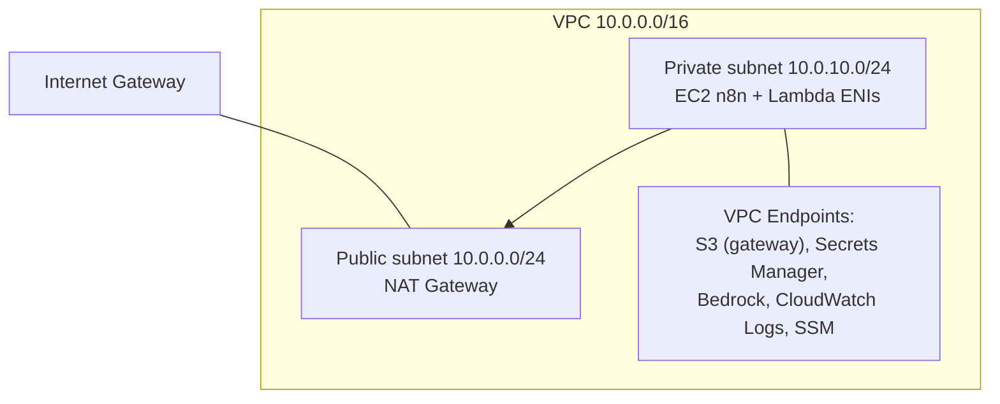

# Infrastructure

All infrastructure is provisioned with **Terraform**. This document describes each AWS service, how it's used, the Terraform module layout, remote state, networking, and encryption.

Related: [Architecture](./architecture.md) · [Deployment](./deployment.md) · [Security](./security.md) · [Cost Optimization](./cost-optimization.md).

---

## 1. Service Overview

| Service | Purpose | Terraform module |
| --- | --- | --- |
| Amazon Bedrock | Foundation model inference | referenced by IAM + EC2/Lambda |
| Amazon EC2 | n8n orchestration host | `modules/ec2` |
| AWS Lambda | Go functions (clone/analyze/publish) | `modules/lambda` |
| Amazon S3 | Artifacts, posts, Terraform state | `modules/s3` |
| Amazon EventBridge | Scheduling + EC2 start/stop | `modules/eventbridge` |
| Amazon CloudWatch | Logs, metrics, dashboards, alarms | `modules/monitoring` |
| AWS Secrets Manager | Credentials and tokens | `modules/secrets` |
| AWS IAM | Roles and policies | `modules/iam` |
| Amazon VPC | Network isolation | `modules/networking` |
| Amazon DynamoDB | Terraform state locking | bootstrap |

---

## 2. Amazon Bedrock

- Provides foundation-model inference for blog generation via `bedrock-runtime:InvokeModel`.
- The model ID/inference profile and parameters (`max_tokens`, `temperature`) are Terraform variables, so the model can be swapped without code changes ([FR-9.2](./requirements.md#19-amazon-bedrock-integration)).
- Access is granted narrowly via IAM to the n8n instance role (and/or the generation Lambda), scoped to the specific model ARN(s).
- **Model access must be requested** in the Bedrock console per Region before first use ([Deployment §1](./deployment.md#1-aws-prerequisites)).

---

## 3. Amazon EC2

- Single instance (default `t3.small`) running **n8n via Docker Compose** in a **private subnet**.
- No public IP and no inbound SSH; administrative access via **SSM Session Manager**.
- Bootstrapped with user-data that installs Docker, pulls the n8n image, and starts the stack.
- Managed by EventBridge start/stop schedule to control cost ([Cost Optimization](./cost-optimization.md#1-ec2-scheduling)).
- Attached IAM instance profile grants Bedrock invoke, Lambda invoke, S3 access, Secrets Manager read, and CloudWatch.

---

## 4. AWS Lambda

Three Go functions, packaged as `provided.al2023` (custom runtime, `bootstrap` binary), preferably on **arm64** (Graviton) for cost/performance.

| Function | Trigger | Responsibility |
| --- | --- | --- |
| `repo-cloner` | n8n | Clone repo → normalize → upload to artifacts bucket |
| `repo-analyzer` | n8n | Discover/rank files, extract metadata, detect tech, build prompt |
| `blog-publisher` | n8n | Render Markdown, version, write to posts bucket, emit metrics |

Each has its own least-privilege role, dedicated CloudWatch log group, configurable memory/timeout, and (optionally) VPC access via endpoints.

---

## 5. Amazon S3

| Bucket | Contents | Config |
| --- | --- | --- |
| `<prefix>-artifacts` | Cloned snapshots / intermediates | SSE, block public access, lifecycle expire (default 7d) |
| `<prefix>-posts` | Generated Markdown | **Versioning on**, SSE, lifecycle IA/Glacier |
| `<prefix>-tfstate` | Terraform state | Versioning on, SSE, TLS-only, DynamoDB lock |

All buckets: **Block Public Access = ON**, default encryption enabled, and bucket policies requiring `aws:SecureTransport`. See [Storage Architecture](./architecture.md#7-storage-architecture).

---

## 6. Amazon EventBridge

- **Generation schedule** — a rule (cron/rate) triggers the ingestion workflow.
- **EC2 start/stop** — scheduled rules invoke a small start/stop mechanism to keep the n8n host off outside operating hours.
- Rules and schedules are declared in `modules/eventbridge` and configured via variables.

---

## 7. Amazon CloudWatch

- **Log groups** per Lambda and for n8n, with bounded retention (`log_retention_days`, default 14).
- **Metrics** — custom namespace (`BlogGenerator`) for runs, successes, failures, latency, and token usage.
- **Dashboard** — a single operational dashboard.
- **Alarms** — failure-rate and error alarms wired to SNS. See [Monitoring](./monitoring.md).

---

## 8. AWS Secrets Manager

Stores the GitHub token, n8n credentials/encryption key, and notification secrets. Terraform creates the secret resources; values are populated out of band ([Deployment §4](./deployment.md#4-secrets)). Rotation and access policy: [Security](./security.md#2-secrets-management).

---

## 9. AWS IAM

Every compute identity gets a dedicated, least-privilege role. No wildcards on resources where an ARN can be specified. Details and example policies: [Security → Least Privilege](./security.md#3-least-privilege).

---

## 10. Networking (VPC, Subnets, Endpoints)



- **Public subnet:** NAT gateway + internet gateway for controlled egress (GitHub, image pulls).
- **Private subnet:** EC2 and Lambda ENIs; no inbound from the internet.
- **VPC endpoints** keep S3/Secrets Manager/Bedrock/Logs/SSM traffic on the AWS network.

### 7. Security Groups

| Security group | Inbound | Outbound |
| --- | --- | --- |
| `n8n-sg` (EC2) | None from internet; SSM only | 443 to AWS endpoints; 443 to GitHub via NAT |
| `lambda-sg` | None | 443 to endpoints/services |
| `vpce-sg` | 443 from `n8n-sg`, `lambda-sg` | — |

---

## 11. Terraform Modules

```text
terraform/
├── backend.tf        # S3 + DynamoDB remote state
├── providers.tf      # AWS provider, default tags
├── main.tf           # module composition
├── variables.tf
├── outputs.tf
└── modules/
    ├── networking/   # VPC, subnets, NAT, IGW, endpoints, SGs
    ├── ec2/          # n8n host, instance profile, user-data
    ├── lambda/       # 3 Go functions, roles, log groups
    ├── s3/           # buckets, versioning, lifecycle, policies
    ├── eventbridge/  # schedules + EC2 start/stop rules
    ├── secrets/      # Secrets Manager resources
    ├── iam/          # roles and policies
    └── monitoring/   # dashboards, alarms, log retention
```

Each module exposes typed variables and outputs and is composed in `main.tf`. Modules are independently reviewable and reusable across environments (`dev`/`prod`) via workspaces or `-var-file`.

---

## 12. Remote State

- **Backend:** S3 (versioned, encrypted) + **DynamoDB** for state locking.
- Created once by `scripts/bootstrap.sh` before the first `terraform init` ([Deployment §2](./deployment.md#2-bootstrap-remote-state)).
- State is never committed to git; the state key is `blog-generator/terraform.tfstate`.

---

## 13. Encryption

| Layer | Mechanism |
| --- | --- |
| S3 (all buckets) | SSE (SSE-S3 or SSE-KMS); TLS-only bucket policy |
| EBS (EC2) | Encrypted volumes |
| Secrets Manager | KMS-encrypted at rest |
| In transit | TLS 1.2+ for all AWS API and GitHub calls |
| Terraform state | Encrypted S3 + versioning |

KMS key usage and rotation: [Security → Encryption](./security.md#4-encryption).
