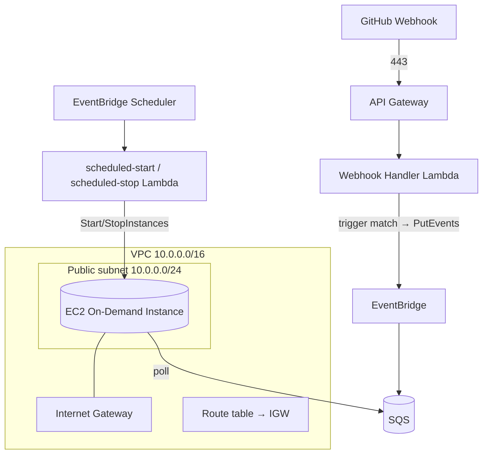

# Infrastructure

All infrastructure is provisioned with **AWS CloudFormation** — **no Terraform**. This document describes each AWS service, how it is used, the modular stack layout, networking, the persistent storage volume, and encryption.

Related: [Architecture](./architecture.md) · [Deployment](./deployment.md) · [Security](./security.md) · [Cost Optimisation](./cost-optimization.md).

---

## 1. Service Overview

| Service | Purpose | CloudFormation stack |
| --- | --- | --- |
| Amazon VPC | Network isolation (public subnet, IGW, route tables, SGs) | `network.yaml` |
| Amazon API Gateway | HTTPS ingress: webhook, registration, and manual `POST /process` | `serverless.yaml` |
| AWS Lambda | Registration, webhook handler, manual-trigger (`serverless.yaml`); scheduled-start, scheduled-stop (`scheduler.yaml`) | `serverless.yaml` / `scheduler.yaml` |
| AWS Secrets Manager | One shared secret holding all repos' PAT + webhook secret (JSON keyed by owner/name) | `serverless.yaml` |
| Amazon DynamoDB | Repository metadata store | `serverless.yaml` |
| Amazon EventBridge | Event bus for matched events | `serverless.yaml` |
| Amazon EventBridge Scheduler | Weekday start/stop schedules (owns instance power) | `scheduler.yaml` |
| Amazon SQS | Durable event buffer + dead-letter queue | `serverless.yaml` |
| Amazon EC2 (On-Demand) | Ubuntu host running n8n + OpenClaw + Ollama | `compute.yaml` |
| Amazon EBS (gp3) | Persistent volume for models, n8n state, Repository Memory | `compute.yaml` |
| AWS IAM | Least-privilege roles and policies | each stack |
| Amazon CloudWatch | Logs, metrics, dashboards, alarms | `observability.yaml` |

All AI inference runs **locally via Ollama on the EC2 instance** — there is no managed inference service to provision.

---

## 2. Amazon VPC & Networking



- **Public subnet** hosts the EC2 instance so it can clone repositories, pull container images, and download model weights.
- **Internet Gateway** provides ingress for operator SSH and egress for outbound traffic.
- The webhook front door (API Gateway → Lambda → EventBridge → SQS) is serverless and reaches the instance only indirectly, by the instance **polling SQS**. No inbound webhook traffic hits the instance.

---

## 3. Security Groups

| Security group | Inbound | Outbound |
| --- | --- | --- |
| `instance-sg` (EC2) | **SSH (22) from operator CIDR(s) only** | 443 to GitHub, container registries, and AWS APIs |

- The **n8n UI (5678)** and **Ollama API (11434)** ports are **not** opened to the internet; access them via an SSH tunnel.
- SSH uses **key-pair authentication**; password authentication is disabled ([Security](./security.md)).
- Restrict the operator CIDR to known addresses; avoid `0.0.0.0/0`.

---

## 4. Amazon API Gateway

- Exposes **HTTPS** endpoints (managed TLS): a **webhook** route (GitHub deliveries), a **registration** route (onboarding), and a **`POST /process`** route (the manual trigger).
- The webhook route integrates with the **Webhook Handler Lambda**; the registration route with the **Registration Lambda**; `POST /process` with the **Manual Trigger Lambda**.
- The webhook route is public (HMAC-verified); the **registration** and **`/process`** routes require an **API key** (`x-api-key`) via the shared usage plan. See [Manual Trigger](./manual-trigger.md).
- Returns **HTTP 200** to GitHub immediately for both matched and ignored events; `POST /process` returns **202** (accepted) or **503** (outside the operating window).
- Stack outputs include `WebhookUrl`, `RegistrationUrl`, and `ProcessUrl`.

---

## 5. AWS Lambda

Five small functions form the serverless control plane (three in `serverless.yaml`, two in `scheduler.yaml`). They are packaged as `provided.al2023` (custom runtime, `bootstrap` binary), preferably on **arm64** (Graviton). The webhook and manual triggers share the trigger-agnostic `internal/intake` core (publish + window policy), so neither duplicates orchestration.

| Function | Trigger | Responsibility |
| --- | --- | --- |
| `registration` | API Gateway (registration route) | Validate repo access + token permissions → create GitHub webhook → store metadata (DynamoDB) → store PAT + webhook secret (Secrets Manager) |
| `webhook-handler` | API Gateway (webhook route) | Resolve repo metadata → verify HMAC (webhook secret from the shared secret) → **validate trigger** → hand to `intake.Service` (buffer policy) → report `accepted`/`deferred` → return 200. **No analysis, inference, or PAT access, and it never starts the instance.** |
| `manual-trigger` | API Gateway (`POST /process`, API key) | Validate JSON request → hand to `intake.Service` (reject policy) → **202 accepted** in-window, **503 rejected** outside it. Never starts the instance. See [Manual Trigger](./manual-trigger.md). |
| `scheduled-start` | EventBridge Scheduler (18:00 Mon–Fri) | Start the On-Demand instance if stopped (idempotent) |
| `scheduled-stop` | EventBridge Scheduler (20:00 Mon–Fri) | Stop the On-Demand instance if running (idempotent) |

Least-privilege roles:

- `registration` — `secretsmanager:GetSecretValue`/`PutSecretValue` on the **single** shared secret, `dynamodb:PutItem`/`UpdateItem`/`GetItem`/`DeleteItem` on the metadata table, CloudWatch Logs. Runs with **reserved concurrency 1** (single writer for the shared secret).
- `webhook-handler` — `dynamodb:GetItem` on the metadata table, `secretsmanager:GetSecretValue` on the per-repo **webhook secret**, `events:PutEvents` on the bus, read-only `ec2:DescribeInstances`, CloudWatch Logs. **No PAT access; no start/stop.**
- `manual-trigger` — `events:PutEvents` on the bus, read-only `ec2:DescribeInstances` (window gate), CloudWatch Logs. **No start/stop.**
- `scheduled-start` — `ec2:StartInstances` on the specific instance ARN + `ec2:DescribeInstances`, CloudWatch Logs.
- `scheduled-stop` — `ec2:StopInstances` on the specific instance ARN + `ec2:DescribeInstances`, CloudWatch Logs.

No Lambda performs content generation — that runs inside n8n/Ollama on EC2, which reads the PAT from Secrets Manager only when cloning.

---

## 5a. AWS Secrets Manager & Amazon DynamoDB

Onboarding introduces two managed stores.

**AWS Secrets Manager** holds **one shared secret** — `blog-gen/github/repositories` — whose value is a JSON object keyed by `"<owner>/<name>"`, each entry `{"pat":…,"webhook_secret":…}`. Registration read-modify-writes it (single writer via reserved concurrency 1); the webhook handler and worker read it and index by key. One secret regardless of repo count. It is KMS-encrypted; access is least-privilege and per-ARN. The PAT is **never** stored in DynamoDB, config, or logs. Full detail: [Registration](./registration.md) · [Security §2](./security.md#2-github-pat--secret-storage).

**Amazon DynamoDB** (`repositories` table, on-demand capacity, encrypted at rest) stores per-repository metadata: Repository ID, owner, name, URL, default branch, webhook ID, **trigger pattern**, enabled status, **secret reference (ARN)**, last processed commit SHA, and registration timestamp. It stores only the **reference** to the PAT secret — never the value ([Requirements §13](./requirements.md#13-repository-metadata-requirements)).

---

## 6. Amazon EventBridge

EventBridge is the central **event bus** and the extension point for future trigger sources.

- A **custom bus** receives `blog.publish.requested` events from any trigger source (the webhook handler and the manual `/process` trigger today).
- A **rule** routes those events to a single target: the **SQS `events` queue** (durable buffer for the run). Its pattern matches the `${ProjectName}.` **source prefix**, so new trigger sources route with no rule change. There is **no** start-on-event target — instance power is owned by the scheduler stack.
- Instance start/stop is handled separately by **EventBridge Scheduler** (in `scheduler.yaml`): two weekday schedules invoke the `scheduled-start`/`scheduled-stop` Lambdas. See [Scheduling](./scheduling.md).
- Future trigger sources (releases, tags, PR labels, manual, scheduled) publish to the **same bus**, so the downstream pipeline is unchanged ([Roadmap](./roadmap.md), [TRG-7](./requirements.md#2-publishing-trigger-requirements)).

---

## 7. Amazon SQS

| Queue | Purpose |
| --- | --- |
| `events` | Durable buffer of matched events (delivered by EventBridge) |
| `events-dlq` | Dead-letter queue for messages that repeatedly fail |

- **Durability:** messages survive while the instance is stopped (outside its window) or booting, so **no matched event is lost** — the backlog is drained at the next scheduled start ([COST-8](./requirements.md#10-cost-optimisation-requirements)).
- **Visibility timeout** hides an in-flight message while n8n processes it; if the run fails or the instance stops at 20:00 mid-run, the message reappears and is retried.
- **Redrive policy** routes messages exceeding the maximum receive count to the dead-letter queue.
- Encryption at rest (SSE) is enabled.

---

## 8. Amazon EC2 (On-Demand Instance)

- An **On-Demand Instance** running **Ubuntu**. On-Demand (not Spot) is used so a scheduled start always succeeds and the host stays up for the whole window — the fixed weekday window already caps compute cost, so Spot's discount buys little. See [Cost Optimisation §5](./cost-optimization.md#5-on-demand-on-a-schedule-not-spot).
- Runs **n8n**, **OpenClaw**, and **Ollama** (serving a local **Qwen** model) via **Docker Compose**.
- Bootstrapped by **user data** (`instance/user-data.sh`) that installs Docker + Docker Compose, mounts the persistent EBS volume, pulls the model into Ollama (first boot only), and starts the Compose stack.
- **Started/stopped on the weekday schedule** by EventBridge Scheduler (scheduled-start 18:00 / scheduled-stop 20:00, Mon–Fri) — see `scheduler.yaml`.
- Attached instance profile grants only what the host needs: `sqs:ReceiveMessage`/`DeleteMessage`/`GetQueueAttributes` on the events queue and CloudWatch Logs.
- Key parameters: `InstanceType`, `KeyPairName`, `OllamaModel`, `EbsVolumeSizeGb`; the schedule window is set on the scheduler stack (`StartExpression`, `StopExpression`, `ScheduleTimezone`).

---

## 9. Amazon EBS (Persistent gp3 Volume)

- A **persistent gp3 volume** holds **Ollama model weights**, **n8n state and credentials**, **Repository Memory**, and **exported workflows**.
- The volume is **retained across the daily start/stop cycles** (and independent of the instance lifecycle), so a restarted or replaced instance re-attaches it and is ready to infer **without re-downloading models** — and with its Repository Memory intact.
- **Attached at boot, not by CloudFormation.** The instance locates the volume by its `Project`/`Name` tags and attaches it in user data (granted `ec2:AttachVolume`), retrying until it is free. This deliberately avoids an `AWS::EC2::VolumeAttachment` resource: a single retained volume managed that way makes **every instance-replacing update fail** with `volume already exists / already attached` (CloudFormation creates the new attachment before deleting the old, but a volume attaches to only one instance). Boot-time attach lets the old instance terminate first, then the new one claims the volume — so replacements are seamless.
- Sized via `EbsVolumeSizeGb` (default 100 GB).
- Encrypted at rest.

**Repository Memory** is stored here as a persistent, per-repository record of prior analyses and published topics ([MEM requirements](./requirements.md#5-repository-memory-requirements)). Keeping it on EBS — rather than a managed database — is consistent with the self-hosted, minimal-managed-services design.

---

## 10. Amazon CloudWatch

- **Log groups** for `webhook-handler`, `scheduled-start`, `scheduled-stop`, and the EC2 host (n8n), with bounded retention (`LogRetentionDays`, default 14).
- **Metrics** — a custom `BlogGenerator` namespace for triggered vs. ignored events, runs, successes, failures, latency, and queue depth, plus native AWS metrics.
- **Dashboard** — a single operational dashboard.
- **Alarms** — failure and error alarms. See [Monitoring](./monitoring.md).

---

## 11. AWS IAM

Every compute identity gets a dedicated, least-privilege role. No wildcards where an ARN can be named. Details and example policies: [Security → Least Privilege](./security.md#4-least-privilege).

---

## 12. CloudFormation Stacks

Templates are **modular and reusable** so each layer can be deployed and updated independently.

```text
infrastructure/
├── network.yaml         # VPC, public subnet, IGW, route tables, security groups
├── serverless.yaml      # API Gateway (webhook + registration + /process), Lambdas (registration + handler + manual-trigger), Secrets Manager, DynamoDB, EventBridge bus + rule, SQS + DLQ, IAM
├── compute.yaml         # On-Demand EC2 instance, gp3 EBS volume, instance profile, user data
├── scheduler.yaml       # EventBridge Scheduler (weekday start/stop) + scheduled-start/scheduled-stop Lambdas + roles
└── observability.yaml   # CloudWatch log groups, metrics, alarms, dashboard
```

| Stack | Responsibility | Key outputs |
| --- | --- | --- |
| `network.yaml` | Networking and security groups | `VpcId`, `PublicSubnetId`, `InstanceSecurityGroupId` |
| `serverless.yaml` | Registration + webhook front door, secrets, metadata, event bus, queue | `WebhookUrl`, `RegistrationUrl`, `RepositoriesTableName`, `EventBusName`, `QueueUrl`, `DeadLetterQueueUrl` |
| `compute.yaml` | On-Demand host and persistent volume | `InstanceId`, `PersistentVolumeId` |
| `scheduler.yaml` | Weekday power schedules + start/stop Lambdas (owns instance power) | `StartFunctionArn`, `StopFunctionArn`, `ScheduleWindow` |
| `observability.yaml` | Logs, metrics, alarms | `DashboardName`, `LogGroupNames` |

Deploy order is **network → serverless → compute → scheduler → observability**; the compute stack imports the queue and instance security group from earlier stacks, and the scheduler stack takes the compute stack's `InstanceId`.

---

## 13. Deployment Artifacts

- Lambda binaries are built (`GOOS=linux GOARCH=arm64`), zipped, and either uploaded to an S3 bucket for packaging or deployed inline.
- CloudFormation **manages stack state itself** — no remote state file or lock table.
- A failed update **rolls back automatically** to the last good state.

---

## 14. Encryption

| Layer | Mechanism |
| --- | --- |
| Secrets Manager (PATs, webhook secrets) | KMS-encrypted at rest |
| DynamoDB (repository metadata) | Encryption at rest |
| EBS (persistent volume + root) | Encrypted EBS |
| Amazon SQS | SSE at rest |
| In transit | TLS 1.2+ for the endpoints and all AWS API / GitHub calls |

The webhook endpoint (API Gateway) is **HTTPS only**; the instance's n8n and Ollama ports are never publicly exposed. KMS usage and rotation: [Security → Encryption](./security.md#5-encryption).
