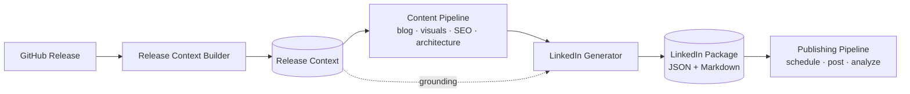
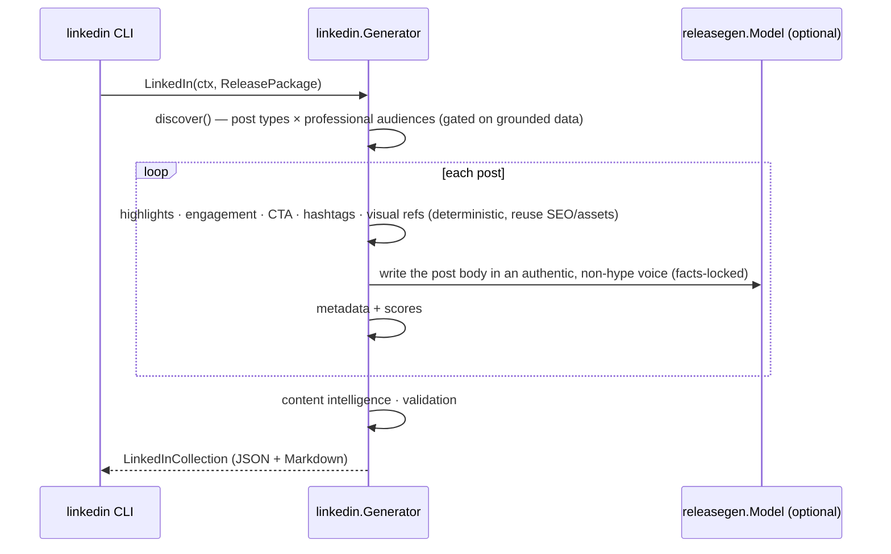

# LinkedIn Content Generation (Milestone 12)

Milestone 12 converts the content pipeline's artifacts — [Release Context](./release-context.md)
(M2) through [Architecture Diagrams](./architecture-diagrams.md) (M11) — into a
professional **LinkedIn content package**: multiple post variations targeting
software, cloud, and AI engineering audiences. It is the **Professional
Marketing** engine.

It generates structured content, **not** published posts, and every post is
**educational, technically accurate, and grounded in the Release Context** — no
hype, no clickbait, no invented features or performance claims.

Related: [SEO](./seo.md) · [Visual Assets](./visual-assets.md) · [Architecture Diagrams](./architecture-diagrams.md) · [Release Context](./release-context.md) · [Architecture](./architecture.md).

---

## 1. Pipeline



`Generator.LinkedIn(ctx, ReleasePackage) → LinkedInCollection`, where
`ReleasePackage` bundles the ten upstream artifacts. The generator **composes**
professional posts from them; it never regenerates repository knowledge.

### Sequence



## 2. Design

The engine lives in [`internal/linkedin`](../internal/linkedin). It is
**deterministic where it matters** and uses the LLM only to write the prose. Each
planner is a pure, independently-testable function.

| Concern | Produced by |
| --- | --- |
| Post discovery (types × audiences) | Deterministic, gated on grounded data |
| Technical highlights | Deterministic, extracted from the Release Context |
| Engagement prompts · CTAs | Deterministic, per type; CTAs reuse the SEO blog URL / repo URL |
| Hashtags | Deterministic, **reuse the SEO LinkedIn hashtags** + grounded tags |
| Visual references | **Point at existing Visual Assets (M9) + Architecture diagrams (M11)** — never regenerated |
| Metadata, engagement & professional-confidence scores | Deterministic |
| Post body & title | LLM (`releasegen.Model`) with a grounded fallback |

When `Model` is nil, generation is fully deterministic — bodies are assembled
from grounded facts.

## 3. Post types & audiences

Each type targets a different professional audience and is gated on grounded data:

| Post type | Audience | Grounded on |
| --- | --- | --- |
| Release Announcement | Engineers & managers | the release summary |
| Feature Spotlight | Developers | the headline feature |
| Architecture Deep Dive | Cloud & solutions architects | the architecture overview / AWS |
| AWS Best Practice | AWS & cloud engineers | architecture highlights |
| AI Engineering Highlight | AI/ML engineers | only when the stack includes AI (Bedrock, etc.) |
| Engineering Lesson | Engineers & tech leads | "why it matters" / developer value |
| Developer Productivity Tip | Working developers | the feature / DX improvements |
| Behind-the-Build | Advocates & OSS community | the release story |
| Performance Improvement | Platform & SRE | only when there's an infra signal |

A diverse, deduplicated set is selected (≤ `MaxPosts`, default 6).

## 4. Reuse over regeneration

- **Hashtags** reuse the SEO engine's LinkedIn hashtag set, topped up with
  grounded technology/AWS tags.
- **CTAs** reuse the SEO blog canonical URL and the repository URL.
- **Visual references** point at the Visual Assets' recommended filenames (M9)
  and the Architecture diagram titles (M11) — images are never regenerated.
- **Keywords / reading time** come from the SEO metadata.

## 5. Schema (abridged)

```json
{
  "schemaVersion": "1.0.0",
  "metadata": { "repository": "acme/widget", "release": "v0.2.0", "postCount": 6 },
  "posts": [
    {
      "id": 1, "type": "Release Announcement", "variation": "Long-form Post",
      "audience": "Software engineers and engineering managers",
      "title": "Shipping widget v0.2.0", "summary": "...", "body": "...",
      "technicalHighlights": ["grounded content intelligence"],
      "engagementPrompt": "What would you want to see in the next release?",
      "cta": "The full technical breakdown is on the blog: https://…",
      "hashtags": ["#SoftwareEngineering", "#AWSLambda"],
      "visualReferences": [ { "type": "LinkedIn Banner", "reference": "widget-v0-2-0-linkedin-banner.png", "source": "Visual Assets (M9)" } ],
      "metadata": { "engagementScore": 82, "professionalConfidence": 90, "suggestedPublishTime": "Tue 8:30am (local)" }
    }
  ],
  "contentIntelligence": { "postCount": 6, "averageEngagementScore": 78, "tone": "professional, educational, authentic" }
}
```

The schema is versioned and additive-only, so future publishing automation
extends it without breaking.

## 6. Validation

`LinkedInCollection.Validate(pkg)` enforces the Milestone 12 invariants (empty ⇒ valid):

- Every post is grounded in the Release Context.
- Every post has a non-empty body, a CTA, hashtags, and an engagement prompt.
- Every technical highlight is grounded (technical claims are validated).
- No two posts are duplicates (by type or body).

## 7. Running it

The `linkedin` CLI reads a Release Context (and optional blog), builds the content
chain, then emits Markdown (default) or JSON:

```bash
# Fully offline from a context + an existing blog (deterministic):
go run ./cmd/linkedin --context ctx.json --blog post.md --offline

# Cap the batch and emit JSON, generating the chain via Ollama:
go run ./cmd/linkedin --context ctx.json --max 4 --format json --out linkedin.json
```

Flags: `--context` (required), `--blog`, `--max`, `--format md|json`, `--model`
(`OLLAMA_MODEL`), `--ollama` (`OLLAMA_URL`), `--offline`, `--out`, `--timeout`.

## 8. Status

**Implemented:** the LinkedIn engine (post discovery, technical-highlight
extractor, body/title writer, summary, engagement, CTA, hashtag, visual-reference,
and metadata planners with engagement + professional-confidence scores), the
versioned JSON schema, the Markdown renderer, structural + grounding validation,
and the `linkedin` CLI. Unit-tested at 80%+ with deterministic and model-backed
paths.

**Next (future milestones):** publish directly to LinkedIn, schedule posts,
analyze engagement, and personalize/translate — all without modifying the
LinkedIn Generator; this package is the canonical professional-marketing output.
