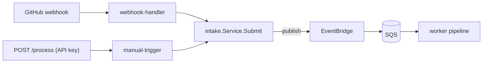

# Manual Processing Trigger (POST /process)

An authenticated REST endpoint that manually triggers an AI processing run. It
is **one more trigger source** alongside the GitHub webhook — it does **not**
create a separate pipeline. A manual request is validated, then handed to the
shared `intake.Service`, which publishes onto the **same EventBridge → SQS →
worker** path the webhook uses.

Related: [Architecture](./architecture.md) · [Workflows](./workflows.md) ·
[Scheduling](./scheduling.md) · [Infrastructure](./infrastructure.md).

---

## 1. Why a shared module

Every trigger source builds the same `intake.Event` and calls
`intake.Service.Submit(...)`; the worker treats all events identically, so the
processing engine is independent of how a run was triggered. Adding a future
source (CLI, Slack, cron) is just another thin entry point that maps its input
to `intake.Request` / `intake.Event` and calls `Submit` — no orchestration is
duplicated.



The only difference between sources is the **window policy**:

| Trigger | Policy | Outside the operating window |
| --- | --- | --- |
| webhook (push/release) | `BufferOutsideWindow` | published, retained in SQS, processed at the next scheduled start (`deferred`) |
| manual (`POST /process`) | `StartOutsideWindow` | **starts the instance on demand** (overriding the schedule), publishes, and returns 202 |

The webhook never starts the instance — the [scheduler](./scheduling.md) owns
its normal power window (default 18:00–20:00, Mon–Fri). The **manual** trigger
is an explicit override: it starts the On-Demand host if it is stopped so a run
can be forced any time (its role has tag-scoped `ec2:StartInstances`; it never
stops the instance). If the start call fails, the event is still buffered in SQS
and runs at the next scheduled start.

---

## 2. Endpoint

```text
POST /process
Host: https://<api-id>.execute-api.<region>.amazonaws.com/<stage>
Content-Type: application/json
x-api-key: <api key>
```

The URL and API-key id are stack outputs of `serverless.yaml`:

```bash
API=$(aws cloudformation describe-stacks --stack-name blog-gen-serverless \
  --query "Stacks[0].Outputs[?OutputKey=='ProcessUrl'].OutputValue" --output text)

KEY_ID=$(aws cloudformation describe-stacks --stack-name blog-gen-serverless \
  --query "Stacks[0].Outputs[?OutputKey=='RegistrationApiKeyId'].OutputValue" --output text)
API_KEY=$(aws apigateway get-api-key --api-key "$KEY_ID" --include-value --query value --output text)
```

## 3. Authentication

The endpoint requires an **API key** (`x-api-key`) — the same simple scheme the
registration route uses, covered by the shared API Gateway **usage plan** on the
stage. Requests without a valid key get **403 Forbidden** from API Gateway before
the Lambda runs; the endpoint is never publicly accessible. (IAM auth or a Lambda
authorizer would also satisfy the requirement; the API key is the simplest secure
fit for the existing architecture.)

## 4. Request payload

```json
{
  "repository": "designing-an-ai-agent-platform-on-aws",
  "owner": "username",
  "branch": "main",
  "commit": "optional",
  "force": false,
  "provider": "bedrock"
}
```

| Field | Required | Default | Notes |
| --- | --- | --- | --- |
| `repository` | **yes** | — | repository name (without owner) |
| `owner` | **yes** | — | repository owner/org |
| `branch` | no | `main` | mapped to `refs/heads/<branch>` |
| `commit` | no | (resolved by pipeline) | specific commit SHA to process |
| `force` | no | `false` | request reprocessing even if already published (carried through for the worker) |
| `provider` | no | local Ollama | AI-provider hint (e.g. `bedrock`); carried through for future use |

The payload is **extensible**: unknown fields are ignored, and `force`/`provider`
flow through on the event for future enhancements. Required fields are validated
and produce a meaningful error.

## 5. Responses

| Status | When | Body |
| --- | --- | --- |
| **202 Accepted** | published; instance running, or started on demand | success (below) |
| **400 Bad Request** | missing required field / invalid JSON | `{"status":"error","reason":"…"}` |
| **403 Forbidden** | missing/invalid API key | API Gateway default |
| **500 Internal Server Error** | publish failed | `{"status":"error","reason":"internal error"}` |

**Success (202)** — `message` reflects what happened:

- in the window (host already running): `"AI processing has been initiated."`
- host stopped, started on demand: `"AI platform is starting; processing will begin shortly."`
- host stopped and the start call failed (event still buffered): `"AI platform could not be started now; processing will begin at the next scheduled runtime."`

```json
{
  "status": "accepted",
  "trigger": "manual",
  "requestId": "8280b22c-36a5-4f12-80b6-fd98ad7b4a91",
  "message": "AI platform is starting; processing will begin shortly."
}
```

**Validation error (400):**

```json
{
  "status": "error",
  "reason": "missing required field(s): repository, owner"
}
```

## 6. Examples

```bash
# In window (host running) → processed now
curl -sS -X POST "$API" \
  -H "Content-Type: application/json" \
  -H "x-api-key: $API_KEY" \
  -d '{"repository":"widget","owner":"acme","branch":"main"}'
# → 202 {"status":"accepted",...,"message":"AI processing has been initiated."}

# Outside window (host stopped) → started on demand, event buffered
# → 202 {"status":"accepted",...,"message":"AI platform is starting; processing will begin shortly."}

# Missing the API key
curl -sS -X POST "$API" -H "Content-Type: application/json" -d '{"repository":"widget","owner":"acme"}'
# → 403 {"message":"Forbidden"}
```

## 7. Logging

The `manual-trigger` Lambda emits one structured CloudWatch line per request in
`/aws/lambda/blog-gen-manual-trigger`, identifying the trigger source and run
context — no secrets or request bodies are logged:

| Field | Example |
| --- | --- |
| `trigger_source` | `manual` |
| `request_id` | API Gateway request id |
| `repository` | `acme/widget` |
| `branch` | `refs/heads/main` |
| `provider` | `bedrock` (empty ⇒ local Ollama) |
| `decision` | `accepted` / `started` / `deferred` |
| `duration` | processing time |
| `outcome` | `success` / `failure` |

## 8. CloudFormation changes (`serverless.yaml`)

| Resource | Purpose |
| --- | --- |
| `ManualTriggerRole` | least-privilege role: `events:PutEvents` on the bus, read-only `ec2:DescribeInstances` (window gate), and **tag-scoped `ec2:StartInstances`** (start on demand). No stop. |
| `ManualTriggerLogGroup` | `/aws/lambda/${ProjectName}-manual-trigger`, retention-bounded |
| `ManualTriggerFunction` | Go Lambda (`provided.al2023`, arm64); env `EVENT_BUS_NAME`, `EVENT_SOURCE=${ProjectName}.manual`, `PROJECT_NAME` |
| `ProcessResource` / `ProcessMethod` | `POST /process`, `ApiKeyRequired: true`, `AWS_PROXY` integration |
| `ProcessInvokePermission` | lets API Gateway invoke the Lambda |
| `ApiDeploymentV3` | bumped deployment so the stage serves the new methods |
| `PublishRequestedRule` | source pattern broadened to a `${ProjectName}.` **prefix** so manual (and future) sources route to SQS with no rule change |
| Output `ProcessUrl` | the endpoint URL |

`observability.yaml` adds a `ManualTriggerErrorsAlarm` and a dashboard row.

## 9. Deployment

No new steps — the normal deploy builds and ships it:

```bash
# build + package the Lambda (arm64) alongside the others
make build           # includes lambdas/manual-trigger

# deploy the serverless stack (CI passes ManualTriggerCodeKey automatically)
aws cloudformation deploy \
  --template-file infrastructure/serverless.yaml \
  --stack-name blog-gen-serverless \
  --capabilities CAPABILITY_NAMED_IAM \
  --parameter-overrides ArtifactsBucket="$ARTIFACTS_BUCKET" \
    ManualTriggerCodeKey="manual-trigger.zip"
```

Then fetch `ProcessUrl` + the API key (section 2) and call the endpoint.

---

## 10. Migration notes

- **New shared core `internal/intake`.** The canonical `Event` contract and the
  publish/window decision moved out of `internal/webhook` into `internal/intake`
  (`Event`, `Publisher`, `Window`, `Service.Submit`, `Request`). The webhook
  handler now delegates to `intake.Service` (buffer policy) instead of its own
  inline logic — no behaviour change; the webhook still returns `accepted` /
  `deferred` / `ignored`.
- **`eventbus` and the worker** now use `intake.Event` (same JSON tags, so the
  SQS message contract is unchanged and in-flight messages stay compatible).
- **Window gate reused.** `awsec2.InstanceWindow` (host-running check) satisfies
  `intake.Window` and is shared by both the webhook handler and the manual
  trigger.
- **EventBridge rule** now matches a source **prefix** (`${ProjectName}.`)
  instead of the single `${ProjectName}.webhook` source, so additional trigger
  sources route to SQS without a rule edit.
- **No pipeline duplication:** the manual trigger reuses EventBridge, SQS, and
  the worker; only a thin new Lambda + API Gateway route were added.
