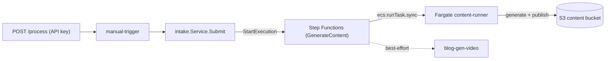

# Processing Trigger (POST /process)

The authenticated REST endpoint that triggers an AI processing run — the
platform's single entry point. A request is validated, then handed to the shared
`intake.Service`, which **starts an AWS Step Functions execution**.

**Which state machine depends on the cutover flag** (`CONTENT_STATE_MACHINE_ARN`
on the Lambda, set by `CUTOVER_CONTENT=true`):

- **Serverless (current, cutover live)** → the **`GenerateContent`** state
  machine (`blog-gen-content`) runs the generator as a one-shot **ECS Fargate**
  task (`content-runner`) that builds the Release Context, generates the full
  content suite, and publishes it to S3 — then best-effort triggers video
  rendering. **No EC2 host, no SQS.**
- **Legacy (pre-cutover / rollback)** → the **`OrchestrationStateMachine`** starts
  the EC2 worker box, waits for it to report ready via SSM, and enqueues the job
  onto SQS for the worker.

The endpoint, request/response, and API key are identical either way — only the
engine behind `/process` changes. See
[Serverless content migration](./content-generation-serverless-migration.md).

Related: [Architecture](./architecture.md) · [Workflows](./workflows.md) ·
[Scheduling](./scheduling.md) · [Infrastructure](./infrastructure.md).

---

## 1. Why a shared module

Every trigger source builds the same `intake.Event` and calls
`intake.Service.Submit(...)`; the worker treats all events identically, so the
processing engine is independent of how a run was triggered. Adding a future
source (CLI, Slack, cron, release webhook) is just another thin entry point that
maps its input to `intake.Request` / `intake.Event` and calls `Submit` — no
orchestration is duplicated.



The `intake.Service`'s `Publisher` is the Step Functions publisher
(`eventbus.NewStepFunctions`), which starts an execution whose input is exactly
the `{"detail": <event>}` body the generator consumes. The Lambda targets
`CONTENT_STATE_MACHINE_ARN` when set (serverless, current) and otherwise
`STATE_MACHINE_ARN` (the legacy orchestration machine) — same input envelope
either way, so the switch is a config flip. This Lambda never touches EC2 and
there is no operating-window gate — a run is always started on demand. On the
serverless path there is no instance at all; on the legacy path, instance
power-**off** stays with the [scheduler](./scheduling.md).

---

## 2. Endpoint

```text
POST /process
Host: https://<api-id>.execute-api.<region>.amazonaws.com/<stage>
Content-Type: application/json
x-api-key: <api key>
```

The URL and API-key id are stack outputs of `serverless.yaml`:

```bash
API=$(aws cloudformation describe-stacks --stack-name blog-gen-serverless \
  --query "Stacks[0].Outputs[?OutputKey=='ProcessUrl'].OutputValue" --output text)

KEY_ID=$(aws cloudformation describe-stacks --stack-name blog-gen-serverless \
  --query "Stacks[0].Outputs[?OutputKey=='RegistrationApiKeyId'].OutputValue" --output text)
API_KEY=$(aws apigateway get-api-key --api-key "$KEY_ID" --include-value --query value --output text)
```

## 3. Authentication

The endpoint requires an **API key** (`x-api-key`) — the same simple scheme the
registration route uses, covered by the shared API Gateway **usage plan** on the
stage. Requests without a valid key get **403 Forbidden** from API Gateway before
the Lambda runs; the endpoint is never publicly accessible.

## 4. Request payload

```json
{
  "repository": "designing-an-ai-agent-platform-on-aws",
  "owner": "username",
  "branch": "main",
  "commit": "optional",
  "releaseTag": "v0.2.0",
  "force": false,
  "provider": "bedrock"
}
```

| Field | Required | Default | Notes |
| --- | --- | --- | --- |
| `repository` | **yes** | — | repository name (without owner) |
| `owner` | **yes** | — | repository owner/org |
| `branch` | no | `main` | mapped to `refs/heads/<branch>` (repository run) |
| `commit` | no | (resolved by pipeline) | specific commit SHA to process |
| `releaseTag` | no | — | when set, generates **release content** (full suite) for that GitHub Release via the [Release Context](./release-context.md) → [generation](./blog-generation.md) pipeline, instead of a repository run |
| `force` | no | `false` | request reprocessing even if already published (carried through for the worker) |
| `provider` | no | (router default) | AI-provider hint; carried through for future use. Generation runs through the [Provider Router](./hybrid-ai-routing.md) (Bedrock → Anthropic) regardless |

> **Two run modes.** With `releaseTag`, `/process` triggers a **release run** —
> building the Release Context for that tag and generating the full content suite.
> Without `releaseTag`, it triggers a **repository run** (clone the branch and
> generate from the working copy). `POST /release-context` builds only the context
> (no generation); `/process` with a tag builds *and* generates.
>
> ⚠️ **On the serverless path, only release runs are supported.** The
> `GenerateContent` machine requires a `releaseTag` (the Fargate `content-runner`
> takes `RELEASE_TAG`); a `/process` call **without** `releaseTag` fails the
> execution (`States.Runtime`, missing `$.detail.release_tag`) even though the API
> returns `202`. Repository/snapshot runs only work on the legacy worker path.

The payload is **extensible**: unknown fields are ignored, and `force`/`provider`
flow through on the event for future enhancements. Required fields are validated
and produce a meaningful error.

## 5. Responses

| Status | When | Body |
| --- | --- | --- |
| **202 Accepted** | the Step Functions execution started | success (below) |
| **400 Bad Request** | missing required field / invalid JSON | `{"status":"error","reason":"…"}` |
| **403 Forbidden** | missing/invalid API key | API Gateway default |
| **500 Internal Server Error** | StartExecution failed | `{"status":"error","reason":"internal error"}` |

**Success (202):**

```json
{
  "status": "accepted",
  "trigger": "manual",
  "requestId": "8280b22c-36a5-4f12-80b6-fd98ad7b4a91",
  "message": "AI processing has been initiated."
}
```

**Validation error (400):**

```json
{
  "status": "error",
  "reason": "missing required field(s): repository, owner"
}
```

## 6. Examples

```bash
# Repository run
curl -sS -X POST "$API" \
  -H "Content-Type: application/json" \
  -H "x-api-key: $API_KEY" \
  -d '{"repository":"widget","owner":"acme","branch":"main"}'
# → 202 {"status":"accepted",...,"message":"AI processing has been initiated."}

# Release run (full content suite)
curl -sS -X POST "$API" -H "Content-Type: application/json" -H "x-api-key: $API_KEY" \
  -d '{"repository":"widget","owner":"acme","releaseTag":"v1.2.0"}'

# Missing the API key
curl -sS -X POST "$API" -H "Content-Type: application/json" -d '{"repository":"widget","owner":"acme"}'
# → 403 {"message":"Forbidden"}
```

## 7. Logging

The `manual-trigger` Lambda emits one structured CloudWatch line per request in
`/aws/lambda/blog-gen-manual-trigger`, identifying the trigger source and run
context — no secrets or request bodies are logged:

| Field | Example |
| --- | --- |
| `trigger_source` | `manual` |
| `request_id` | API Gateway request id |
| `repository` | `acme/widget` |
| `branch` | `refs/heads/main` |
| `provider` | `bedrock` (empty ⇒ router default) |
| `decision` | `accepted` |
| `duration` | processing time |
| `outcome` | `success` / `failure` |

## 8. CloudFormation changes (`serverless.yaml`)

| Resource | Purpose |
| --- | --- |
| `ManualTriggerRole` | least-privilege role: `states:StartExecution` on the orchestration **and** the (deterministically named) `blog-gen-content` state machine. **No EC2 access.** |
| `ManualTriggerLogGroup` | `/aws/lambda/${ProjectName}-manual-trigger`, retention-bounded |
| `ManualTriggerFunction` | Go Lambda (`provided.al2023`, arm64); env `STATE_MACHINE_ARN` + `CONTENT_STATE_MACHINE_ARN` (the latter set by `CUTOVER_CONTENT=true`, routing `/process` to the serverless `GenerateContent` machine) |
| `OrchestrationStateMachine` | *(legacy path)* Step Functions state machine: find host by tag → start → SSM ready gate → SendMessage to SQS. Dormant once cutover; removed in Phase B teardown. |
| `GenerateContent` (in `content.yaml`) | *(serverless path)* runs the `content-runner` Fargate task → publishes the suite to S3 → best-effort triggers `blog-gen-video` |
| `StateMachineRole` | `ec2:DescribeInstances`, tag-scoped `ec2:StartInstances`, `ssm:DescribeInstanceInformation`, `sqs:SendMessage` |
| `ProcessResource` / `ProcessMethod` | `POST /process`, `ApiKeyRequired: true`, `AWS_PROXY` integration |
| `ProcessInvokePermission` | lets API Gateway invoke the Lambda |
| `ApiDeploymentV5` | bumped deployment so the stage serves the current methods (V5 removes `/webhook`) |
| Outputs `ProcessUrl` / `StateMachineArn` | the endpoint URL and the state machine ARN |

`observability.yaml` adds a `ManualTriggerErrorsAlarm` and a dashboard row.

## 9. Deployment

No new steps — the normal deploy builds and ships it:

```bash
# build + package the Lambda (arm64) alongside the others
make build           # includes lambdas/manual-trigger

# deploy the serverless stack (CI passes ManualTriggerCodeKey automatically)
aws cloudformation deploy \
  --template-file infrastructure/serverless.yaml \
  --stack-name blog-gen-serverless \
  --capabilities CAPABILITY_NAMED_IAM \
  --parameter-overrides ArtifactsBucket="$ARTIFACTS_BUCKET" \
    ManualTriggerCodeKey="manual-trigger.zip"
```

Then fetch `ProcessUrl` + the API key (section 2) and call the endpoint.

---

## 10. Design notes

- **Shared core `internal/intake`.** The canonical `Event` contract and
  `Service.Submit` live in `internal/intake` (`Event`, `Publisher`, `Request`).
  The manual trigger maps its request to an `intake.Event` and submits it.
- **Step Functions publisher.** `eventbus.NewStepFunctions` implements
  `intake.Publisher`; its `Publish` starts an execution whose input is the exact
  `{"detail": <event>}` body both machines consume — the serverless
  `GenerateContent` machine reads `$.detail.owner/name/release_tag` into the
  Fargate task's env, so the contract is unchanged across the cutover.
- **Config-flip cutover.** Routing is chosen at runtime by
  `CONTENT_STATE_MACHINE_ARN` (serverless) vs `STATE_MACHINE_ARN` (legacy), so
  moving `/process` to serverless — and rolling back — is a one-variable change
  with no code edit.
- **No window gate.** Neither path gates on an operating window (serverless has no
  instance; the legacy machine starts the host itself), so the manual trigger has
  no window logic and needs no EC2 permissions.
- **One entry point today, many tomorrow.** Additional sources (CLI, Slack, cron)
  can start the same state machine, so the downstream pipeline is unchanged.
