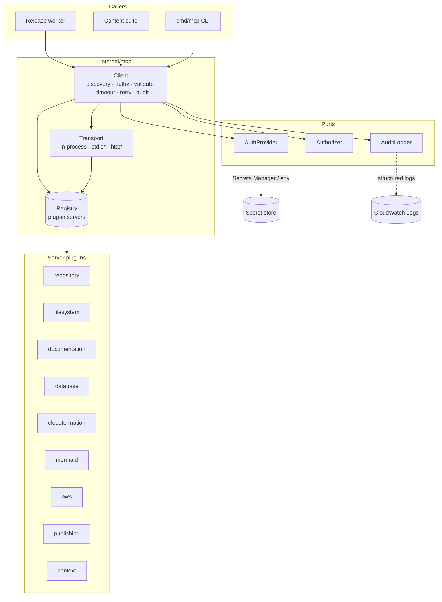
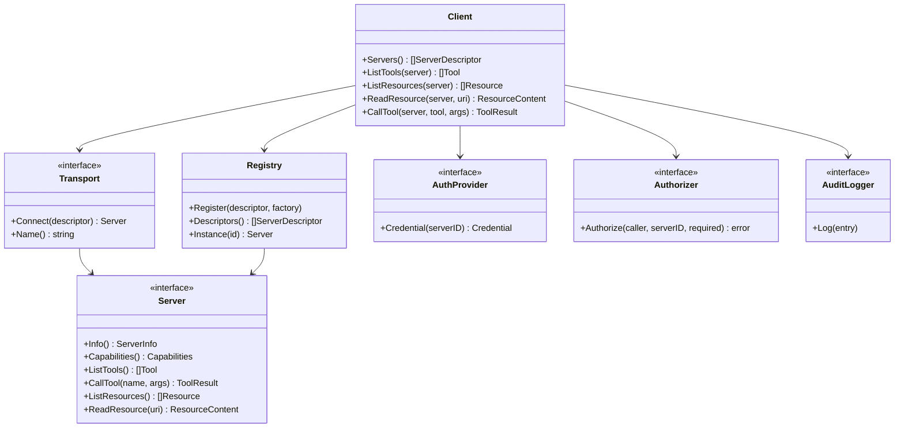
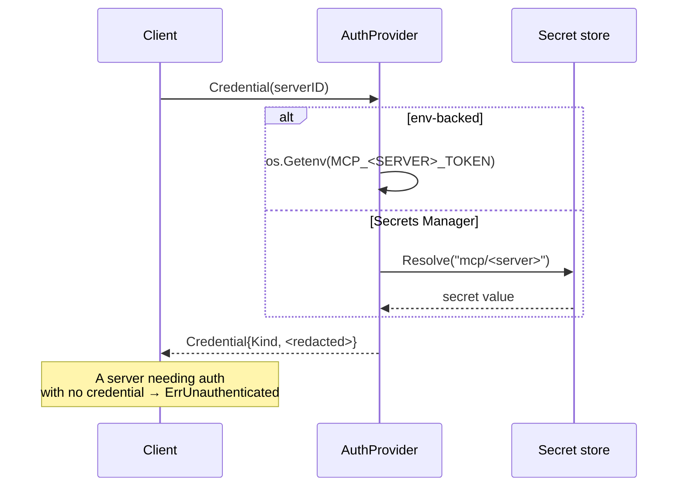
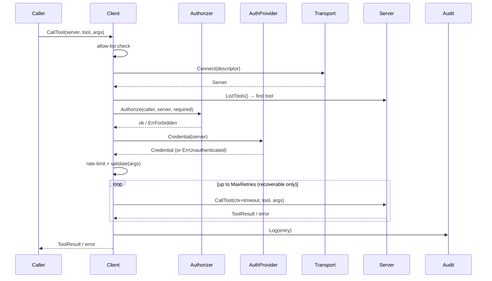
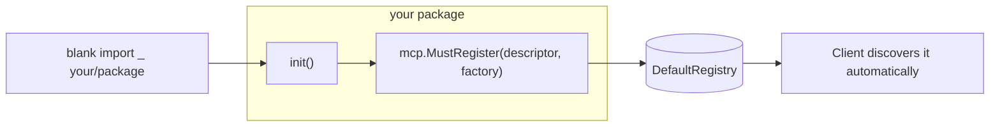
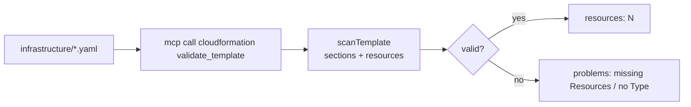

# MCP Integration & Tool Ecosystem

`internal/mcp` is the project's **standardized integration layer**. It brings the
[Model Context Protocol](https://modelcontextprotocol.io) (MCP, protocol version
`2025-06-18`) into the codebase so that every AI-driven interaction with an
external system — repositories, the filesystem, databases, CloudFormation, AWS,
documentation, diagram generation, and publishing platforms — goes through **one
uniform, secure, auditable client** instead of a bespoke integration per system.

Before this layer, each generator reached for whatever client it needed directly.
MCP replaces that sprawl with a single seam: servers expose **tools** (callable
actions) and **resources** (readable context) behind a common port, and a single
`Client` layers discovery, authentication, authorization, input validation,
timeouts, retries, rate limiting, and audit logging around every call.

> This layer **extends** the existing Clean Architecture / Ports & Adapters design
> — it does not replace it. Servers are adapters; the `Client` depends only on
> ports. `internal/platform` keeps its thin `MCPClient` abstraction for plug-in
> extensions; `internal/mcp` is the full concrete subsystem they can build on.

---

## Contents

- [Architecture](#architecture)
- [MCP in one minute](#mcp-in-one-minute)
- [Components](#components)
- [Supported servers](#supported-servers)
- [Tool catalog](#tool-catalog)
- [Resource catalog](#resource-catalog)
- [Authentication](#authentication)
- [Authorization](#authorization)
- [Auditing](#auditing)
- [Configuration](#configuration)
- [The `mcp` CLI](#the-mcp-cli)
- [Invocation lifecycle](#invocation-lifecycle)
- [Extending: writing a server plug-in](#extending-writing-a-server-plug-in)
- [CloudFormation integration](#cloudformation-integration)
- [Security model](#security-model)
- [Troubleshooting & runbooks](#troubleshooting--runbooks)
- [Best practices](#best-practices)

---

## Architecture



The `Client` is the only thing callers touch. Everything policy-related lives in
the client and the three cross-cutting ports (`AuthProvider`, `Authorizer`,
`AuditLogger`); the servers stay small and contain only their domain logic.

---

## MCP in one minute

MCP standardizes how an AI application discovers and uses external capabilities:

- **Server** — a provider of capabilities. Advertises `ServerInfo`, `Capabilities`,
  and a `Category`.
- **Tool** — a callable action with a typed parameter schema (`ParamSpec`) and
  `ToolAnnotations` (read-only / destructive / idempotent). Returns a `ToolResult`
  (text or JSON content, or a grounded tool-level error).
- **Resource** — addressable, readable context identified by a URI (e.g. the
  generated blog, the release context JSON).
- **Prompt** — a reusable prompt template (supported by the port; not used by the
  built-in servers yet).

Our types live in `internal/mcp/model.go`; the `Server` port is in `ports.go`.

---

## Components



| File | Responsibility |
|------|----------------|
| `model.go` | Domain types: `ServerInfo`, `Tool`, `Resource`, `ToolResult`, `AuditEntry`, … |
| `ports.go` | The interfaces: `Server`, `Transport`, `AuthProvider`, `Authorizer`, `AuditLogger`, `Credential` |
| `client.go` | The `Client` — the secure invocation pipeline |
| `registry.go` | Plug-in `Registry` (database/sql driver pattern) + `DefaultRegistry` |
| `transport.go` | `InProcessTransport` (default); seam for stdio/HTTP |
| `authz.go` | `Permission` ladder, `PolicyAuthorizer` (deny-by-default), `AllowAllAuthorizer` |
| `auth.go` | `NoAuth`, `EnvAuth`, `SecretsManagerAuth`, `MapAuth`, `SecretResolver` port |
| `audit.go` | `SlogAudit` (CloudWatch-shaped), `NopAudit`, `RecordingAudit` |
| `base.go` | `BaseServer` no-op defaults + shared argument validation |
| `config.go` | `Config` (caller, timeout, retries, rate limit, allow-list) |
| `errors.go` | Sentinel errors + `InvocationError` + retry classification |
| `builtin.go` | `RegisterDefaults` + `init()` auto-registration |
| `server_*.go` | The nine built-in server plug-ins |

---

## Supported servers

| Server | Category | Perm | Purpose |
|--------|----------|------|---------|
| `repository` | repository | read-only | Git metadata: branch, commits, tags, tracked files |
| `filesystem` | filesystem | read-only | Sandboxed, read-only file access under a fixed root |
| `documentation` | documentation | read-only | Search + retrieve project Markdown docs |
| `database` | database | read-only | Structured, read-only access to relational tables (no raw SQL) |
| `cloudformation` | cloudformation | read-only | Validate, summarize, enumerate resources in CFN templates |
| `mermaid` | mermaid | read-only | Generate + validate Mermaid diagram source |
| `aws` | aws | read-only | Read-only AWS inspection (S3, stacks, SSM parameters) |
| `publishing` | publishing | read-only¹ | Validate + publish content to blog/social platforms |
| `context` | context | read-only | Serves generated artifacts (blog, storyboard, release context) as **resources** |

¹ `publishing`'s baseline is read-only, but its `publish_post` tool requires the
elevated `publish` permission (see [Authorization](#authorization)).

Each server is a **self-registering plug-in**: `builtin.go` registers all nine
into `DefaultRegistry` from `init()`. Data-backed servers (`repository`,
`database`, `aws`, `context`) are seeded with empty, safe defaults; wire real data
by registering your own factory (see [Extending](#extending-writing-a-server-plug-in)).

---

## Tool catalog

| Server | Tool | Permission | Description |
|--------|------|-----------|-------------|
| repository | `describe_repo` | read-only | Name, default branch, counts |
| repository | `list_commits` | read-only | Recent commits (`limit`) |
| repository | `list_tags` | read-only | Release tags |
| repository | `list_files` | read-only | Tracked files (`prefix`) |
| filesystem | `read_file` | read-only | Read a file (`path`) |
| filesystem | `list_dir` | read-only | List a directory (`path`) |
| filesystem | `stat` | read-only | Size + kind (`path`) |
| documentation | `list_docs` | read-only | All Markdown docs |
| documentation | `get_doc` | read-only | One doc (`path`) |
| documentation | `search_docs` | read-only | Substring search (`query`) |
| database | `list_tables` | read-only | Table names |
| database | `describe_table` | read-only | Columns + row count (`table`) |
| database | `query` | read-only | Rows with equality filter (`table`, `filter_column`, `filter_value`, `limit`) |
| cloudformation | `validate_template` | read-only | Structural validation (`template`) |
| cloudformation | `list_resources` | read-only | Logical IDs + Types (`template`) |
| cloudformation | `summarize_template` | read-only | Sections + counts (`template`) |
| mermaid | `flowchart` | read-only | Linear flowchart (`steps`, `direction`) |
| mermaid | `sequence` | read-only | Sequence diagram (`messages`) |
| mermaid | `validate` | read-only | Validate diagram header (`source`) |
| aws | `list_buckets` | read-only | S3 buckets |
| aws | `describe_stack` | read-only | Stack status (`name`) |
| aws | `get_parameter` | read-only | SSM parameter (`name`) |
| publishing | `list_platforms` | read-only | Platforms + limits |
| publishing | `validate_post` | read-only | Fit check (`platform`, `content`) |
| publishing | `publish_post` | **publish** | Publish, returns a receipt (`platform`, `content`) |
| context | `list_context` | read-only | Available context resources |
| context | `get_context` | read-only | Body by URI (`uri`) |

Discover this catalog live with `go run ./cmd/mcp discover`.

---

## Resource catalog

The `context` server is the primary example of MCP **resources**. It serves the
pipeline's generated artifacts by URI so an agent can pull them into a prompt:

| URI scheme | Example | Content |
|------------|---------|---------|
| `context://` | `context://blog` | The generated blog Markdown |
| `context://` | `context://release` | The Release Context JSON |
| `context://` | `context://storyboard` | The video storyboard |

Resources are injected at construction (`newContextServer([]ContextDoc{…})`), so
they are offline and deterministic in tests; a production build would back the
same server with S3/DynamoDB behind an identical resource surface.

---

## Authentication

Credentials are resolved on demand through the `AuthProvider` port and are
**never hard-coded, logged, serialized, or embedded in errors** — the
`Credential` type keeps its value in an unexported field and redacts itself under
every `fmt` verb (`String`/`GoString`).



| Provider | Source | Use |
|----------|--------|-----|
| `NoAuth` | none | In-process servers (default) |
| `EnvAuth` | `MCP_<SERVERID>_TOKEN` env var | Local / CI with rotation |
| `SecretsManagerAuth` | `SecretResolver` port → AWS Secrets Manager | Production |
| `MapAuth` | in-memory map | **Tests only** |

`SecretResolver` is a port, so `internal/mcp` never imports the AWS SDK and stays
offline-testable. Rotation is free: secrets are read on every call.

---

## Authorization

Authorization is **deny-by-default** and enforced before every tool call and
resource read. Permissions form a small ladder plus orthogonal scopes:

```mermaid
flowchart LR
    none --> read-only --> read-write
    read-only -. "orthogonal scopes" .-> analytics
    read-only -. .-> publish
    admin(("admin<br/>implies all"))
```

- **Ladder:** `none < read-only < read-write` — a higher rung satisfies a lower one.
- **Orthogonal scopes:** `analytics` and `publish` are additive and satisfy only
  themselves (a `read-write` holder cannot publish; a `publish` holder cannot read).
- **`admin`** implies everything.

The `PolicyAuthorizer` maps a caller id to the permission it holds, with a `"*"`
default entry; an unknown caller holds `none` and can do nothing. The required
permission for a call is the **higher** of the tool's permission and the server's
baseline.

```go
authz := mcp.NewPolicyAuthorizer(map[string]mcp.Permission{
    "release-worker": mcp.PermReadWrite,
    "publisher":      mcp.PermPublish,
    "*":              mcp.PermReadOnly, // default for everyone else
})
```

`AllowAllAuthorizer` permits everything and is for **trusted, single-tenant local
use only** (the CLI). Never use it in a multi-caller deployment.

---

## Auditing

Every operation emits an `AuditEntry` — caller, server, operation, tool/resource,
required permission, outcome (`ok` / `denied` / `timeout` / `error`), duration,
and any error — **never a credential**. `SlogAudit` writes structured logs shaped
for CloudWatch Logs; swap in a real CloudWatch adapter behind the same
`AuditLogger` port with no caller change. Disable with `Config.AuditEnabled=false`
(→ `NopAudit`).

---

## Configuration

`Config` controls the client's cross-cutting behavior (zero value is usable):

| Field | Default | Meaning |
|-------|---------|---------|
| `Caller` | `anonymous` | Principal for authz + audit |
| `CallTimeout` | `30s` | Per-call deadline |
| `MaxRetries` | `2` | Extra attempts for recoverable failures |
| `RetryBackoff` | `100ms` | Base linear backoff |
| `RatePerMinute` | `0` (unlimited) | Per-caller rate cap |
| `AuditEnabled` | `true` | Toggle audit logging |
| `AllowedServers` | all | Least-privilege server allow-list |

```go
client := mcp.NewClient(mcp.DefaultRegistry, mcp.Config{
    Caller:         "release-worker",
    RatePerMinute:  60,
    AllowedServers: []string{"repository", "context", "cloudformation"},
},
    mcp.WithAuthorizer(authz),
    mcp.WithAuth(mcp.NewEnvAuth("MCP_", mcp.AuthBearer)),
    mcp.WithAudit(mcp.SlogAudit{}),
)
```

Related env-var reference: [`docs/configuration.md`](./configuration.md).

---

## The `mcp` CLI

`cmd/mcp` is the operator CLI. It uses the same `Client`, so it doubles as a smoke
test of the tool ecosystem. It runs with `AllowAllAuthorizer` (trusted local use).

```
go run ./cmd/mcp servers                         # list registered servers
go run ./cmd/mcp tools <server>                  # a server's tools + params
go run ./cmd/mcp resources <server>              # a server's resources
go run ./cmd/mcp discover                        # every server + its tools
go run ./cmd/mcp call <server> <tool> k=v k=v…   # invoke a tool
go run ./cmd/mcp read <server> <uri>             # read a resource
```

Examples:

```bash
go run ./cmd/mcp call mermaid flowchart steps='Build|Test|Ship'
go run ./cmd/mcp call cloudformation validate_template template="$(cat infrastructure/worker.yaml)"
go run ./cmd/mcp call repository list_tags
```

---

## Invocation lifecycle



Order matters: **authorize → authenticate → rate-limit → validate → invoke →
audit**. A denial never reaches the server, and every terminal path is audited.

---

## Extending: writing a server plug-in



1. Implement the `Server` port. Embed `mcp.BaseServer` to inherit no-op
   resources/prompts and a healthy default — implement only `Info`,
   `Capabilities`, `Category`, `ListTools`, `CallTool`.
2. Provide a `ServerDescriptor` (id, category, baseline permission, description).
3. Register from `init()`:

```go
func init() {
    mcp.MustRegister(myDescriptor(), func() (mcp.Server, error) {
        return newMyServer(), nil
    })
}
```

4. Ensure the package is imported (a blank import in a wiring file) so its `init()`
   runs — the database/sql driver pattern.

Guidelines: keep servers offline and deterministic (inject data behind a struct or
a port); return **tool-level errors** (`IsError` results) for expected failures and
Go errors only for faults; never validate arguments by hand — the `Client` runs
`validate()` against your `ParamSpec`s; never touch a credential value.

---

## CloudFormation integration

The `cloudformation` server analyses templates **without a YAML dependency** — a
lightweight, indentation-aware structural scan. It fits the project's existing
CFN tooling: the same templates linted by `cfn-lint` in CI can be validated,
summarized, and enumerated through MCP.



```bash
# Validate every infrastructure template through MCP
for f in infrastructure/*.yaml; do
  echo "== $f =="
  go run ./cmd/mcp call cloudformation validate_template template="$(cat "$f")"
done
```

This complements `cfn-lint` (which does deep, rules-based linting): the MCP server
gives agents a fast, dependency-free structural view they can reason over.

---

## Security model

Aligned with the project's security constraints and AWS Well-Architected:

- **No hard-coded credentials.** Secrets come from env or Secrets Manager via the
  `AuthProvider` port; the `Credential` type cannot leak a value through logs or
  `fmt`.
- **Least privilege.** Deny-by-default authorization; per-caller server allow-list;
  read-only servers by default; `publish` is a separate elevated scope.
- **Secure by default.** Unknown parameters are rejected; required/enum/type
  validation runs on every call; the filesystem server is sandboxed with
  path-traversal neutralization; reads are size-capped.
- **Prompt-injection containment.** Servers return structured results and never
  execute arbitrary input; the `database` server accepts structured queries only
  (no raw SQL), removing the injection surface.
- **Session isolation.** Each `Client` holds its own caller identity, config, and
  rate-limit state; the registry instantiates servers lazily and caches per
  registry, so tests build isolated registries.
- **Resource limits.** Per-call timeouts, bounded retries, and a per-caller token
  bucket rate limiter.
- **Auditability.** Every operation is logged with outcome + duration; nothing
  sensitive is recorded.

See also [`docs/security.md`](./security.md).

---

## Troubleshooting & runbooks

| Symptom | Cause | Fix |
|---------|-------|-----|
| `mcp: forbidden` | Caller lacks the required permission, or server not in allow-list | Grant the permission in the `PolicyAuthorizer`, or add the server to `AllowedServers` |
| `mcp: unauthenticated` | A server needs a credential but none resolved | Set `MCP_<SERVER>_TOKEN` or the Secrets Manager entry |
| `mcp: invalid argument` | Missing/unknown/mistyped parameter | Check `mcp tools <server>` for the schema |
| `mcp: tool not found` | Wrong tool name | `mcp discover` |
| `mcp: server not found` | Unregistered id | `mcp servers`; confirm the plug-in's `init()` runs |
| `mcp: tool call timed out` | Call exceeded `CallTimeout` | Raise `Config.CallTimeout`; check the backing system |
| `mcp: rate limited` | Caller exceeded `RatePerMinute` | Back off or raise the cap |

**Runbook — a call is unexpectedly denied**
1. `go run ./cmd/mcp servers` — confirm the server is registered and its baseline permission.
2. `go run ./cmd/mcp tools <server>` — confirm the tool's permission.
3. Check the caller's grant in the `PolicyAuthorizer` and the `AllowedServers` list.
4. Inspect the audit log entry (`outcome=denied`) for the exact required vs. held permission.

**Runbook — add a new external integration**
1. Write `server_<name>.go` implementing `Server` (embed `BaseServer`).
2. Register it in `builtin.go` (or from your package `init()`).
3. Add auth wiring if it needs a credential (`AuthProvider`).
4. Add tests to `servers_test.go` (aim ≥90% coverage).
5. Document it in the tables above.

---

## Best practices

- **Depend on the `Client`, not on servers.** Callers should never import a server
  package directly.
- **One `Client` per caller identity** with its own `Config` and grants.
- **Keep servers pure and offline.** Inject data/ports; no network in a `CallTool`.
- **Return tool errors for expected failures**, Go errors for faults — retries key
  off that distinction.
- **Never log a `Credential`.** Log the `AuditEntry` instead.
- **Set an allow-list** (`AllowedServers`) for automated callers — least privilege.
- **Test through the `Client`** to exercise the full policy pipeline, and test
  servers directly for their domain logic.
