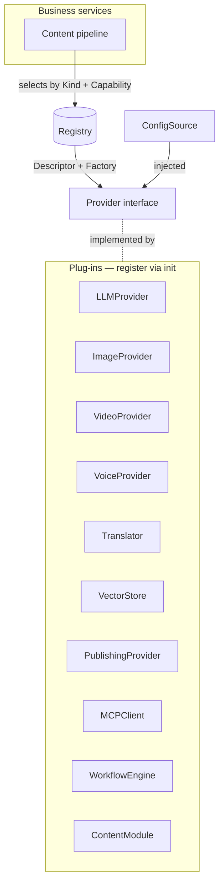
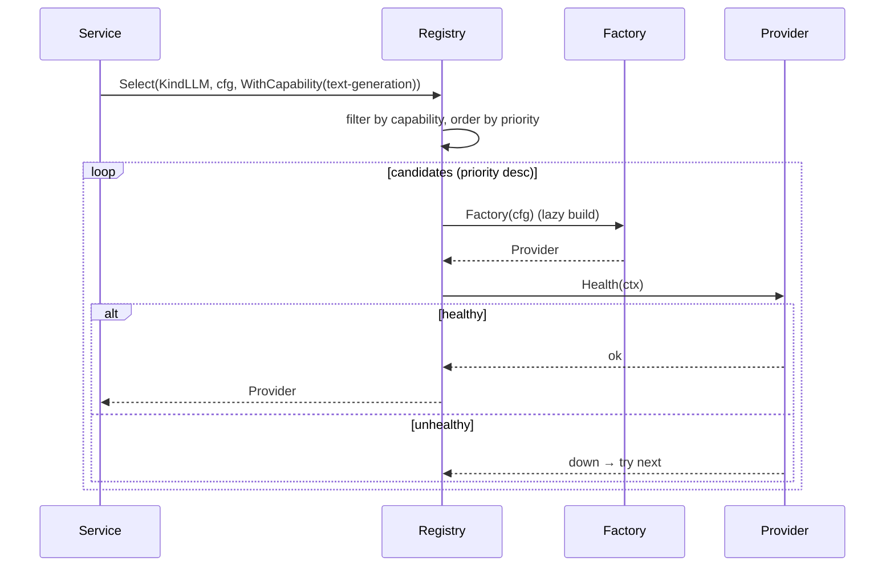

# Platform Extensibility (Milestone 19)

Milestone 19 turns the system into a **modular AI content-generation platform**.
New AI providers, publishing platforms, content formats, storage backends, and
workflow integrations are added by **implementing an interface and registering
it** — never by editing existing business logic. Every future integration
behaves as a plug-in.

It is built on Clean Architecture, SOLID, the **Open/Closed Principle**,
dependency inversion, provider abstraction, composition over inheritance,
interface-driven design, loose coupling, and high cohesion.

Package: [`internal/platform`](../internal/platform) · CLI: [`cmd/platform`](../cmd/platform).

Related: [Architecture](./architecture.md) · [Publishing](./publishing.md) · [Content Analytics](./content-analytics.md) · [Contributing](./contributing.md).

---

## 1. The model



Business services depend only on **interfaces + the Registry**. They select a
provider by `Kind` and `Capability` — never by concrete type — so a new provider
is picked up automatically once registered.

## 2. Core abstractions

| Concept | Role |
|---------|------|
| `Provider` | Base interface: `ID`, `Kind`, `Capabilities`, `Health` — every plug-in implements it |
| `Descriptor` | Registration metadata: id, kind, version, API version, priority, capabilities, managed/local |
| `Factory` | `func(ConfigSource) (Provider, error)` — lazy construction; credentials touched only on use |
| `Registry` | Thread-safe register / discover / select-with-fallback, keyed generically by `Kind` |
| `ConfigSource` | Configuration port (env, map, chain, prefix; future: Parameter Store, Secrets Manager) |
| `Capability` | Free-form capability tag used for selection — new capabilities need no code change |

### Selection, priority & fallback

`Registry.Select(ctx, kind, cfg, opts…)` filters candidates by capability +
options, orders them by **priority**, then instantiates and **health-checks**
each in order, returning the first healthy one — automatic **fallback**. Options:
`WithCapability`, `WithID`, `ManagedOnly`, `LocalOnly`, `WithMinPriority`.

```go
llm, err := platform.SelectTyped[platform.LLMProvider](
    ctx, platform.Default(), platform.KindLLM, cfg,
    platform.WithCapability(platform.CapTextGeneration))
resp, _ := llm.Generate(ctx, platform.LLMRequest{Prompt: "…"})
```

### API versioning & compatibility

Each provider declares the platform `APIVersion` it targets. The registry
**rejects incompatible majors** on registration (`ErrIncompatible`), so backward
compatibility is enforced, not hoped for.

## 3. The abstractions (one reference implementation each)

| Kind | Interface | Reference impl | Future providers |
|------|-----------|----------------|------------------|
| `llm` | `LLMProvider` (+`StreamingLLM`) | `echo` | Bedrock, OpenAI, Anthropic, Gemini, Azure OpenAI, Cohere, Mistral, Together, Groq, Ollama, llama.cpp, vLLM, LM Studio |
| `image` | `ImageProvider` | `placeholder` | Stable Diffusion, FLUX, DALL·E, Nova Canvas, Midjourney |
| `video` | `VideoProvider` (submit/poll) | `stub` | Veo, Runway, Pika, Luma, Kling |
| `voice` | `VoiceProvider` | `stub` | Polly, ElevenLabs, OpenAI TTS, Azure Speech, Google TTS |
| `translation` | `Translator` (+`LanguageRegistry`) | `identity` | any MT engine; languages are a runtime registry |
| `vector` | `VectorStore` | `memory` (cosine) | pgvector, Pinecone, Weaviate, Qdrant, Milvus, Chroma, OpenSearch |
| `publishing` | `PublishingProvider` | `dryrun` | LinkedIn, X, TikTok, Instagram, Facebook, Reddit, Discord, Slack, Ghost, WordPress, Substack, Beehiiv |
| `mcp` | `MCPClient` (discover/call) | `mock` | GitHub, AWS, Slack, Jira, Confluence, Postgres, SQLite, filesystems, search, vector DBs |
| `workflow` | `WorkflowEngine` | `inprocess` | Temporal, Argo, Airflow, Step Functions |
| `content` | `ContentModule` / `PodcastAssembler` | `blog`, `newsletter`, `podcast` | white papers, books, courses, webinars, KBs, product docs |

Every reference implementation is deterministic and offline, so the whole surface
runs with no network or credentials (`go run ./cmd/platform demo`).

## 4. Plugin development guide

Adding a provider is three steps and **zero edits** to existing code:

```go
// 1. Implement the domain interface over the Provider base.
type BedrockLLM struct{ /* client, model */ }
func (b *BedrockLLM) ID() string                 { return "bedrock" }
func (b *BedrockLLM) Kind() platform.Kind         { return platform.KindLLM }
func (b *BedrockLLM) Capabilities() []platform.Capability {
    return []platform.Capability{platform.CapTextGeneration, platform.CapStreaming}
}
func (b *BedrockLLM) Health(ctx context.Context) platform.Health { /* ping */ return platform.OK() }
func (b *BedrockLLM) Generate(ctx context.Context, r platform.LLMRequest) (platform.LLMResponse, error) { /* … */ }

// 2. Register from the package init() — auto-discovery (database/sql style).
func init() {
    platform.MustRegister(platform.Registration{
        Descriptor: platform.Descriptor{
            ID: "bedrock", Kind: platform.KindLLM, Version: "1.0.0",
            Priority: 10, Managed: true,
            Capabilities: []platform.Capability{platform.CapTextGeneration, platform.CapStreaming},
        },
        Factory: func(cfg platform.ConfigSource) (platform.Provider, error) {
            region := platform.GetDefault(cfg, "AWS_REGION", "us-east-1")
            return newBedrock(region)
        },
    })
}

// 3. Import the package for its side effect (blank import) somewhere in the build.
//    import _ "…/internal/providers/bedrock"
```

Business code changes **nothing** — the higher `Priority` means `Select` prefers
Bedrock automatically, falling back to the next healthy provider if it is down.

## 5. Configuration framework

`ConfigSource` is the single configuration port. Reference sources: `EnvConfig`,
`MapConfig`, `ChainConfig` (first hit wins — the fallback pattern), and
`PrefixConfig` (per-provider namespacing). Future backends (AWS Parameter Store,
Secrets Manager, Consul) implement the same one-method interface — **no
provider-specific config logic ever leaks into business services**, and secrets
are read on demand (never logged), supporting rotation.

## 6. Provider registry responsibilities

Discovery, registration, capability detection (`Descriptor.HasCapability`),
configuration (via `Factory` + `ConfigSource`), health checks (`Provider.Health`),
versioning (semver API-compat), fallback (ordered `Candidates`), and priority
selection (`Select`). The process-wide `Default()` registry is auto-populated by
plug-in `init()` functions; embedders can also build an isolated registry with
`NewRegistry()` + `RegisterDefaults`.

## 7. Extending each domain

- **New LLM / image / video / voice provider** → implement the interface, register.
- **New language** → `LanguageRegistry.Register(tag, name)` at runtime; workflows
  read `Supported()` and never hard-code a language list.
- **New content format** → implement `ContentModule` for a new `ContentTypeID`.
- **New publishing platform** → implement `PublishingProvider`.
- **New MCP server / vector DB / workflow engine** → implement the respective
  interface; tool discovery, similarity search, and orchestration stay uniform.

## 8. Sequence: selecting a provider with fallback



## 9. Version compatibility

`platform.APIVersion` is the extension API version (`1.0.0`). A provider's
`Descriptor.APIVersion` must share the same **major**; a mismatch is rejected at
registration. This lets the platform evolve (additive minor/patch) while
guaranteeing that already-built plug-ins keep working — backward compatibility by
contract.

## 10. Testing

`go test ./internal/platform/` (**98%+ coverage**) covers provider registration,
duplicate/validation/version rejection, dependency injection via factories,
plug-in loading + auto-registration, the configuration framework and fallback,
capability detection, priority selection and **health-based fallback**, typed
selection, interface contracts, and every reference implementation — all with
**mock providers and no network**.
