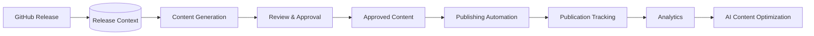

# Publishing Automation (Milestone 15)

Milestone 15 is the **content-distribution** layer: it automatically distributes
**approved** AI-generated content to multiple publishing platforms after it has
passed the [Review & Approval Workflow](./governance.md). It supports immediate
and scheduled publication, configurable retries with exponential backoff, failure
recovery, full publication tracking, and a complete audit trail — and it **never
publishes content that has not been approved**.

Related: [Review & Approval Workflow](./governance.md) · [SEO](./seo.md) · [Visual Assets](./visual-assets.md) · [Architecture Diagrams](./architecture-diagrams.md).

---

## 1. Pipeline



The engine refuses `Draft`/`Rejected`/unapproved content: `Content.Approved` must
be set (with an `ApprovalRef` from governance) or `Distribute` returns
`ErrNotApproved`.

---

## 2. Clean Architecture

The engine lives in [`internal/publishing`](../internal/publishing). It follows
Clean Architecture and dependency inversion — the application layer depends only
on ports:

```
        ┌────────────── domain (model.go, status.go) ──────────────┐
        │  Content · Publication · PlatformMetadata · Schedule · …  │
        └───────────────────────────────────────────────────────────┘
                     ▲                     ▲                    ▲
   ┌─────────────────┴───────┐  ┌──────────┴────────┐  ┌────────┴────────┐
   │ engines                 │  │ application layer │  │ ports           │
   │ metadata · validation   │  │ Engine (Distribute│  │ Publisher       │
   │ retry · scheduler       │  │  / RunDue / Cancel)│  │ Repository      │
   │ tracker (status+audit)  │  │ multi-platform     │  │ Notifier        │
   └─────────────────────────┘  └───────────────────┘  │ HTTPDoer · Clock│
                                                        │ Sleeper         │
                                                        └─────────────────┘
   adapters: DevTo · Medium · Hashnode · YouTube · GitHub · DryRun
             MemoryRepository · LogNotifier
```

**Every platform is an independent adapter implementing the common `Publisher`
interface** — `Name`, `Supports`, `Validate`, `Publish`, `Update`, `Delete`,
`GetStatus`. New platforms (LinkedIn, X, Facebook, Instagram, TikTok, Reddit,
Discord, Telegram, newsletters) are added by implementing that interface and
registering them; no existing business logic changes.

| Concern | Component |
| --- | --- |
| Publishing Engine | `Engine` — multi-platform orchestration, `Distribute`/`RunDue`/`Cancel` |
| Publisher Interface | `Publisher` port + Dev.to / Medium / Hashnode / YouTube / GitHub adapters |
| Scheduling Engine | `Scheduler` — immediate/delayed/scheduled/recurring, time zones, business hours |
| Retry Engine | `RetryEngine` — exponential backoff, **retries only recoverable errors** |
| Publication Tracker / Status Manager | `Tracker` + the status state machine + audit trail |
| Metadata Generator | `MetadataEngine` — per-platform title/description/tag limits |
| Validation Layer | `ValidationEngine` — approval, required metadata, supported, credentials |
| Persistence | `Repository` port + `MemoryRepository` (SQLite/PostgreSQL later) |
| Notifications | `Notifier` port + `LogNotifier` (Slack/Discord/Email/Teams later) |

---

## 3. Publication lifecycle

```
Pending → ┬→ Scheduled → Publishing → ┬→ Published → Archived
          │                            ├→ Retrying → Publishing
          │                            └→ Failed → ┬→ Retrying
          ├→ Publishing                            └→ Cancelled / Archived
          └→ Cancelled
```

Only legal transitions are allowed (`status.go`); every change is persisted and
appended to the publication's audit trail.

---

## 4. Scheduling

- **Immediate** — publishes now.
- **Delayed** — publishes after a duration.
- **Scheduled** — publishes at a specific time; parked as `Scheduled` and picked
  up by `RunDue` (an n8n/cron tick).
- **Recurring** — recurrence hook (a full cron parser is a future enhancement).
- **Time zones + business hours** — a `Window` shifts publication into the
  configured local hours.

---

## 5. Retry & failure handling

`RetryEngine` retries with exponential backoff (`base·multiplier^attempt`, capped
at `MaxDelay`) **only for recoverable errors**. Errors are classified:

| Recoverable (retried) | Permanent (fail fast) |
| --- | --- |
| network, timeout, rate-limit (429), platform-down (5xx) | auth (401/403), quota (402), duplicate (409), invalid (400/422), missing-asset, unsupported |

Each attempt is recorded (`PublicationAttempt`) with success, error code, and
duration. Failure messages are meaningful and **never expose secrets**.

---

## 6. Platform metadata

The `MetadataEngine` optimizes to each platform's limits — Dev.to (title ≤128,
≤4 tags, canonical, cover), Medium (≤100 title, ≤5 tags, publishStatus),
Hashnode (slug, ≤5 tags, publicationId, cover), YouTube (≤100 title, ≤5000
description with chapters, tag character budget, category, visibility, Shorts
tagging), GitHub (path, commit message, branch).

---

## 7. Multi-platform distribution

One approved item fans out to many destinations in a configurable order
(`Config.Priority`); a failure on one does not stop the others (when
`ContinueOnError`). Each destination is an independent, fully tracked
`Publication`.

---

## 8. Security

Credentials come from environment variables via `Credentials` and are **never
logged, serialized, or embedded in errors** — only their presence is checked.
Adapters read `DEVTO_API_KEY`, `MEDIUM_TOKEN`/`MEDIUM_USER_ID`, `HASHNODE_TOKEN`,
`YOUTUBE_ACCESS_TOKEN`, and `GITHUB_TOKEN`.

---

## 9. n8n integration

See [`n8n-publishing-workflow.json`](./n8n-publishing-workflow.json): Approved
Content → Validate → Generate Platform Metadata → Publish → Update Status →
Notify → Analytics → Complete. The `distribute` CLI is the automation entry
point and exits `0` on success, `3` when any platform failed.

---

## 10. Developer guide

```go
engine := publishing.NewEngine(publishing.DefaultConfig(), publishing.NewMemoryRepository(), []publishing.Publisher{
    publishing.NewDevToPublisher(httpClient, publishing.EnvCredentials()),
    publishing.NewGitHubPublisher(httpClient, publishing.EnvCredentials(), "acme", "widget"),
}, time.Now)

pubs, err := engine.Distribute(ctx, publishing.Content{
    ID: "blog-v0.2.0", Type: publishing.TypeBlog, Title: "...", Body: markdown,
    Approved: true, ApprovalRef: "governance:blog-v0.2.0",
}, publishing.DistributeRequest{Schedule: publishing.Schedule{Mode: publishing.ScheduleImmediate}})
```

### CLI

```bash
# Dry-run (no network/credentials) — demonstrate the multi-platform flow:
go run ./cmd/distribute --content post.md --approval gov:blog-1 --platforms devto,medium,github --gh-owner acme --gh-repo widget

# Real distribution (needs DEVTO_API_KEY, etc.):
go run ./cmd/distribute --content post.md --platforms devto --dry-run=false
```

Flags: `--content` (required), `--approval` (required), `--type`, `--title`,
`--tags`, `--canonical`, `--cover`, `--platforms`, `--gh-owner`, `--gh-repo`,
`--dry-run`, `--delay`, `--format md|json`, `--out`.

---

## 11. Status & future extensions

**Implemented:** the publishing engine, the `Publisher` interface, Dev.to /
Medium / Hashnode / YouTube / GitHub adapters (+ a dry-run adapter), the
scheduling and retry engines, the publication tracker + status manager, the
metadata generator, the validation layer, the in-memory persistence layer, the
`LogNotifier`, the `distribute` CLI, and an n8n workflow. Unit + adapter +
retry + scheduler + validation + integration tests at ~80%.

**Next:** SQLite/PostgreSQL repository adapters, real Slack/Discord/Email
notifiers, LinkedIn/X/TikTok/Reddit publisher adapters, resumable YouTube binary
upload, an approval-timeout/recurring-cron scheduler, and analytics ingestion.
