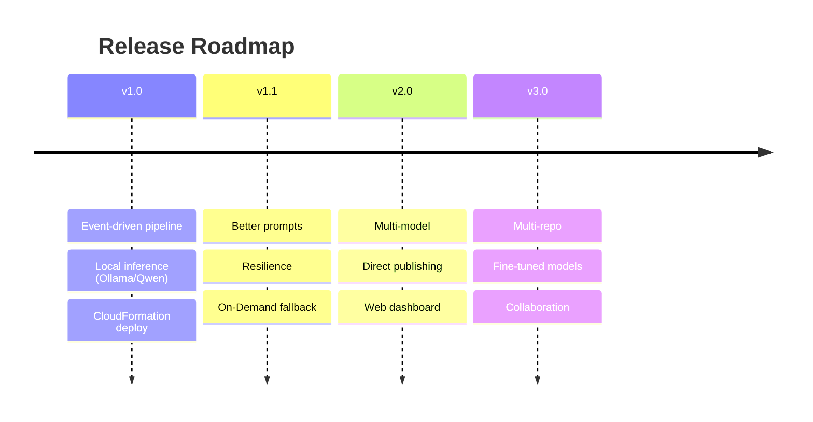

# Roadmap

Planned direction for the **GitHub AI Blog Generator**. Dates are indicative; scope may shift as the project evolves. Items marked ✅ are considered done for the milestone.

Related: [Requirements](./requirements.md) · [Contributing](./contributing.md).

---

## Version 1.0 — Foundation

The core event-driven pipeline, deployable from scratch with CloudFormation.

- ✅ GitHub Webhook trigger with HMAC SHA-256 signature validation (API Gateway + Lambda)
- ✅ Durable event buffering with Amazon SQS (+ dead-letter queue)
- ✅ On-demand EC2 Spot Instance start (webhook handler) and idle-timeout stop (EventBridge + Lambda)
- ✅ Local inference via Ollama + Qwen — no paid inference API
- ✅ Repository analysis via OpenClaw and Markdown content generation
- ✅ Persistent gp3 EBS volume for models and n8n state
- ✅ CloudFormation deployment (VPC, public subnet, IGW, route tables, SGs, IAM, EC2 Spot, EBS, API Gateway, Lambda, SQS, EventBridge, CloudWatch)
- ✅ n8n workflow orchestration with retries, error handling, and notifications

**Exit criteria:** deploying the CloudFormation stacks + importing the workflows + configuring the webhook yields a working pipeline that starts on a repository event, generates content locally, publishes it, and stops on idle.

---

## Version 1.1 — Quality & Resilience

Improve output quality and make the compute layer more robust.

- Improved prompts (better structure, tighter context selection, few-shot examples)
- **On-Demand fallback** when Spot capacity is unavailable
- Multi-Availability-Zone Spot placement
- GPU auto-detection and model right-sizing
- Configurable prompt templates surfaced as parameters
- Faster cold start (pre-warmed AMI, model preload tuning)

---

## Version 2.0 — Flexibility & Reach

Make model choice, output format, and publishing configurable.

- **Multi-model support** — different local models per content type
- Additional content types (video/short/podcast scripts, auto-generated diagrams)
- Multi-language content generation
- **Direct publishing integrations** (Dev.to, Medium, Hashnode)
- Draft/review state before publish
- Web dashboard for run history and content review

---

## Version 3.0 — Scale & Collaboration

From single-run tool to team platform.

- **Multi-repository batch processing** (org-wide scans)
- **Fine-tuned local models** for documentation style
- GitHub App authentication (replace per-repo secrets)
- Team workspaces and multi-user support
- A second local-model review pass for accuracy and tone
- Analytics on generated-content performance

---

## Continuously (all versions)

- Hardening security and least-privilege posture
- Cost tracking and optimisation (idle behaviour, EBS sizing)
- Expanded test coverage and CI checks
- Documentation upkeep

---

## Contributing to the Roadmap

Have an idea or want to pick up a milestone item? Open an issue describing the use case, or comment on an existing one. See [Contributing](./contributing.md). Roadmap items are tracked as GitHub issues/milestones so progress is visible.
