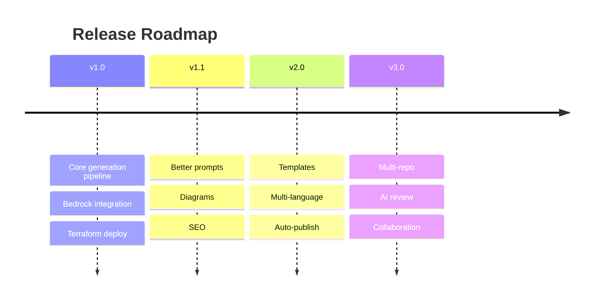

# Roadmap

Planned direction for the **AI GitHub Repository Blog Generator**. Dates are indicative; scope may shift as the project evolves. Items marked ✅ are considered done for the milestone.

Related: [Requirements](./requirements.md) · [Contributing](./contributing.md).

---

## Version 1.0 — Foundation

The core end-to-end pipeline, deployable from scratch with Terraform.

- ✅ GitHub Webhook trigger with HMAC SHA-256 signature validation
- ✅ GitHub repository analysis (clone, metadata, file discovery, README + source analysis, technology detection)
- ✅ Amazon Bedrock integration generating a full multi-platform content package
- ✅ Versioned S3 storage of generated content
- ✅ Terraform deployment (VPC, EC2/n8n, Lambda, S3, EventBridge Scheduler, CloudWatch, Secrets Manager, IAM)
- ✅ n8n workflow orchestration with error handling and notifications

**Exit criteria:** a single `terraform apply` + workflow import + webhook configuration yields a working pipeline that produces a versioned content package from a repository event.

---

## Version 1.1 — Quality & Hardening

Improve output quality, discoverability, and webhook robustness.

- Improved AI prompts (better structure, tighter context selection, few-shot examples)
- Better architecture diagrams (auto-generated Mermaid from detected structure)
- SEO optimization (meta description, slug, tags, reading time, canonical front matter)
- Configurable prompt templates surfaced as variables
- Managed webhook front door (ALB + ACM + WAF, or API Gateway) with an always-on ingestion buffer for 24/7 delivery capture
- Expanded webhook event support (`issues`, `discussion`, `deployment`, `package`, `star`, `fork`, …)

---

## Version 2.0 — Flexibility

Make output format and reach configurable.

- Multiple blog templates (tutorial, deep-dive, changelog, "show HN" style)
- Multi-language support (generate posts in multiple human languages)
- Automatic publishing to Medium, Dev.to, and Hashnode via their APIs
- CMS integrations (WordPress, Ghost)
- Draft/review state before publish

---

## Version 3.0 — Scale & Collaboration

From single-run tool to team platform.

- Multi-repository support (batch analysis; org-wide scans)
- AI content review (a second model pass for accuracy, tone, and fact-checking)
- Team collaboration (roles, review/approval workflow, comments)
- Analytics on generated content performance

---

## Continuously (all versions)

- Hardening security and least-privilege posture
- Cost tracking and optimization
- Expanded test coverage and CI checks
- Documentation upkeep

---

## Contributing to the Roadmap

Have an idea or want to pick up a milestone item? Open an issue describing the use case, or comment on an existing one. See [Contributing](./contributing.md). Roadmap items are tracked as GitHub issues/milestones so progress is visible.
